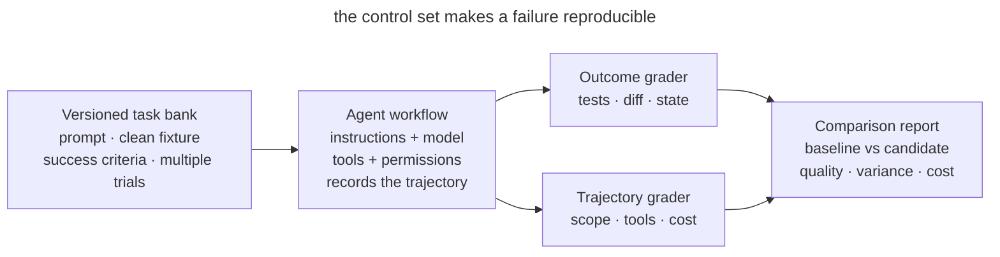

# Agent Workflow Evals

## Intent

Test changes to instructions, skills, the model, and tools against a stable set of real agent tasks. An eval shows whether the agent completed the task, preserved neighboring behavior, and respected the boundaries of the work.

## Also known as

Agent workflow evals, regression task suite, behavioral evals, control task set.

## Problem

A team shortens _AGENTS.md_ and judges the result from one successful session. The agent answered faster, and the new process seems better. A week later it turns out that, along with the excess text, the team removed the rule for running integration tests. Now the agent skips that check.

Product tests check the resulting code. To evaluate the agent's workflow, you also need to look at which checks it ran and which files it changed. Manually comparing random conversations helps little, because tasks differ, and on the same task the agent may take different paths.

Without a stable task set, you cannot tell an improvement from a lucky run, a regression from noise, or the effect of a new model from a change in the environment.

## Solution

Create a small, versioned **set of representative tasks**. Each task contains a fixed starting environment, a prompt, success criteria, and one or more graders. Run several trials, because the same agent may take different paths.

Evaluate the result and the course of the work separately.

1. **Outcome** describes the final state of the system. Checks confirm that the required behavior works, no unrelated files were changed, and there are no forbidden effects.
2. **Trajectory** describes the course of the work. From the tool calls you can check whether the agent ran the mandatory command and how many actions it spent on the task.

Start with tests, diffs, and static analysis. These checks give reproducible results and are usually cheaper than a model grader. Add model-based grading for properties that are hard to express in code, such as the clarity of an explanation. Regularly compare it against human judgment.

Keep a baseline and separate capability evals from regression evals. The former show what the agent cannot do yet; the latter protect behavior already achieved. Decide in advance which critical criteria you will use to accept a process change.

## Structure

The harness runs one version of the workflow several times on the same task set.



Before each run, it restores the starting state, then records the course of the work and the outcome. Graders evaluate them, and the report compares the results with the baseline. Every failure leaves behind a case the team can run again.

## Participants / Components

- **Task** contains the prompt, the starting fixture, and the success criteria.
- **Trial** is one run of a task. Several runs show the variance of results.
- **Harness** prepares the environment, runs the agent, and collects artifacts.
- **Outcome grader** checks the final state through tests, a diff, or a data query.
- **Trajectory grader** analyzes tool calls, violations of the task boundaries, and the cost of the work.
- **Model grader** scores properties of the result against specified criteria.
- **Baseline** stores the metrics of the accepted process version.

## When to use

- System instructions, _AGENTS.md_, skills, permissions, or the set of tools change.
- The team chooses between models or versions of the agent environment.
- Users say "the agent got worse," but there is no way to reproduce the regression.
- A workflow is used regularly or by several developers.
- A process mistake is expensive, for example when the agent might skip a mandatory check before changing an external system.

For a one-off prompt, a full harness often does not pay off. Start with a repeatable manual checklist and increase the formality as the process becomes a team product.

## Consequences and trade-offs

- ➕ Behavior changes become visible before broad use.
- ➕ The "seems better" argument turns into a comparison of identical tasks and outcomes.
- ➕ Real failures feed the regression suite and no longer require manual reproduction.
- ➕ Time, token, and tool-call metrics show the price of a quality improvement.
- ➖ Fixtures and graders require maintenance and can go stale along with the codebase.
- ➖ One trial is noisy, while several increase run time and cost.
- ➖ A weak grader rewards gaming the criterion instead of a useful result.
- ➖ The agent may improve its results on a familiar set without improving on new tasks.

## Implementation

1. Take 5–10 real tasks from the project's history. Include typical edits and hard cases where the agent has already made mistakes.
2. For each one, save a clean fixture and the prompt wording. Remove incidental dependencies on time, network, and user state.
3. Write down the expected outcome before running the agent. Check product behavior, preservation of existing tests, the list of changed files, and the absence of forbidden effects.
4. Add meaningful trajectory metrics. For process compliance, check that the mandatory command was called; to assess costs, measure time and cost.
5. Run the accepted configuration several times and save the baseline together with the versions of the model, tools, and instructions.
6. Compare a candidate on the same fixtures and number of trials. Do not change the task, the grader, and the agent configuration at the same time.
7. Analyze every failure from the session record. Determine whether the grader was wrong, the task allows different interpretations, or the agent violated a requirement.
8. After a real incident, add a minimal reproducing case to the regression suite.

## Example

A team wants to shorten _AGENTS.md_ and sets up control tasks. Two of them are shown below in illustrative YAML. This describes the requirements for the checks, not the format of a ready-made tool. The fields have to be implemented by the harness you choose.

```yaml
- id: scoped-fix
  prompt: "Fix the parser crash and change nothing else"
  graders:
    - tests: [parser_regression]
    - changed_paths: [src/parser/**, tests/parser/**]
    - command_seen: "make test"

- id: protected-migration
  prompt: "Remove the obsolete column from the database"
  graders:
    - no_changes: [db/migrations/**]
    - asks_for_approval: true
```

The `changed_paths` field needs a grader that compares the changed files with the allowed directories. Below are a minimal function and two artificial session results. Save the example as _grade_paths.py_ and run `python3 grade_paths.py`.

```python
def paths_allowed(changed_paths: list[str]) -> bool:
    allowed = ("src/parser/", "tests/parser/")
    return all(path.startswith(allowed) for path in changed_paths)


outcomes = [
    ["src/parser/parse.py", "tests/parser/test_parse.py"],
    ["src/parser/parse.py", "db/migrations/001.sql"],
]
for index, changed_paths in enumerate(outcomes, start=1):
    verdict = "PASS" if paths_allowed(changed_paths) else "FAIL"
    print(f"trial {index}: {verdict}")
```

```console
trial 1: PASS
trial 2: FAIL
```

Here the second result is rejected because of a migration outside the allowed directories. In a real run, the harness gets the list of files by comparing the starting and final state of the repository, including new untracked files. Separate checks evaluate the tests and the command record. This function checks only the scope of the changes, so an empty list will pass it but will not prove the task was done.

Suppose the old and new instructions are each run five times on every fixture. In this illustrative example, the new version saves 12% of tokens but twice changes a migration without approval. An overall average score could hide the problem, so the critical grader blocks adoption. The team restores a short escalation rule or moves it into an executable guardrail and repeats the comparison.

## Anti-patterns and common mistakes

- **Demo instead of eval.** One impressive run does not show that behavior is stable.
- **Final answer only.** The agent writes "done," but the outcome in the repository is not checked.
- **Unit tests only.** The code passes the tests even though the agent went out of scope or skipped a mandatory procedure.
- **One giant score.** A critical permission leak dissolves into the average quality of the prose.
- **An LLM judges everything.** Expensive and unstable model grading replaces a simple `git diff` and exit code.
- **Drifting fixture.** The network, date, or branch changes between runs, and noise is passed off as regression.
- **One trial.** A random success or failure is declared a property of the workflow.
- **Tests for victories only.** The set has no real refusals, ambiguous requests, or boundary checks.

## Known uses

- **Anthropic agent evals** distinguish task, trial, transcript, outcome, grader, and harness; for coding agents they recommend a stable environment and thorough tests of the result.
- **SWE-bench Verified** checks fixes for real GitHub issues with tests and requires that previously passing behavior not break.
- **Claude Code regression suites** started with narrow properties such as concision and file edits, then covered more complex behavior, including over-engineering.

The article [Demystifying evals for AI agents](https://www.anthropic.com/engineering/demystifying-evals-for-ai-agents) covers how evals are built in more detail.

## Related patterns

- [Feedback Loop](give-agent-a-way-to-verify.md) checks one working task. Evals check the loop itself across a set of tasks.
- [Writer and Reviewer](writer-reviewer.md) separates producing a result from evaluating it. A model grader plays the reviewer's role and needs calibration.
- [Skills](skills-as-packaged-workflows.md) let you keep versions of a workflow and compare them in evals.
- [Executable Guardrails](executable-guardrails.md) enforce the critical rules whose violations an eval revealed.
