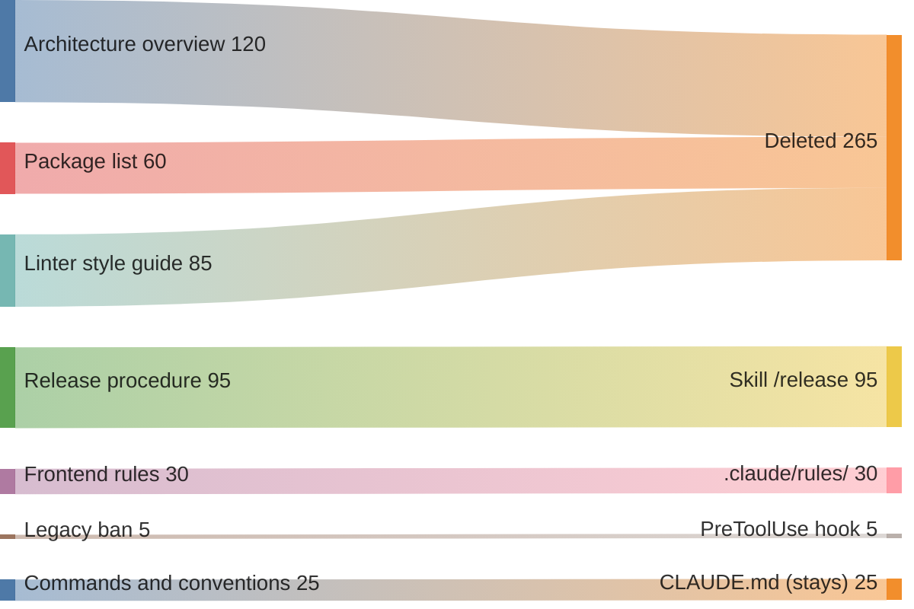

# Bloated Memory

## Also known as

Bloated CLAUDE.md, over-specified memory file, memory dump.

## Context

For months, the team keeps adding to the project memory file. After every incident with the agent, developers add a rule, but rarely check whether it is still needed. The file grows and never shrinks.

## Problem

The memory file accumulates hundreds of lines of duplicates, contradictions, and retellings of the code. The agent finds it harder to pick out the applicable instructions from the rest, so even a rule that is written down may go unheeded.

## Why people do it

- Every rule was needed at some point, and developers are afraid to delete it without knowing the original reason.
- The team expects additional instructions to make the agent's behavior more predictable and does not check the effect of piling them up.
- Developers put architecture descriptions and long procedures into memory that would be better off as separate documents.
- The whole team adds to the file, but nobody is responsible for reviewing it.

## Consequences

- ➖ The agent misses the instruction it needs among all the others.
- ➖ Every extra line costs tokens in every session that loads the file.
- ➖ When instructions contradict each other, the agent may pick different rules in different sessions.
- ➖ New colleagues have to wade through a long file to find the convention they need.

## Signs

- The file has hundreds of lines and keeps growing.
- The agent does what the memory explicitly forbids.
- The file retells the directory structure and dependencies that the agent can read in the repository.
- Some rules are ones the agent follows even without the instruction.
- Nobody can say why half of the lines are there.

## A better way

Review the memory using the rule from [the pattern of the same name](claude-md-memory.md). For each line, find out which mistake it prevents. If the agent gets the same information from the code or follows the rule without a reminder, the line can be deleted. Move long procedures into [skills](skills-as-packaged-workflows.md) that load on demand. After trimming the file, check on real tasks whether the behavior you need is preserved.

## Example

**Before:**

> CLAUDE.md has accumulated 420 lines. Most of it is an architecture overview, a list of packages, and copied linter rules. Among them, on line 287, is a ban on changing legacy code that the agent violated yesterday.

In the diagram, you delete 265 lines that repeat information from the code and the linter settings. You move the 95-line release procedure into a skill, put the 30 lines of frontend rules into _.claude/rules/_, and enforce the five-line legacy ban with a hook. What stays in memory is 25 lines of commands and conventions. Each rule now lives where it applies.

**After:**

> CLAUDE.md is down to 25 lines of commands and conventions. The agent gets the release procedure from the `/release` skill and loads the frontend rules from _.claude/rules/_ when working with the relevant files. A PreToolUse hook blocks writes to legacy code.

## Related patterns and anti-patterns

- [Project Memory](claude-md-memory.md) sets the rules for selecting and reviewing persistent instructions.
- [Skills](skills-as-packaged-workflows.md) let procedures load on demand.
- [Context Engineering](context-engineering.md) explains how extra text gets in the way of using the information you need.
- [Premature Specification](premature-specification.md) describes a similar attempt to gain control through excessive instructions.
- [Scheduled Maintenance](scheduled-maintenance.md) keeps memory from bloating: a monthly pass removes duplicates and rules that change nothing.
