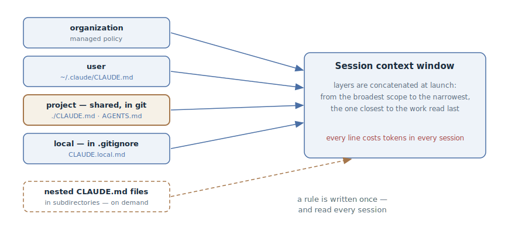

# Project Memory

## Intent

Keep a persistent file with the project's rules — commands, conventions,
boundaries — in the repository, and have the agent read it automatically at
the start of every session. A rule is written down once — and holds in every
new context window, instead of being retold in every conversation.

## Also known as

CLAUDE.md, AGENTS.md, memory file; in other tools — project rules, custom
instructions.

## Problem

Every agent session starts with a clean context window. The agent doesn't know
how the project builds, what runs the tests, what the team's conventions are,
and what must not be touched here. The developer explains all this in the
conversation — and the explanation dies with the session:

- The same clarifications get typed anew every session: "we use pnpm, not
  npm", "tests go through make test", "don't touch that folder".
- The agent makes the same mistake for the second week in a row — there is no
  way to tell it about it *for good*.
- The knowledge lives in one developer's head. The colleague at the next desk
  explains the same things to their agent — in different words and with
  different success.

Keeping these rules in the task's specification is no way out either: they are
not about the task, they are about the project — and they are needed in every
task.

## Solution

A file at the repository root that the agent loads at the start of every
session. Into it goes what you would otherwise have to explain again: build
and test commands, code and commit conventions, boundaries ("always X",
"never Y"), the project's non-obvious quirks.

The file grows through simple triggers:

- the agent made the same mistake a second time;
- a code review caught something the agent was obliged to know about this
  codebase;
- you are typing a clarification you already typed last session;
- a new teammate would need the same context to be productive.

The file lives under version control, so the rules are shared by the whole
team and go through regular review. Edit the text — and you change the
behavior of every agent on the project starting from the next session.

An important boundary: this is context, not configuration. The memory file
*guides* the agent's behavior but does not guarantee it. Prohibitions that
must hold always — "don't push to main", "don't touch prod" — get duplicated
by mechanics: hooks, permissions, tool settings.

## Structure



Memory is layered: the organization level (managed policy), the user's
personal level, the project level, and a local file with personal settings for
the specific repository. At session start the layers are concatenated into the
window — from broad to narrow, so project rules are read after personal ones,
and local ones last. The team layer — the project file in git — is the subject
of this pattern; the other levels complement it without replacing it. Nested
memory files in subdirectories are loaded not at launch but on demand — when
the agent starts working with files next to them.

## Participants / Components

- **Project memory file** (`./CLAUDE.md`, `./AGENTS.md`) — the team's rules;
  lives in git, goes through review.
- **User's personal file** (`~/.claude/CLAUDE.md`) — the developer's
  preferences across all their projects.
- **Local file** (`CLAUDE.local.md` in `.gitignore`) — personal to this
  project: sandbox URLs, test data.
- **Developer and team** — grow the file by triggers and clean it regularly.
- **Agent** — reads the layers at launch; on request, appends new rules
  itself.

## When to use

- In any repository where an agent works regularly — this is the first file
  worth creating.
- It pays off especially when project conventions diverge from tool defaults:
  non-standard commands, a house style, strict module boundaries.
- When several people and several agents work on one codebase — the file
  aligns the rules for everyone.

## Consequences and trade-offs

- ➕ Rules outlive the session: "explain once" instead of "explain every
  time".
- ➕ Knowledge becomes the team's: rules live in git, not in someone's head,
  and every agent on the project shares one picture of the world.
- ➕ Edits are cheap: it's markdown under review — changing a rule costs one
  line of diff.
- ➖ The file competes for the context window: every line is tokens in every
  session of every developer (see [context engineering](context-engineering.md)).
- ➖ Without care it degrades into a dump: rules get duplicated and
  contradictory, and the agent starts ignoring half of them.
- ➖ It is not an enforcement mechanism: critical prohibitions recorded only
  in memory will one day be violated.

## Implementation

1. Generate a starting file — in Claude Code that's `/init`: the agent studies
   the codebase itself and finds the commands and conventions. Strip from the
   result everything the agent can derive from the code on its own (directory
   layout, dependency lists): those are tokens without signal. Keep what the
   code doesn't show.
2. Write verifiable statements: "indentation — two spaces", "run `make test`
   before committing" — not "format neatly" and "test your changes".
3. Keep the file short — on the order of two hundred lines. The longer it
   gets, the worse it is followed: rules drown in each other.
4. Split growing instructions by location: rules needed only by part of the
   codebase go into modular files scoped to paths (in Claude Code —
   `.claude/rules/` with a `paths` field), so they load only when the agent
   works with matching files.
5. Separate the levels: team content — in the project file under git,
   personal-for-all-projects — at the user level, personal-for-this-project —
   in a local file under `.gitignore`.
6. Grow it on the "explaining this for the second time" trigger — and ask the
   agent directly: "add this rule to CLAUDE.md". Clean it regularly: a stale
   rule is worse than a missing one.

### AGENTS.md: one memory for every agent

The [AGENTS.md](https://agents.md/) convention puts the same rules into a file
with a standard name that dozens of tools read — Codex, Cursor, Copilot,
Gemini CLI, and others; the format is stewarded by the Agentic AI Foundation
under the Linux Foundation and used by more than 60 thousand open-source
repositories. In a monorepo the files nest: an agent takes the one closest to
the code being edited.

Claude Code reads `CLAUDE.md`, so for a team with AGENTS.md a symlink is
enough — `ln -s AGENTS.md CLAUDE.md` — or an `@AGENTS.md` import as the first
line of CLAUDE.md if Claude-specific instructions need to be appended. One
memory, no duplication.

### In the spec-driven development toolkits

The SDD frameworks have their own embodiments of the same pattern — a
persistent file the agent checks against at every phase:

- **GitHub Spec Kit** — the "constitution" (`/speckit.constitution`):
  immutable project principles the specification and plan are validated
  against.
- **OpenSpec** — `openspec/project.md`: the project's stack, conventions, and
  context, shared by all changes.
- **Kiro** — steering files (product, tech, structure) attached to every spec
  session.
- **Matt Pocock's skills** — the pack sits on top of AGENTS.md and keeps it
  deliberately thin: procedures move into skills, only rules stay in memory.

## Example

A fragment of a small service's memory file — short, concrete, only what the
code doesn't show:

```markdown
# Project: billing-service

## Commands
- Build and tests: `make test` (not `npm test` — containers are required)
- Local run: `make up`, sandbox on :8080

## Conventions
- Package manager — pnpm; the lock file is committed
- Commits — Conventional Commits, in English
- Migrations are never edited retroactively — only a new migration

## Boundaries
- Domains talk only through events; direct imports across
  `src/domains/*` are forbidden
- No sleeps in tests — explicit waits only
```

The agent gets the task "add a failed-charge notification to billing" and
reaches for a direct import of the notifications module — but the domain
boundary rule is already in the window, and it builds the interaction through
an event. The conversation says not a word about it.

A week later, review catches an agent commit with `npm install` instead of
pnpm. The developer closes the hole for good:

> Add to CLAUDE.md: dependencies are installed only with pnpm;
> package-lock.json must never appear in the repository.

From the next session on, every agent on the project knows this rule.

## Anti-patterns and common mistakes

- **Bloated memory.** Hundreds of lines, duplicates, and contradictions — the
  agent ignores half of it, because the important is indistinguishable from
  the noise. A mistake so common it gets its own chapter in the anti-patterns
  section.
- **A dump of derivables.** Directory layout, dependency lists, an
  architecture overview — the agent sees all of that in the code itself. It
  doesn't belong in memory: tokens spent, no signal.
- **Expecting enforcement.** "Never push to main" in a memory file is a wish,
  not a prohibition. Duplicate hard boundaries with hooks and permissions.
- **Personal content in the team file.** Your sandbox URLs and taste
  preferences belong at the personal and local levels, not in the shared file
  under git.
- **Write and forget.** Rules go stale while the agent keeps confidently
  following them. Cleaning the memory is as regular a chore as updating
  dependencies.

## Known uses

- **Claude Code** — `CLAUDE.md` with its hierarchy of levels (organization →
  user → project → local), generation via `/init`, modular `.claude/rules/`
  scoped to paths; alongside it — auto memory, the notes the agent keeps
  about the project on its own.
- **AGENTS.md** — the cross-tool convention: 60k+ repositories, including
  Apache Airflow and Temporal; OpenAI's monorepo holds 88 nested files.
- **Editor rules** — `.cursor/rules` in Cursor, custom instructions in GitHub
  Copilot: the same idea in tool-specific formats.
- **SDD toolkits** — the constitution in [Spec Kit](spec-kit.md),
  `project.md` in [OpenSpec](openspec.md), steering files in [Kiro](kiro.md).

## Related patterns

- [Context Engineering](context-engineering.md) — the memory file is the
  persistent layer of context: it loads every session and competes for the
  attention budget.
- [Domain Vocabulary](domain-context-file.md) — the other axis of the
  persistent layer: "what words mean", not "how we work".
- [Spec-Driven Development](spec-driven-development.md) — project conventions
  serve as the standing input of the SDD pipeline; in the toolkits the
  pattern is embodied by the constitution, project.md, and steering files.
