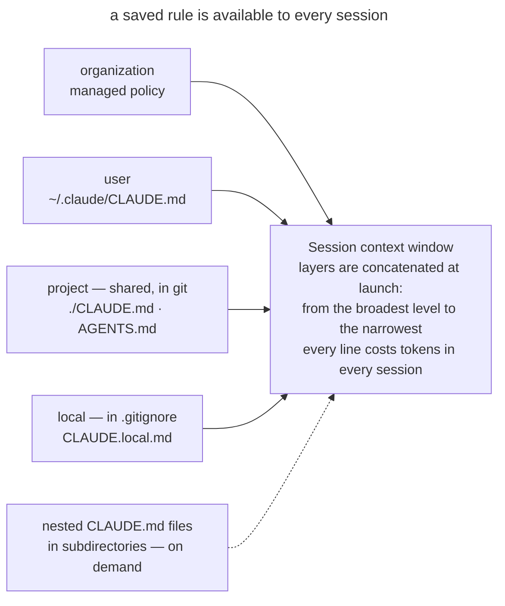

# Project Memory

## Intent

Keep a persistent file in the repository with the project's commands, conventions, and constraints, which the agent reads at the start of every session. You write a rule down once, and the following sessions get it from the file.

## Also known as

CLAUDE.md, AGENTS.md, memory file, project rules, custom instructions.

## Problem

A new session may not know how the team builds the project and runs the tests. You explain the rules in the conversation, but the next session needs the same clarifications. This is most noticeable with a non-standard verification command.

For example, the agent runs the usual test script, although the project requires `make test` with fixture setup. You correct the command in the chat. If the rule is kept only in the conversation, a colleague in a new session will run into the same failure.

Project rules are needed across different tasks. It is more convenient to keep them separate from the specification of a particular feature.

## Solution

Create a file in the repository that the agent loads at startup. Write down in it the commands and non-obvious conventions that would otherwise have to be explained in every session. Specify module boundaries if the agent cannot reliably reconstruct them from the code.

Add to the file when you see a recurring need for context.

- the agent made the same mistake a second time;
- a review caught something the agent was obliged to know about this codebase;
- you are typing a clarification you already typed in the previous session;
- a new colleague would need the same context to be productive.

Keep the file under version control. Then the team can discuss edits in review, and new sessions get an agreed version of the rules.

The memory file guides the agent's behavior but does not guarantee the rules are followed. Enforce critical prohibitions, such as not writing to a protected branch, with permissions and hooks.

## Structure

The diagram shows the memory levels of Claude Code.


```mermaid
---
title: a saved rule is available to every session
---
flowchart LR
  org["organization<br/>managed policy"]
  user["user<br/>~/.claude/CLAUDE.md"]
  project["project — shared, in git<br/>./CLAUDE.md · AGENTS.md"]:::accent
  local["local — in .gitignore<br/>CLAUDE.local.md"]
  nested["nested CLAUDE.md files<br/>in subdirectories — on demand"]:::muted
  window["Session context window<br/>layers are concatenated at launch:<br/>from the broadest level to the narrowest<br/>every line costs tokens in every session"]
  org --> window
  user --> window
  project --> window
  local --> window
  nested -.-> window
```

The organization sets a managed policy, the user keeps personal preferences, and the team records the project rules in git. A local file supplements them with the developer's settings for a specific repository. Nested files provide instructions for individual directories when the agent works with them. The pattern is about the team file that goes through review together with the code.

## Participants / Components

- **Project memory file** (_./CLAUDE.md_, _./AGENTS.md_) keeps the team's rules in git and goes through review.
- **User's personal file** (_~/.claude/CLAUDE.md_) keeps the developer's preferences for their projects.
- **Local file** (_CLAUDE.local.md_ in _.gitignore_) holds the developer's settings for this project.
- **Developer and team** add rules based on observed failures and review the file regularly.
- **Agent** reads the instructions and, on request, appends new rules.

## When to use

- The agent works in the repository regularly.
- The project's conventions diverge from the tools' default settings.
- Several developers and agents need shared working rules.

## Consequences and trade-offs

- ➕ New sessions get the saved rules without repeated explanations.
- ➕ The team keeps a shared version of the rules in git and discusses changes in review.
- ➕ Refining a rule takes only a small Markdown edit.
- ➖ Every line takes up space in the context of every session that reads the file (see [context engineering](context-engineering.md)).
- ➖ Without review, duplicates and contradictions accumulate in the file.
- ➖ Text instructions do not guarantee that critical prohibitions are respected.

## Implementation

1. Generate a starter file with the `/init` command in Claude Code. Check the commands and conventions it found, then delete the retelling of the directory structure and dependencies. Keep the information that is hard for the agent to get from the code.
2. Phrase actions so they can be checked. For example, "run `make test` before committing" sets a specific verification command.
3. Keep the file short. A guideline of two hundred lines helps you notice growth, but each rule still has to solve an observed problem.
4. Move rules for individual parts of the project into files bound to paths. In Claude Code this is what _.claude/rules/_ with the `paths` field is for.
5. Keep team rules in git, personal preferences at the user level, and local repository settings in a file under _.gitignore_.
6. If you explain the same rule a second time, ask the agent to add it to the memory file. Regularly delete outdated instructions.

### Shared memory through AGENTS.md

The [AGENTS.md](https://agents.md/) convention sets a common name for the instructions file across agent tools, including Codex, Cursor, Copilot, and Gemini CLI. In a monorepo, nested files let you refine the rules for individual directories.

For a team with AGENTS.md, the _CLAUDE.md_ file can point to it via `ln -s AGENTS.md CLAUDE.md`. Another option uses an `@AGENTS.md` import at the top of _CLAUDE.md_ and lets you add separate instructions for Claude.

### In the spec-driven development toolkits

SDD frameworks also keep project rules in persistent documents that the agent uses in different phases of the work.

- **GitHub Spec Kit** keeps the project's principles in a constitution, which is created through `/speckit.constitution` and checked against the specification and plan.
- **OpenSpec** keeps the project's shared context in its configuration documents.
- **Kiro** attaches steering files describing the product, technologies, and project structure.
- **Matt Pocock's skills** move procedures into skills, so that AGENTS.md keeps only short project rules.

## Example

Below is a fragment of a small service's memory with commands and conventions that are hard to infer from the code.

```markdown
# Project: billing-service

## Commands
- Build and tests: `make test` (not `npm test` — containers are required)
- Local run: `make up`, sandbox on :8080

## Conventions
- Package manager — pnpm; the lock file is committed
- Commits — Conventional Commits, in English
- Migrations are never edited retroactively — only a new migration

## Boundaries
- Domains talk only through events; direct imports across
  `src/domains/*` are forbidden
- No sleep in tests — explicit waits only
```

The agent gets a task to add a failed-charge notification to billing. The memory says that domains interact through events, so the agent uses an event to trigger the notification. You do not have to repeat this rule in the task.

A week later, review finds that the agent ran `npm install` in a pnpm project. You extend the memory.

> Add a rule to CLAUDE.md that dependencies are installed only through pnpm. State that package-lock.json must not appear in the repository.

The next session will get this rule when it reads the project memory.

## Anti-patterns and common mistakes

- **Bloated memory.** Duplicates and contradictions make it harder to find the applicable rules. This mistake is covered in a separate chapter, [Bloated Memory](bloated-claude-md.md).
- **A dump of derivables.** A retelling of the directory structure and dependencies takes up context, although the agent can get this information from the project files.
- **Expecting enforcement.** A text prohibition on pushing to main does not block the command. Enforce the boundary with permissions.
- **Personal content in the team file.** Keep personal sandbox URLs and the developer's preferences at the user or local level.
- **Write and forget.** Outdated instructions can steer the agent toward the wrong decision. Review them together with changes to the project.

## Known uses

- **Claude Code** uses _CLAUDE.md_, generation via `/init`, and modular rules in _.claude/rules/_. Auto memory supplements them with the agent's notes.
- **AGENTS.md** sets a common instructions format for several agent tools.
- **Editor rules** implement the same idea through _.cursor/rules_ in Cursor and custom instructions in GitHub Copilot.
- **SDD toolkits** keep shared principles in the GitHub Spec Kit constitution, Kiro's steering files, and OpenSpec's context documents.

## Related patterns

- [Context Engineering](context-engineering.md) helps select information for the persistent memory file.
- [Domain Vocabulary](domain-context-file.md) supplements working instructions with definitions of the project's terms.
- [Spec-Driven Development](spec-driven-development.md) uses the project's conventions when preparing the specification and plan.
- [Bloated Memory](bloated-claude-md.md) describes a memory file that, without review, has accumulated duplicates, contradictions, and a retelling of the code.
