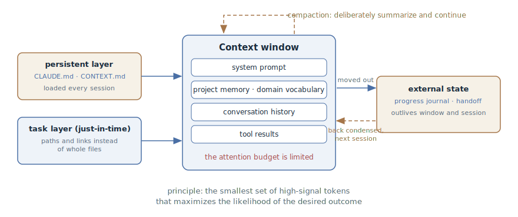

# Context Engineering

## Intent

Treat the agent's context window as a finite resource: deliberately curate the
smallest set of high-signal tokens instead of dumping into the session
everything that might come in handy. This is the overview chapter of the
section: it sets the vocabulary — the window, the attention budget, the layers
of context — that the other context patterns build on.

## Also known as

Context engineering.

## Problem

Intuition says: the more the agent knows, the better it works. Hence the habit
of pasting whole files into the prompt, logs from start to finish, and
instructions for every occasion. But the context window is not a hard drive —
it is working memory, and it behaves counterintuitively:

- **Context rot.** As the number of tokens in the window grows, the model's
  ability to accurately recall what is in it degrades. The effect reproduces
  on every model — only the severity differs.
- **Attention budget.** A transformer maintains pairwise relationships between
  all tokens in the window, and it was trained mostly on short sequences. The
  longer the context, the thinner attention is spread across it: every
  unnecessary token spends budget the important ones will lack.
- **Context accumulates on its own.** The agent works in a loop: every tool
  call adds results to the window — listings, diffs, logs. By the end of a
  long session the window is full of spent noise, and the rule stated at the
  beginning has been pushed to the margins of attention.

Prompt engineering does not help here: it optimizes the wording of a single
instruction, while the problem is *what set of information* lands in the
window on each next step of the loop — and what stays there.

## Solution

Change the question from "how do I word the prompt" to "what will the model
see at this moment, and why exactly that". The discipline's guiding principle,
from the Anthropic article: *the smallest set of high-signal tokens that
maximizes the likelihood of the desired outcome.*

Context is built out of layers, and each has its own management technique:

1. **The persistent layer** — what the agent must know in every session: the
   project's rules and the domain's language. It lives in repository files and
   loads automatically instead of being retold in the conversation.
2. **The task layer** — the code and data of the specific task. Don't preload
   everything: give the agent paths and links and let it pull in what it needs
   itself (just-in-time). File names, directory structure, and timestamps are
   signals in their own right.
3. **The state layer** — what accumulates as the work goes on: decisions,
   progress, discarded hypotheses. It gets moved out of the window — into
   notes, a progress journal, a handoff document — and brought back as needed.
4. **Instructions and examples** — rules at the right "altitude": not rigid
   case-by-case logic and not a vague "write good code", but strong
   heuristics; instead of enumerating every edge case, a few canonical
   examples.

Minimal does not mean short: if stable behavior takes a page of rules, then a
page it is. Excess is whatever doesn't change the agent's behavior yet spends
its attention.

## Structure

At the center is the context window with its attention budget. On the left,
what *enters* the window: the persistent layer (project memory and the domain
vocabulary) loads every session, while the task layer is pulled in on demand —
by paths and links, not by preloading. On the right, what gets *moved out*:
the state of long-running work settles into a progress journal and a handoff
document and returns to the new session already condensed. The dashed loop on
top is compaction: when the window approaches its limit, its contents are
deliberately summarized and the cycle continues.

## Participants / Components

- **Developer** — the context curator: decides what lives in the persistent
  layer, what is pulled in on demand, what is moved out of the window.
- **Agent** — fills the window itself: reads files by path, takes notes,
  updates external state.
- **Context window** — the finite resource: tokens compete for the model's
  attention budget.
- **Persistent context files** — project memory and the domain vocabulary;
  read every session.
- **External state** — the progress journal and handoff documents; they
  outlive the window and the session.

## When to use

- Always, as a background discipline — the only question is how much effort it
  justifies at your scale of tasks.
- Acutely — when sessions are long and the agent visibly "gets dumber" toward
  the end: forgets rules, repeats covered ground, proposes what was already
  rejected.
- When the work is bigger than one context window and state has to be handed
  over between sessions.
- When the same explanations — conventions, terms, commands — get repeated
  session after session.

## Consequences and trade-offs

- ➕ The agent stays accurate longer: what matters doesn't drown in spent
  noise.
- ➕ Cheaper and faster: fewer tokens per model call.
- ➕ Project knowledge is reused: a new session, another agent, and a new
  colleague all start from the same persistent layer, not from a retelling.
- ➖ Curation is ongoing work: the context layers have to be replenished and
  cleaned; they won't maintain themselves.
- ➖ A stale persistent layer is worse than none: the agent follows
  yesterday's rules with today's confidence.
- ➖ Over-economizing hurts quality: removing something behavior depends on is
  easier than it seems — the agent will fill the gap with guesses.

## Implementation

1. Start minimal: a strong model and short instructions. Add rules in response
   to observed failures, not in advance.
2. Move the project's standing rules — conventions, commands, constraints —
   into a memory file and keep it short.
3. Put the domain's language — terms and accepted architectural decisions —
   into a separate domain file: that's a different axis than "how we work".
4. Don't paste whole files and logs into the prompt: give paths and links —
   the agent will read what it needs, and the window won't fill up with
   low-signal tokens.
5. Move long-running work out of the window: a progress journal along the way,
   a handoff document at the session boundary.
6. Compact deliberately, not by auto-threshold: keep decisions, current state,
   and open questions; drop spent tool results.

Each technique on this list has its own chapter in this section:

- [Project Memory](claude-md-memory.md) — the persistent "how we work" layer:
  rules, conventions, and commands in a file the agent reads every session.
- [Domain Vocabulary](domain-context-file.md) — the persistent "what words
  mean" layer: a glossary and architectural decisions as the project's
  canonical language.
- [Progress Journal](progress-file.md) — a running record of state during long
  work, from which an agent with a fresh window reconstructs the picture.
- [Session Handoff](handoff.md) — deliberately packing the session into a
  document at its boundary, instead of trusting auto-summarization.

## Example

The task: figure out why the payment gateway integration test is flaky.

**The naive approach.** The developer pastes the entire CI log into the
prompt — three thousand lines — plus three test files "for context", and
states the project rule along the way: "we don't allow sleeps in tests". The
agent starts out confident, but the window is already half-occupied by the
log. A dozen exchanges later the rule has been crowded out by noise — the
agent proposes "stabilizing the test" with `sleep(5)`.

**The engineered approach.** The sleep rule lives in the project memory
file — no need to state it. Instead of pasted files, the prompt gives
coordinates:

> Figure out why `tests/integration/payment_gateway_test.py` is flaky.
> Failing runs are in the integration-tests job — look at the last three.

The agent pulls only the failing chunks out of the logs, reads the test and
the adjacent code by path, and finds a race between the webhook and status
polling. There was no time to fix it in this session — the developer closes
it with a handoff document:

> Wrapping up. Put together a handoff: what we learned about the cause, which
> hypotheses were ruled out, where the next session should start.

The next session starts from two screens of condensed text — not from three
thousand lines of log and reconstruction from memory.

## Anti-patterns and common mistakes

- **A bloated memory file.** The persistent layer turns into a dump of
  hundreds of rules — and the agent ignores half of them, because the
  important is indistinguishable from the noise. A mistake so common it gets
  its own chapter in the anti-patterns section.
- **"I'll paste it whole, just to be safe."** Whole files and logs instead of
  paths and links: the window is occupied by low-signal tokens before the work
  even starts.
- **Silent auto-compaction.** Trusting the summarization of important
  decisions to an auto-threshold — the decisions get thrown out along with
  the noise. Compaction is a deliberate move by the developer, and at the
  session boundary — a full handoff.
- **Economizing on the necessary.** Minimal does not mean short: remove from
  the context what behavior depends on, and the agent will fill the gap with
  guesses — confident and wrong.

## Known uses

- **Claude Code** — the persistent layer in `CLAUDE.md`, deliberate compaction
  with the `/compact` command, subagents with clean windows for isolated
  subtasks.
- **Anthropic's memory tool** — structured agent notes in external memory: a
  knowledge base accumulates across sessions without occupying the window.
- **Anthropic's multi-agent research system** — subagents dig deep but return
  a condensed summary of 1–2 thousand tokens: division of labor as a way to
  protect the coordinator's window.
- **AGENTS.md and editor rules** — the same persistent layer in other tools:
  `.cursor/rules` in Cursor, custom instructions in GitHub Copilot.
- The term was cemented by the Anthropic article [Effective context
  engineering for AI
  agents](https://www.anthropic.com/engineering/effective-context-engineering-for-ai-agents) —
  the primary source for this chapter's principles.

## Related patterns

- [Project Memory](claude-md-memory.md), [Domain Vocabulary](domain-context-file.md),
  [Progress Journal](progress-file.md), and [Session Handoff](handoff.md) —
  the discipline's concrete techniques, one chapter each.
- [Spec-Driven Development](spec-driven-development.md) — SDD artifacts are
  context engineering too: a specification is curated, high-signal task
  context that outlives the session.
- [Four Phases](explore-plan-code-commit.md) — the exploration phase of that
  cycle is just-in-time window filling: the agent gathers the task's context
  itself before the plan.
