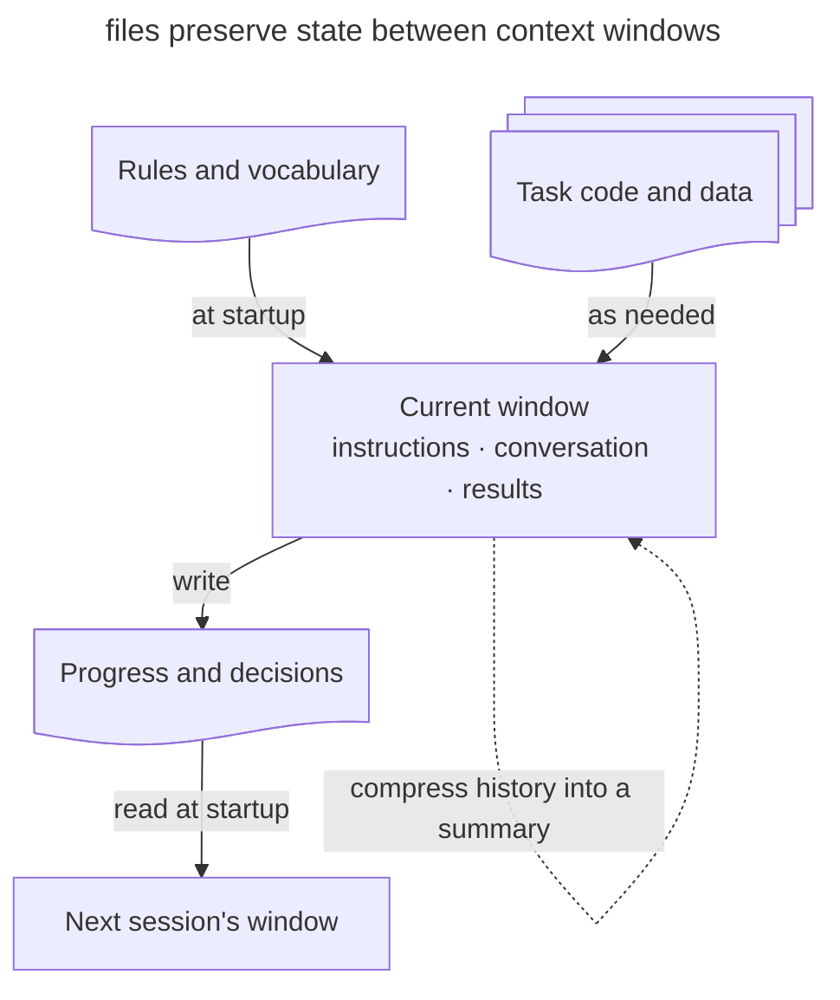

# Context Engineering

## Intent

Select context for the current task and account for the limited size of the agent's window. The chapter explains how to pick information, load it as needed, and preserve the state of the work between sessions.

## Also known as

Context engineering.

## Problem

A developer may paste the whole CI log into the prompt, hoping to give the agent more information. But the relevant error takes up only a few lines of it. The rest of the output occupies the window and makes it harder to find the cause of the failure. Context management starts with selecting the data for a specific step of the work.

**Context rot** shows up when the model makes worse use of information in a long window. The size of the effect depends on the model and the task, so the window's capacity by itself does not guarantee an accurate answer. The window has an **attention budget**. The term describes the practical problem of selecting the information the model must take into account at the same time. For example, the rule for running tests can get lost among logs that are already spent. The agent adds to the context with every tool call. If you keep all the listings and check results, by the end of the session they will take up the space needed for the next decision.

The wording of the prompt solves only part of the problem. The developer also needs to decide what information the agent will see at each step and what it will keep after the step is done.

## Solution

Before the next action, find out what the agent needs to know to carry it out. The Anthropic article describes this approach as finding the smallest set of high-signal information that is enough for the desired outcome.

How you manage context depends on how long the information lives.

1. **The persistent layer** holds the project's rules and the domain's language. Keep them in repository files and load them into new sessions.
2. **The task layer** holds the relevant code and data. Give the agent paths and links so it reads them as needed (just-in-time).
3. **The state layer** preserves decisions made, progress, and hypotheses already checked. Record them in a journal and a handoff document so the next session can continue the work.
4. **Instructions and examples** help choose actions. Write verifiable rules and show examples of applying them to typical cases.

Cutting helps as long as the agent keeps the information the decision depends on. If stable behavior takes a page of rules, keep it. Remove text that occupies the context without helping to complete the task.

## Structure

The context window receives information from several sources. To continue the work, decisions are saved separately from the conversation history.

```mermaid
---
title: files preserve state between context windows
config:
  flowchart:
    rankSpacing: 30
---
flowchart TB
  rules@{ shape: doc, label: "Rules and vocabulary" }
  files@{ shape: docs, label: "Task code and data" }
  current["Current window<br/>instructions · conversation · results"]:::accent
  saved@{ shape: doc, label: "Progress and decisions" }
  next["Next session's window"]:::accent
  rules -- "at startup" --> current
  files -- "as needed" --> current
  current -- "write" --> saved
  saved -- "read at startup" --> next
  current -. "compress history into a summary" .-> current
```

Persistent instructions are loaded into the next session as well; it reads the task's code as needed. The progress journal and the handoff keep decisions outside the window. The dashed loop shows history compression within the current session: spent tool results give way to a short summary.

## Participants / Components

- **Developer** decides which information is needed all the time and which can be read on demand.
- **Agent** reads files, takes notes, and updates the state of the work.
- **Context window** holds the limited amount of information available to the model at the current step.
- **Persistent context files** store the project's rules and the domain vocabulary.
- **External state** in the journal and handoff documents lets the work continue after the session ends.

## When to use

- The cost of reading context is noticeable relative to the size of the task.
- By the end of a long session the agent forgets rules or repeats proposals that were already rejected.
- When the work is bigger than one context window and state has to be handed over between sessions.
- The developer repeats commands and conventions in every session.

## Consequences and trade-offs

- ➕ It is easier for the agent to find the information needed for the current decision.
- ➕ A smaller context reduces the cost of model calls.
- ➕ A new session and a new colleague get the same version of the project's knowledge.
- ➖ The developer has to regularly add to and review the context files.
- ➖ Stale instructions can steer the agent toward a wrong decision.
- ➖ If you cut too much, the agent will fill in the missing information with assumptions.

## Implementation

1. Start with short instructions and add rules in response to observed failures.
2. Move the project's standing commands and conventions into a memory file.
3. Record domain terms and the reasons behind architectural decisions in separate documents.
4. Give paths to files and logs. The agent can read the fragment it needs before making a decision.
5. During long work, keep the progress journal up to date, and prepare a handoff document before switching sessions.
6. When compacting the context, keep decisions, the current state, and open questions. Remove tool results that no longer affect the work.

The following chapters cover these techniques in detail.

- [Project Memory](claude-md-memory.md) stores standing commands and conventions.
- [Domain Vocabulary](domain-context-file.md) defines the project's terms and preserves the reasons behind architectural decisions.
- [Progress Journal](progress-file.md) helps reconstruct the state of long-running work.
- [Session Handoff](handoff.md) saves the context in a document before moving to a new window.

## Example

The developer needs to find out why the payment gateway integration test sometimes fails.

**The naive approach.** The developer pastes three thousand lines of CI log and three test files. Along the way they add the rule "we don't allow sleeps in tests". After a few exchanges the agent proposes `sleep(5)`, even though such a delay only hides the flakiness. In a context filled with the log, the rule did not affect the choice of solution.

**The engineered approach.** The sleep rule lives in the project memory. In the request, the developer points to where the test and the failed runs are.

> Figure out why _tests/integration/payment_gateway_test.py_ is flaky. Look at the last three failed runs in the integration-tests job.

The agent reads the failing log fragments, the test, and the related code. It finds a race between the webhook and status polling, but the session has to end before the fix. The developer asks it to save the results of the investigation.

> Put together a handoff with the cause of the failure, the hypotheses checked, and the first action for the next session.

The next session gets a short summary and paths to the evidence. The agent can start by fixing the race it found.

## Anti-patterns and common mistakes

- **A bloated memory file.** Among hundreds of rules it is harder for the agent to pick out the applicable instructions. This mistake is covered in the [Bloated Memory](bloated-claude-md.md) chapter.
- **"I'll paste it whole, just to be safe."** Full logs occupy the window before the investigation begins. Pass paths and specify which fragment is needed.
- **Silent auto-compaction.** Decisions can be lost during automatic compaction. Check the summary and prepare a handoff before switching sessions.
- **Correcting on top of a failed attempt.** A reply like "that didn't work, try something else" leaves the failed approach and the argument about it in the window. Rewind the conversation to the point before the attempt and repeat the request, taking into account what you learned.
- **Economizing on the necessary.** If you remove information the decision depends on, the agent will start making assumptions.

## Known uses

- **Claude Code** supports persistent instructions in _CLAUDE.md_, compaction via `/compact`, and separate subagent contexts.
- **The Claude Code team** [recommends](https://claude.com/blog/using-claude-code-session-management-and-1m-context) rewinding the conversation with `/rewind` instead of correcting a failed attempt. The window keeps the files already read and one refined request. Before rewinding, you can ask the agent to briefly write down what it learned.
- **Codex** compacts a long conversation with the `/compact` command and branches it with the `/fork` command when the work really does split into alternatives.
- **Anthropic's memory tool** lets the agent keep structured notes outside the current window.
- **Anthropic's multi-agent research system** uses subagents for separate lines of research. The coordinator receives short summaries of their results.
- **AGENTS.md and editor rules** store persistent instructions in the formats of different tools.
- The Anthropic article [Effective context engineering for AI agents](https://www.anthropic.com/engineering/effective-context-engineering-for-ai-agents) is the source of this chapter's principles.

## Related patterns

- [Project Memory](claude-md-memory.md), [Domain Vocabulary](domain-context-file.md), [Progress Journal](progress-file.md), and [Session Handoff](handoff.md) implement individual ways of managing context.
- [Spec-Driven Development](spec-driven-development.md) preserves the selected task context in the specification and the plan.
- [Four Phases](explore-plan-code-commit.md) sets aside a separate exploration stage in which the agent gathers context before planning.
- [Bloated Memory](bloated-claude-md.md) describes a persistent context layer overloaded with duplicates and outdated rules.
