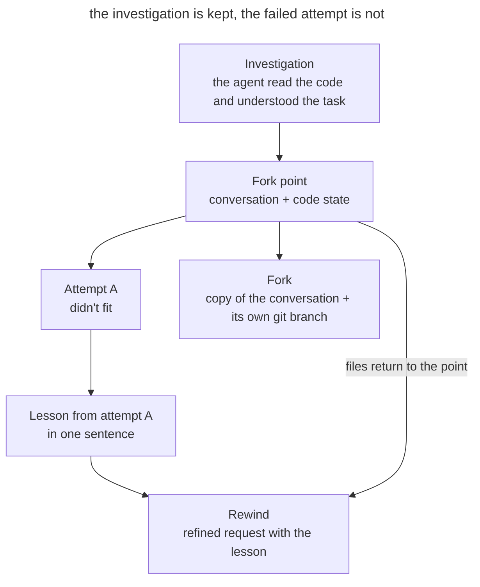

# Context Forking

## Intent

Return to the point in the conversation where the agent has already gathered the context it needs, and continue a different line of work from there. The failed attempt doesn't stay in the window, and the investigation doesn't have to be repeated in a new session. The code must match the chosen branch of the conversation.

## Also known as

Context forking; conversation rewind (`/rewind`, `Esc Esc`) and `/branch` in Claude Code; `/fork` in Codex.

## Problem

The agent has read the task queue, the mail client, and the configuration, and then implemented a first solution. It doesn't fit. The natural reaction is to write "that's wrong, try something else". Then the window holds the files read, the failed approach, your objection, and the second approach. The failed attempt keeps influencing the answers, and space in the window goes to things that are no longer needed.

A new session gets rid of the failure but loses the investigation. The agent has to read the same files again, or you have to prepare a [handoff document](handoff.md) for work that hasn't finished.

A similar situation arises when you need to compare two approaches. If you try them one after another in the same conversation, the second option is built with an eye on the first. And if one command printed a huge log, the valuable context before it ends up buried under the output.

The difficulty is that the work has two states: the conversation and the files. Rewinding the conversation doesn't bring the code back by itself, and a copy of the conversation works in the same directory as the original.

## Solution

Treat the conversation history as a tree. The fork point is the moment when the investigation is finished and the solution hasn't started yet. Two moves are available from it.

- **Rewind.** Go back to the fork point and repeat the request, taking into account what you learned. The failed branch is discarded; the window keeps the investigation and one refined request.
- **Fork.** Copy the conversation and continue working in the copy, leaving the original untouched. This lets you try a risky option or compare approaches from the same starting understanding.

With every move, bring the code in line with the conversation branch. After a rewind, return the files to the state of the fork point. For a fork, create a separate git branch, and if the branches run at the same time, a separate worktree.

Carry the lesson of the failed branch over explicitly: in one sentence in the new request, or in a short summary the agent writes before the rewind.

## Structure

The diagram shows one fork point and two paths from it. Note that on a rewind the files return together with the conversation.

Attempt A is discarded along with its edits, but its lesson goes into the new request. The fork starts from the same point and gets its own code state, so the options don't mix.

## Participants / Components

- **Fork point** captures the conversation after the investigation and the code state that matches it.
- **Conversation branch** continues the work from the fork point: it replaces the failed attempt or runs alongside the original.
- **Code state** is tied to the branch through the tool's checkpoints, a git branch, or a worktree.
- **Lesson of the failed branch** carries what was learned into the new request without the attempt itself.
- **Developer** chooses the fork point, decides whether to rewind or fork, and compares the results of the branches.

## When to use

- The agent took a wrong path after a valuable investigation.
- You need to compare two approaches based on the same understanding of the code.
- One operation filled the window with output, and the context before it is still needed.

If a new task begins, open a new session. If the work moves to another session, prepare a [handoff document](handoff.md).

## Consequences and trade-offs

- ➕ The failed attempt doesn't take up the window and doesn't influence the next answers.
- ➕ The investigation is reused without retelling.
- ➕ Options are compared from the same starting understanding of the task.
- ➖ The conversation and the code easily get out of sync: after rewinding only the conversation, the edits stay in the files, and the agent no longer knows about them.
- ➖ The tool's checkpoints don't track every change. Shell commands, external effects, and edits by background subagents have to be rolled back through git or by hand.
- ➖ Branches in the same working directory see each other's edits.
- ➖ The lesson of a discarded branch is lost unless you carry it over explicitly.
- ➖ You can only rewind to the boundary of one of your messages, not to the middle of a chain of tool calls.

## Implementation

1. When the investigation is finished, mark the fork point: commit or stash the current code state. This gives you an anchor for changes that checkpoints don't track, too.
2. If an attempt didn't fit, decide what you need: to replace it, or to keep it and try another option alongside.
3. Before rewinding, ask the agent to briefly write down what it learned. In Claude Code, the `/rewind` menu has a "Summarize from here" item for this.
4. Rewind the conversation together with the code. Then check `git status`: the tool won't revert changes made by shell commands and migrations.
5. Repeat the request and add the lesson from the failed attempt.
6. To compare approaches, create a conversation branch for each option and a separate git branch for its code. If the options run at the same time, give each its own worktree (see [Isolated Parallel Work](isolated-parallel-work.md)).
7. Compare the options against the same checks. Close the extra branches, and move the decision and its reasons into permanent documents.

## Example

A notification service needs to resend emails on temporary SMTP errors. The agent has studied the task queue, the mail client, and the worker settings. You committed a clean state and asked it to implement retries.

The agent added a retry loop with `sleep` inside the mail client. The tests pass, but when the server is unavailable, each worker waits up to a minute and stops picking up other tasks. You remember that the queue can already defer tasks.

Instead of objecting in the same window, you open `/rewind`, pick your message asking to implement retries, and restore the code and the conversation. `git status` shows a clean tree: the agent changed files through its edit tools, and the checkpoint reverted them. The original request comes back into the input field, and you extend it.

> Add email resending on temporary SMTP errors. Retries inside the mail client block the worker, use the queue's deferred tasks

The window keeps the files read and one refined request. The agent schedules the retry as a deferred task and adds a test. The argument about the blocking loop never made it into the context.

## Anti-patterns and common mistakes

- **Rewinding the conversation without the code.** The agent continues from a point where there were no edits yet, but the files have already changed. The next solution is built on top of changes it can't see.
- **Trusting checkpoints completely.** Files deleted by a command, applied migrations, and sent requests aren't rolled back with the conversation. Keep a commit at the fork point.
- **Two branches in one directory.** Parallel conversation branches overwrite each other's edits. Give each one its own git branch or worktree.
- **Rewinding without the lesson.** If you don't carry the lesson over, the agent may repeat the same mistake.
- **Forking too late.** A fork point after the failed attempt already contains the failure. Choose a moment before the first attempt.

## Known uses

- **Claude Code** opens the rewind menu with `/rewind` or a double `Esc`. You can restore the code and the conversation, only the conversation, or only the code, and also compress part of the conversation into a summary. `/branch` and `claude --continue --fork-session` copy the conversation and keep the original. The [documentation](https://code.claude.com/docs/en/checkpointing) warns that checkpoints don't track shell commands or external changes and don't replace git.
- **The Claude Code team** [advises](https://claude.com/blog/using-claude-code-session-management-and-1m-context) rewinding the conversation instead of correcting a failed attempt, and suggests recording the lesson with "Summarize from here" before rewinding.
- **Codex** lets you [edit a previous message](https://learn.chatgpt.com/docs/developer-commands?surface=cli) with a double `Esc` and fork the conversation from that point. The `/fork` command copies the current conversation, `/side` opens a temporary fork for a side question, and `/worktree` continues the conversation in a new worktree.
- **HumanLayer** [describes](https://www.humanlayer.dev/blog/context-forking-to-save-time-trouble-and-tokens) three reasons to fork: correcting course, comparing design options, and rescuing valuable context after a tool output that was too large.

## Related patterns

- [Context Engineering](context-engineering.md) explains why a failed attempt in the window gets in the way of the next answers.
- [Session Handoff](handoff.md) carries context into a new session through a document, when forking within the conversation no longer fits.
- [Isolated Parallel Work](isolated-parallel-work.md) gives parallel branches separate worktrees.
- [Design It Twice](design-it-twice.md) compares design options; forking lets you build them from the same investigation.
- [Throwaway Prototype](prototype-to-answer.md) tests a question with an experiment that is convenient to run in a separate branch.
