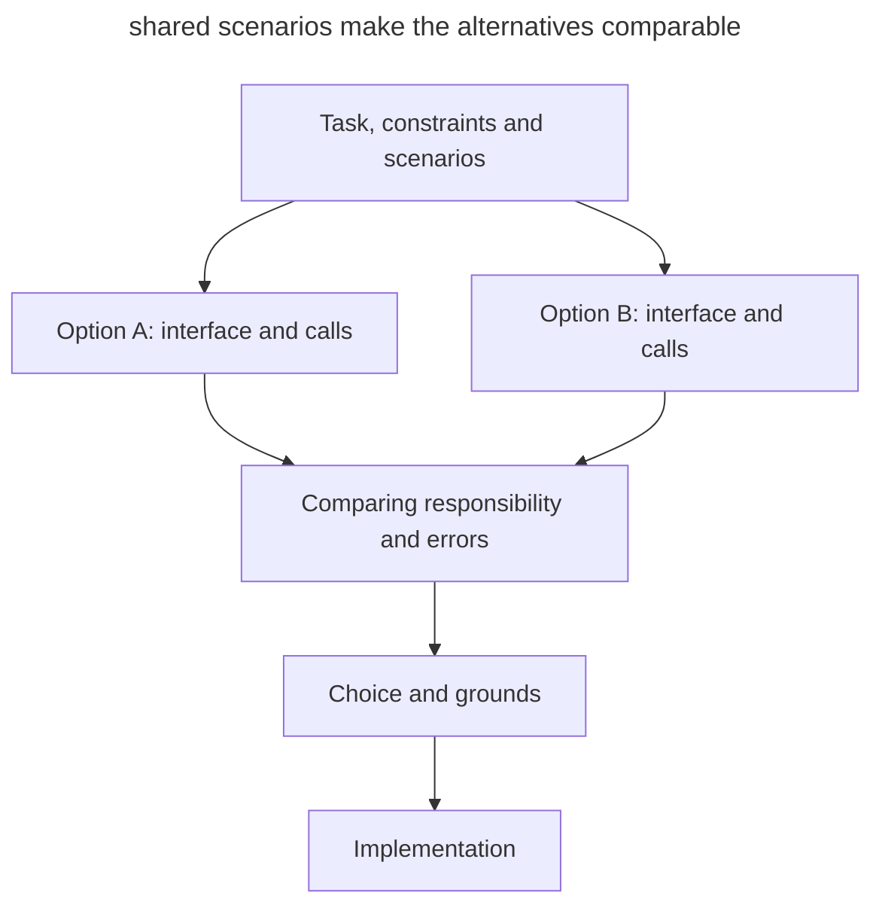

# Design It Twice

## Intent

Compare several substantially different solutions before implementation. You set shared requirements, the agent prepares alternatives and shows how they are used, and then you choose the approach by its concrete consequences for the project.

## Also known as

Design It Twice, John Ousterhout's "design it twice" principle.

## Problem

The agent proposes a plausible plan, and you immediately ask it to implement it. Further discussion refines the chosen design: which methods to add, where to handle an error, which tests to write. Meanwhile, the division of responsibility between modules itself is never compared with alternatives.

For example, the agent splits a CSV import into reading, validating and saving rows. The calling code ties these steps together and decides what to do with errors. This option may suit the project, but without an alternative it is hard to notice its cost: every new consumer will know the order of steps and the rules for partial saving.

Once the implementation is written, changing the design means reworking the code and the tests. Comparing small sketches lets you make this decision earlier.

## Solution

Ask the agent to design at least two options for the same task. Give both the same requirements, constraints and scenarios. The difference should touch how the solution is built: who drives the process, where the state lives, what the calling code knows.

Each option needs a small interface, a usage example and a description of behavior on errors. From them you can see what knowledge stays with the consumer and which changes will touch several places. General labels like "flexible" or "simple" are not enough to choose by.

Compare the options on the ordinary scenario and one or two hard cases. Ask the agent to recommend a solution and name the conditions under which the alternative is preferable. Record the choice and its grounds before implementation. If the key question needs observations, set aside a [throwaway prototype](prototype-to-answer.md) for it.

## Structure

Shared requirements branch into two sketches, which are then compared on the same scenarios.



The options can appear one after another in the same session. What matters is the difference in design and a shared basis for comparison; the number of agents doesn't guarantee that by itself.

## Participants / Components

- **Developer** sets the constraints and makes the decision with the project's needs in mind.
- **Agent** proposes alternatives, shows the calls and works through the trade-offs.
- **Shared scenarios** let you compare how the solutions behave under the same conditions.
- **Sketches** describe the interfaces, responsibility and errors before the full implementation.
- **Decision record** keeps the choice, the reasons and the conditions for revisiting it.

## When to use

- You are designing an API that several modules will use.
- During a refactor, you need to decide where to move responsibility or state.
- The first proposal looks convincing, but there is nothing yet to compare its advantages with.
- Changing the chosen design later will affect a lot of calling code.

For a local fix with an unambiguous solution, the comparison may cost more than the work itself. Limit it to a specific decision that affects further development.

## Consequences and trade-offs

- ➕ Usage code helps you notice the complexity an interface shifts onto the consumer.
- ➕ The choice rests on the project's scenarios and constraints.
- ➕ The rejected option leaves useful grounds for a future revision.
- ➖ Preparing and reading alternatives takes time.
- ➖ The agent may propose superficial differences or make one option deliberately weaker.
- ➖ A sketch doesn't confirm the performance and correctness of the future implementation.

## Implementation

1. Choose one decision to compare: for example, the boundary of the import module.
2. Have the agent read the existing code and name the constraints with references to places in the project.
3. Name the ordinary scenario and one or two hard cases on which you will compare the options.
4. Request two different divisions of responsibility. Limit the result to interfaces, calling code and a description of errors.
5. Check that each option meets all mandatory requirements. If one missed a requirement, send it back for rework.
6. Compare the options by their usage code and the places that will have to change. Go through the agent's recommendation.
7. Record the decision in the task or an ADR and hand the chosen contract over to implementation.

If one agent reproduces the first option under different names, give the second approach an explicit direction: for example, move control of the process from the calling code into the module. You can assign the sketches to separate agents, giving each the same initial context and its own search direction. All mandatory requirements still apply. To compare interfaces, separate branches with full implementations are usually unnecessary.

## Example

You need to import users from a CSV. The import is started by an HTTP handler and a CLI command. The file is limited to 10,000 rows. Valid rows are saved, and for invalid ones the row number and the reason are returned. If the storage is unavailable, the import stops; rows already saved remain, and the report contains their count. Rerunning and deduplication need a separate decision and are not part of this example.

You give the agent a frame for the comparison:

> Design the API for importing users from a CSV twice: in one option the calling code drives the steps, in the other the import module does. Compare them for the HTTP handler and the CLI

Below are sample sketches in JavaScript. The function names stand for the proposed contract; the code shows the division of responsibility and is not a finished import implementation. In both options, a CSV syntax error stops the import with the code `invalid_csv`; an error in the content of a single row goes into the report and doesn't affect the other rows.

**Option A: the consumer drives the steps.** `readCsv` yields numbered rows, `validateUser` returns a user or a list of errors, `users.save` saves one user. When the storage is unavailable, `save` throws `StorageUnavailable`.

```js
const report = { saved: 0, rejected: [], stopped: null };

try {
  for await (const { line, fields } of readCsv(source)) {
    const result = validateUser(fields);
    if (!result.ok) {
      report.rejected.push({ line, errors: result.errors });
      continue;
    }

    await users.save(result.user);
    report.saved += 1;
  }
} catch (error) {
  if (error instanceof StorageUnavailable) {
    report.stopped = "storage_unavailable";
  } else if (error instanceof InvalidCsv) {
    report.stopped = "invalid_csv";
  } else {
    throw error;
  }
}
```

The calling code controls every step. It also knows when to continue processing, when to stop and how to count saved rows. The HTTP handler and the CLI will both need these rules. If you move the whole process shown here into a shared operation, the boundary of responsibility moves closer to the second option.

**Option B: the module drives the import.** On creation, the module receives the storage. The `run` method reads the CSV, validates and saves the rows, and builds the same report. Expected reasons for stopping are returned in `stopped`; unexpected errors are thrown to the caller.

```js
// When assembling the application:
const userImport = createUserImport({ users });

// In the HTTP handler or the CLI:
const report = await userImport.run(source);
```

In both options, two valid users and one invalid row give the same result:

```json
{
  "saved": 2,
  "rejected": [{ "line": 3, "errors": ["Invalid email"] }],
  "stopped": null
}
```

If the first row is saved and the storage becomes unavailable while saving the second, the expected report is `saved: 1`, `rejected: []`, `stopped: "storage_unavailable"`. These examples set the contract for both options; during implementation they need to be checked with tests.

| Scenario or change | Option A | Option B |
|---|---|---|
| Invalid row | The consumer adds the error to the report and continues the loop | The module returns the row error in the finished report |
| Storage unavailable | The consumer stops the loop and keeps the counter | The module stops the import and returns the counter |
| Adding a second consumer | The processing rules have to be repeated or extracted | The new consumer calls `run` |
| A special action before saving a row | The consumer adds it to its loop | The module has to change or its contract has to be extended |

For the stated task we choose B: HTTP and CLI use the same import rules, so it helps to keep them in one place. Option A makes sense if consumers need different processing sequences. A short decision record keeps this condition:

> We chose a module with a run operation: it owns row processing and report building for HTTP and CLI. Valid rows are saved independently; an expected failure stops the import with a report on the partial result. We'll revisit the boundary if consumers need different processing flows.

## Anti-patterns and common mistakes

- **Two names for one solution.** Classes and functions are renamed, but the responsibility stays the same. Ask the agent to show what knowledge about the process has moved to another module.
- **Unequal conditions.** One option handles only the happy path, while the other handles errors. First bring both up to the shared requirements.
- **Comparing by the number of methods.** A single method can hide dozens of mandatory settings and a complex setup order. Look at the whole usage code.
- **Fully implementing each option.** The amount of work grows before the question that requires running anything has been formulated. Start with sketches and set experiments apart.
- **Endless enumeration.** New options keep appearing without a new criterion for choosing. Finish the comparison when the requirements are covered and the essential trade-offs are understood.
- **Accepting the recommendation automatically.** The agent may misjudge the project's future needs. Check the assumptions the choice rests on.

## Known uses

- **John Ousterhout** discusses Design It Twice in the book [A Philosophy of Software Design](https://web.stanford.edu/~ouster/cgi-bin/aposd.php); the principle is also included in the [materials of his CS 190 course](https://web.stanford.edu/~ouster/cs190-winter24/lectures/aposd/). Here it is adapted to a developer working with an agent.
- **Matt Pocock's skills** include [Design It Twice inside codebase-design](https://github.com/mattpocock/skills/blob/main/skills/engineering/codebase-design/DESIGN-IT-TWICE.md): several agents design different interfaces, show how they are used and compare what complexity the module hides and where changes will concentrate. This is one way to organize the work; the process described in this chapter can also be run in a single session.

## Related patterns

- [Grilling](grilling.md) checks the assumptions of a finished plan; comparing alternatives helps choose the design itself.
- [Throwaway Prototype](prototype-to-answer.md) provides observations for questions that remain after comparing the sketches.
- [Four Phases](explore-plan-code-commit.md) makes room for the comparison before implementation, in the planning phase.
- [Domain Vocabulary](domain-context-file.md) helps use shared terms in the options and preserve the decision in an ADR.
