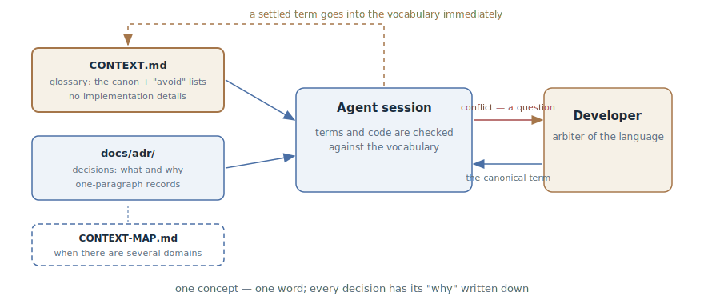

# Domain Vocabulary

## Intent

Pin down the project's canonical language in the repository: a glossary of
domain terms and a log of architectural decisions that the agent reads in
every session. One concept — one word, and every non-obvious decision has its
"why" written down: this cures term drift, renaming churn, and attempts to
"fix" the deliberate.

## Also known as

CONTEXT.md, domain glossary; DDD's ubiquitous language moved into a file;
ADR — architecture decision records.

## Problem

A living project has a language of its own, and it is written down nowhere:

- One concept goes by three names. "Account" in conversation, `Customer` in
  the code, `client` in the new table. The agent, not knowing the canon,
  legitimately uses any of them — and every session adds synonyms.
- The agent proposes renames. To it, `Enrollment` looks like a non-standard
  name for a subscription — so it "improves" it into `Subscription`, breaking
  the language the team uses to talk to the business.
- Decisions lose their "why". Half a year later nobody — human or agent —
  remembers that services talking through events instead of direct calls was
  a deliberate choice. The agent sees "needless complexity" and proposes
  REST — and this has to be argued down anew in every session.

[Project Memory](claude-md-memory.md) doesn't close this gap: it answers "how
we work" — commands, conventions, boundaries. "What words mean" is a different
axis, and dumping a glossary into the general rules file means bloating it.

## Solution

Two artifacts in the repository that the agent receives in every session.

**The glossary** — `CONTEXT.md`: a list of the domain's terms. The format is
strict and deliberately poor:

- One canonical word per concept; the remaining synonyms are listed under an
  "avoid" note.
- A definition in one or two sentences: what the thing *is*, not what it
  does.
- Only this domain's terms. General programming concepts — timeouts, retries,
  patterns — don't live in the vocabulary, even if the project is full of
  them.
- No implementation details: the vocabulary is neither a spec nor a scratch
  pad.

**The decision log** — `docs/adr/`: short records of "what we decided and
why", one file per decision. An ADR is created only when all three conditions
hold: the decision is hard to reverse, it would surprise a reader without
context, and it is the result of a real choice between alternatives. One
paragraph is enough — the value is that the decision and its reason are
*written down*, not in filled-out sections.

From there the vocabulary works both ways. The agent checks its own speech
and code against it — and stops breeding synonyms. And when the developer
uses a word that conflicts with the glossary, the agent is obliged to push
back: "the glossary defines cancellation as cancelling the whole order, but
you seem to mean partial — which is it?" A new term is recorded in the
vocabulary the moment it settles — not put off for later.

## Structure



On the left, the artifacts: the glossary with its canonical terms and the
decision log; in large repositories with several domains they are tied
together by a context map (`CONTEXT-MAP.md` — where each vocabulary lives and
how the contexts communicate). Both artifacts enter the agent's session along
with the persistent context layer. Inside the session runs the checking loop:
the agent notices a term conflict and calls the developer out for
clarification, the developer rules on the canonical word — and it is recorded
in the vocabulary immediately. The dashed arrow back is that update: the
vocabulary grows at the moment a term crystallizes, not at the end of the
week.

## Participants / Components

- **Glossary** (`CONTEXT.md`) — canonical terms with definitions and "avoid"
  lists.
- **Decision log** (`docs/adr/`) — one-paragraph records of non-obvious
  decisions with their "why".
- **Context map** (`CONTEXT-MAP.md`) — for repositories with several domains:
  which contexts exist, where their vocabularies live, how they relate.
- **Developer** — the source and arbiter of the language: approves terms,
  settles disputes.
- **Agent** — checks speech and code against the vocabulary, challenges
  conflicts, updates the vocabulary as decisions land.

## When to use

- The domain has a language of its own: business terms that must not blur —
  billing, logistics, insurance, education.
- The project lives long and will outlast hundreds of sessions: without a
  canon, the language drifts with each one.
- The agent already confuses terms, calls one concept different names, or
  proposes renaming something that is named that way on purpose.
- The codebase is split into several domains and one word means different
  things in different places — a context map is needed.

For a weekend utility the vocabulary is overkill: the language won't have
time to drift.

## Consequences and trade-offs

- ➕ The agent speaks the same language as the code and as you: names in new
  code match the team's language without reminders.
- ➕ Renaming churn stops: the agent can "improve" a canonical name only by
  challenging the vocabulary explicitly.
- ➕ Decisions stop getting "fixed": the ADR answers "why is it like this"
  before the agent proposes a redo.
- ➕ The vocabulary works for people too: a new developer gets the project's
  language from the same file as the agent.
- ➖ One more artifact to maintain: a stale vocabulary misinforms with an
  authoritative air.
- ➖ It demands in-the-moment discipline: a term is recorded when it settles —
  put it off and it's lost.
- ➖ The temptation to bloat: implementation details and general programming
  terms turn the vocabulary into a dump, and an ADR for every sneeze devalues
  the log.

## Implementation

1. Create lazily: `CONTEXT.md` — when the first term settles, `docs/adr/` —
   when the first decision worth recording appears. Empty scaffolding isn't
   needed.
2. Keep the glossary format poor: a term, one or two sentences of "what it
   is", an "avoid" list. Be opinionated: of the synonyms, one survives.
3. Filter at the door: only concepts unique to this domain. If a term would
   appear in any project, it doesn't belong here.
4. Create ADRs by the three criteria — hard to reverse, surprising without
   context, a real choice. One paragraph: context, decision, reason. Number
   sequentially (`0001-...`, `0002-...`).
5. Attach the vocabulary to every session — simplest via an import from
   [Project Memory](claude-md-memory.md) (in Claude Code — an `@CONTEXT.md`
   line in CLAUDE.md).
6. Charge the agent with defending the language: ask it to check terms and
   argue on conflict, and to record what's been settled into the vocabulary
   right away.
7. In a repository with several domains add a `CONTEXT-MAP.md`: the list of
   contexts, their vocabularies, and the relationships between them; the
   vocabularies move in with their modules.

In [Matt Pocock's skills](matt-pocock-skills.md) the pattern is implemented
by the `domain-modeling` skill: it maintains CONTEXT.md and the ADRs by the
rules described here, while the pack's other skills — the interview, the
spec, the implementation — read the vocabulary as the source of language.

## Example

The glossary of an education platform — short and opinionated:

```markdown
# Learning

The course-taking context: from enrollment to certificate.

## Language

**Enrollment**:
The fact of a student's access to a course. Created at sign-up, lives
until revoked.
_Avoid_: subscription, purchase, access

**Cohort**:
A group of students taking a course on a shared schedule.
_Avoid_: group, class, batch

**Completion**:
An enrollment with all mandatory modules finished.
_Avoid_: graduation, course closure
```

And an ADR, `docs/adr/0003-enrollment-not-subscription.md`:

```markdown
# Enrollment is not tied to payment

Course access and billing are separated on purpose: enrollments are also
created by corporate contracts and grants, where no subscription exists at
all. Hence Enrollment is its own entity, not a Subscription status.
```

The developer sets a task: "make it so that when a subscription is cancelled
the student loses course access." The agent, having read the vocabulary,
answers with a question:

> The glossary marks "subscription" as avoid — here this is Enrollment, and
> per ADR-0003 it is not tied to payment. Do you want to revoke enrollments
> created specifically through billing, or all of the user's enrollments?

The ambiguity that would have become a bug for corporate students in the code
died in the first reply. Without the vocabulary the agent would have
obediently tied Enrollment to billing — and "improved" the names while at it.

## Anti-patterns and common mistakes

- **A vocabulary-turned-spec.** Implementation details, table names, and call
  orders seep into the definitions — the vocabulary becomes a decaying
  duplicate of the code. Define *what it is*; the rest lives in code and
  specs.
- **A vocabulary-turned-encyclopedia.** General programming terms and
  truisms bloat the file — the domain words drown (see
  [context engineering](context-engineering.md): every line costs attention).
- **Synonyms without an arbiter.** Recording every variant of "how we say it"
  without choosing a canon legitimizes the drift instead of stopping it.
- **A dead vocabulary.** The file exists but isn't attached to the session
  and isn't updated when decisions land — a month later it lies, and the
  agent lies with it.
- **An ADR for every sneeze.** Records of trivial decisions bury the
  important ones. The three criteria are a filter at the door, not a
  formality.

## Known uses

- **Matt Pocock's skills** — the `domain-modeling` skill: CONTEXT.md with the
  "term + avoid" format, one-paragraph ADRs with the three criteria, a
  context map for multi-domain repos; the pattern's primary source in its
  agentic form.
- **Domain-Driven Design** — Eric Evans's ubiquitous language and bounded
  contexts: the root of the idea, here moved from the team's heads into a
  file for the agent.
- **The ADR convention** — Michael Nygard's architecture decision records and
  tools like adr-tools; a decade-old practice that the agent reads as
  context.
- **Kiro** — the product.md steering file as a partial analog: product
  context attached to every spec session.

## Related patterns

- [Project Memory](claude-md-memory.md) — the neighboring axis of the
  persistent layer: "how we work" versus "what words mean"; the vocabulary is
  attached to the session through it.
- [Context Engineering](context-engineering.md) — the vocabulary and ADRs are
  part of the persistent context layer and obey its economics: short and
  high-signal.
- [Spec-Driven Development](spec-driven-development.md) — specifications
  written in the canonical language don't diverge from each other in terms;
  the vocabulary is the common denominator of all artifacts.
