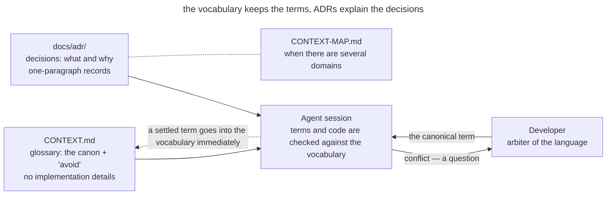

# Domain Vocabulary

## Intent

Record the project's terms and the reasons behind architectural decisions in the repository. The agent can then check names in the code and proposed changes to the system against them. For each concept the team chooses one name, and for a non-obvious decision it keeps the rationale.

## Also known as

CONTEXT.md, domain glossary, ubiquitous language from DDD; architecture decision records (ADR).

## Problem

A project has its own language, which a new participant cannot always reconstruct from the code. For example, on an education platform, enrolling in a course and a paid subscription can grant similar access but have different grounds.

If the agent treats them as synonyms, it will rename `Enrollment` to `Subscription` and tie access to payment. Corporate students may then lose access, even though their enrollments were paid for in another way.

The reason for the original separation may have survived only in an old conversation. Without a record, the team has to explain it again every time someone proposes to "simplify" the model.

[Project memory](claude-md-memory.md) holds working instructions. Definitions of domain concepts are better kept in a separate vocabulary and attached to the session through the memory file.

## Solution

Keep a glossary and a decision log in the repository that the agent can use while working on a task.

**The glossary** in _CONTEXT.md_ defines the domain's terms. A short format is enough for it.

- Each concept has one accepted name. Other variants are listed and marked "avoid".
- The definition explains the meaning of the concept in one or two sentences.
- The vocabulary includes only concepts to which the project gives a special meaning.
- Implementation details stay in the code and technical plans.

**The decision log** in _docs/adr/_ keeps the decision made and its reason in a separate file. In this variant of the pattern, an ADR is needed for a choice that is hard to reverse and hard to understand without context. The record should explain which alternatives the team considered and why it chose one of them. For a simple case, a paragraph is enough.

The agent checks terms against the vocabulary and clarifies discrepancies before changing the code. For example, if cancellation means cancelling the whole order, a request for partial cancellation needs clarification. When the team has agreed on a new concept, the agent records its definition right away.

## Structure

In the diagram, the glossary and the decision log enter the agent's context.


```mermaid
---
title: the vocabulary keeps the terms, ADRs explain the decisions
---
flowchart LR
  glossary["CONTEXT.md<br/>glossary: the canon + 'avoid'<br/>no implementation details"]:::accent
  adr["docs/adr/<br/>decisions: what and why<br/>one-paragraph records"]
  map["CONTEXT-MAP.md<br/>when there are several domains"]:::muted
  session["Agent session<br/>terms and code are checked against the vocabulary"]
  dev["Developer<br/>arbiter of the language"]:::accent
  glossary --> session
  adr --> session
  adr -.- map
  session -- "conflict — a question" --> dev
  dev -- "the canonical term" --> session
  session -. "a settled term goes into the vocabulary immediately" .-> glossary
```

If a term in the task diverges from the vocabulary, the agent asks the developer for clarification and saves the accepted definition. The dashed arrow shows this update. For a project with several domains, _CONTEXT-MAP.md_ indicates where the vocabularies are and how their contexts are related.

## Participants / Components

- **Glossary** (_CONTEXT.md_) keeps definitions and unwanted synonyms.
- **Decision log** (_docs/adr/_) explains non-obvious architectural choices.
- **Context map** (_CONTEXT-MAP.md_) links the vocabularies of several domains.
- **Developer** approves terms and resolves contradictions.
- **Agent** checks text and code against the vocabulary and records agreed definitions.

## When to use

- The domain uses terms whose meaning must be preserved, for example in billing or education.
- Different people and agents work on the project and need a shared vocabulary.
- The agent already confuses terms, calls one concept by different names, or proposes renaming something that is named that way on purpose.
- The same word has different meanings in different domains.

For a small one-off utility, a separate vocabulary usually does not pay off.

## Consequences and trade-offs

- ➕ New names in the code agree with the team's language.
- ➕ Before renaming, the agent has to explain the discrepancy with the vocabulary.
- ➕ An ADR helps evaluate a proposed rework with the original reasons in mind.
- ➕ A new developer learns the terms from the same document the agent reads.
- ➖ The team has to keep the definitions up to date.
- ➖ If recording an agreed term is postponed, the next session may choose a different name.
- ➖ Unnecessary definitions and records of trivial decisions make it harder to find the needed context.

## Implementation

1. Create _CONTEXT.md_ when the first term is agreed, and _docs/adr/_ when a decision appears that needs to be explained to a future reader.
2. For a term, write a short definition and the unwanted synonyms. Choose one name to use in the project.
3. Add only concepts whose meaning depends on the domain.
4. In an ADR, record the context, the decision made, and the reason for the choice. Number the files sequentially (`0001-...`, `0002-...`).
5. Attach the vocabulary through [project memory](claude-md-memory.md). In Claude Code you can use an `@CONTEXT.md` line in CLAUDE.md for this.
6. Ask the agent to notice contradictions in terms and record agreed definitions right after the discussion.
7. In a project with several domains, place the vocabularies next to the modules and link them through _CONTEXT-MAP.md_.

In [Matt Pocock's skills](matt-pocock-skills.md), the `domain-modeling` skill maintains CONTEXT.md and ADRs. The other skills use these documents during the interview, specification writing, and implementation.

## Example

Below is the glossary of an education platform.

```markdown
# Learning

The course-taking context: from enrollment to certificate.

## Language

**Enrollment**:
The fact of a student's access to a course. Created at sign-up, lives until revoked.
_Avoid_: subscription, purchase, access

**Cohort**:
A group of students taking a course on a shared schedule.
_Avoid_: group, class, batch

**Completion**:
An enrollment with all mandatory modules finished.
_Avoid_: graduation, course closure
```

The reason for the choice of name is kept in the ADR _docs/adr/0003-enrollment-not-subscription.md_.

```markdown
# Enrollment is not tied to payment

Course access and billing are separated on purpose: enrollments are
created both by corporate contracts and by grants, where there is no
subscription at all. Hence Enrollment exists as a separate entity.
```

You ask for a student to lose access to the course when their subscription is cancelled. The agent reads the vocabulary and clarifies the task.

> The vocabulary uses the name Enrollment for course access. According to ADR-0003, an enrollment is not necessarily tied to payment. Should only enrollments created through billing be revoked, or all of the user's enrollments?

The clarification preserves access for corporate students whose enrollments are not tied to a personal subscription. You notice the ambiguity before it turns into a condition for removing access.

## Anti-patterns and common mistakes

- **A vocabulary-turned-spec.** Table names and call orders quickly go stale. Keep the meaning of concepts in the vocabulary, and describe the implementation in the code and technical plans.
- **A vocabulary-turned-encyclopedia.** General programming terms make it harder to find the project's concepts and take up context (see [context engineering](context-engineering.md)).
- **Synonyms without an arbiter.** A list of all variants without choosing the main name preserves the ambiguity.
- **A dead vocabulary.** A document that nobody reads or updates gradually diverges from the project's language.
- **An ADR for every sneeze.** Among records of trivial decisions, the reasons for architectural choices are harder to find.

## Known uses

- **Matt Pocock's skills** implement the pattern through `domain-modeling`, which maintains the vocabulary, ADRs, and the context map.
- **Domain-Driven Design** by Eric Evans introduces the ubiquitous language and bounded contexts on which this pattern builds.
- **The ADR convention** by Michael Nygard and tools like adr-tools help preserve the reasons for architectural decisions.
- **Kiro** attaches product context through the product.md steering file.

## Related patterns

- [Project Memory](claude-md-memory.md) attaches the vocabulary to the agent session.
- [Context Engineering](context-engineering.md) helps select information for the vocabulary and ADRs.
- [Spec-Driven Development](spec-driven-development.md) uses the shared vocabulary when writing specifications.
