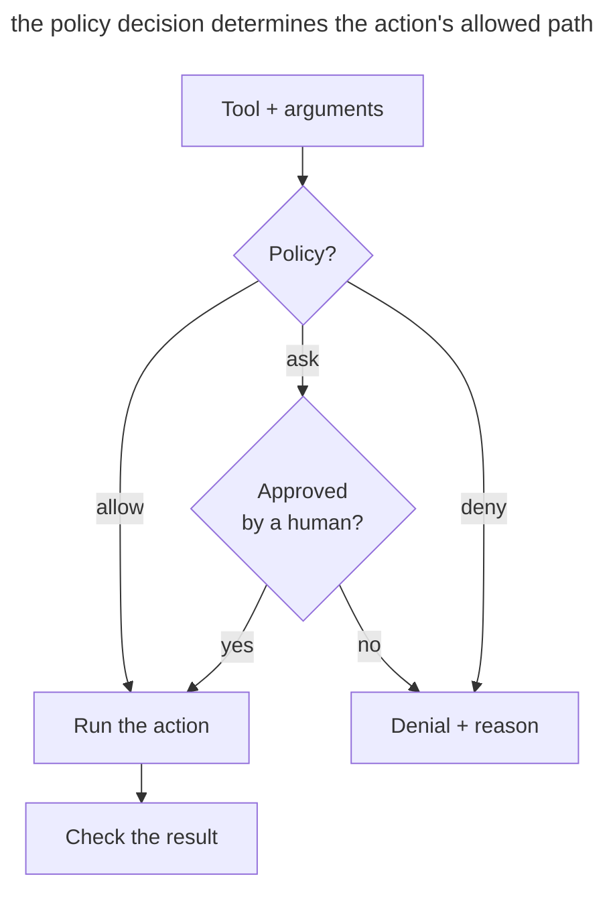

# Executable Guardrails

## Intent

Enforce critical rules for agent work with access permissions, a sandbox, hooks, and automated checks. Inside the allowed area, the agent acts on its own. An attempt to cross its boundaries is stopped by the system.

## Also known as

Executable guardrails, policy as code, enforced constraints, rails for agents.

## Problem

_AGENTS.md_ says not to change migrations. The agent may miss that in a long context or call a tool that changes the file as a side effect. The text of the prohibition will not stop the write by itself. A critical rule needs a mechanism that checks the action before it runs.

Confirming every command also takes attention. After dozens of identical requests, you may start approving them mechanically. Removing all restrictions reduces the number of requests but widens the area a mistake can affect.

Not all rules are equal. "Prefer small functions" requires judgment and belongs in guidance. "Do not write outside the repository" can be checked unambiguously and should be enforced by a machine. If a deterministic rule stays only in the prompt, the project relies on probabilistic compliance with something that could be guaranteed.

## Solution

Separate rules into **guidance** and **invariants**. Keep guidance in project memory, where the agent can take context into account. For invariants that can be checked unambiguously, choose a suitable mechanism.

1. **A sandbox** restricts the available directories, network, and processes.
2. **Permissions** pre-approve a narrow set of safe actions and require a human decision outside it.
3. **A pre-action hook** checks the intent before execution and blocks what is forbidden.
4. **A post-action or stop hook** checks the result and does not let the work be declared finished without the required signal.
5. **CI** repeats critical checks outside the agent session and protects the target branch.

A guardrail should check a narrow condition and explain the reason for a denial. Along with the denial, return an allowed next step. The agent can then keep working inside the allowed area without constant approvals.

## Structure

The mechanism checks an action before it runs. The policy determines whether it can run right away, needs human approval, or is forbidden.



Human approval opens only the branch the policy provides for. It does not override the hard prohibitions of the sandbox or hooks. On denial, the agent receives the reason and an allowed next step. After execution, a separate check confirms the requirements for the result.

## Participants / Components

- **Policy** defines an unambiguously checkable rule.
- **Agent** proposes an action and receives the result of the check.
- **Enforcement mechanism** checks the action through a sandbox, permissions, an allowlist, a hook, or CI.
- **Safe area** covers the actions allowed without human involvement.
- **Escalation** hands a human an action that cannot be automatically allowed or denied.
- **Audit** records the rule that fired, without secrets or unnecessary data.

## When to use

- Breaking the rule could delete data, expose a secret, change an external system, or damage a release.
- The agent works without constant supervision or starts child processes.
- The same prohibitive rule has to be repeated in prompts.
- The conditions can be checked quickly and unambiguously from a command, path, diff, or exit code.
- The team wants to reduce the number of manual approvals without expanding the agent's access uncontrollably.

The requirement "the architecture should be simple" has no unambiguous quick check. Keep it as guidance for design and review. A hook with such a condition will either block legitimate work or create an illusion of control.

## Consequences and trade-offs

- ➕ Critical invariants hold regardless of how full the context is or the quality of a particular response.
- ➕ The agent runs familiar allowed commands without your involvement.
- ➕ A denial shows which rule fired and why.
- ➕ The policy lives in git, goes through review, and works the same way for the whole team.
- ➖ A bug in a guardrail blocks useful work; boundaries need a set of positive and negative tests.
- ➖ Synchronous hooks add latency, so heavy checks should move to a stop hook or CI.
- ➖ The allowlist gradually grows; a broad rule such as "allow any shell" destroys the point of the boundary.
- ➖ A sandbox reduces the blast radius but does not prove the code is correct and does not replace tests.

## Implementation

1. Collect the recurring prohibitions from instructions and incident history. For each one, determine whether a violation can be detected without guessing at the agent's intent.
2. Describe in a table the actions the system allows, blocks, or sends for approval. Start with the critical restrictions on writing and publishing.
3. Put the boundary at the right layer. The OS sandbox restricts file and network access; a pre-tool hook checks a specific command; tests and CI check the quality of the result.
4. In the denial response, name the rule and the allowed next step.
5. Check that the mechanism blocks the forbidden action and lets the nearest allowed one through. Add checks for input escaping and timeouts.
6. Keep a minimal audit of decisions, but do not record tokens, the contents of secret files, or complete user data.
7. Analyze false blocks and refine the specific condition that caused them.

## Example

The agent may change the service in _./app_, run tests, and read documentation. Writing outside the repository is forbidden, and publishing requires approval. Project memory keeps a general working rule.

> Work within the task and prefer reversible changes.

First, let's write down the desired policy decisions in illustrative notation. This is pseudocode for discussing the rules, which still has to be expressed in the settings of the sandbox and permissions you choose.

```text
write path ./app/**          allow
write path ./docs/**         allow
write path ../**             deny: outside workspace
command make test            allow
command git push *           ask: external state change
network registry.npmjs.org   allow
network *                    deny: domain not approved
```

After configuring the mechanisms, we check the expected decisions. A `git push` call should ask for approval, a write to _~/.ssh/config_ should be blocked, and `make test` should run without a question. The pseudocode block itself does not set up any such restrictions.

A real, narrow guardrail can be shown with a ban on committing changes to migrations. Save the following script as _.git/hooks/pre-commit_ in a test repository with a regular _.git_ directory and make it executable with `chmod +x .git/hooks/pre-commit`.

```sh
#!/bin/sh
set -eu

changes=$(git diff --cached --name-only -- db/migrations/)
if [ -n "$changes" ]; then
    printf '%s\n' 'Blocked: staged migration changes require review.' >&2
    exit 1
fi
printf '%s\n' 'Allowed: no staged migration changes.'
```

In this script, `git diff --cached` checks the changes staged for commit. If any of them is a file from _db/migrations/_, the hook returns exit code 1 and Git stops the commit. In a temporary repository, calling the hook before and after adding a migration gives this result.

```console
$ .git/hooks/pre-commit
Allowed: no staged migration changes.
$ mkdir -p db/migrations
$ touch db/migrations/001.sql
$ git add db/migrations/001.sql
$ .git/hooks/pre-commit
Blocked: staged migration changes require review.
$ echo $?
1
```

This hook protects the moment of the commit. It does not prevent writing the file and can be disabled, so a mandatory restriction needs a check outside the agent's control, for example in CI with branch protection. To forbid the write itself, use file permissions or a sandbox.

## Anti-patterns and common mistakes

- **Everything in the prompt.** Deterministic prohibitions compete for attention with the task description and sometimes lose.
- **Block everything.** Every command requires approval; you get tired and start approving without reading.
- **Allow the whole shell.** A narrow allowlist is replaced with a universal bypass of the entire threat model.
- **A hook with intelligence.** A slow LLM hook tries to judge the intent of every command and makes the boundary expensive and unpredictable.
- **Silent denial.** The agent sees only a non-zero exit code and starts looking for a workaround instead of a safe path.
- **Secrets in the audit.** The leak protection itself copies sensitive data into the log.
- **Local protection only.** The agent disables the hook or does not run it; a critical invariant must be repeated in CI or branch protection.

## Known uses

- **GitHub Copilot hooks** run commands at key points of a session. A pre-tool hook can allow or deny a tool call; other hooks check state and keep an audit.
- **Claude Code sandboxing** sets file system and network restrictions at the OS level, including child processes, and allows free work inside the allowed area.
- **Git hooks and CI** apply the same principle to commit format, tests, and branch rules.

The mechanisms are described in the [GitHub Copilot hooks](https://docs.github.com/en/copilot/concepts/agents/hooks) documentation and the article on [Claude Code sandboxing](https://www.anthropic.com/engineering/claude-code-sandboxing).

## Related patterns

- [Project Memory](claude-md-memory.md) holds guidance and explains the purpose of the restrictions.
- [Feedback Loop](give-agent-a-way-to-verify.md) checks that the result is correct.
- [Isolated Parallel Work](isolated-parallel-work.md) uses worktrees whose boundaries can be enforced with a sandbox and permissions.
- [Bloated Memory](bloated-claude-md.md) describes an accumulation of prohibitions that are better moved into executable mechanisms.
