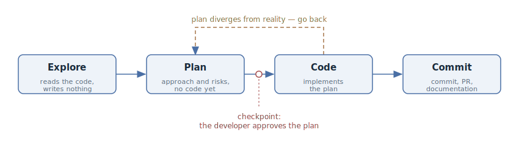

# Explore — Plan — Code — Commit

## Intent

Split the agent's work on a non-trivial task into four explicit phases —
exploration, planning, implementation, and committing the result — so that the
agent first understands the task and agrees on the approach with the developer,
and only then writes code.

## Also known as

Explore–Plan–Code–Commit (EPCC), "plan first, code second".

## Problem

By default, an agent starts writing code from the very first message. For a
simple edit that is fine, but on a non-trivial task it has not yet seen the
relevant files, does not know the project's conventions, and easily solves the
wrong problem. The developer discovers this only while reviewing the finished
diff — at the most expensive point: redoing the work costs more than the whole
conversation before it.

Trying to insure against this with a more detailed prompt leads to the opposite
extreme — premature specification: you dictate the implementation instead of
the task. What you need is a way to catch a wrong direction early, without
taking the choice of approach away from the agent.

## Solution

Explicitly walk the agent through four sequential phases and forbid writing
code in the first two.

1. **Explore.** The agent reads the relevant code and gathers context. No
   edits — understanding the task only.
2. **Plan.** The agent proposes an approach: what to change, in what order,
   what the risks are. The developer reads the plan and approves or amends it.
   This is the main checkpoint: correcting course at the plan level is many
   times cheaper than at the code level.
3. **Code.** The agent implements the approved plan, checking itself against
   the plan and against the available checks (tests, build, linter).
4. **Commit.** The result is locked in: a commit with a meaningful message, a
   pull request, and documentation updates where needed.

## Structure

The phases run strictly in order, but the process is not one-way: if the plan
diverges from reality during implementation, the right move is to return to the
planning phase and re-agree on the plan — not to stretch the code to fit an
outdated document. The checkpoint between plan and code belongs to the
developer: without an explicit "yes" the agent does not move on to
implementation.

## Participants / Components

- **Developer** — sets the task, reads and approves the plan, accepts the
  result.
- **Agent** — explores the codebase, proposes a plan, implements it.
- **Plan** — the intermediary artifact: a short "what and how" document. It can
  be edited, saved, executed in a fresh session, or handed to another agent.
- **Codebase** — the source of context in the exploration phase and the object
  of change in the code phase.

## When to use

- The task is non-trivial: it touches several modules, an unfamiliar part of
  the system, or requires choosing between approaches.
- A wrong direction is expensive: a large diff, a migration, a public contract.
- You want to review the direction, not only the finished result.

For one-line edits and mechanical changes the pattern is overkill — four phases
only slow the work down.

## Consequences and trade-offs

- ➕ The agent solves the problem you actually meant: a wrong direction is
  caught at the plan, not at diff review.
- ➕ Reviewing a plan is an order of magnitude cheaper than reviewing code —
  both for the human and in tokens.
- ➕ The plan remains an artifact: it can be refined, executed in a fresh
  session, or reused as the pull request description.
- ➖ For simple tasks the cycle is slower and more expensive than a direct
  "just do it".
- ➖ The plan goes stale during implementation — returning to the planning
  phase takes discipline, otherwise code and plan silently diverge.
- ➖ The temptation to grow the plan into a step-by-step instruction leads back
  to premature specification.

## Implementation

1. Start with exploration and explicitly forbid code: "Read the files
   responsible for X and figure out how Y works. Don't write anything yet."
2. Ask for a plan: "Draft a plan for solving this; don't write code." If the
   tool has a planning mode (in Claude Code — plan mode), turn it on: the ban
   on edits is then enforced by the tool itself, not just by the prompt.
3. Read the plan the way you would review code: ask questions, cross out the
   unnecessary, demand alternatives. Iterate until you agree — this is the
   cheapest phase to argue in.
4. Once the plan is approved, ask for the implementation and point out what the
   agent can verify itself with: tests, build, linter.
5. Finish with the commit phase: a meaningful message, a pull request with the
   plan in the description, and documentation updates if the changes touched
   it.

You don't have to assemble the pattern from prompts by hand — the popular
spec-driven development toolkits implement it with ready-made commands. Below,
the EPCC phases are mapped onto the four most widespread ones.

### With GitHub Spec Kit

[Spec Kit](https://github.com/github/spec-kit) walks you through the phases
with a series of slash commands, each leaving an artifact in the repository:

- **Explore and plan** — `/speckit.specify` pins down *what* is being built
  (requirements and user stories), `/speckit.clarify` asks questions about the
  underspecified spots, `/speckit.plan` writes the technical plan, and
  `/speckit.tasks` slices it into tasks. The checkpoint is reviewing and
  editing these artifacts before any code starts.
- **Code** — `/speckit.implement` executes the task list.
- **Commit** — the usual git flow; `/speckit.analyze` additionally checks the
  spec, plan, and tasks for consistency.

### With OpenSpec

[OpenSpec](https://github.com/Fission-AI/OpenSpec) organizes work around a
"change" with a propose → review → apply → archive lifecycle:

- **Explore** — `/opsx:explore`: a "thinking partner" mode that reads the code
  and weighs options without changing anything.
- **Plan** — `/opsx:propose` creates a bundle of artifacts: `proposal.md` (why
  and what changes), `specs/` (requirements and scenarios), `design.md` (the
  technical approach), `tasks.md` (the implementation checklist). The
  checkpoint is reviewing the bundle before the first line of code.
- **Code** — `/opsx:apply` works through the tasks in `tasks.md`.
- **Commit** — the finished change is archived into
  `openspec/changes/archive/`: the decision history stays in the repository
  next to the code.

### With Superpowers

[Superpowers](https://github.com/obra/superpowers) is a skill pack for Claude
Code with mandatory checkpoints after every phase:

- **Explore and plan** — `brainstorming` sharpens the idea with questions and
  presents the design in sections for validation; once you've signed off on
  the design, `writing-plans` writes a plan of bite-sized tasks (2–5 minutes
  each) with exact file paths and verification steps. Implementation doesn't
  start until you explicitly say "go".
- **Code** — `subagent-driven-development`: a fresh subagent per task, with
  `test-driven-development` holding the red–green–refactor cycle inside, and
  `using-git-worktrees` isolating the work in a separate worktree.
- **Commit** — `requesting-code-review` checks the result against the
  specification, and `finishing-a-development-branch` takes the branch to a
  merge or a PR.

### With Matt Pocock's skills

If the project has [Matt Pocock's skill pack](https://github.com/mattpocock/skills)
installed, the pattern assembles from ready-made commands — its main
"idea → ship" flow mirrors the EPCC phases:

- **Explore and plan** — `/grill-with-docs`: the skill reads the codebase and
  interviews you until the plan runs out of holes; what it learns settles into
  `CONTEXT.md` and ADRs. A question that can't be settled in conversation is
  taken out to `/prototype`, bridged by `/handoff`.
- **Locking the plan in** — for work larger than one session, `/to-spec` turns
  the conversation into a spec, and `/to-tickets` slices it into tracer-bullet
  tickets with blocking edges.
- **Code** — `/implement` drives the work per ticket, running `/tdd` inside,
  one red–green slice at a time.
- **Commit** — `/implement` closes with a `/code-review` (two axes: standards
  and spec) and only then commits.

The pattern's checkpoint survives intact: both the outcome of
`/grill-with-docs` and the testing seams in `/to-spec` are explicitly confirmed
with the developer.

## Example

Task: in the CSV report export, timestamps are shifted by an hour for some
users.

**Explore:**

> Read the report export code and figure out where the timestamps in the CSV
> come from and where they could shift around the daylight-saving transition.
> Don't change anything yet.

**Plan:**

> Draft a fix plan. The file format must not change — external integrations
> read it. Don't write code.

The agent proposes two options: convert the time when writing or when reading.
The developer replies:

> Converting on read breaks the files that have already been exported. Take the
> first option, and add a test for the daylight-saving boundary to the plan.

**Code:**

> Plan approved. Implement it and run the exporter tests.

**Commit:**

> Commit and open a pull request; put the plan and the option we chose into the
> description.

The wrong direction — fixing on the read side — was discarded in a single
reply at the planning phase. Had it surfaced at review, a finished
implementation would have been thrown away.

## Anti-patterns and common mistakes

- **Skipping exploration.** The agent plans from guesses about the codebase —
  the plan looks convincing but doesn't match the real code.
- **Approving the plan without reading it.** The checkpoint becomes a
  formality, and the pattern merely adds overhead to a plain "just do it".
- **The plan as an instruction.** Demanding step-by-step detail from the plan
  before the problem is understood is premature specification.
- **Stretching the code to fit a stale plan.** If reality has diverged from
  the plan, go back to the planning phase instead of forcing the code to match
  the document.

## Known uses

- **Claude Code** — plan mode as built-in support for the planning phase; the
  workflow itself is listed first in [Claude Code best
  practices](https://code.claude.com/docs/en/best-practices).
- Similar "plan first" modes exist in other agents — e.g. plan mode in Cursor
  and architect mode in aider.
- **Spec-driven toolkits** — GitHub Spec Kit, OpenSpec, Superpowers, and Matt
  Pocock's skill pack — unfold EPCC into full methodologies; their commands are
  covered in the "Implementation" section.

## Related patterns

- [Spec-Driven Development](spec-driven-development.md) — the same "agree
  first, code second" principle unfolded into artifacts that outlive the
  session: specification → plan → tasks → implementation.
- [Premature Specification](premature-specification.md) — the anti-pattern the
  planning phase degrades into when you demand detail before the problem is
  understood.
