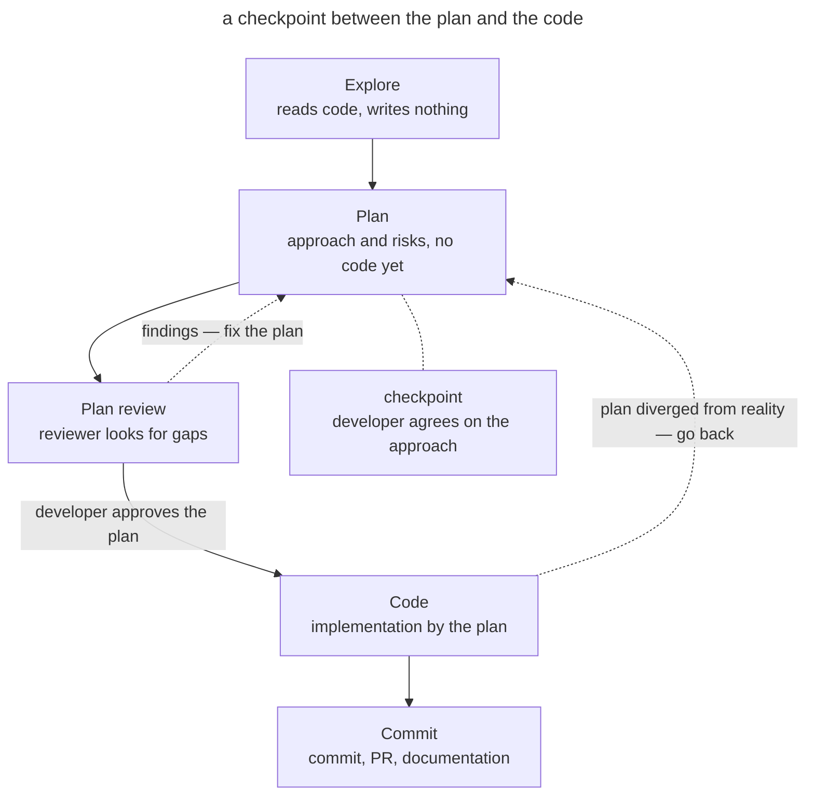

# Four Phases

## Intent

If the task is non-trivial, split the agent's work into four phases: explore, plan, code and commit. First the agent studies the code and agrees on the approach with you. Only then does it write code and check the result.

## Also known as

Explore–Plan–Code–Commit (EPCC), "plan first, code second".

## Problem

If the agent starts writing code right away, it may miss a constraint of an existing interface. You will find the mistake only when reviewing the finished code, and the agent will have to redo the implementation. Had the agent studied the code first and shown you a plan, you would have caught that constraint earlier.

A detailed prompt can lock in a mistake too. If you dictate the implementation in it up front, the agent will carry it out even when the solution is wrong (see [Premature Specification](premature-specification.md)). So let the agent explore the task and propose an approach on its own. Then you check that approach before the agent starts changing code.

## Solution

Walk the agent through the four phases in order. The first two run in plan mode, and no code changes in them.

1. **Explore.** The agent reads the relevant code and gathers context, but edits nothing.
2. **Plan.** The agent describes the approach, the order of changes and the risks. Before you read the plan, a reviewer with a fresh context checks it: it looks for gaps, contradictions with the code and steps that nothing can verify. The author fixes the plan based on the findings. Then you read the plan and clarify the constraints before the agent moves on to the code.
3. **Code.** The agent implements the approved plan. It checks itself against the plan and against the available checks: tests, the build, the linter.
4. **Commit.** The agent saves the verified result in a commit with a meaningful message and prepares a pull request. If behavior has changed, it updates the documentation.

## Structure

In the diagram, the agent goes through the four phases in order.

```mermaid
---
title: a checkpoint between the plan and the code
---
flowchart TB
  explore["Explore<br/>reads code, writes nothing"]
  plan["Plan<br/>approach and risks, no code yet"]
  check["Plan review<br/>reviewer looks for gaps"]:::muted
  code["Code<br/>implementation by the plan"]
  commit["Commit<br/>commit, PR, documentation"]
  explore --> plan
  plan --> check
  check -. "findings — fix the plan" .-> plan
  check -- "developer approves the plan" --> code
  code --> commit
  code -. "plan diverged from reality — go back" .-> plan
  gate["checkpoint<br/>developer agrees on the approach"]:::warn
  plan -.- gate
```

The reviewer clears the plan of mechanical mistakes: forgotten files, contradictions with the code, steps with no check. So you read an already cleaned-up plan and spend your attention on choosing the approach. If it turns out during coding that the plan has a mistake, the agent goes back to planning and agrees the change with you. In this version of the process, you explicitly approve the plan, and only then does the agent write code.

## Participants / Components

- **Developer** sets the task, approves the plan and accepts the result.
- **Agent** explores the code, proposes a plan and implements it.
- **Plan reviewer** is an agent with a fresh context that checks the plan against criteria before you read it. It has not seen the author's reasoning, so it notices what the plan leaves out.
- **Plan** is the approach you agreed on with the agent. You can refine it or hand it to another session.
- **Codebase** is what the agent studies during exploration and what it verifies the solution against.

## When to use

- The task touches several modules, or an approach has to be chosen.
- A wrong solution is expensive to redo. For example, when a public contract changes.
- You want to check the direction of the work before the agent writes code.

A one-line or mechanical edit is usually easier to ask for directly, without a separate plan.

## Consequences and trade-offs

- ➕ You notice the agent has gone the wrong way before it writes a lot of code.
- ➕ You can usually check a short plan faster than a finished implementation.
- ➕ The reviewer finds gaps and contradictions in the plan, and you spend your attention on decisions rather than on hunting for forgotten files.
- ➕ You can hand a saved plan to a new session or paste it into the pull request description.
- ➖ On a simple task, four phases are slower and cost more than asking "just do it".
- ➖ The plan review adds another agent pass. Some of the reviewer's findings turn out to be noise and have to be filtered out.
- ➖ If you learn something new along the way, the plan has to be revised together with the code.
- ➖ There is a temptation to spell the plan out into step-by-step instructions. That takes you back to [Premature Specification](premature-specification.md).

## Implementation

1. Turn on plan mode so the agent doesn't edit code until you approve the approach.
2. Give the agent the task or a link to the ticket. Ask it to study the code before drafting the plan.
3. Before reading the plan, hand it for review to a subagent with a fresh context, as in the [Writer and Reviewer](writer-reviewer.md) pattern. The author works the findings you agree with into the plan.
4. Read the plan. Clarify hidden constraints, discuss alternatives and strike out unnecessary work.
5. Approve the plan and name the commands the agent will use to check the result.
6. Ask the agent to commit the result, prepare a pull request and update the documentation the changes affect.

If you work with a [spec-driven development](spec-driven-development.md) tool, it has ready-made commands for these phases. Below is what each tool does in each phase.

### With GitHub Spec Kit

[Spec Kit](https://github.com/github/spec-kit) saves the result of each phase in the repository.

- **Explore and plan.** The `/speckit.specify`, `/speckit.clarify`, `/speckit.plan` and `/speckit.tasks` commands record the requirements, clarifications, technical approach and tasks in turn. On top of that, `/speckit.analyze` checks that the documents don't contradict each other. This is the machine check of the plan: you read the documents after it, before work on the code begins.
- **Code.** The `/speckit.implement` command implements the tasks from the list.
- **Commit.** Here you work with Git as usual.

### With other tools

Ready-made [skills](skills-as-packaged-workflows.md) and other spec-driven development tools save the results of the phases in different ways. The commands, and when to pick which tool, are covered in separate profiles.

| Tool | Explore and plan | Code | Commit |
| --- | --- | --- | --- |
| [OpenSpec](openspec.md) | A change package with a proposal and requirement deltas | Tasks from the package | Validation, spec sync and archiving |
| [Superpowers](superpowers.md) | Agreeing on the question, a design in chat or a written specification — depending on the task's size | Implementation and TDD procedures | Review and finishing the branch |
| [Matt Pocock's skills](matt-pocock-skills.md) | Interview, specification and tickets in the tracker | Carrying out the chosen ticket with tests | Review against standards and requirements |

When you discuss the domain with the agent, Matt Pocock's skills also record a vocabulary of terms and [ADRs](domain-context-file.md). ADRs are architectural decision records with their reasons. From them, the next implementer will understand why this particular approach was chosen. The order of the phases does not change.

## Example

There is a ticket in the backlog: for some users, the time in the CSV export is shifted by an hour. You turn on plan mode and hand the ticket to the agent.

> Look into REP-1432 and put together a fix plan.

In the **explore** phase, the agent finds the code that converts the time when writing the CSV.

In the **plan**, the agent proposes two options: convert the time on write or on read. Before reading the plan, you send it for review.

> Hand the plan for review to a subagent with a fresh context

The reviewer notices that the plan has no test reproducing the one-hour shift. The agent adds such a test to the plan. You read the revised plan and clarify a constraint the reviewer couldn't have known.

> External integrations use the format of the files already exported. We fix the conversion on write. In the test, use a daylight saving time transition date.

You approve the plan. In the **code** phase, the agent makes the change and runs the exporter tests.

You check the result and ask for a **commit**.

> Commit and open a pull request; put the plan and the solution we chose in the description.

You dropped the convert-on-read option right away, while discussing the plan — otherwise the agent would have been reworking code that was already done.

## Anti-patterns and common mistakes

- **Skipping exploration.** The agent hasn't read the code and builds the plan on guesses. Such a plan may contradict how the project is built.
- **Approving the plan without reading it.** If you approve the plan without reading it, the checkpoint becomes a formality. Then the pattern only adds extra work to a plain "just do it". The reviewer's check doesn't replace reading: it finds gaps and contradictions, but only you can choose the approach and name the hidden constraints.
- **Plan as instructions.** If you demand step-by-step detail from the plan before the task is understood, you get [Premature Specification](premature-specification.md).
- **Stale plan.** If the plan diverged from reality during coding, don't keep following the old plan. Go back to planning and agree on a new approach.

## Known uses

- **Claude Code** supports plan mode. This workflow is described in [Claude Code best practices](https://code.claude.com/docs/en/best-practices).
- Other agents have similar modes: plan mode in Cursor and architect mode in aider.
- **Spec-driven development tools** record the result of each phase in documents and link the phases with commands.

## Related patterns

- [Spec-Driven Development](spec-driven-development.md) records the specification, plan and tasks in documents so the work can be continued in another session.
- [Premature Specification](premature-specification.md) happens when the plan is spelled out in detail before the task is understood.
- [Writer and Reviewer](writer-reviewer.md) describes a check by a fresh agent. Here the same technique is applied to the plan rather than to the diff.
- [Reflection](reflection.md) is a cheaper option: the agent checks its own plan against criteria in the same window, but misses more than a separate reviewer.
