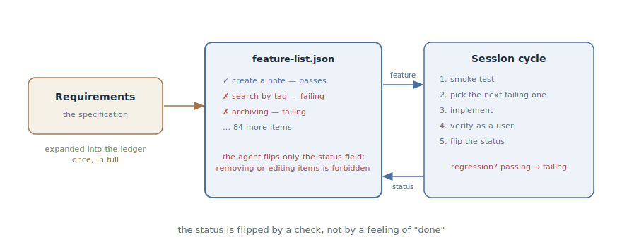

# Feature List

## Intent

Keep a persistent ledger of the project's features in which every feature is
born with a "failing" status and flips to "passing" only after a real check.
The backbone of long-running work: at any moment it is visible what is done,
what isn't, and what to take next — visible by statuses, not by feel.

## Also known as

Feature list, feature list harness, feature ledger.

## Problem

Work spanning dozens of features and many sessions — a greenfield build, a
large module, autonomous runs. At this scale the usual ways of tracking
progress break down:

- The completion criterion is blurry: the agent counts as done what it
  *wrote*, not what *works*. "80% done" is backed by nothing.
- What was done quietly regresses: a feature that worked three sessions ago
  is broken by yesterday's change, and nobody noticed — it's no longer being
  checked.
- A new session doesn't know what to take: without a shared list, each one
  starts by reinventing the plan, and features get duplicated or dropped.
- The [Progress Journal](progress-file.md) holds the narrative — "where we
  are and why" — but statuses in prose eventually get rephrased or clobbered
  by the agent: machine-updated marks don't belong in text.

## Solution

A ledger file in the repository: the full list of features with a binary
status. The ledger is created in full at the start of the work — by expanding
the requirements into concrete verifiable items, each with a description,
verification steps, and a `passes: false` status.

From there, the rules apply:

1. **The status is flipped by a check, not by a feeling.** A feature earns
   `passes: true` only after the agent has run it as a user — an end-to-end
   scenario, for the web through a browser with screenshots, not unit tests
   alone (see the [Feedback Loop](give-agent-a-way-to-verify.md)).
2. **The ledger is untouchable.** Removing features and rewording them after
   the fact is forbidden — harshly and directly: "it is unacceptable to
   remove or edit items, because this leads to missing or buggy
   functionality." The agent changes only the status field.
3. **Regressions flip statuses back.** The smoke test at the start of a
   session may switch `passing` back to `failing` — the ledger reflects
   reality, not a history of achievements.

The format is JSON, not Markdown: the agent corrupts and overwrites a
machine-updated JSON file noticeably less often than markdown text — an
update reduces to flipping a single field.

A session works off the ledger: read it, take the next failing feature,
implement, verify, flip the status — one per pass (why one is a
[chapter of its own](one-feature-at-a-time.md)).

## Structure



On the left, the requirements — the ledger is expanded from them once, in
full, before implementation begins. In the center, the ledger itself: items
with statuses, and the only change allowed to the agent is the status field.
On the right, the session cycle: take the next failing feature, implement,
verify as a user, flip the status. The dashed arrow down is the regression:
the smoke test returns a broken feature to "failing", and it is back in the
queue.

## Participants / Components

- **The ledger** — a JSON file in the repository: the full feature list with
  statuses; the source of truth about progress.
- **A feature** — a concrete verifiable item: description, verification
  steps, status.
- **The agent** — takes the next failing one, implements, verifies, flips
  the status.
- **The check** — an end-to-end run as a user; only it flips the status.
- **The developer** — reviews the ledger's slicing at the start and
  spot-checks statuses against reality.

## When to use

- Long work with a clear end state: a greenfield "build the app from the
  spec", a large module, a migration with a checklist.
- Autonomous runs: the agent works in sessions unattended, and progress must
  be visible from an artifact, not a retelling.
- Several agents, or agent/human shifts, over one front of work — the ledger
  aligns the picture for everyone.

For a task of a few steps the ledger is overkill — the SDD pipeline's
`tasks.md` or an in-session plan is enough.

## Consequences and trade-offs

- ➕ Progress is objective: "34 of 200 done" is backed by checks, not by
  feel.
- ➕ Regressions are visible: a broken feature returns to the queue instead
  of vanishing from sight.
- ➕ Sessions chain together without retelling: any new session knows what
  to take next.
- ➖ The ledger's quality is the slicing's quality: items too large are
  unverifiable, items too small bury the signal in bureaucracy.
- ➖ The untouchability rests on instructions: without harsh wording in the
  prompt and project memory, the agent will one day "tidy up" an
  inconvenient item.
- ➖ A binary status is coarse: "half-works" has to be expressed by slicing
  into smaller features.

## Implementation

1. Expand the requirements into the ledger before implementation begins:
   each item is a behavior verifiable by an end-to-end scenario ("the user
   opens a chat, types a query, and sees a response"), not a task ("set up
   routing").
2. Keep the format structured: JSON with fields for category, description,
   verification steps, and `passes`. Everything starts as `false`.
3. Write the rules into [Project Memory](claude-md-memory.md): status only
   after an end-to-end check; removing and editing items is unacceptable;
   the agent changes only `passes`.
4. Set the session ritual: read the ledger → smoke test → take the next
   failing one → implement → verify as a user → flip.
5. Pair it with the [Progress Journal](progress-file.md): the ledger holds
   the statuses, the journal holds the narrative; they complement each
   other, not duplicate.
6. Review the ledger like a specification: the slicing and the wording are
   your zone; spot-check `passing` features against reality.

## Example

An agent is building a notes service from a specification. The initializing
session expanded it into a ledger of 87 items:

```json
[
  {
    "category": "notes",
    "description": "A user creates a note and sees it in the list",
    "steps": ["open /notes", "click 'Create'", "enter text",
              "save", "confirm the note is in the list"],
    "passes": true
  },
  {
    "category": "search",
    "description": "Search by tag returns only notes with that tag",
    "steps": ["create notes tagged work and home",
              "search by tag work",
              "confirm no home notes in the results"],
    "passes": false
  }
]
```

The next session starts with a smoke test: creating a note works, but
archiving — `passing` since last week — fails after a recent schema change.
The agent flips it to `false`, reports it, and takes the next failing item —
search by tag. It implements, runs the ledger's steps through the browser,
attaches a screenshot of the results — and only then `passes: true`.

The developer, glancing at the ledger in the evening, sees an honest
picture: 41 of 87, including one regression — without reading diffs or
asking around.

## Anti-patterns and common mistakes

- **A checkbox without a check.** The status was flipped because "the code
  is written" — the ledger becomes a list of good intentions. The flip is
  the finale of a [Feedback Loop](give-agent-a-way-to-verify.md), not a
  gesture.
- **The agent edits the ledger.** An item reworded "to match what came out"
  and an inconvenient feature quietly deleted are lost functionality. The
  ban must be harsh and written down.
- **Statuses in prose.** A ledger woven into a Markdown narrative gets
  clobbered by the agent's updates — machine marks live in a structured
  file.
- **The ledger instead of the specification.** The ledger is a derivative of
  the requirements, not their replacement: the "why" and the context live in
  the specification; the ledger holds only verifiable statuses.
- **Unit tests as the check.** Green units without an end-to-end run are
  premature success: the feature "works" until the first user.

## Known uses

- **Anthropic's harness for long-running agents** — the primary source: a
  200+ feature ledger for a claude.ai clone, the initializer agent, the "it
  is unacceptable to remove or edit items" rule, and end-to-end verification
  through the browser before a status flips.
- **Eval harnesses** — the same mechanics in agent evaluation: a fixed list
  of verifiable scenarios with statuses that must not be fitted to the
  result.
- **SDD toolkits** — `tasks.md` in [Spec Kit](spec-kit.md) and
  [OpenSpec](openspec.md) as the weak form: the checklist exists, but a mark
  is not always a check; the ledger hardens exactly that spot.

## Related patterns

- [Feedback Loop](give-agent-a-way-to-verify.md) — flipping a status is
  completing the loop: the ledger is a list of loops left to close.
- [One Feature at a Time](one-feature-at-a-time.md) — the discipline of
  working the ledger: one item per pass, against the attempt to do
  everything at once.
- [Progress Journal](progress-file.md) — the neighbor in the state layer:
  the "where we are and why" narrative versus the machine statuses of "what
  works".
- [Spec-Driven Development](spec-driven-development.md) — the ledger is
  derived from the specification, like the plan and the tasks; it is its
  verifiable projection.
