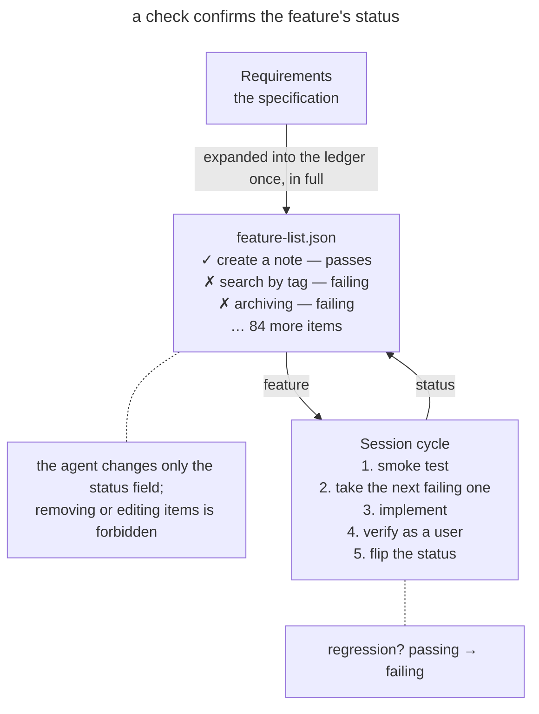

# Feature List

## Intent

Keep a ledger of features with verifiable statuses. Every feature starts as "failing" and becomes "passing" after an end-to-end check. From the ledger, a new session sees the remaining work.

## Also known as

Feature list, feature list harness, feature ledger.

## Problem

When you work on dozens of features, an "80% done" report is not enough. The agent may have written the code but not yet verified the user scenario.

For example, creating a note passed its check a week ago, but yesterday's schema change broke it. If the status is not tied to rerunning the check, the next session considers the feature finished and keeps building on a broken base.

Without a shared ledger, a new session also wastes time reconstructing the task queue. The [Progress Journal](progress-file.md) explains how the work went and why decisions were made. Statuses need a separate structured file in which the agent changes specific fields.

## Solution

Before implementation begins, expand the requirements into a ledger. For each feature, record a description of the user-facing behavior, the verification steps, and the initial status `passes: false`.

Update rules tie the ledger to check results.

1. **Success is confirmed by an end-to-end scenario.** The agent sets `passes: true` after verifying through the user interface. For a web application this can be a browser scenario with screenshots (see the [Feedback Loop](give-agent-a-way-to-verify.md)).
2. **Requirements are protected from fitting.** During implementation the agent changes only the status. Removing or rewording an item requires a separate decision about the requirements.
3. **A regression sends the feature back into work.** If a repeated check fails, the agent changes `passes` to `false`.

JSON gives the record an explicit structure and limits a routine update to one field. A schema and a diff check help catch an accidental change to the description or the verification steps.

A session reads the ledger, picks a failing feature, implements it, and updates the status after the check. Limiting work to [one feature per pass](one-feature-at-a-time.md) lets you finish a scenario before moving to the next.

## Structure

In the diagram, the requirements become a ledger before implementation.


```mermaid
---
title: a check confirms the feature's status
---
flowchart TB
  req["Requirements<br/>the specification"]:::accent
  ledger["feature-list.json<br/>✓ create a note — passes<br/>✗ search by tag — failing<br/>✗ archiving — failing<br/>… 84 more items"]
  rules["the agent changes only the status field;<br/>removing or editing items is forbidden"]:::warn
  cycle["Session cycle<br/>1. smoke test<br/>2. take the next failing one<br/>3. implement<br/>4. verify as a user<br/>5. flip the status"]
  regression["regression? passing → failing"]:::warn
  req -- "expanded into the ledger once, in full" --> ledger
  ledger -- "feature" --> cycle
  cycle -- "status" --> ledger
  ledger -.- rules
  cycle -.- regression
```

The agent picks an item from it and goes through the development cycle with verification. The dashed arrow returns a feature to the queue if a regression is found later.

## Participants / Components

- **The ledger** stores the list of features and their statuses in JSON.
- **A feature** describes verifiable behavior and the steps to check it.
- **The agent** implements the chosen item and updates the status based on the check result.
- **The check** confirms the user scenario.
- **The developer** reviews the ledger's contents and spot-checks statuses against the product's behavior.

## When to use

- A large piece of work has a clear end result that can be broken down into scenarios.
- The agent works in several autonomous sessions, and progress needs to be visible from a file.
- Several participants need a shared work queue.

For a small task, a plan or _tasks.md_ is usually enough.

## Consequences and trade-offs

- ➕ The count of finished features rests on check results.
- ➕ After a regression, the broken feature is visible in the queue again.
- ➕ A new session can pick the next item without a retelling of the whole history.
- ➖ Items that are too large are hard to verify, and items that are too small make the ledger harder to maintain.
- ➖ A written ban on changing requirements needs to be backed by a check of changes to the ledger.
- ➖ Partially working behavior has to be split into self-contained scenarios.

## Implementation

1. Expand the requirements into verifiable scenarios before implementation. For example, "the user opens a chat, asks a question, and sees an answer" describes a result that can be reproduced.
2. Store the category, description, verification steps, and `passes` in JSON. Set the initial status to `false`.
3. Write into [Project Memory](claude-md-memory.md) that the agent changes only `passes`, and only based on the result of an end-to-end check.
4. Start a session by reading the ledger and running a smoke test. Then pick an item, implement it, verify it, and update the status.
5. Keep the reasons for decisions in the [Progress Journal](progress-file.md) and the statuses in the ledger.
6. Review the ledger's contents as requirements, and spot-rerun the scenarios of finished features.

## Example

An agent is building a notes service. The initial session expands the specification into a ledger of failing items. Below is a fragment after creating a note has been verified. Search by tag has not been verified yet.

```json
[
  {
    "category": "notes",
    "description": "A user creates a note and sees it in the list",
    "steps": ["open /notes", "click 'Create'", "enter text",
              "save", "confirm the note is in the list"],
    "passes": true
  },
  {
    "category": "search",
    "description": "Search by tag returns only notes with that tag",
    "steps": ["create notes tagged work and home",
              "search by tag work",
              "confirm no home notes in the results"],
    "passes": false
  }
]
```

At the start of a session, the smoke test finds that archiving fails after a schema change. The agent sets its status back to `false` and records the regression. After restoring the basic scenario, it takes search by tag, implements it, and walks through the verification steps in the browser. Only then does search get `passes: true`.

In the evening you see 41 verified features out of 87 in the ledger, and in the journal you can read about the regression that was found and fixed.

## Anti-patterns and common mistakes

- **A checkbox without a check.** Marking a feature because the code is written hides unverified behavior. Update the status after the [Feedback Loop](give-agent-a-way-to-verify.md).
- **Fitting the ledger.** Changing a requirement to match finished code hides missing functionality. Review such changes separately.
- **Statuses inside prose.** When rewriting Markdown, the agent may accidentally lose a mark. Keep statuses in structured fields.
- **The ledger instead of the specification.** The goal and constraints stay in the specification. The ledger holds verifiable scenarios derived from it.
- **Unit tests only.** Individual functions can work while the user scenario is broken.

## Known uses

- **Anthropic's harness for long-running agents** uses a feature ledger and browser verification before a status changes.
- **Eval harnesses** use a fixed set of scenarios that is protected from being fitted to the result.
- **SDD toolkits** keep tasks in _tasks.md_, as in [OpenSpec](openspec.md). The ledger additionally ties a mark to a behavior check.

## Related patterns

- [Feedback Loop](give-agent-a-way-to-verify.md) provides the grounds for updating a status.
- [One Feature at a Time](one-feature-at-a-time.md) limits the scope of a single pass.
- [Progress Journal](progress-file.md) keeps the reasons for decisions and the state of unfinished work.
- [Spec-Driven Development](spec-driven-development.md) supplies the requirements for the ledger.
- [Premature Success](premature-success.md) occurs when a status is changed without an end-to-end check of the scenario.
