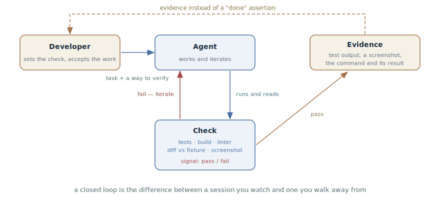

# Feedback Loop

## Intent

Give the agent a check with a binary outcome — tests, a build, a linter, a
screenshot compared against a design — that it runs, reads, and iterates
against until green. The verification loop closes inside the session, not
through the developer.

## Also known as

Give the agent a way to verify its work, verification loop, closed
verification cycle.

## Problem

The agent stops when the work *looks* done. If it has no check it can run,
"looks done" is the only signal available to it. From there the familiar
troubles begin:

- You become the feedback loop: every mistake waits for a human to notice
  it. The session can't be left alone — you can't even step away for coffee.
- The code is plausible but doesn't work: it compiles, reads smoothly, and
  falls over on the edge case. Plausibility is what the model does best,
  which is exactly why it can't be taken at its word.
- "Done" means nothing: the agent sincerely reports success, because the
  success criterion was never set anywhere.

## Solution

Before the work starts, give the agent a check — anything that returns a
pass/fail signal it can read: a test suite, a build exit code, a linter, a
script that diffs output against a fixture, a screenshot against a design.
And ask explicitly: run it, read the result, iterate until green.

From that moment the loop closes without you: the agent takes a step, runs
the check, reads the failure, fixes it — and so on until it passes. Your
involvement shifts from "noticing mistakes" to the two ends of the loop:
setting the check at the entrance and accepting the evidence at the exit.

How hard the check gates the stop is a ladder of four rungs, each trading
setup for autonomy:

1. **In one prompt** — "run the tests and iterate"; works on any task right
   now.
2. **A session goal** — the check becomes a condition re-verified after
   every one of the agent's turns until it holds.
3. **A deterministic gate** — a stop hook: a script blocks the session from
   ending while the check is red.
4. **A second opinion** — a subagent with a fresh context tries to refute
   the result: the work is graded by someone other than whoever did it (see
   [Writer and Reviewer](writer-reviewer.md)).

And the final rule: evidence instead of assertions. Have the agent show the
test output, the command with its result, or a screenshot — reading evidence
is faster than re-verifying yourself, and it is the only way to accept the
work of a session you weren't watching.

## Structure

The developer stands at the ends of the loop: at the entrance they hand the
agent the task together with a way to verify it, at the exit they accept the
evidence. Inside the loop is a cycle with no human in it: the agent works,
runs the check, reads the signal; a red signal sends it back to work, a
green one opens the exit with evidence. The harder the gate at the exit
(prompt → goal → hook → second opinion), the longer the loop can spin
unattended.

## Participants / Components

- **Developer** — sets the check and the criteria before the start; accepts
  the work by its evidence.
- **Agent** — works, runs the check, reads the signal, iterates.
- **Check** — an oracle with a binary outcome: tests, build, linter, a diff
  script, a screenshot against a design.
- **Signal** — pass/fail, read by the agent inside the session.
- **Evidence** — the check's output, presented to the developer instead of
  the word "done".

## When to use

- Anywhere the result is checkable — this is basic hygiene of working with
  an agent, not a technique for special occasions.
- Mandatory before leaving a session unattended: without a check,
  autonomous work means autonomous accumulation of mistakes.
- For UI — through screenshots: the agent compares the result with the
  design and lists the differences.
- If there is no check — the check comes first: in legacy code the agent's
  first task is not "fix it" but "write a failing test that reproduces the
  bug".

## Consequences and trade-offs

- ➕ The loop closes without a human — the difference between a session you
  watch and one you walk away from.
- ➕ Mistakes are caught inside the cycle, at the cost of an agent
  iteration, not at review at the cost of your time.
- ➕ Evidence speeds up acceptance: reading test output is faster than
  running the tests yourself.
- ➖ The check has to exist or be built: in code without tests the pattern
  starts with writing the check, and that is separate work.
- ➖ The agent optimizes exactly for the check: a weak check produces green
  garbage. The loop's quality equals the oracle's quality.
- ➖ The check can be "hacked": a fitted test, a weakened condition, a
  suppressed error. A ban on editing the check is part of the pattern.

## Implementation

1. State the criterion before the start and write it into the prompt: not
   "build a validator" but "build a validator; cases: X — true, Y — false;
   run the tests after implementing".
2. No check — build one: ask the agent to first write a failing test that
   reproduces the problem, and only then fix it (the disciplined form is
   [TDD with an Agent](tdd-with-agent.md)).
3. Close the loop explicitly: "run it, read the result, iterate until
   green." Without that instruction the agent runs the check once — or not
   at all.
4. Forbid changing the check: editing a test, weakening a condition, and
   suppressing an error are the developer's decisions, not moves within the
   iteration. Anchor the ban with a hook if needed.
5. Climb the ladder as autonomy grows: a supervised task needs only the
   prompt; a session you walk away from — a goal or a hook; long autonomous
   work — a review by a fresh subagent.
6. Demand evidence: test output, the command and its result, a screenshot.
   "Done" without evidence is not a signal.
7. Anchor the verification commands in [Project Memory](claude-md-memory.md)
   so the agent knows them in every session.

In the spec-driven development toolkits the loop is built into the pipeline:
in [Spec Kit](spec-kit.md) and [OpenSpec](openspec.md) every task in
`tasks.md` carries its own way of being verified, in [Kiro](kiro.md)
acceptance criteria are written in EARS notation back at the requirements
phase, in [Superpowers](superpowers.md) the red–green–refactor cycle is
mandatory inside every task, and in
[Matt Pocock's skills](matt-pocock-skills.md) `/implement` doesn't finish
without `/tdd` and the two-axis review.

## Example

The task is a promo code validator. The prompt sets the check together with
the task:

> Write validatePromoCode. Cases: SUMMER25 with an active promo — true; an
> expired code — false with reason expired; a code from another region —
> false with reason region; an empty string — false. Turn the cases into
> tests, run them, and iterate until they pass. Don't edit the tests.

The agent writes the implementation and the tests, runs them: two of four
are red — the expired code passes, because the date comparison ignores the
time zone. The agent fixes it, runs again — green. The reply carries the
test runner's output: 4 passed.

The developer was doing something else the whole time: the time zone bug was
caught and fixed inside the loop, at the cost of one agent iteration.
Without the check it would have ridden to review — or to the users.

## Anti-patterns and common mistakes

- **Taking it at its word.** "Done" without the check's output is not a
  signal, it's politeness. Asking for evidence is not distrust, it's
  protocol.
- **A weak oracle.** A check that is dishonestly easy to pass produces green
  garbage: the agent optimizes for it, not for the task.
- **A check exists, but no loop.** The tests sit in the repository, but
  nobody asked the agent to run them — so it doesn't. The instruction is
  what closes the loop.
- **The agent edits the oracle.** A fitted test and a suppressed error look
  like progress. Editing the check is always the developer's separate
  decision.
- **Unit tests as the finale.** Green units are not yet a working feature:
  without an end-to-end check as the user, that's premature success — see
  the anti-pattern of that name.

## Known uses

- **Claude Code best practices** — the primary source: the check is "the
  difference between a session you watch and one you walk away from"; the
  before/after table of prompts with criteria.
- **Claude Code** — the ladder mechanized: `/goal` as a session condition,
  Stop hooks as a deterministic gate, review subagents as the second
  opinion.
- **Anthropic's harness for long-running agents** — the feature list with
  `passing/failing` statuses that flip only after a real check, and the
  end-to-end smoke test at the start of every session.
- **SDD toolkits** — acceptance criteria and verifiable tasks as a
  mandatory part of the pipeline: EARS in Kiro, `tasks.md` checklists in
  Spec Kit and OpenSpec, mandatory TDD in Superpowers.

## Related patterns

- [TDD with an Agent](tdd-with-agent.md) — the disciplined form of the
  loop: the check is written before the code, one per step.
- [Writer and Reviewer](writer-reviewer.md) — verification by judgment for
  what doesn't reduce to a binary oracle: quality, completeness, adherence
  to the plan.
- [Reflection](reflection.md) — the cheapest and weakest form of
  verification: self-critique without an external oracle.
- [Four Phases](explore-plan-code-commit.md) — the loop lives in the code
  phase: the approved plan names the checks the agent verifies the
  implementation against.
