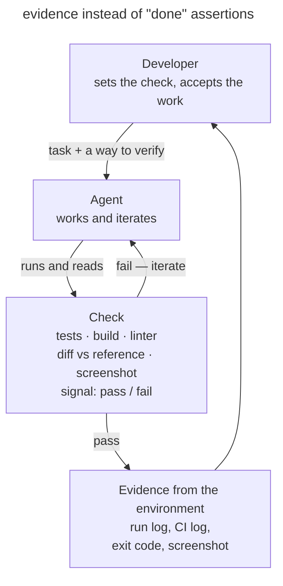

# Feedback Loop

## Intent

Give the agent a way to check the result, read the failure, and repeat the work until the criterion is met. The agent runs the check inside the session, and you receive the result together with the evidence.

## Also known as

Give the agent a way to verify its work, verification loop, closed verification cycle.

## Problem

Without a check, the agent can stop at plausible code. For example, a validator accepts a valid promo code but gets an expired one wrong.

If there is no test, you have to notice the mistake yourself. Until then the agent considers the task done.

The definition of done should describe observable behavior. Then the agent can tell a written implementation from a verified result.

## Solution

Before the start, set a check with a clear outcome. It can be a test, a build, or a comparison of the output with a reference. For a UI, provide a design and the criteria for visual comparison. Ask the agent to run the check after its changes, work through the failures, and repeat the cycle.

The agent makes an edit, runs the check, and fixes the failure it finds. You choose the criteria before the work begins and assess the evidence at the end.

The degree of automation of the loop can be chosen per task.

1. **An instruction in the prompt** asks the agent to run the checks and fix the failures it finds.
2. **A session goal** sets a condition the agent returns to after every step.
3. **A deterministic gate** blocks completion until the required check passes.
4. **A second opinion** adds a review in a fresh context to check completeness and quality (see [Writer and Reviewer](writer-reviewer.md)).

The evidence has to come from the environment, not from the agent's account. Output the agent reprinted in its final message could just as well be made up: `4 passed` written without a run, or taken from a run before the last edit. Check against a record the harness kept: the tool call in the session log, the CI log, the exit code in a hook, a screenshot from the browser tool. This data shows what exactly the agent checked and lets you accept the work without reconstructing the whole session.

## Structure

In the diagram, the developer hands over the task and the verification criteria.

```mermaid
---
title: evidence instead of "done" assertions
---
flowchart TB
  dev["Developer<br/>sets the check, accepts the work"]:::accent
  agent["Agent<br/>works and iterates"]
  check["Check<br/>tests · build · linter<br/>diff vs reference · screenshot<br/>signal: pass / fail"]
  evidence["Evidence from the environment<br/>run log, CI log,<br/>exit code, screenshot"]:::accent
  dev -- "task + a way to verify" --> agent
  agent -- "runs and reads" --> check
  check -- "fail — iterate" --> agent
  check -- "pass" --> evidence
  evidence --> dev
```

The agent repeats the cycle of edits and checks until it succeeds, then returns the evidence. A hook can enforce the exit condition, and an independent review can complement the automated checks.

## Participants / Components

- **Developer** sets the criteria and accepts the result by its evidence.
- **Agent** changes the code, runs the check, and works through the result.
- **Check** evaluates the specified property of the result.
- **Signal** tells the agent whether the criterion is met.
- **Evidence** preserves the command, the output, or an image of the verified state. It is recorded by the environment, not by the agent.

## When to use

- The result can be checked in a reproducible way.
- The agent has to run several iterations without constant supervision.
- A UI can be compared with a design against given criteria.
- A bug can be reproduced by a test before the fix begins.

## Consequences and trade-offs

- ➕ The agent works through the failures it finds without waiting for a manual check of every step.
- ➕ Some defects are caught before review.
- ➕ The saved results show you how much verification was actually done.
- ➖ If there is no check, preparing one takes separate work.
- ➖ A weak check lets through an implementation that does not fully solve the task.
- ➖ The agent may weaken the check to succeed. Changes to the criteria have to be controlled separately.

## Implementation

1. Describe the expected behavior before implementation and state how to check it.
2. If there is no check, start with a reproducing test (see [TDD with an Agent](tdd-with-agent.md)).
3. Ask the agent to run the check after its edits, read the result, and fix the failures it finds.
4. Protect the criteria from being fitted. Agree on any change to a test or weakening of a condition separately; if needed, enforce the restriction with a hook.
5. For long autonomous work, add completion control and a review in a fresh context.
6. Accept the work by the environment's records: the tool call log, the CI log, or the hook's result. A retelling of the result in the agent's final message does not count as evidence.
7. Anchor the verification commands in [Project Memory](claude-md-memory.md) so the agent knows them in every session.

In [OpenSpec](openspec.md), [Superpowers](superpowers.md), and [Matt Pocock's skills](matt-pocock-skills.md), checks are part of the implementation workflow. The specific mechanism depends on the skill set and the task's criteria.

## Example

For a promo code validator, you set the cases to check together with the task.

> Write validatePromoCode. A valid SUMMER25 must be accepted. For an expired code return false with reason expired, for a code from another region return false with reason region. Reject an empty string. Turn the cases into tests, run them, and fix the implementation until they pass. Once the tests are agreed, don't change them without a separate discussion.

The agent writes the tests and the implementation. The expired-code check fails because the date comparison ignores the time zone. After the fix, the agent runs the tests again. The session log shows the last test run after the final edit, with the result `4 passed`.

You receive an implementation in which the time zone bug has already been found and fixed. Your involvement was needed only to set the scenarios and accept the result.

## Anti-patterns and common mistakes

- **Taking it at its word.** A "done" message does not show what the agent checked. Ask for the run results.
- **Retold output.** The line `4 passed` in the final message is still the agent's words. Check it against the run in the session log or in CI.
- **A weak oracle.** The check may miss significant cases. Compare it with the task's requirements.
- **A check that is never run.** Tests in the repository do not mean the agent ran them. Specify the command and the completion condition.
- **Fitting the check.** A weakened condition hides the defect. Changes to the criterion need a separate decision.
- **Unit tests as the finale.** For a user-facing feature, also check the end-to-end scenario, otherwise you risk [premature success](premature-success.md).

## Known uses

- **Claude Code best practices** describe framing tasks with criteria and examples of verification.
- **Agent tools** can support session goals, Stop hooks, and review subagents.
- **Anthropic's harness for long-running agents** ties feature statuses to checks and runs a smoke test at the start of each session.
- **SDD toolkits** include acceptance criteria in specifications and tasks, and Superpowers uses the TDD cycle.

## Related patterns

- [TDD with an Agent](tdd-with-agent.md) starts each iteration with a test before the code changes.
- [Writer and Reviewer](writer-reviewer.md) checks properties that require judgment.
- [Reflection](reflection.md) helps find flaws through self-critique but needs external confirmation.
- [Four Phases](explore-plan-code-commit.md) sets the checks in the plan and uses them during implementation.
- [Premature Success](premature-success.md) occurs when work is declared done without an end-to-end check of the user scenario.
- [One-Shotting](one-shotting.md) describes expecting a finished result from a single pass with no verification cycle.
