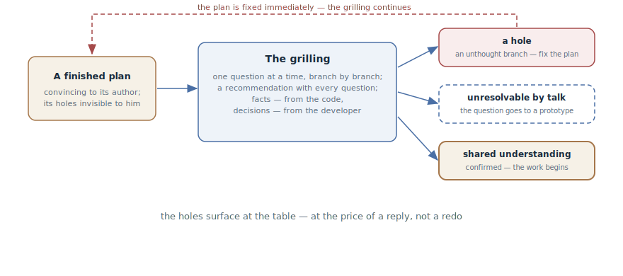

# Grilling

## Intent

Hand a finished plan to the agent for interrogation: it relentlessly
interviews you about every aspect — one question at a time, branch by
branch — until the holes surface and a confirmed shared understanding
emerges. A stress test of *your* thinking before the work starts, not
requirements gathering.

## Also known as

Grilling, the interrogation; `/grilling` in Matt Pocock's skills.

## Problem

The plan is written and looks convincing — to you, its author. That is
exactly the trouble:

- Your own holes are invisible: the plan is convincing precisely because it
  is built on your own assumptions — the same author's blindness an agent
  has toward its own code.
- A colleague's review is expensive and often shallow: "looks reasonable"
  is the most common and least useful feedback a plan gets.
- The holes surface during implementation — at the most expensive point: an
  unthought-through design branch turns into a redo instead of a reply in a
  conversation.

## Solution

Before the work starts — an interrogation:

> Interview me relentlessly about every aspect of this plan until we reach
> a shared understanding. Walk down the branches of the design tree,
> resolving dependencies between decisions one by one. For each question,
> propose your recommended answer. Ask one question at a time. Look up
> facts in the codebase yourself — but put every decision to me and wait
> for my answer. Do not start the work until I confirm the understanding is
> shared.

Three rules hold the construction:

- **One question at a time.** A batch of questions is bewildering — and it
  lets you answer the comfortable ones while skipping the uncomfortable.
- **Facts from the code, decisions from you.** Whatever can be learned by
  reading the codebase, the agent learns itself; only the genuine forks
  reach you.
- **A recommendation with every question.** A question with a proposed
  answer is a position you can argue with; a bare question is offloaded
  work.

Every question has three outcomes: the answer closes the branch; the answer
exposes a hole — the plan is fixed, the interrogation continues; the
question can't be resolved by talking — it goes to a
[Throwaway Prototype](prototype-to-answer.md). The finale is singular: an
explicit confirmation of shared understanding — and only after it does the
work begin.

## Structure

On the left, the finished plan — convincing to its author, with holes he
can't see. In the center, the interrogation loop: a question with a
recommendation, the developer's decision, the next branch. On the right,
the three outcomes: an exposed hole returns to the plan as a fix — and the
grilling continues; a question that talking can't settle leaves for a
prototype; exhausted branches end in the confirmation of shared
understanding — the only door to starting the work.

## Participants / Components

- **The plan** — the subject of the interrogation: a written document, not
  an idea in a head.
- **The interviewing agent** — walks the decision tree, digs facts out of
  the code, recommends answers; instructed to be relentless.
- **The developer** — owns the decisions; his thinking is what is being
  tested.
- **The holes** — the interrogation's product: unthought branches exposed
  before implementation.
- **Shared understanding** — the finale's criterion: an explicit
  confirmation, without which the work doesn't start.

## When to use

- Before starting significant work from a plan written alone: the more
  expensive the implementation, the cheaper an hour of interrogation.
- The decision is hard to reverse: an architectural choice, a public
  contract, a migration.
- The plan is "too smooth": not a single open question is a sure sign the
  questions were simply never asked.

Not needed for half-hour plans — there a hole costs less than the
interrogation. And don't confuse it with the
[Agent-Led Interview](let-claude-interview-you.md): the interview *builds*
a specification from nothing, grilling *attacks* a finished plan.

## Consequences and trade-offs

- ➕ The holes surface at the table, not in the implementation — at the
  price of a reply, not a redo.
- ➕ The agent's recommendations make the interrogation substantive: you
  argue with a position instead of filling out a questionnaire.
- ➕ The decisions are spoken out loud: after the grilling the plan is
  shared by two, not assumed by one.
- ➖ It is unpleasant: the plan is under fire, and a well-built
  interrogation finds holes almost always. That's the price, not a defect.
- ➖ Time: a real interrogation is dozens of questions; budget a session,
  not five minutes.
- ➖ An agreeable agent is useless: without an explicit "relentlessly" the
  interrogation degenerates into compliments to the plan.

## Implementation

1. Interrogate a document, not a thought: the plan must be written — the
   agent builds the decision tree from the text, not from guesses.
2. Start with the three-rule prompt: relentlessly, one question at a time,
   facts from the code — decisions from me, the finale is a confirmation of
   understanding.
3. Answer honestly, including "I don't know": not knowing is a found hole,
   not a failed interrogation.
4. Fix the plan as you go: an exposed hole is an immediate edit to the
   document, not a "fix it later" note.
5. Send the unresolvable to a prototype: an argument that has run out of
   arguments is a signal for a
   [Throwaway Prototype](prototype-to-answer.md), not for stubbornness.
6. Record the decisions on the spot: settled terms and taken forks go into
   the [Domain Vocabulary](domain-context-file.md) and ADRs while they are
   hot.
7. Finish explicitly: "the understanding is shared, we begin" — said in
   words, not implied by silence.

## Example

The developer has written a tariff migration plan and, before starting,
hands it over for interrogation. The agent walks the branches:

> The plan applies a tariff upgrade immediately, but says nothing about a
> downgrade. I recommend: a downgrade takes effect from the next period,
> with no pro-rated refund. Agreed?

The developer agrees — the branch closes, the plan gets the addition. A few
questions later:

> The plan assumes a subscription is always tied to billing. But the domain
> vocabulary says enrollments are also created by corporate contracts — with
> no subscription at all. How do corporate tariffs with a deferred start
> migrate?

The plan says not a word about it — a hole. The discussion runs into the
cancellation model: the arguments run out, both sides are plausible. The
question leaves for a prototype — and so begins the story familiar from the
[Session Handoff](handoff.md) and [Prototype](prototype-to-answer.md)
chapters. The remaining branches close within an hour; the developer
confirms the shared understanding, and the work begins — from a plan whose
most expensive hole was found before the first line of code.

## Anti-patterns and common mistakes

- **Interrogating an idea instead of a plan.** Without a written document,
  grilling degenerates into an [interview](let-claude-interview-you.md) —
  a different instrument for a different stage.
- **Question batches.** Five questions at once — and you answer the
  comfortable three. One at a time, waiting for the answer.
- **The agent answers itself.** An interviewer closing its own questions
  with its own recommendations, without your answer, is testing its
  thinking, not yours.
- **Holes "for later".** An exposed hole not written into the plan
  immediately evaporates by the end of the session.
- **A polite interviewer.** Without the relentlessness instruction the
  agent praises the plan and asks checkbox questions — no stress test
  happens.

## Known uses

- **Matt Pocock's skills** — `/grilling`: the primary source, with the
  formula "relentlessly, one question at a time, facts from the code —
  decisions from the user, don't start without confirmation"; in
  `/grill-with-docs` the decisions settle into CONTEXT.md and ADRs, and on
  the [Investigation Map](wayfinder.md) grilling is a standard ticket type.
- **Premortems** — the pre-agent lineage: "imagine the project failed —
  why?"; grilling automates the role of the skeptic asking that question on
  every branch.
- **Design document reviews** — the same function in team engineering
  culture; the agent makes it available to teams of one.

## Related patterns

- [Agent-Led Interview](let-claude-interview-you.md) — the mirror
  neighbor: the interview builds a specification, grilling attacks a
  finished plan.
- [Throwaway Prototype](prototype-to-answer.md) — the exit for questions
  talking can't settle: the argument becomes an experiment.
- [Writer and Reviewer](writer-reviewer.md) — the same "the author can't
  see his own holes" principle applied to code; grilling applies it to the
  plan — and to you.
- [Domain Vocabulary](domain-context-file.md) — the receiver of the
  interrogation's decisions: terms and forks are recorded while they are
  hot.
