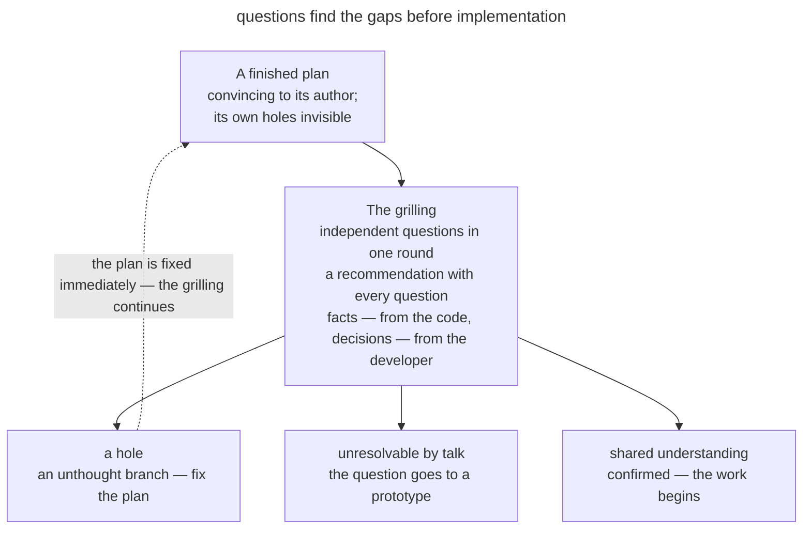

# Grilling

## Intent

Ask the agent to test a finished plan with a series of questions, to expose assumptions and dependencies between decisions before implementation starts.

## Also known as

Grilling, the interrogation; `/grilling` in Matt Pocock's skills.

## Problem

Say you have written a tariff migration plan. It covers the regular subscription but leaves out corporate enrollments. The plan feels complete to you, because you remember the assumptions you never wrote down. But another participant, the agent for instance, cannot see them.

If nobody asks about corporate enrollments before implementation, the agent will apply one rule to every user. So walk through every branch of the plan with the agent: then a gap like this one turns up before the agent changes any code.

## Solution

Before the agent starts implementing, ask it to test the plan with questions. For example:

> Check every assumption in this plan. First work out which decisions depend on others. Ask the questions whose prerequisites are already answered together, in a small round. Keep a question that depends on an answer you don't have yet for the next round. For each question, propose the answer you recommend and explain why. Look up facts in the code yourself. Put the decisions to me and wait for my answer. Start implementing only once I confirm we share an understanding of the plan.

In this prompt you give the agent three rules.

- **Dependencies between questions.** The agent asks questions that don't depend on each other together. If the next question depends on the answer to the previous one, the agent waits for that answer. A round should be small enough for you to work through every item.
- **Facts from the code.** Whatever can be learned by reading the project, the agent finds out itself. It asks you only about decisions.
- **A recommendation with a reason.** For each question the agent proposes a recommended answer and explains why it advises that one. This gives you a concrete choice to discuss.

Your answer either confirms an item of the plan or shows that the item needs fixing. Sometimes a question can't be settled by talking: to answer it you need to run something and look at the result. Take such a question to a [Throwaway Prototype](prototype-to-answer.md). Once all the significant branches are covered, you confirm the plan and the agent starts implementing.

## Structure

In the diagram the agent receives a finished plan and walks through the branches of decisions.

```mermaid
---
title: questions find the gaps before implementation
---
flowchart TB
  plan["A finished plan<br/>convincing to its author;<br/>its own holes invisible"]:::accent
  grill["The grilling<br/>independent questions in one round<br/>a recommendation with every question<br/>facts — from the code, decisions — from the developer"]
  hole["a hole<br/>an unthought branch — fix the plan"]:::warn
  proto["unresolvable by talk<br/>the question goes to a prototype"]:::muted
  shared["shared understanding<br/>confirmed — the work begins"]:::accent
  plan --> grill
  grill --> hole
  grill --> proto
  grill --> shared
  hole -. "the plan is fixed immediately — the grilling continues" .-> plan
```

A gap you find takes you straight back to the plan, and a question that needs an experiment goes to a prototype. Only you can end the grilling: the agent does not decide on its own that a shared understanding has been reached.

## Participants / Components

- **The plan** — the document the agent asks its questions about.
- **The agent** — asks the questions, checks facts in the code itself and proposes options for decisions.
- **The developer** — answers the questions and approves changes to the plan.
- **The gaps found** — scenarios and dependencies the plan does not cover yet.
- **Shared understanding** — you and the agent understand the plan the same way. You confirm this explicitly before implementation.

## When to use

- You are about to do substantial work from a plan you wrote alone.
- The decision is hard to roll back: for example, it changes a public contract or a data schema.
- The plan contains assumptions nobody has tested with questions yet.

If the change is small and easy to roll back, the grilling may cost more than the implementation itself. And if there is no plan yet, start with the [Agent-Led Interview](let-claude-interview-you.md): there the agent builds the initial specification from your answers. Grilling tests a plan that is already written.

## Consequences and trade-offs

- ➕ You find missed scenarios before the agent writes any code.
- ➕ The agent gives a recommendation with each question, so you discuss a concrete option.
- ➕ Assumptions you kept in your head get written into the plan.
- ➖ It can be hard to revisit decisions you considered final.
- ➖ A thorough review needs time set aside for it.
- ➖ The agent may agree with you and skip weak spots unless you give it a clear task to test the plan critically.

## Implementation

1. Write the plan down so the agent can refer to specific decisions.
2. Ask the agent to check the assumptions and to ask independent questions together. Once it has the answers, the agent refines the plan and decides which questions to ask in the next round.
3. If you don't know the answer, say so: "I don't know". Record the question in the plan as open.
4. Make each agreed change to the plan right away, as the conversation goes.
5. Take questions that need an experiment to a [Throwaway Prototype](prototype-to-answer.md).
6. Write the agreed terms into the [Domain Vocabulary](domain-context-file.md), and the reasons for architectural decisions into an ADR (architecture decision record), a short file with a decision and its reason.
7. Confirm the plan explicitly before implementation.

## Example

Before a tariff migration, you hand the plan to the agent for review. The agent starts with the rules for changing tariffs.

> The plan applies an upgrade immediately. I propose applying a downgrade from the start of the next period, without refunding the difference for the remaining days. Does this rule work for the product?

The question about corporate agreements does not depend on the downgrade rule, so the agent asks it in the same round. The date the payment is recalculated does depend on it, so the agent postpones that question until you answer.

> In the plan a subscription is always tied to billing. But according to the vocabulary, a corporate agreement creates an enrollment — access to a course — without a subscription. How should corporate agreements that haven't taken effect yet be migrated?

The plan has no such scenario. You clarify the product rule: if an agreement is cancelled before its start date, access must not open on that date. A technical question remains: if the agreement's start event is already in the queue, won't it open access after the cancellation?

Talking won't answer this question; it needs a [prototype](prototype-to-answer.md). In the prototype you create an agreement with a future start date, cancel it and move the clock to the day after the start date. If access opens, the start event handler ignores the cancellation.

The agent prepares a [Session Handoff](handoff.md) with this question and the scenario. You will return to the migration once you have checked the solution.

## Anti-patterns and common mistakes

- **No initial plan.** Then you are not testing decisions but gathering requirements, and the conversation turns into an [interview](let-claude-interview-you.md).
- **Dependent questions in the same round.** A later question may rely on a decision you haven't made yet. For example, the payment recalculation date depends on the downgrade rule. Postpone such a question until the answer arrives. And if a round of independent questions is so long that you skip some items, shorten it.
- **The agent answers for you.** The agent's recommendation is not yet a decision. You make the decision, so the agent must wait for your answer.
- **Holes "for later".** If you don't write a discovered hole into the plan right away, it gets lost by the end of the session.
- **Formal agreement.** The agent praises the plan but doesn't test the assumptions. That way the missed scenarios are never found.

## Known uses

- **Matt Pocock's skills** implement this process in `/grilling` and `/grill-with-docs`. On the [Investigation Map](wayfinder.md), grilling is one of the work types: a ticket of this type refines a decision together with you.
- **Premortems** — before a project starts, you imagine it has failed and look for why that could happen.
- **Design document reviews** solve a similar problem: the plan is checked not by its author but by another participant.

## Related patterns

- [Agent-Led Interview](let-claude-interview-you.md) gathers the initial requirements when there is no plan yet.
- [Throwaway Prototype](prototype-to-answer.md) answers questions that talking can't settle.
- [Writer and Reviewer](writer-reviewer.md) independently checks code that is already written.
- [Domain Vocabulary](domain-context-file.md) keeps the agreed terms and decisions.
