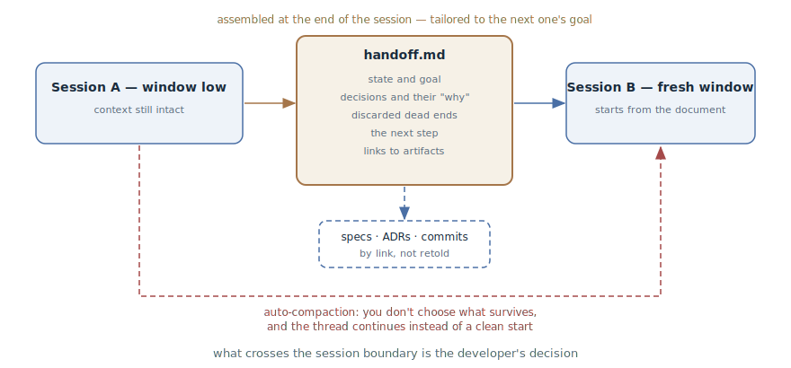

# Session Handoff

## Intent

At the session boundary, deliberately pack its contents into a handoff
document that the next session or another agent will start from — instead of
trusting auto-summarization to decide what survives from the context.

## Also known as

Handoff; `/handoff` in Matt Pocock's skills; handoff document.

## Problem

Every session has a boundary: the window runs out, the work is handed to
another agent, or the next stage is better done from a clean slate. Context
does not cross the boundary on its own, and both stock ways of carrying it
over are bad:

- **Auto-compaction** fires on a threshold and summarizes at its own
  discretion. What survives — the decisions made, or a retelling of
  long-processed logs — is not your choice. And it loses things silently:
  you find out only when the agent "forgets" an agreement.
- **Retelling by hand** is expensive and leaky: the developer reconstructs
  from memory what the agent knew more precisely — and inevitably loses the
  reasons behind decisions and the discarded dead ends.

There is a third trouble: summarization continues *the same* work in *the
same* thread. But the next session is often needed for something else — a
prototype, implementation of a finished plan, a review. It needs not a
retelling of the whole history but an extract tailored to its specific goal.

## Solution

As the session's final act, the developer asks the agent to assemble a
handoff document — and says what the next session will be for. The agent,
still holding the full context in its window, packs it for that goal:

- the current state and the next session's goal;
- the key decisions — with reasons, not just outcomes;
- what has been tried and discarded, so it isn't tried again;
- the concrete next step;
- links to the permanent artifacts — specifications, ADRs, commits,
  tickets — instead of retelling them;
- hints for the next agent: which skills and tools will be useful.

Secrets — keys, passwords, personal data — are scrubbed: the document leaves
the session's bounds. The document itself is disposable and is not committed
to the repository: long-lived knowledge belongs in specifications, ADRs, and
the [progress journal](progress-file.md), while the handoff lives from one
session to the next.

The new session begins by reading the document — and gets dense, curated
context for its task, not the lottery of auto-compaction and not the tail of
someone else's history.

## Structure



The upper path is the pattern: the departing session, while its context is
still intact, assembles the handoff document for the named goal; the next
session reads it as its first message. Permanent artifacts are not rewritten
into the document — it references them, and the new session reads what it
needs on its own. The lower dashed path is what the pattern opposes:
auto-compaction carries across the boundary whatever it chooses, and
continues the same thread instead of a clean start toward the new goal.

## Participants / Components

- **The departing session** — the only moment when the context is still
  complete; assembles the document.
- **The handoff document** — a disposable extract tailored to the goal:
  state, decisions, dead ends, next step, links.
- **The next session** — a fresh window (another agent, another kind of
  work); starts by reading the document.
- **The developer** — names the next session's goal and decides when the
  boundary has arrived.
- **Permanent artifacts** — specifications, ADRs, commits, tickets; they
  enter the document as links.

## When to use

- The window is running low and the work isn't finished — a handoff instead
  of hoping for auto-compaction.
- The nature of the work changes: exploration → prototype, plan →
  implementation, implementation → review. The next stage needs a clean
  slate and an extract, not the whole history.
- The work is handed to another agent or a colleague.
- A long discussion has accumulated decisions you don't want to entrust to
  compaction.

If the work continues in the same session on the same course, the
[progress journal](progress-file.md) is enough; the handoff is a move made
precisely at the boundary.

## Consequences and trade-offs

- ➕ What survives the boundary is decided by the developer, not by an
  auto-compaction threshold.
- ➕ The next session starts with context cut to its goal — denser and
  cheaper than the tail of someone else's history.
- ➕ The reasons behind decisions and the discarded dead ends move across
  explicitly — exactly what auto-summarization loses first.
- ➖ A manual move: the boundary has to be noticed in advance — a document
  assembled after compaction packs already-truncated context.
- ➖ Quality depends on the packing: a poorly assembled document loses the
  same things the automation does.
- ➖ The temptation to duplicate artifacts: retelling the specification in
  the handoff means wasted tokens and a second source of truth.

## Implementation

1. Set up a command: a ready-made `/handoff` skill exists in
   [Matt Pocock's pack](matt-pocock-skills.md), and in Claude Code a custom
   slash command is easy to make. The point is one invocation, not a ritual
   from memory.
2. Always name the goal: "assemble a handoff for a session that will do X."
   A document for implementation and a document for review are different
   documents.
3. Keep the contents: state and goal, decisions with reasons, the discarded,
   the next step, links to artifacts, suggested skills.
4. Don't duplicate: everything already recorded in specifications, ADRs,
   commits, and tickets enters as a link, not a retelling.
5. Scrub secrets: the document will be read outside this session.
6. Keep it outside the repository — in a temporary directory: it is a
   disposable document. Whatever must live long goes into the permanent
   artifacts as the session wraps up.
7. Start the next session from the document: "read such-and-such file and
   continue."
8. Watch the window: the handoff is assembled *before* compaction. If the
   tool shows the window filling up, that's the signal to prepare the
   boundary.

## Example

A session has planned a tariff migration and hit an open question: can the
chosen subscription-cancellation model handle corporate contracts? It's
easier to settle with a prototype in a clean session. The developer closes
the current one:

> Assemble a handoff for the next session: it will build a prototype of the
> cancellation model; the question is whether the model survives corporate
> contracts with deferred start.

The agent writes `handoff-cancellation-prototype.md` to the temporary
directory:

```markdown
# Handoff: cancellation model prototype

## Session goal
Verify with a prototype: does the event-based cancellation model
survive corporate contracts with deferred start?

## Context
The tariff migration plan is done (see docs/specs/tariff-migration.md).
Open question #3 from it is the cancellation model.

## Decisions
- Cancellation is an event with an effective date, not a status
  change: billing needs the history (ADR-0009).

## Discarded
- A cancelled_at flag on the subscription: loses repeat cancellations
  after reactivation.

## Next step
Prototype: three scenarios — immediate cancellation, cancellation with
a date, cancellation before the contract starts.

## Suggested skills
/prototype — the session is entirely about throwaway code.
```

The new session starts with a single line:

> Read /tmp/handoff-cancellation-prototype.md and get going.

The prototype session doesn't drag three hours of planning behind it — only
the extract for its question and a link to the specification if details are
needed.

## Anti-patterns and common mistakes

- **Trusting the boundary to auto-compaction.** Decisions and reasons leave
  silently; the pattern exists precisely so that they don't.
- **A handoff-dump.** Unloading the entire history "just in case" — the next
  session starts with someone else's noise instead of clean context. A
  handoff is an extract for a goal.
- **Retelling the artifacts.** The specification and the ADRs are already
  written — in the handoff their place is a link. A copy will go stale and
  start lying.
- **A handoff in git.** A disposable document in the repository is litter
  and a leak risk: it was written with no thought of a long life. The
  long-lived goes into the journal, ADRs, and specifications.
- **Assembling after compaction.** Too late: half the context is already
  gone. The handoff is written while the window is intact.

## Known uses

- **Matt Pocock's skills** — `/handoff`: a disposable document in the
  temporary directory, a suggested-skills section, a ban on duplicating
  artifacts, secret scrubbing; in the pack's main flow the handoff links the
  interview to the prototype and other stage changes.
- **Claude Code** — `/compact` with an instruction ("compact, focus on X") —
  the pattern's built-in younger sibling: you can set the focus, but the
  result stays in the same thread and doesn't survive a session change.
- **Compaction from the Anthropic context engineering article** — the
  automated variant of the same operation in long-running agent harnesses:
  summarize with maximum recall, then tune for precision.
- **Subagents** — the same handoff bottom-up: a subagent returns to the
  coordinator a condensed summary of its work, not the full trace.

## Related patterns

- [Progress Journal](progress-file.md) — the neighbor in the state layer:
  the journal is kept as the work goes and lives in the repository, the
  handoff is written once at the boundary and dies after being read.
- [Context Engineering](context-engineering.md) — a handoff is deliberate
  compaction: the "minimum tokens, maximum signal" principle applied by hand
  to the session boundary.
- [Four Phases](explore-plan-code-commit.md) — an approved plan is a
  ready-made handoff document: it can be executed in a fresh session without
  dragging the discussion history along.
- [Spec-Driven Development](spec-driven-development.md) — SDD's permanent
  artifacts and the disposable handoff complement each other: the former
  store the knowledge, the latter carries the working moment.
