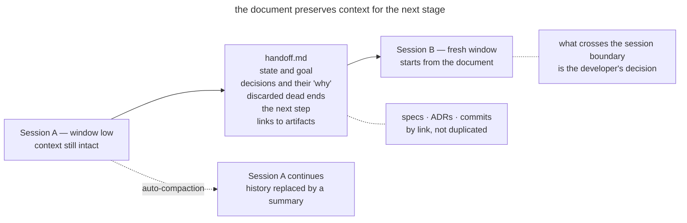

# Session Handoff

## Intent

Before switching sessions, save the state of the work in a handoff document. The next agent gets the goal, the decisions made, and the first step from which it can continue.

## Also known as

Handoff; `/handoff` in Matt Pocock's skills; handoff document.

## Problem

A session has to end when the window runs out or the nature of the work changes. For example, after planning, a disputed decision needs to be checked with a separate prototype.

An automatic summary may preserve the course of the discussion but miss the reason one option was rejected. The new agent will then repeat research that has already been done. Retelling it by hand also takes time and depends on your memory.

For the next stage, it is more useful to select information for its goal in advance. A prototype needs the open question and the experiment's criterion, while an implementation needs the agreed plan.

## Solution

Before finishing, ask the agent to prepare a document for a named goal. While the context is available, it can save the necessary information.

- the current state and the goal of the next session;
- key decisions and their reasons;
- what was already tried and discarded, so it is not tried again;
- a specific next step;
- links to specifications, ADRs, commits, and tickets;
- recommendations on skills and tools for the next session.

Remove secrets and unnecessary personal data from the document. In this variant of the pattern, the handoff is stored in a temporary directory and used for a specific transfer. Keep long-term knowledge in specifications, ADRs, and the [progress journal](progress-file.md).

The next session starts from the document and follows the links to read additional materials that the task requires.

## Structure

The upper path in the diagram shows a handoff for a given goal.


```mermaid
---
title: the document preserves context for the next stage
---
flowchart LR
  a["Session A — window low<br/>context still intact"]
  doc["handoff.md<br/>state and goal<br/>decisions and their 'why'<br/>discarded dead ends<br/>the next step<br/>links to artifacts"]:::accent
  b["Session B — fresh window<br/>starts from the document"]
  artifacts["specs · ADRs · commits<br/>by link, not duplicated"]:::muted
  a --> doc --> b
  doc -.- artifacts
  compact["Session A continues<br/>history replaced by a summary"]:::muted
  a -. "auto-compaction" .-> compact
  note["what crosses the session boundary<br/>is the developer's decision"]:::muted
  b -.- note
```

The current agent writes the document, and the next one reads it and follows the links to the permanent artifacts. The lower path shows auto-compaction within the current conversation, where you have less control over what goes into the summary.

## Participants / Components

- **The departing session** assembles the document while the necessary context is still available.
- **The handoff document** preserves the state and the next step for a specific goal.
- **The next session** reads the document before continuing the work.
- **Developer** chooses the moment of the handoff and the goal of the next stage.
- **Permanent artifacts** provide details via links from the document.

## When to use

- The window runs out before the task is finished.
- The work moves from research to a prototype, implementation, or review.
- The work is handed to another agent or a colleague.
- A long discussion has accumulated decisions you would not want to entrust to compaction.

When continuing the same work, a [progress journal](progress-file.md) is often enough. A handoff is useful at the moment of transfer between sessions.

## Consequences and trade-offs

- ➕ You can check what information whoever picks up the work next will get.
- ➕ The new session gets context tailored to its task.
- ➕ The reasons for decisions and the hypotheses already checked are preserved explicitly.
- ➖ The document has to be prepared before the necessary information is lost from the window.
- ➖ An incomplete summary may miss the same details as auto-compaction.
- ➖ Retelling permanent documents creates copies that can diverge from the originals.

## Implementation

1. Prepare a repeatable handoff command. For example, `/handoff` is available in [Matt Pocock's pack](matt-pocock-skills.md).
2. Name the goal of the next session so that the agent selects information for it.
3. Save the state, the decisions with their reasons, the hypotheses already checked, and the next step.
4. Give links to specifications, ADRs, and tickets.
5. Check that the document contains no secrets.
6. Put the handoff in a temporary directory. Move knowledge needed for the long term into permanent documents.
7. Start the next session by asking it to read the handoff.
8. Prepare the handoff before the window is compacted, while the agent can still reconstruct the reasons for decisions.

## Example

While planning a tariff migration, a question remained about corporate contracts with a deferred start. You decide to check the cancellation model with a prototype and prepare a new session.

> Assemble a handoff for a prototype of the cancellation model. The next session should check whether the model supports corporate contracts with a deferred start.

The agent saves _handoff-cancellation-prototype.md_ to the temporary directory.

```markdown
# Handoff: cancellation model prototype

## Session goal
Verify with a prototype: does the event-based cancellation model
survive corporate contracts with deferred start?

## Context
The tariff migration plan is done (see docs/specs/tariff-migration.md).
Open question #3 from it is the cancellation model.

## Decisions
- Cancellation is an event with an effective date, not a status
  change: billing needs the history (ADR-0009).

## Discarded
- A cancelled_at flag on the subscription: loses repeat cancellations
  after reactivation.

## Next step
Prototype: three scenarios — immediate cancellation, cancellation with
a date, cancellation before the contract starts.

## Suggested skills
/prototype — the session is entirely about throwaway code.
```

In the new session, you pass the path to the document.

> Read /tmp/handoff-cancellation-prototype.md and get going.

The agent starts the prototype from the stated question and the links to the agreed decisions. It does not need to reconstruct them from several hours of discussion.

## Anti-patterns and common mistakes

- **Trusting the boundary to auto-compaction.** Decisions and reasons leave silently; the pattern exists precisely so that they don't.
- **A handoff-dump.** The full history takes up the next session's window. Select information for its goal.
- **Retelling the artifacts.** A copy of the specification can go stale. Pass a link to the original document.
- **A disposable handoff in git.** A temporary summary quickly goes stale. Keep in the repository the information the team intends to maintain.
- **Handing off after the context is lost.** The agent can only write down the information that remains. Prepare the document in advance.

## Known uses

- **Matt Pocock's skills** use `/handoff` to transfer between stages, including the move from the interview to the prototype.
- **Claude Code** lets you set a focus for `/compact`. Such a summary continues the work in the current conversation.
- **Anthropic's article on context engineering** describes context compaction for long-running agent work.
- **Subagents** return to the coordinator a summary of results selected for its task.

## Related patterns

- [Progress Journal](progress-file.md) is updated as the work goes and is kept in the repository.
- [Context Engineering](context-engineering.md) explains how to select information for a handoff.
- [Four Phases](explore-plan-code-commit.md) lets you pass an approved plan to a new implementation session.
- [Spec-Driven Development](spec-driven-development.md) keeps the permanent documents that a handoff links to.
