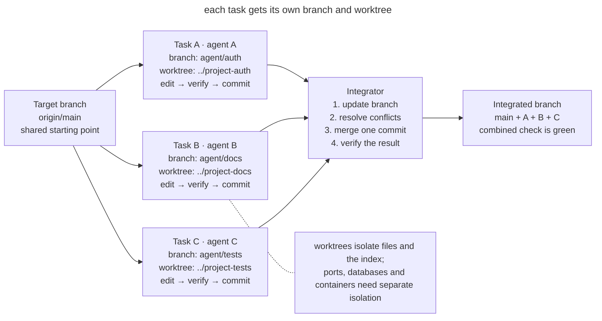
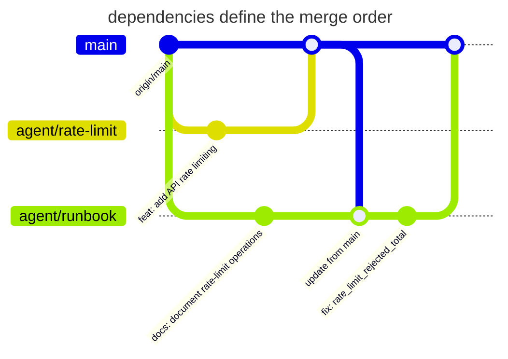

# Isolated Parallel Work

## Intent

Give each parallel task its own branch and working tree. The agent verifies the change in its own directory and hands off the result as a commit. The integrator merges finished changes one at a time.

## Also known as

Worktree per task, branch per agent, isolated checkout, parallel worktrees.

## Problem

One agent is changing authentication while a second one updates the documentation in the same checkout. The second sees the first one's unfinished files and formats them. Now the tests run against a mixture of changes, and one agent's commit can capture someone else's lines.

A shared checkout mixes changes before they are even committed. This makes several routine operations harder.

- `git diff` no longer answers which task produced a line;
- one task is verified against another task's code and produces a false green signal;
- an agent can delete or rewrite an unfamiliar change as “unnecessary”;
- during review and rollback it is hard to tell where a task begins and ends;
- two processes compete for the Git index, generated files, and local dependencies.

Just creating branches does not separate the working files. A directory has one branch checked out, so switching it affects every process that uses that directory.

Separate clones isolate the work but duplicate history. Git worktree lets you create several directories, each with its own `HEAD`, index, and files, over a shared Git object store.

## Solution

Give each task **its own branch and worktree**, an ownership scope, and a completion criterion. The agent changes and verifies files inside its own directory. The verified commit is the result that can be handed off for integration.

Integrate finished branches one at a time. Before merging, update the branch from the target, resolve conflicts in the context of its task, and run the checks again. This turns competition from uncontrolled writes to shared files into ordinary, observable Git integration.

The following rules keep the isolation in place.

1. **A working directory** belongs to one task or session.
2. **An ownership scope** defines which changes are allowed.
3. **The result is handed off** through a verified commit.
4. **Integration** updates the target branch sequentially and verifies the combined state.

## Structure

In the diagram, each task runs its own cycle in a separate worktree.



The integrator accepts commits one at a time and verifies the assembled state. Overlaps between tasks surface when branches are updated and merged.

## Participants / Components

- **Target branch** collects finished changes, for example in `main`.
- **Task** defines an independent result and a scope of changes.
- **Task branch** holds the history of its implementation.
- **Worktree** contains the working files and a separate Git index.
- **Agent** works in its assigned directory.
- **Integrator** decides the merge order and verifies the combined result.
- **Environment contract** separates ports, databases, containers, and temporary files.

## When to use

- Two or more independent tasks can genuinely be done at the same time.
- One agent implements a change while another writes tests or documentation, or researches the code.
- You need to compare several implementations without overwriting experiment results.
- A long task must not block an urgent fix in the same repository.
- Parallel sessions are started locally or by an automated harness.

If two changes constantly need each other's uncommitted results, do them sequentially. Parallel work pays off once you have split out parts that can be verified on their own.

## Consequences and trade-offs

- ➕ The tasks' working files are separated into different directories.
- ➕ A check in a branch applies to that specific task, and re-running it after the merge evaluates the combined behavior.
- ➕ A failed experiment can be deleted together with its own worktree.
- ➕ One PR ties the result to the task and to the participant responsible for it.
- ➖ Poorly split tasks still produce difficult merge conflicts.
- ➖ Each worktree needs dependencies installed and its own environment configuration; without a fast bootstrap, setup eats the gain.
- ➖ Git isolates files but not external resources. Identical ports, a single test database, or a shared cache directory still create races.
- ➖ A large number of branches needs someone responsible for integration and a dependency order.

## Implementation

1. Identify self-contained results. For each task, write down the completion criterion, the ownership scope, and the dependencies.
2. Pin the starting point and create separate branches with worktrees.

   ```bash
   git fetch origin
   git worktree add -b agent/auth ../project-auth origin/main
   git worktree add -b agent/docs ../project-docs origin/main
   ```

   `git worktree list` shows all active directories and branches. Git will not let you accidentally use the same branch in two worktrees unless you force past the protection.
3. Run the project's standard setup in each directory. A command like `make setup` should bring a fresh worktree to a reproducible green state; configuring every instance by hand does not scale.
4. Give the agent the task and the rules for working in its assigned directory. Specify which files it may change and what verified result it must return.
5. Separate the external environment. Assign different ports, container names, test databases, and temporary directories. Secrets are best mounted read-only or replaced with safe local values.
6. Each agent verifies its change inside its branch and creates one meaningful commit. Unfinished state is not passed to neighbors as a dependency.
7. The integrator picks the order based on dependencies. Before merging, each branch pulls in the current target branch, resolves conflicts, and repeats its check.
8. After each merge, run a check of the combined state. Two green branches do not guarantee a green composition.
9. After integration, remove clean worktrees with the standard command.

   ```bash
   git worktree remove ../project-auth
   git worktree remove ../project-docs
   git worktree prune
   ```

   Use `git worktree remove`. It refuses to delete a worktree with uncommitted files, so no work gets lost.

### Resolving conflicts by intent

On a conflict, ask the agent to reconstruct the purpose of both changes from the commits, PRs, and original tasks. It should explain which requirements the combined version preserves. If the requirements are incompatible, agree on the desired behavior before continuing the integration.

For example, one branch adds a request timeout and another limits the number of retries. Picking only one side can lose the other constraint. After combining them, verify both behaviors and how they work together. Even Git's automatic merge needs this check. The [resolving-merge-conflicts](https://github.com/mattpocock/skills/blob/main/skills/engineering/resolving-merge-conflicts/SKILL.md) skill relies on recovering the original intent; stage only the files of the current integration and leave unrelated changes alone.

## Example

A team is preparing rate limiting and an operations page for an online store. You create two worktrees from the same `origin/main`.

```text
shop/                 main, integration only
shop-rate-limit/      agent/rate-limit, code + tests
shop-runbook/         agent/runbook, docs + link checks
```

The first agent changes the middleware and tests; the second writes the runbook. Each runs `make setup` and its own checks in a separate directory. The result is two commits.

```text
4d23f91 feat: add API rate limiting
8a771bc docs: document rate-limit operations
```

The runbook depends on the final metric names, so the integrator merges the code first. It then updates the documentation branch and notices the rename to `rate_limit_rejected_total`. It fixes the reference and repeats the documentation check before merging.



In the diagram, both branches start from the same point. The `agent/runbook` branch receives the merged code before it is finished, so the metric-name fix shows up as a separate documentation commit.

Local servers need different ports, for example `PORT=4101` and `PORT=4102`, and separate test databases. A worktree separates files, but shared external resources can still create races.

## Anti-patterns and common mistakes

- **Shared checkout.** Several agents writing to one directory mix their unfinished changes.
- **Branch without a worktree.** Processes take turns switching the branch in one directory; files change underneath them.
- **Worktree without an owner.** Several tasks in one directory mix their edits again.
- **Splitting by files instead of outcomes.** “You change the controller; you write the tests” creates two halves that cannot be independently verified and completed.
- **Shared infrastructure.** Different directories start the same Compose project, use one database or one port, and get races outside Git.
- **Parallel merging.** Several processes update the target branch at the same time. The serialization point disappears and green checks quickly go stale.
- **Integration without re-verification.** Every branch is green on its own, but nobody has run their composition.
- **Endless worktrees.** Finished directories are never removed, branches lose their owners, and a week later nobody knows where valuable work remains.

## Known uses

- **Claude Code** recommends separate worktrees for parallel CLI sessions so their changes do not collide, and uses the same technique when fanning work out across files.
- **Anthropic's C compiler experiment** used separate containers and agent clones, task locks, and synchronization through Git.
- **Git worktree** supports several working trees of one repository without full clones.

The examples are described in [Claude Code best practices](https://code.claude.com/docs/en/best-practices), the [C compiler experiment](https://www.anthropic.com/engineering/building-c-compiler), and the [Git worktree documentation](https://git-scm.com/docs/git-worktree).

## Related patterns

- [One Feature at a Time](one-feature-at-a-time.md) bounds the work inside a single worktree.
- [Writer and Reviewer](writer-reviewer.md) splits implementation and review between sessions.
- [Feedback Loop](give-agent-a-way-to-verify.md) verifies branches before and after integration.
- [Four Phases](explore-plan-code-commit.md) ends the cycle with a verified commit.
- [Reproducible Agent Bootstrap](reproducible-agent-bootstrap.md) prepares a new worktree with a single verifiable command.
