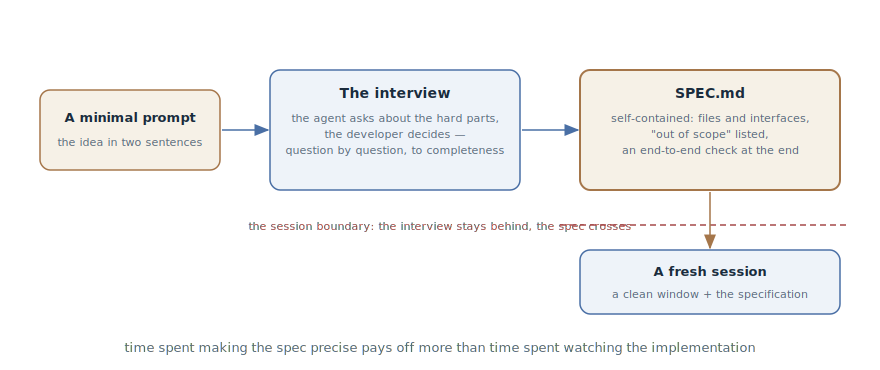

# Agent-Led Interview

## Intent

Flip the setup of a large task: instead of writing the specification
yourself, start with a minimal description and let the agent interview you —
until your answers assemble into a self-contained specification. A fresh
session with a clean context executes it.

## Also known as

Let Claude interview you, the reverse interview.

## Problem

A large feature lives in your head — and comes out of there badly:

- Writing the specification yourself is hard and one-sided: you don't know
  what you don't know. The edge cases, UX forks, and trade-offs you never
  thought about won't make it into the text — there is nobody to ask about
  them.
- Dumping everything into one long prompt yields a pile of text without
  structure: the important mixed with the obvious, and the holes still in
  place.
- The unsaid surfaces at the worst moment: mid-implementation the agent
  hits an unresolved question — and silently resolves it itself, however it
  happens to.

## Solution

Start with the minimum and hand the initiative to the agent:

> I want to build [a brief description]. Interview me in detail: ask about
> the technical implementation, UX, edge cases, risks, and trade-offs.
> Don't ask obvious questions — dig into the hard parts I might not have
> considered. Keep going until we've covered everything, then write the
> complete specification to SPEC.md.

The roles split cleanly: the agent asks — and it is good at this, because
it knows the typical holes of features of this kind; you decide — every
answer pins down a decision that would otherwise have surfaced
mid-implementation.

The interview's finale is a **self-contained** specification: it names the
files and interfaces involved, explicitly lists what is *out of* scope, and
ends with an end-to-end verification step that proves the feature works.
Self-containedness is the readiness criterion: such a spec can be worked
from with no access to its author.

Execution happens in a fresh session: a clean window devoted entirely to
the implementation, with the specification as the source. The interview is
not dragged into the executor's context — everything valuable in it is
already in SPEC.md. Time spent making the specification precise pays off
more than time spent watching the implementation.

## Structure

On the left, the minimal prompt — the idea in a couple of sentences. In the
center, the interview loop: the agent asks about the hard parts, the
developer decides, question by question. On the right, the product — a
self-contained specification with the files, the scope boundaries, and the
end-to-end check. The dashed boundary separates it from execution: a fresh
session receives the spec and a clean window; the interview stays behind.

## Participants / Components

- **The developer** — the source of decisions: answers, chooses, cuts
  scope.
- **The interviewing agent** — asks about what you haven't thought of;
  instructed not to ask the obvious.
- **SPEC.md** — the interview's product: a self-contained specification
  with files, boundaries, and a check.
- **The fresh session** — the executor: a clean window plus the
  specification, without the interview's tail.

## When to use

- A large feature whose requirements exist in your head but not on paper —
  and writing them yourself isn't working.
- You are solo or a small team with no dedicated analyst: the agent covers
  the role of the person who asks the uncomfortable questions.
- Specs you wrote alone in the past kept turning out to have holes in the
  same places.

Not needed for small edits — a normal task statement suffices — and when a
specification already exists: a finished plan isn't interviewed into
existence, it gets [attacked](grilling.md).

## Consequences and trade-offs

- ➕ The questions expose what you hadn't thought about: the agent knows
  the typical holes — retries, races, empty states, permissions.
- ➕ The specification is born structured and self-contained — a ready
  input for the [SDD pipeline](spec-driven-development.md).
- ➕ The executor gets a clean context: the window isn't buried under an
  hour of negotiations.
- ➖ The interview costs time and patience: dozens of questions in a row
  wear you down.
- ➖ Quality hangs on the instruction: without "don't ask the obvious" the
  agent starts with "which framework are we using".
- ➖ Careless answers devalue everything: a "whatever you think is best" to
  every question yields a specification made of the agent's guesses — you
  might as well have skipped the interview.

## Implementation

1. Write the minimal prompt: the idea in one or two sentences plus the
   request to interview — with an explicit "dig into the hard parts, don't
   ask the obvious".
2. Answer as the owner: every answer is a decision. If you don't know, say
   so: "I don't know — propose options" beats a random pick.
3. Demand the finale as a file: the complete specification in `SPEC.md`,
   not a summary in the chat.
4. Check the self-containedness: the files and interfaces are named, the
   "out of scope" is listed, an end-to-end verification step closes it.
   Something missing — another round of questions.
5. Execute with a fresh session: a new context, `SPEC.md` as the input. For
   work bigger than one session, the spec goes into the
   [SDD pipeline](spec-driven-development.md) — as a plan and tasks.

## Example

A developer wants webhooks for integrations and writes exactly that:

> I want to add webhooks so clients get order events. Interview me in
> detail, dig into what I haven't considered, then write the specification
> to SPEC.md.

The agent asks — one at a time, with a recommendation for each: which
events in the first version; what to do when the receiver returns a 500 — I
recommend exponential retries with a cap; should the payload be signed — I
recommend HMAC; do we guarantee event ordering; what about client-side
deduplication. On "what happens when a receiver is consistently slow and
builds up a queue" the developer stops: he hadn't thought about it at all —
they decide to disable the webhook after N failures, with a notification.

Twenty questions later `SPEC.md` holds the specification: the events and
their format, the retry policy, the signing, "out of scope: the settings
UI — next iteration", and the end-to-end check — "create an order, see the
delivered event in a test receiver, take the receiver down, see the retries
and the disable". The developer opens a fresh session: "implement from
SPEC.md" — and the executor works from a document in which the
slow-receiver question is already decided.

## Anti-patterns and common mistakes

- **"Whatever you think is best" to everything.** The interview works only
  while the decisions are yours: an agent answering itself produces a
  specification made of guesses.
- **An interview without the file.** Decisions left in the conversation die
  with the session — the finale is always `SPEC.md`.
- **Executing in the same session.** The window is buried under the
  interview, and the executor drags an hour of negotiation instead of a
  clean context. The spec is self-contained — give it a fresh session.
- **Obvious questions.** Without an explicit "dig into the hard parts" the
  agent interviews across the surface — and the holes stay put.
- **An interview instead of grilling.** If the plan is already written,
  rebuilding it with questions is too late — it needs to be
  [attacked](grilling.md).

## Known uses

- **Claude Code best practices** — the primary source with the ready-made
  prompt: the interview via AskUserQuestion, "dig into the hard parts I
  might not have considered", the specification into SPEC.md, execution by
  a fresh session.
- **Kiro** — spec sessions as an IDE mode: the same idea built into the
  tool — requirements born in a dialogue with phase-gate approvals.
- **Matt Pocock's skills** — `/grill-with-docs`: an interview that reads
  the codebase in parallel and settles its decisions into CONTEXT.md and
  ADRs.

## Related patterns

- [Grilling](grilling.md) — the mirror neighbor: the interview *builds* a
  specification from nothing, grilling *attacks* a finished plan.
- [Spec-Driven Development](spec-driven-development.md) — the receiver of
  the result: SPEC.md is a ready pipeline input.
- [Four Phases](explore-plan-code-commit.md) — the smaller scale: there the
  agent explores and plans itself; here the plan is born from your
  decisions.
- [Premature Specification](premature-specification.md) — the anti-pattern
  the interview guards against: the specification assembles from decisions
  on questions, not from early guesses about the implementation.
