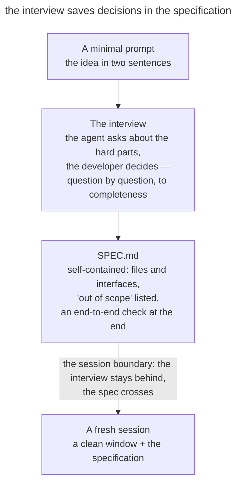

# Agent-Led Interview

## Intent

If the requirements for a feature aren't written down yet, briefly describe the idea to the agent and ask it to interview you. The agent will ask about scenarios you may have missed. From your answers, it will put together a self-contained specification — a document that can be understood without reading the interview. Then a fresh session implements the task from it.

## Also known as

Let Claude interview you, the reverse interview, agent-led interview.

## Problem

Say you ask the agent to add order webhooks. You picture how the feature should work, but you haven't written down all the scenarios yet. Experience suggests the usual path to you, and you don't notice the exceptions.

Your request doesn't say what to do if the receiver responds slowly. So the agent will have to choose the retry policy on its own, already during implementation. Even a detailed description of the idea can keep this gap, because you write it from the same experience. That's why you need a counterpart who will ask what should happen on failure.

## Solution

Describe the intent in a few sentences and ask the agent to question you about what you might have overlooked. For example:

> I want to build [a brief description]. Interview me and write the requirements to SPEC.md

The agent looks for places where the feature's behavior is not yet defined and asks you about them. What is recorded in the project, the agent finds out without you, and you make the product decisions. With each answer, you settle something the agent would otherwise choose on its own during implementation: for example, what to do with a slow receiver.

At the end, the agent writes a **self-contained specification** — a document the next implementer will understand without reading the interview. It includes the requirements, the scope boundaries and an end-to-end check, that is, a scenario that shows the feature works as a whole.

Start the implementation in a fresh session — a new conversation with the agent. The long interview has already taken up part of the [context window](glossary.md), the amount of data the model takes into account in every response. A fresh session starts with a clean window and the specification. It doesn't see the interview, so every important decision from it must be written down in the document.

## Structure

In the diagram, you start with a short idea, answer the agent's questions and get a specification.


```mermaid
---
title: the interview saves decisions in the specification
---
flowchart TB
  prompt["A minimal prompt<br/>the idea in two sentences"]:::accent
  interview["The interview<br/>the agent asks about the hard parts,<br/>the developer decides —<br/>question by question, to completeness"]
  spec["SPEC.md<br/>self-contained: files and interfaces,<br/>'out of scope' listed,<br/>an end-to-end check at the end"]:::accent
  fresh["A fresh session<br/>a clean window + the specification"]
  prompt --> interview --> spec
  spec -- "the session boundary: the interview stays behind,<br/>the spec crosses" --> fresh
```

The session boundary in the diagram is the moment you open a new session and hand it SPEC.md.

## Participants / Components

- **Developer** makes decisions and limits the scope of the task.
- **Interviewing agent** asks questions about missed scenarios.
- **SPEC.md** is the file with the requirements and acceptance criteria.
- **Fresh session** implements the task from the specification.

## When to use

- You have an idea for a large feature, but its requirements aren't written down yet.
- The team needs a counterpart to help check that all scenarios are covered.
- Specifications you wrote alone kept turning out to have holes in the same places.

A small edit is usually enough to simply hand to the agent. And a finished plan is better checked with [Grilling](grilling.md): there the agent asks questions about a plan that is already written.

## Consequences and trade-offs

- ➕ By answering the agent's questions, you find mistakes and constraints you haven't discussed yet.
- ➕ The specification can serve as the basis for [spec-driven development (SDD)](spec-driven-development.md).
- ➕ The implementer receives only the selected decisions, without the whole interview history.
- ➖ A detailed interview takes your time and attention.
- ➖ If the agent doesn't see the code, it may ask you about things already recorded in the project.
- ➖ If you don't make decisions, the agent will fill the specification with its own assumptions.

## Implementation

1. Describe the idea in a few sentences and ask the agent to find out which scenarios you missed.
2. Discuss the answer options with the agent. If there is no decision yet, write down an open question.
3. Ask the agent to save the specification to _SPEC.md_.
4. Reread the requirements, constraints and end-to-end check. Clarify the places the implementer won't understand without the interview.
5. Hand the document to a fresh session. If the work is long, add a plan and tasks to the specification following [SDD](spec-driven-development.md).

### When someone else knows the answer

Sometimes the agent asks about a rule you don't know. Then ask the agent to prepare a questionnaire for the person who knows the answer. The agent puts the task context into the questionnaire itself, so it can be given to an expert who didn't take part in your conversation.

For example, you are preparing a billing migration, and the finance team has to clarify the refund rules. Then the agent will ask in the questionnaire what happens if the customer used only part of the period, and which exceptions the contract provides for. If a question gets an "I don't know", record it as open. When the answers arrive, check them and ask the agent to update the requirements.

The [to-questionnaire](https://github.com/mattpocock/skills/blob/main/skills/productivity/to-questionnaire/SKILL.md) skill can prepare such a questionnaire. A [skill](glossary.md) is a repeatable procedure written down in instructions for the agent. First, to-questionnaire asks you who the questionnaire is addressed to and what information needs to be obtained. But the team has to send the questionnaire and carry the answers into the specification itself: the skill doesn't do that.

## Example

Back to the order webhooks. You start with this request:

> I want to add webhooks so clients get order events. Interview me in detail, dig into what I haven't considered, then write the specification to SPEC.md.

The agent questions you one by one about what to do on delivery errors. When it asks about a receiver that is consistently slow, you realize you missed this scenario. You agree with the agent: after a set number of failures the webhook is disabled, and the client gets a notification.

The agent writes these conditions into _SPEC.md_ together with the event format, the signature and the retry policy. Here is the fragment about disabling the webhook that you agreed on:

```markdown
Disable the webhook after five consecutive failed delivery attempts.
A failure is a response outside the 200–299 range or no response
within 10 seconds. A successful delivery resets the counter to zero.
After the fifth failure, stop sending and create one notification
in the client's dashboard. The client can re-enable the webhook themselves.
```

The fragment has a threshold, a way of counting failures and an observable result. So an end-to-end check can be built from it. The check reproduces five failures and confirms that the webhook is disabled and the client got a notification. A separate scenario inserts a successful delivery between failures and checks that the counter was reset.

These are the conditions of a sample product. In your own product, pick values that fit your load and delivery requirements.

## Anti-patterns and common mistakes

- **"Whatever you think is best" to everything.** If you answer every question that way, the agent's guesses end up in the document instead of your decisions.
- **An interview without a file.** Important decisions remain only in the conversation, and the next session won't see them.
- **Executing in a filled window.** A long interview takes up space in the context window that the implementation will need. Hand the agreed specification to a fresh session.
- **Only obvious questions.** If the agent asks only about what is clear anyway, the gaps go unnoticed. Ask it to question you about exceptions and constraints you haven't discussed yet. The prompt in the example has the words "dig into what I haven't considered" for this.
- **Another interview on a finished plan.** If the plan is already written, check its decisions with [Grilling](grilling.md), not a new interview.

## Known uses

- **Claude Code best practices** advise running the interview through the AskUserQuestion tool, saving the outcome to SPEC.md and implementing it in a fresh session.
- **Kiro** drafts requirements in a dialogue with you, and you confirm them phase by phase.
- **Matt Pocock's skills** save the outcomes of `/grill-with-docs` to CONTEXT.md and ADRs — architectural decision records.

## Related patterns

- [Grilling](grilling.md) checks a plan that is already written.
- [Spec-Driven Development](spec-driven-development.md) takes the interview's result as the basis of the plan.
- [Four Phases](explore-plan-code-commit.md) separate exploring the task from implementing it.
- [Premature Specification](premature-specification.md) is an anti-pattern: you choose the implementation before you've clarified the requirements.
