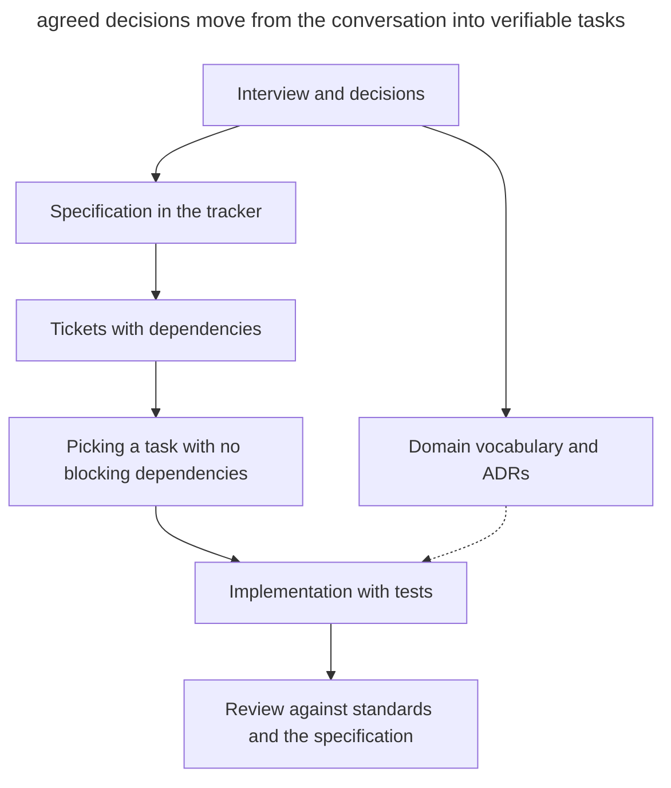

# Matt Pocock's Skills

_Commands and capabilities checked on September 21, 2026._

[Matt Pocock's skill pack](https://github.com/mattpocock/skills) implements [spec-driven development](spec-driven-development.md) as a set of [procedures for a coding agent](skills-as-packaged-workflows.md). The specification and its linked tickets go into the **issue tracker**, where the team carries on with its usual work.

## Installation and setup

For an editable install, use `npx skills@latest add mattpocock/skills`. For a managed install through the Claude Code marketplace, there is the `/plugin install mattpocock-skills` command. After installing, run `/setup-matt-pocock-skills` once; it agrees on the tracker, the triage labels and the location of the domain documents. The configuration is saved in _docs/agents/_. There are templates for GitHub, GitLab and local Markdown files. For other trackers, including Linear, the skill records how to work with them from the user's description.

## Workflow

The main process consists of several phases.

1. **Interview.** `/grill-me` runs rounds of independent questions with recommendations through `grilling`. Questions that depend on unresolved points move to the next round. The skill looks up facts in the code and agrees on decisions with the human. `/grill-with-docs` additionally saves terms to _CONTEXT.md_ and architectural decisions to ADRs through `domain-modeling`.
2. **Specification.** `/to-spec` gathers the requirements from the discussion and publishes a document with the `ready-for-agent` label. Concrete file paths and ordinary listings are left out because they quickly go stale. The exception is a short excerpt from a prototype that captures an agreed decision more precisely, such as a state model. The skill agrees on the testing boundaries with the user.
3. **Tasks.** `/to-tickets` creates tracer-bullet tickets, each with a self-contained verifiable result and blocking links. The agent picks a ticket whose dependencies are closed. Broad mechanical refactoring uses expand–contract.
4. **Implementation.** `/implement` carries out the task with `/tdd` at the agreed boundaries and runs type checks and tests.
5. **Review.** `/code-review` checks the project standards and the specification requirements in separate contexts.

The diagram shows which artifacts connect the conversation with the implementation.

In this diagram the tracker holds the requirements and the work queue. The vocabulary and ADRs add the meaning of terms and the reasons for decisions to a task, and the review checks the result against the original specification.

Additional skills support other stages of the work.

- `/wayfinder` builds a map of investigation questions for a large idea.
- `/triage` takes incoming issues to a brief and a ready status.
- `/prototype` tests a design question. For logic it creates a standalone HTML file with controllable scenarios; for UI, several switchable variants. The prototype is kept in a separate branch linked from the task.
- `/handoff` passes the state of the work to the next session.
- `/diagnosing-bugs` organizes [hypothesis-driven debugging](hypothesis-driven-debugging.md).
- `/to-questionnaire` prepares a questionnaire for the person who has the missing information.
- `/wizard` creates an interactive script for manual setup or migration steps.
- `/writing-for-agents` helps write instructions and documents for an agent. It is the new name of the expanded `writing-great-skills`.

## Artifacts

| Artifact | Where it lives |
| ---------- | ----------- |
| Specification (PRD) | An issue in the tracker with the `ready-for-agent` label |
| Tickets with blocking links | The tracker (or files in _.scratch/\<feature\>/issues/_ if the tracker is local) |
| _CONTEXT.md_ | Repository root: the domain glossary |
| ADR | _docs/adr/_: architectural decisions |
| Handoff document | The OS temp directory — deliberately outside the repository |

## What makes it different

- Specifications and tickets live in the tracker alongside the team's tasks.
- The interview helps uncover uncertainty before the specification is written.
- Each tracer-bullet ticket ends in verifiable behavior and states its dependencies explicitly.
- The glossary and ADRs grow during the discussion and are used by the other skills.

## When to choose it

The pack fits a team that wants to run SDD inside a coding agent and an existing tracker. The managed install is available in Claude Code; the editable one lets you adapt the procedures to the project. [OpenSpec](openspec.md) is convenient for keeping the change package in the repository, and [Superpowers](superpowers.md) offers a different set of skills with mandatory checkpoints.
