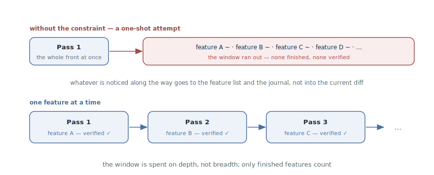

# One Feature at a Time

## Intent

Constrain the agent to one feature per pass: a session takes one item,
carries it all the way to a verified "works" — and only then takes the next
one. A constraint against the agent's built-in urge to do everything at
once: the window is spent on depth, not breadth.

## Also known as

One feature at a time, one feature per session, incremental progress; a
relative of kanban's WIP limit.

## Problem

Left to itself on a large task, an agent tries to do too much at once —
essentially to one-shot the whole app. It looks productive: files appear by
the dozen, features get "started" one after another. It always ends the same
way:

- The window is eaten by the breadth of the front: midway through the tenth
  feature the context is exhausted, and none of the ten is finished.
- "Almost done" can't be verified: verification needs finished behavior, and
  there is none anywhere.
- Half-done is worse than not-done: the next session inherits not a clean
  task list but an excavation — what of the started work runs, what to drop,
  what to finish.
- A session cutoff is expensive: progress is lost across the whole front at
  once.

## Solution

An explicit constraint, anchored in project memory and prompts: **one pass —
one feature, carried to the end**. The end is not "code written" but the
full cycle:

1. Take one item — the next failing one from the
   [Feature List](feature-list-harness.md), or a single ticket.
2. Implement it and only it.
3. Verify as a user — run the
   [Feedback Loop](give-agent-a-way-to-verify.md) to green.
4. Record: the status in the list, a commit, an entry in the
   [Progress Journal](progress-file.md).

Everything noticed along the way — a broken neighboring feature, a
refactoring begging to happen — doesn't widen the current pass; it gets
written down: as a new list item or a journal note. If, after the finale,
the window allows, the agent takes the next item — by the same cycle, not
"while we're at it".

Why it works: one feature fits in the window whole, with room for
verification iterations; completeness becomes binary — a feature is either
finished and verified or not started; and any session cutoff costs at most
one unfinished feature, not the whole front.

## Structure

The top lane is what happens without the constraint: one pass fans out
across the whole front, the window ends before the front does, and the
residue is a scattering of "almosts" that nothing can verify. The bottom
lane is the pattern: a chain of passes, each ending in one finished,
verified feature. The perceived speed is lower; the actual speed is higher —
only finished items count.

## Participants / Components

- **The pass** — the unit of work: a session, or part of one, devoted to
  exactly one feature.
- **The feature** — one verifiable item; "finished" is defined by the check,
  not by the volume of code written.
- **The feature list** — the queue the pass takes its next item from, and
  where everything noticed along the way goes.
- **The agent** — implements and verifies; the constraint is held by the
  prompt and project memory.
- **The developer** — keeps the discipline: doesn't toss in "while you're at
  it" and demands the finale before the next item.

## When to use

- Long work driven by a feature list — that's where the constraint was born:
  without it, autonomous sessions reliably try to do everything at once.
- Autonomous runs: the less supervision, the stricter the pass's frame must
  be.
- As the default for any non-trivial work: an "and X while you're at it" in
  the prompt is already a bid for a smeared, unverifiable diff.

It doesn't fit honestly cross-cutting changes — a format migration, a rename
across the codebase: they can't be sliced into features and need a separate
pass with its own completion criterion.

## Consequences and trade-offs

- ➕ Every pass ends with a verified increment: progress counts in finished
  features, not started ones.
- ➕ The window is spent on depth: the implementation, verification, and
  iterations of one feature — instead of being scattered across ten.
- ➕ A cutoff is cheap: the session died — at most one unfinished feature is
  lost, and the artifacts say which.
- ➖ It feels slower: no invigorating illusion of "everything is almost
  done". That's the price of "done" becoming true.
- ➖ Cross-cutting changes don't fit the frame — they have to be carved out
  into separate passes with their own criteria.
- ➖ The discipline cuts both ways: the prompt holds the agent, but nothing
  holds the developer; the temptation to "toss in Y too" at the end of a
  good pass breaks the pattern from the inside.

## Implementation

1. Anchor the rule in [Project Memory](claude-md-memory.md): "one feature
   per pass, carried to a verified status; incidental findings go to the
   list, not into the diff."
2. Word the pass's prompt narrowly: "take the next failing feature from the
   list and carry it to passes" — not "work on the app".
3. Define the pass's finale and demand it whole: check, status, commit,
   journal entry. A feature without the finale isn't done.
4. Route what's noticed along the way into artifacts: a bug — as a new list
   item, a refactoring idea — as a journal note. The pass's diff touches
   only its own feature.
5. If the window allows continuing — the next item starts as a new pass,
   from reading the list, not as an extension of the current diff.
6. Plan cross-cutting groundwork — migrations, renames, infrastructure — as
   separate passes with an explicit completion criterion.

## Example

The notes service from the [Feature List chapter](feature-list-harness.md).
Project memory holds the one-pass rule. The developer starts a session:

> Take the next failing feature from feature-list.json and carry it to
> passes.

The agent takes "search by tag". Along the way it notices: the notes list's
pagination is broken, and the filters are begging for a refactor. Instead of
fixing and rewriting "while it's at it", it adds pagination as a new list
item, writes the refactoring idea into the journal — and continues with
search. By the end of the pass: search implemented, run as a user,
`passes: true`, a commit, a journal entry.

For contrast — what happened before the rule: the prompt "work on the app"
ended with a session that had "implemented search, filters, pagination, and
started export". The window died on export; nothing was verified; the next
session spent half its context figuring out what of it worked at all.

## Anti-patterns and common mistakes

- **The one-shot attempt.** "Build the whole app" in one pass — the front is
  wider than the window, and the residue is a scattering of "almosts".
  Expecting a feature from a single prompt with no verification cycle is a
  separate anti-pattern, covered in its own section.
- **"While you're at it."** Every incidental "and also fix X" smears the
  diff and pushes verification out. What's noticed goes to the list, not
  into the pass.
- **A feature without a finale.** Implemented but not verified and not
  recorded — the pass doesn't count: the next session starts with an
  excavation.
- **Breadth instead of depth.** Starting three items "in parallel" is the
  same one-shot in miniature: it ends with zero finished.
- **Incidental refactoring.** Rewriting neighboring code inside the pass
  mixes two changes into one diff — and the feature's verification with the
  refactoring's.

## Known uses

- **Anthropic's harness for long-running agents** — the primary source:
  without the constraint "the agent tended to try to do too much at once —
  essentially to attempt to one-shot the app"; the "choose a single feature
  to work on" rule, together with the session ritual.
- **Superpowers** — the same frame at the task level: the plan is sliced
  into 2–5 minute tasks, each implemented by a separate subagent with a
  fresh window.
- **Matt Pocock's skills** — tracer-bullet tickets: the work is sliced into
  tickets with blocking edges, and `/implement` drives exactly one ticket at
  a time.
- **Kanban WIP limits** — the pre-agent lineage: limiting work-in-progress
  as the way to force a system to *finish* rather than *start*.

## Related patterns

- [Feature List](feature-list-harness.md) — supplies the queue: the pass
  takes the next failing item and returns a verified status.
- [Feedback Loop](give-agent-a-way-to-verify.md) — defines "finished": the
  pass's finale is a green check, not a volume of code.
- [Progress Journal](progress-file.md) — receives the incidental findings
  and records the pass's finale for the next session.
- [Four Phases](explore-plan-code-commit.md) — the same completeness
  principle at the scale of one task: the pass ends with a commit, not an
  "almost".
