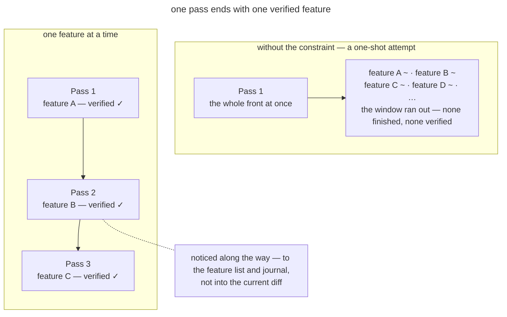

# One Feature at a Time

## Intent

Limit a pass to one feature and finish it with a check before moving to the next. That leaves room in the window for working through errors and bringing the scenario to a working state.

## Also known as

One feature at a time, one feature per session, incremental progress; a relative of kanban's WIP limit.

## Problem

On a large task, the agent may start several features in a row. The number of files grows, but not a single scenario can be verified end to end yet.

For example, a session changes note search, filters, and export all at once. By the time the window fills up, each part needs more work. The next session first has to figure out which parts are usable and which checks have already been run. This reconstruction takes time away from implementation, and unfinished changes make errors harder to localize.

## Solution

Establish the rule **finish one feature per pass**. For each item, run the full cycle.

1. Pick a failing item from the [Feature List](feature-list-harness.md), or a single ticket.
2. Implement only that item.
3. Walk through the user scenario with the [Feedback Loop](give-agent-a-way-to-verify.md).
4. Update the status, create a commit, and record the result in the [Progress Journal](progress-file.md).

Save incidental findings as separate tasks or notes. If they block the current scenario, revise the plan explicitly. Start the next feature after the current one is finished, even if both fit into one session.

A feature's size should leave room for verification and fixes. With this limit, a session cutoff leaves one unfinished piece, while the earlier results are already saved and verified.

## Structure

The upper part of the diagram shows several features started without a check.

```mermaid
---
title: one pass ends with one verified feature
---
flowchart TB
  subgraph oneshot["without the constraint — a one-shot attempt"]
    direction LR
    p0["Pass 1<br/>the whole front at once"]
    wide["feature A ~ · feature B ~<br/>feature C ~ · feature D ~ · …<br/>the window ran out — none finished, none verified"]:::warn
    p0 --> wide
  end
  subgraph oneAtATime["one feature at a time"]
    direction LR
    p1["Pass 1<br/>feature A — verified ✓"]
    p2["Pass 2<br/>feature B — verified ✓"]
    p3["Pass 3<br/>feature C — verified ✓"]
    p1 --> p2 --> p3
  end
  note["noticed along the way — to the feature list and journal,<br/>not into the current diff"]:::accent
  p2 -.- note
```

The lower part shows consecutive passes, each with a finished result. Progress is measured by the number of verified scenarios.

## Participants / Components

- **The pass** is devoted to one feature and can take a session or part of one.
- **The feature** defines a self-contained, verifiable result.
- **The feature list** holds the work queue.
- **The agent** implements and verifies the chosen item.
- **The developer** keeps the task's boundaries and accepts the result.

## When to use

- The work is broken into a feature list with separate verification criteria.
- The agent runs long autonomous passes.
- Incidental tasks regularly get in the way of finishing the original one.

A format migration or a mass rename needs a separate pass with its own completion criterion. Such changes are not always easy to split by user-facing features.

## Consequences and trade-offs

- ➕ Every pass leaves a verified result.
- ➕ The context is available for verifying and fixing one feature.
- ➕ After a cutoff, only the current item's state has to be reconstructed.
- ➖ Verifying each item takes time before moving on to the next.
- ➖ Shared preparatory changes have to be planned separately.
- ➖ You also have to hold yourself back from widening the current task.

## Implementation

1. Write into [Project Memory](claude-md-memory.md) the rule of finishing one feature per pass and recording incidental findings separately.
2. Name a specific item, or ask the agent to pick the next failing feature.
3. Define completion as a check, an updated status, a commit, and a journal entry.
4. Save incidental bugs and ideas as separate tasks if they do not block the current work.
5. Start the next item in a new pass after the previous one is recorded.
6. Plan migrations and shared preparatory changes separately.

## Example

In the notes service from the [Feature List chapter](feature-list-harness.md), you start a pass over the queue.

> Take the next failing feature from feature-list.json and carry it to passes.

The agent picks search by tag and notices a pagination bug that does not prevent verifying search. It records the bug as a separate task and continues with the chosen scenario. After verifying search in the browser, the agent updates the status, makes a commit, and records the result in the journal.

The next session gets working search and a separate pagination task. It does not have to untangle a mixed diff of two unfinished changes.

## Anti-patterns and common mistakes

- **The one-shot attempt.** A large volume of work can fill the window before the first scenario is verified.
- **"While you're at it."** Incidental edits widen the diff and delay completion. Record them separately.
- **A feature without a finale.** Unverified code leaves the next session with the work of reconstructing the state.
- **Several items in progress.** The agent spends context switching between unfinished scenarios.
- **Incidental refactoring.** A mixed diff requires verifying new behavior and the preservation of old behavior at the same time.

## Known uses

- **Anthropic's harness for long-running agents** limits the agent to the chosen feature and sets the order for ending a session.
- **Superpowers** breaks a plan into small tasks for separate subagents.
- **Matt Pocock's skills** implement tracer-bullet tickets one at a time via `/implement`.
- **Kanban WIP limits** cap the amount of unfinished work.

## Related patterns

- [Feature List](feature-list-harness.md) sets the queue and stores verified statuses.
- [Feedback Loop](give-agent-a-way-to-verify.md) determines when a feature is done.
- [Progress Journal](progress-file.md) keeps the pass's state and incidental findings.
- [Four Phases](explore-plan-code-commit.md) finishes work with a check and a commit.
- [One-Shotting](one-shotting.md) describes an attempt to get the whole application in one pass without intermediate checks.
