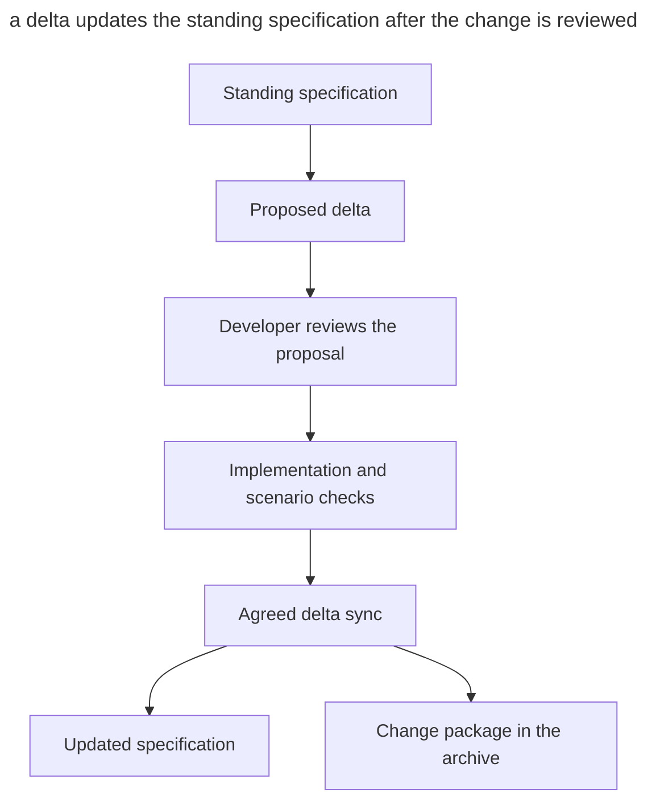

# OpenSpec

_Commands and capabilities checked on September 21, 2026._

[OpenSpec](https://github.com/Fission-AI/OpenSpec) by Fission-AI organizes [SDD](spec-driven-development.md) around a **change** with propose, review, apply and archive stages. Standing specifications describe the system, and deltas record proposed changes to the requirements.

OpenSpec supports various coding agents and assistants, including Claude Code, Codex, Cursor and GitHub Copilot.

## Installation

The CLI is installed via npm and requires Node.js ≥ 20.19.

```sh
npm install -g @fission-ai/openspec@latest
openspec init
```

`openspec init` creates the _openspec/_ directory and registers slash commands with the `/opsx:` prefix; `openspec update` refreshes the agent instructions after an upgrade.

## Workflow

The set of commands depends on the profile. Choose one with `openspec config profile`, then run `openspec update` in the project to apply the choice to the agent instructions. The core workflow goes through the following steps.

1. `/opsx:explore` helps you explore the code and compare options before preparing artifacts.
2. `/opsx:propose <idea>` creates a proposal package that you review before implementation.
3. `/opsx:apply` carries out the tasks from the checklist.
4. `/opsx:archive` offers to sync the deltas into the standing specifications if that has not been done yet, and moves the change to the archive.

The expanded profile adds `/opsx:new`, `/opsx:continue`, `/opsx:ff`, `/opsx:verify`, `/opsx:bulk-archive` and `/opsx:onboard`. They support step-by-step preparation, verification and archiving of large changes.

When you finish a change, run `/opsx:archive` and confirm the proposed delta sync. If the specifications were already updated with `/opsx:sync`, there is no need to sync again. Archiving preserves the change's artifacts; the team decides in its own process whether this happens before or after the merge.

The diagram shows how a change package connects the implementation with the standing description of the system.



Here the specification is kept separate from the proposal. The sync carries the accepted requirements over from the delta, and the archive keeps the explanation and history of the change.

The syntax depends on the agent. Codex may show `$openspec-propose`, while Cursor and GitHub Copilot use the `/opsx-propose` form. `openspec init` prints the exact syntax for the selected tool.

## Artifacts

The _openspec/_ directory separates standing specifications from change packages.

| Path | What lives there |
| ------ | ----------- |
| _openspec/specs/_ | Standing specifications — the current model of what is _already built_ |
| _openspec/changes/\<change\>/proposal.md_ | Why we are changing this |
| _openspec/changes/\<change\>/specs/_ | Requirement deltas with concrete scenarios |
| _openspec/changes/\<change\>/design.md_ | Technical approach |
| _openspec/changes/\<change\>/tasks.md_ | Implementation checklist |
| _openspec/changes/archive/_ | Completed changes |

## Example of a requirement change

In an event delivery service, a webhook is disabled after five consecutive failures. The standing specification in _openspec/specs/webhooks/spec.md_ contains this rule.

```markdown
### Requirement: Delivery failure cutoff
The system SHALL disable a webhook after five consecutive failed attempts.

#### Scenario: Failed deliveries reach cutoff
- **WHEN** the fifth consecutive delivery attempt fails
- **THEN** the webhook is disabled
```

The team agreed on a different threshold for temporarily unavailable recipients. In the change package, the agent creates a delta in _openspec/changes/raise-cutoff/specs/webhooks/spec.md_. For the modified requirement it keeps the heading and gives the new requirement with its scenario in full.

```markdown
## MODIFIED Requirements

### Requirement: Delivery failure cutoff
The system SHALL disable a webhook after ten consecutive failed attempts.

#### Scenario: Failed deliveries reach cutoff
- **WHEN** the tenth consecutive delivery attempt fails
- **THEN** the webhook is disabled
```

In this example `MODIFIED Requirements` marks the replacement of an existing requirement. After implementation and verification, the team confirms the sync during `/opsx:archive`. In the standing _spec.md_, the `Delivery failure cutoff` requirement now holds the threshold of ten and the matching scenario; the `MODIFIED Requirements` marker remains part of the archived delta. If the proposal is rejected, the standing rule with the threshold of five does not change. The format of sections and scenarios is described in the [OpenSpec documentation](https://github.com/Fission-AI/OpenSpec/blob/main/docs/concepts.md).

## What makes it different

- Standing specifications describe the system's current required behavior.
- A delta records the difference between the current and the proposed requirements.
- The process is designed for successive changes to an existing codebase.
- Shared specifications help the team agree on requirements and the history of their changes.

## When to choose it

OpenSpec fits an existing system whose requirements need to be maintained alongside the code. For a skill-based process with mandatory checkpoints, consider [Superpowers](superpowers.md), and for working through an issue tracker, compare [Matt Pocock's pack](matt-pocock-skills.md).
