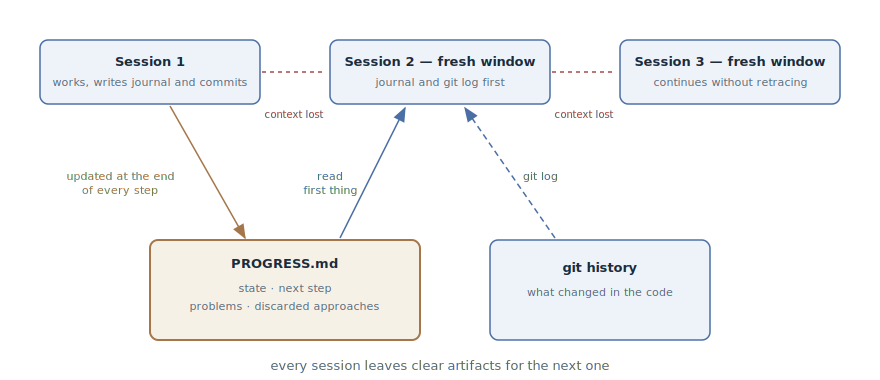

# Progress Journal

## Intent

Keep a journal file of long-running work next to the code — where we are,
what's next, what has already been discarded — which the agent updates as it
works and reads first thing in a new session. A fresh context window recovers
the picture from one file, not by archaeology through code and conversations.

## Also known as

Progress file, progress log; `claude-progress.txt` from the Anthropic
harnesses article, `PROGRESS.md`.

## Problem

The work didn't fit into one context window: a multi-day feature, a
migration, a long debugging hunt. Every new session — and every compaction —
starts with amnesia:

- Git history answers "what changed" but is silent on what matters most: what
  is *unfinished*, why this path was chosen, and what has already been tried
  and discarded.
- An agent with a fresh window retraces dead ends: the solution rejected
  yesterday after an hour of experiments looks attractive again today.
- Recovering state from the code is expensive: the agent burns half of the
  fresh window reading diffs and files before making its first useful move —
  and sometimes confidently picks up the wrong thing.

Relying on auto-summarization at compaction is a lottery: what exactly
survives from the context is not decided by you.

## Solution

A state journal in the repository, next to the code. The agent updates it at
the end of every significant step — as much a part of finishing the step as
the commit. A new session starts with a ritual: read the journal and the
recent git log — and only then work.

The journal holds what git history doesn't:

- **current state** — what works, what is in progress;
- **next step** — where to start if the session gets cut off right now;
- **known problems** — the rakes the next session must know about in advance;
- **discarded approaches** — what was tried and why it didn't work.

The journal and git history complement each other and don't duplicate: git
answers "what changed in the code", the journal — "where we are and where
we're going". Retelling diffs in the journal is unnecessary.

The ritual rests not on the agent's memory but on
[Project Memory](claude-md-memory.md): the rule "at session start read
`PROGRESS.md`, at the end of a significant step — update it" lives there and
applies in every session automatically.

## Structure



Sessions come one after another, and between them is a break: the window ran
out or got compacted, the context is lost. Continuity is provided by the two
artifacts below: the progress journal, which every session updates as it
works, and the git history with its commits. A new session begins by reading
both — the journal gives the state and the direction, the git log the actual
changes — and continues the work from where the previous one broke off,
without retracing its path.

## Participants / Components

- **Progress journal** (`PROGRESS.md`) — state, next step, problems,
  discarded approaches; lives in the repository.
- **Git history** — the journal's complement: the actual code changes and the
  ability to roll back to a working state.
- **Agent** — updates the journal as it works and reads it first thing in a
  new session.
- **Developer** — sets the ritual and reviews the journal: it shows progress
  without digging through diffs.
- **Project memory** — anchors the ritual so it doesn't depend on the
  conversation.

## When to use

- The work is known to be bigger than one session: a multi-day feature, a
  migration, a large refactoring.
- Sessions are long and regularly hit compaction — the journal insures
  against losses at every squeeze of the window.
- Several sessions, several agents, or an agent alternating with a human work
  on the task — the journal aligns the picture for everyone.

For a task that fits in one session the journal is overkill: the in-session
plan is enough.

## Consequences and trade-offs

- ➕ State recovery costs one file: a new session makes a useful move within
  a minute, not after half a window of archaeology.
- ➕ Dead ends are not retraced: a discarded approach is recorded along with
  the reason.
- ➕ Progress is visible to humans: glancing at the journal is faster than
  interrogating the agent or reading diffs.
- ➖ Demands update discipline: one skipped entry — and the journal lies to
  the next session.
- ➖ Grows without care: a journal that is only written to becomes a second
  source of noise (see [context engineering](context-engineering.md)).
- ➖ The temptation to duplicate git: retelling diffs bloats the journal and
  adds no signal.

## Implementation

1. Create the file at the start of long-running work and anchor the ritual in
   [Project Memory](claude-md-memory.md): "at session start read
   `PROGRESS.md` and the recent `git log`; at the end of a significant step
   update `PROGRESS.md`".
2. Keep four sections: state, next step, known problems, discarded
   approaches. "Next step" is the most valuable: write it so the session
   could be cut off at any moment.
3. Write "where we are and why", not "what changed" — the latter is already
   recorded in git.
4. Make the update part of the definition of "step finished": code, tests,
   commit, journal.
5. Keep the journal short: fresh on top, worked-through sections collapsed or
   deleted. The journal is read every session and obeys the same attention
   economics as the rest of the context.
6. Statuses the agent updates mechanically — say, a feature list with
   "passing/failing" marks — move out of the prose into a separate structured
   file: agents corrupt JSON less often than Markdown. That technique is
   covered in the feature-list chapter of the project organization section.

In spec-driven development pipelines the role of the journal for a single
feature is played by `tasks.md`: task lists with completion marks exist in
[Spec Kit](spec-kit.md), [OpenSpec](openspec.md), and [Kiro](kiro.md), and in
[Superpowers](superpowers.md) the plan of small tasks is explicitly designed
as a document from which work can be resumed at any point. The progress
journal is the same technique without the pipeline: one file for any
long-running work.

## Example

A multi-day migration of payments to a new gateway is underway. At the
repository root — `PROGRESS.md`:

```markdown
# Migrating payments to the PayFlow gateway

## State
Webhooks migrated and covered by tests. The gateway error map is done.
Refunds — in progress.

## Next step
Migrate `RefundService`: it is the last one calling the old client.
Start with idempotency keys — see "Discarded".

## Known problems
- The gateway sandbox rejects amounts below 1.00 — tests use 1.05.

## Discarded
- An adapter over the old interface: PayFlow idempotency keys don't fit,
  rewriting the call sites is cheaper (details in ADR-0007).
```

The session breaks off midway — the window ran out. The developer opens a new
one:

> Continuing the PayFlow migration — start with PROGRESS.md.

The agent reads the journal and the git log, picks up `RefundService` — and
does not re-propose the "elegant adapter" that the previous session spent an
hour disproving: the reason for the rejection is written down. Finishing the
refunds, it updates the state and the next step — now this session, too, can
break off safely.

## Anti-patterns and common mistakes

- **A journal-turned-diary.** Retelling every action instead of the state:
  the file grows with each session, and the next one spends its window
  reading history instead of working.
- **A duplicate of git log.** "Changed X, added Y" — that's already recorded
  in the commits. The journal answers the questions git cannot.
- **Updating "later".** A journal lagging behind reality is worse than an
  empty one: the new session confidently works from a lie.
- **Statuses in prose.** Machine-updated marks in free text will sooner or
  later get rephrased or clobbered by the agent — their place is in a
  structured file nearby.
- **The journal instead of a handoff.** Running notes don't replace the
  deliberate packing at the session boundary: [Session Handoff](handoff.md)
  has a different moment and a different density.

## Known uses

- **Anthropic's harness for long-running agents** — the primary source:
  `claude-progress.txt` beside the git history, the session-start ritual
  (git log → journal → feature list → smoke test), and the rule that every
  session leaves clear artifacts for the next one.
- **Claude Code's auto memory** — a journal at the tool level: the agent
  keeps its own notes about the project in
  `~/.claude/projects/<project>/memory/` and loads them into every session;
  the progress journal is the same idea, but about one specific piece of work
  and inside the repository itself.
- **SDD toolkits** — `tasks.md` with completion marks in
  [Spec Kit](spec-kit.md), [OpenSpec](openspec.md), [Kiro](kiro.md), and the
  plans of [Superpowers](superpowers.md): a progress journal built into the
  feature pipeline.
- **Structured note-taking** from the Anthropic context engineering article —
  an agent keeping a `NOTES.md` outside the window is the same mechanism in
  its general form.

## Related patterns

- [Session Handoff](handoff.md) — the neighbor in the state layer: the
  journal is kept as the work goes, the handoff is written once at the
  session boundary.
- [Context Engineering](context-engineering.md) — the journal is the state
  layer moved out of the window, and it obeys the same "short and
  high-signal" rule.
- [Project Memory](claude-md-memory.md) — where the ritual of reading and
  updating the journal is anchored.
- [Spec-Driven Development](spec-driven-development.md) — the pipeline's
  `tasks.md` plays the journal's role at the scale of a single feature.
