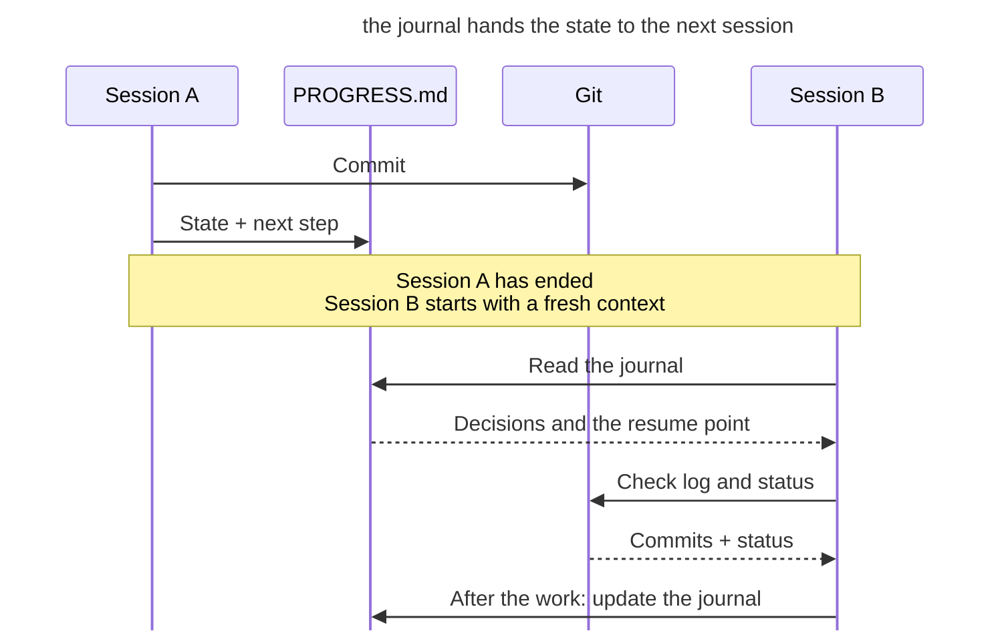

# Progress Journal

## Intent

Keep a journal of the state of long-running work next to the code. The agent updates it as it goes and reads it at the start of a new session to learn what remains to be done and which approaches have already been tried.

## Also known as

Progress file, progress log; _claude-progress.txt_ from Anthropic's article on harnesses, _PROGRESS.md_.

## Problem

During a multi-day migration, new sessions get the code and the commits but may not know the reasons behind an unfinished decision.

For example, yesterday the agent tried an adapter over the old API and rejected it because of an incompatible refund model. Only the accepted implementation remained in git. Without a record of the reason, a new agent may propose the adapter again and repeat the same experiment. Reconstructing such decisions from files and conversations delays useful work.

Automatic context compaction may not preserve all the reasons for decisions. The journal lets you choose them explicitly.

## Solution

Create a journal in the repository and update it after each significant step. A new session reads the journal and the latest commits before continuing the work.

In the journal, keep the information that the git history does not provide.

- **Current state** shows what works and what is not yet finished.
- **Next step** sets the first action after resuming.
- **Known problems** warn about limitations and failures that have been found.
- **Discarded approaches** keep the results of experiments and the reasons for rejecting them.

Git shows the code changes, and the journal explains the state and direction of the work. For commit details, a reference is enough.

Write the procedure for reading and updating the journal into [project memory](claude-md-memory.md), so that new sessions get this instruction.

## Structure

Each session reads the saved state before working and updates it before handing over to the next session.


```mermaid
---
title: the journal hands the state to the next session
config:
  sequence:
    mirrorActors: false
    width: 130
    height: 45
    actorMargin: 35
    messageMargin: 28
---
sequenceDiagram
  participant A as Session A
  participant P as PROGRESS.md
  participant G as Git
  participant B as Session B
  A->>G: Commit
  A->>P: State + next step
  Note over A,B: Session A has ended<br/>Session B starts with a fresh context
  B->>P: Read the journal
  P-->>B: Decisions and the resume point
  B->>G: Check log and status
  G-->>B: Commits + status
  B->>P: After the work: update the journal
```

The journal explains why the work stopped at this point and what to do next. Git shows the actual changes; if it diverges from the journal, the new session first finds out the current state.

## Participants / Components

- **Progress journal** (_PROGRESS.md_) keeps the state, the next step, and the reasons for decisions.
- **Git history** preserves the code changes.
- **Agent** reads the journal at startup and updates it after significant steps.
- **Developer** sets the order of work and checks the entries.
- **Project memory** keeps the instruction for maintaining the journal.

## When to use

- The task takes several sessions.
- Long sessions require context compaction.
- Different people or agents take turns working on the same task.

For a short task, a plan within the session is usually enough.

## Consequences and trade-offs

- ➕ A new session finds the next step faster.
- ➕ The agent sees the reasons for rejecting approaches that have already been tried.
- ➕ You can assess the state without reading all the diffs.
- ➖ A missed update misleads the next session.
- ➖ Without trimming, the journal itself becomes excess context (see [context engineering](context-engineering.md)).
- ➖ Retelling commits makes the file bigger without explaining the state of the work.

## Implementation

1. Create the journal and write the procedure for using it into [project memory](claude-md-memory.md).
2. Set out the state, the next step, the problems, and the discarded approaches. Phrase the next step so that it can be carried out after the session breaks off.
3. Explain the reasons for decisions and the unfinished work. Refer to code changes through commits.
4. Make updating the journal part of finishing a significant step, together with verification and a commit.
5. Keep the current state at the top, and shorten entries that are done with.
6. Keep feature statuses in a separate structured file where the agent changes specific fields (see [Feature List](feature-list-harness.md)).

In [OpenSpec](openspec.md), the marks in _tasks.md_ and the plans of [Superpowers](superpowers.md) help continue the work on a feature. The journal supplements the marks with the reasons for decisions and open problems; it can also be used without an SDD toolkit.

## Example

A team is migrating payments to a new gateway and keeps the state in _PROGRESS.md_.

```markdown
# Migrating payments to the PayFlow gateway

## State
Webhooks migrated and covered by tests. The gateway error map is done.
Refunds — in progress.

## Next step
Migrate `RefundService`: it is the last one calling the old client.
Start with idempotency keys — see "Discarded".

## Known problems
- The gateway sandbox rejects amounts below 1.00 — tests use 1.05.

## Discarded
- An adapter over the old interface: PayFlow idempotency keys don't fit,
  rewriting the calls is cheaper (details in ADR-0007).
```

When the window runs out, you open a new session.

> Continuing the PayFlow migration. Start with PROGRESS.md.

The agent reads the journal and the git log, then continues with `RefundService`. It sees the reason the adapter was rejected and does not repeat the experiment. After finishing the refunds, the agent records the result and the next step.

## Anti-patterns and common mistakes

- **A journal-turned-diary.** A full history of actions makes it harder to find the current state.
- **A duplicate of git log.** The list of changed files is already available in the commits. The journal needs the reasons for decisions and the open tasks.
- **Updating "later".** A stale entry steers the next session toward the wrong action.
- **Statuses in prose.** Marks can get lost when the text is rewritten. Use structured fields.
- **The journal instead of a handoff.** For a new goal, prepare a separate [handoff](handoff.md) that selects the information for the next stage.

## Known uses

- **Anthropic's harness for long-running agents** uses _claude-progress.txt_ together with the git history and a feature list at session start.
- **Claude Code's auto memory** keeps notes about the project at the tool level. The journal in the repository describes a specific piece of long-running work.
- **SDD toolkits** keep tasks and marks in [OpenSpec](openspec.md) and in the plans of [Superpowers](superpowers.md).
- **Structured notes** from Anthropic's article on context engineering keep state outside the window.

## Related patterns

- [Session Handoff](handoff.md) prepares a document for a specific transition between people or agents.
- [Context Engineering](context-engineering.md) helps select the journal's contents.
- [Project Memory](claude-md-memory.md) sets the procedure for reading and updating the journal.
- [Spec-Driven Development](spec-driven-development.md) ties the state of the work to the specification and the tasks.
