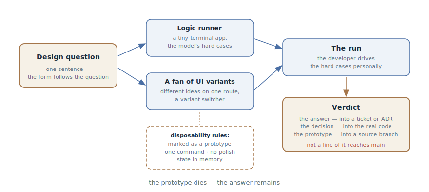

# Throwaway Prototype

## Intent

Build a disposable prototype that answers a specific design question — "does
this state model even fly?", "what should this look like?" — before writing
the real implementation. What gets verified is the design, not the code: the
prototype dies, the answer remains.

## Also known as

Throwaway prototype, spike (in extreme programming terms), prototype-as-an-
answer; `/prototype` in Matt Pocock's skills.

## Problem

Some design questions cannot be settled by reasoning:

- The state model is flawless on paper and in the plan — and on the third
  real scenario it turns out the transitions are awkward and half the cases
  don't fit. A text review doesn't catch this: the reviewer has the same
  limitations as the author — they too reason instead of running it.
- An interface can't be chosen from a description. "A list or a kanban?" is
  an hour-long argument; two working variants settle it in a minute.
- An argument in the plan has hit a dead end: both sides are plausible, the
  arguments have run out, and the decision is important and hard to
  reverse.

Building for real just to check is expensive: if the model is wrong, the
implementation gets redone. And a "quick" prototype without discipline
quietly becomes production: code written without tests and error handling
starts living forever, because it "already works".

## Solution

State the question in one sentence — and build the cheapest artifact that
answers it. The question decides the shape:

- **"Does this logic / state model feel right?"** — a tiny interactive
  terminal app that pushes the model through the cases that are hard to
  reason about on paper. After every action, the full state is printed: you
  can see what changed.
- **"What should this look like?"** — several radically different interface
  variants on a single route with a switcher. Not three shades of one idea —
  different ideas.

The rules that make a prototype safe:

1. **Throwaway from day one** — and clearly marked: named so a casual
   reader can see it is not production.
2. **One command to run** — the developer starts it without thinking.
3. **No persistence** — state lives in memory: storage is what the
   prototype *checks*, not what it depends on.
4. **No polish** — no tests, no error handling beyond the minimum, no
   abstractions. The point is to learn fast.

The agent is what made this pattern practical: a prototype that used to cost
a day of work now costs tens of minutes — and throwing it away genuinely
doesn't hurt.

The finale is mandatory: the verdict — the answer and the question it
settled — is recorded in the ticket or an ADR; the validated decision goes
into the real implementation; the prototype itself is committed to a
throwaway branch as a primary source, with a pointer left behind. Only the
decision reaches main — not the prototype's code.

## Structure

On the left is the question — it exists before the prototype and determines
its shape: a question about logic produces a terminal runner, a question
about looks produces a fan of interface variants. Both artifacts are built
under the same disposability rules and land in the developer's hands: they
drive the hard cases personally. On the right is the only surviving
artifact: the verdict. The decision goes into the implementation, the
prototype into a source branch, and not a line of prototype code reaches
main.

## Participants / Components

- **The design question** — one sentence; it exists before the prototype and
  decides its shape. No question — no prototype.
- **The prototype** — the disposable artifact: a terminal runner for logic
  or a fan of variants for UI.
- **The developer** — drives the hard cases with their own hands and
  delivers the verdict; the prototype is built for their hands.
- **The agent** — builds fast and without polish; the disposability
  discipline is held by the prompt.
- **The verdict** — the recorded answer: what was checked, what was learned,
  what was decided.

## When to use

- A state model or logic with hard cases that are awkward to reason about on
  paper: subscriptions, order statuses, sync conflicts.
- An interface choice: several working variants instead of an argument over
  descriptions.
- An argument in the plan has stalled and the decision is hard to reverse:
  an hour of prototype is cheaper than a day of redo.

Not needed when the question is answered by reading the code or the docs —
or when the answer is obvious by any means cheaper than a prototype.

## Consequences and trade-offs

- ➕ The design is verified before the implementation: the "model didn't
  fit" redo doesn't happen, because the model was run in advance.
- ➕ The argument becomes an experiment: instead of "it seems to me", both
  sides look at working variants.
- ➕ The answer is cheap: without tests, polish, and persistence, a
  prototype costs a fraction of the real implementation.
- ➖ The main risk — "just finish up this prototype": untested, unhandled
  code in production. The finale's discipline is part of the pattern.
- ➖ The prototype answers only the question asked: "it worked in the
  prototype" doesn't generalize to load, security, and the edge cases it
  never touched.
- ➖ Wasted time if the answer was obvious: the cheap means come first —
  code, documentation, a short argument.

## Implementation

1. State the question in one sentence and put it in the prompt verbatim:
   "the prototype must answer question X."
2. Choose the shape: logic — a terminal runner with commands and state
   printing; UI — several radically different variants with a switcher.
3. Dictate the disposability rules: near its future place in the code, a
   name marked as a prototype, one command to run, state in memory, no
   tests or polish.
4. Drive it yourself: ask the agent to prepare the hard cases, but the
   hands on the keyboard are yours. "Does it feel right" is answered by
   feel.
5. Record the verdict in the ticket or an ADR: the question, the answer,
   the decision.
6. Close it cleanly: the decision — into the real implementation (written
   anew, not copy-pasted from the prototype), the prototype — into a
   throwaway branch linked from the ticket, and nothing into main.
7. Start a prototype in a fresh session from a [handoff](handoff.md): an
   extract of the question and the context instead of the discussion's
   tail.

## Example

A continuation of the story from the [Session Handoff](handoff.md) chapter:
the tariff migration plan hit the question of whether the event-based
cancellation model survives corporate contracts with deferred start. The
prototype session starts from the handoff document:

> Read /tmp/handoff-cancellation-prototype.md. Build a throwaway terminal
> prototype of the cancellation model: commands subscribe, cancel <date>,
> reactivate, tick; after every command print the subscription's full state
> and the event queue. No tests, no storage — state in memory. Name it so
> it's obviously a prototype.

The agent assembles a runner started with a single command. The developer
drives the scenarios: immediate cancellation — fine; cancellation with a
date — fine; but on "deferred cancellation, then reactivation before it
takes effect" the model breaks: the cancellation event stays in the queue
and fires after the reactivation. Nobody had seen that case on paper.

The verdict goes into an ADR: the event model is confirmed with one
amendment — reactivation displaces unexecuted cancellation events. The
prototype goes to the `prototype/cancellation-model` branch, the link into
the implementation ticket. The implementation is written from scratch
against the approved model; not a line of the prototype reaches main.

## Anti-patterns and common mistakes

- **"Just finish up this prototype."** The cardinal sin: code written as
  disposable rides into production. The implementation is written anew from
  the verdict — the prototype was a question, not a first version.
- **A prototype without a question.** "Let's try it and see" produces code
  but no answer: nothing to record in a verdict, no reason to have built
  it.
- **Polishing the disposable.** Tests, error handling, and abstractions in
  a prototype are waste: it will die before they pay off.
- **Generalizing the verdict.** "It worked in the prototype" applies
  exactly to the question checked — not to load, not to security, not to
  the edge cases the run never touched.
- **The prototype thrown away together with the answer.** The code was
  deleted, the verdict never written — a month later the question returns,
  and again there is nothing to answer it with.

## Known uses

- **Matt Pocock's skills** — `/prototype`: two branches (logic — a terminal
  runner, UI — a fan of variants on one route), the disposability rules, and
  the mandatory finale "the decision into the code, the prototype into a
  source branch".
- **Spike solutions in extreme programming** — the classic ancestor: a
  short throwaway experiment to retire technical risk before estimating and
  implementing.
- **John Ousterhout's "design it twice"** — the kindred principle: force
  yourself to consider radically different designs; the fan of UI variants
  is its mechanization.
- **Tracer bullets from The Pragmatic Programmer** — a useful contrast:
  tracer code stays and grows, a prototype gets thrown away. Mixing the two
  modes is what produces "a prototype in production".

## Related patterns

- [Feedback Loop](give-agent-a-way-to-verify.md) — the prototype is
  verification for decisions that have no machine oracle: here the
  pass/fail signal comes from the developer's hands and eyes.
- [Session Handoff](handoff.md) — the standard entrance into a prototype:
  an extract of the question and the context for a clean session instead of
  the discussion's tail.
- [Four Phases](explore-plan-code-commit.md) — the prototype's question is
  usually born in the plan phase: an argument that text can't settle gets
  taken to an experiment.
- [Spec-Driven Development](spec-driven-development.md) — the prototype's
  verdict returns into the specification as a requirement or a constraint —
  before the implementation begins.
