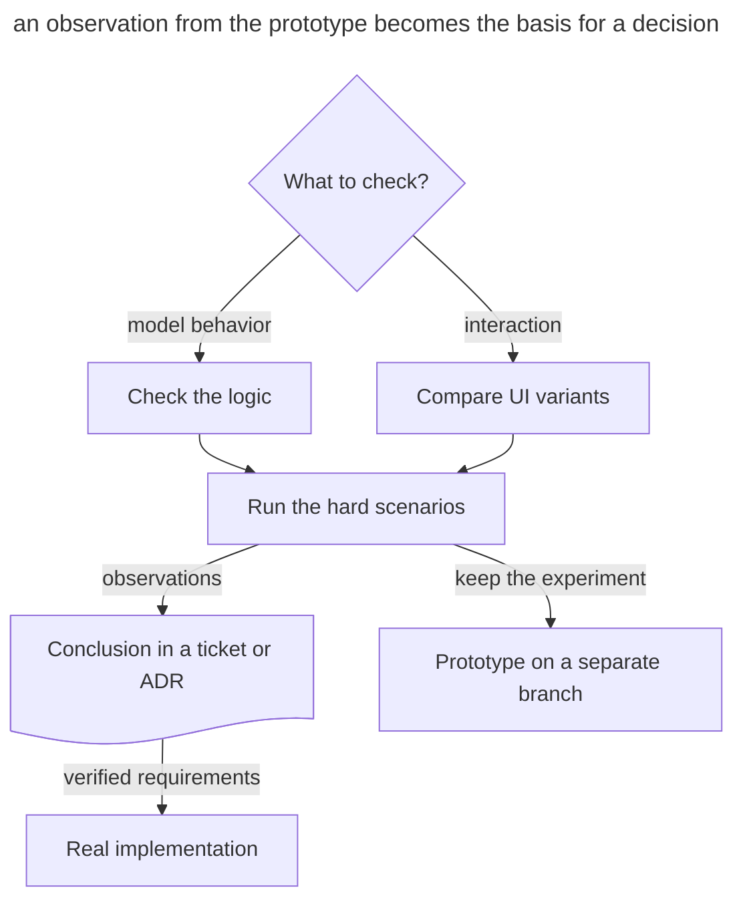

# Throwaway Prototype

## Intent

Test a specific design question with a small, disposable prototype. After the experiment, the team keeps the conclusion and uses it when preparing the real implementation.

## Also known as

Throwaway prototype, spike (in extreme programming terms), prototype-as-an-answer; `/prototype` in Matt Pocock's skills.

## Problem

Some decisions are hard to verify by discussion alone. A state model can look complete until it is applied to a sequence of real actions.

For example, subscription cancellation and reactivation each work on their own, but when a subscription is reactivated before a deferred cancellation, the old event stays in the queue. To notice the bug, it helps to run the transitions and see the state after each one. For an interface, a prototype lets you try different ways of doing the same task and compare them in practice.

A full implementation just for such a check is expensive. A quick prototype cuts the cost, provided the team separates the experiment in advance from the code it will maintain.

## Solution

State the question and pick the smallest experiment that can answer it.

- For a **state model**, build a small tool with actions and visible state. A terminal works for a developer; for a discussion with a domain expert, a standalone HTML file with buttons and scenarios is more convenient.
- For an **interface**, prepare several variants with a switcher and compare them on the same user scenario.

Limit the amount of experimental code.

1. Mark the prototype explicitly in its name and description.
2. Make it runnable with one command.
3. Keep state in memory unless the question requires checking persistent storage.
4. Add only the code the experiment needs.

An agent can build such a tool quickly, so checking a decision becomes cheaper. This is especially useful when a wrong choice would mean reworking several modules.

Record the question, observations, and conclusion in a ticket or an ADR. Keep the prototype on a separate branch, linked from the decision. Build the real implementation from the verified requirements, with the usual tests and error handling.

## Structure

The question determines the shape of the experiment. After the run, the conclusion and the experimental code are kept separately.

```mermaid
---
title: an observation from the prototype becomes the basis for a decision
config:
  flowchart:
    rankSpacing: 30
---
flowchart TB
  question{"What to check?"}:::accent
  logic["Check the logic"]
  ui["Compare UI variants"]
  run["Run the hard scenarios"]
  decision@{ shape: doc, label: "Conclusion in a ticket or ADR" }
  branch["Prototype on a separate branch"]:::muted
  code["Real implementation"]:::accent
  question -- "model behavior" --> logic
  question -- "interaction" --> ui
  logic --> run
  ui --> run
  run -- "observations" --> decision
  run -- "keep the experiment" --> branch
  decision -- "verified requirements" --> code
```

You run the scenarios and record the conclusion with a link to the prototype branch. The real implementation is built from the verified requirements. The experimental code stays on a separate branch as evidence of the check.

## Participants / Components

- **The design question** sets the goal of the experiment.
- **The prototype** produces the observations you need.
- **The developer** runs the scenarios and makes a decision based on the results.
- **The agent** builds the minimal experiment tool.
- **The conclusion** records the question checked, the observations, and the decision.

## When to use

- The model has sequences of states that are hard to verify by reasoning.
- You need to compare interface variants in practice.
- A hard-to-reverse decision lacks observations.

First check whether the answer can be found by reading code or documentation. A prototype is needed when cheaper information is not enough.

## Consequences and trade-offs

- ➕ A model error can surface before the full implementation.
- ➕ Participants discuss the results of one shared experiment.
- ➕ The limited scope lowers the cost of checking an idea.
- ➖ Experimental code is easy to mistake for a ready foundation for the product.
- ➖ The result applies only to the question checked and the conditions of the experiment.
- ➖ A prototype wastes time if the answer is already available in the documentation.

## Implementation

1. Write the question down in one sentence.
2. Choose a terminal scenario, a UI mock-up, or another form that will produce the observations you need.
3. Set the name, the run command, and the minimal constraints of the experiment.
4. Run the hard scenarios and save the observations.
5. Record the conclusion and the decision taken in a ticket or an ADR.
6. Keep the prototype on a separate branch, and build the real implementation from the verified decision.
7. For a separate prototype session, prepare a [handoff](handoff.md) with the question and the context.

## Example

In the story from the [Session Handoff](handoff.md) chapter, you need to check the cancellation model for corporate contracts with a deferred start. You hand a new session the document and the experiment task.

> Read /tmp/handoff-cancellation-prototype.md and build a throwaway prototype of the cancellation model

The first scenario checks the original question. You set the contract start to October 1, the cancellation to September 25, and move the clock to October 2. In this illustrative experiment, the start handler grants access even though the cancellation has already taken effect. This observation shows that a single queue of dated events is not enough. Processing the start has to take the active cancellation into account.

The second scenario checks reactivation before a deferred cancellation. If the old cancellation event stays in the queue, it will later close the restored subscription. The team records a separate rule: reactivation voids that event.

The ADR keeps both observations and decisions, along with the boundaries of the experiment. The prototype stays in _prototype/cancellation-model_, and the implementation ticket gets a link to it. In the real code, both scenarios will be covered by tests. The observations described here illustrate possible prototype results; for your own project, the team gets them by actually running it.

## Anti-patterns and common mistakes

- **"Just finish up this prototype."** Experimental code may lack the safeguards a production system needs. Implement the chosen decision with the usual quality checks.
- **A prototype without a question.** Without a criterion, you cannot tell which observations will end the experiment.
- **Polishing the disposable.** Extra abstractions raise the cost of getting an answer.
- **Generalizing the conclusion.** A successful scenario does not confirm load behavior or other conditions the experiment did not touch.
- **A lost conclusion.** If the code is deleted without recording the result, the question will have to be investigated again.

## Known uses

- **Matt Pocock's skills** implement the experiment through [/prototype](https://github.com/mattpocock/skills/blob/main/skills/engineering/prototype/SKILL.md). For logic, the skill creates a standalone HTML file with free-play actions and step-by-step scenarios; for UI, switchable variants. The verified prototype is kept on a separate branch linked from the task.
- **Spike solutions in extreme programming** retire technical risk with a short experiment.
- **[Design It Twice](design-it-twice.md)** develops John Ousterhout's principle: compare substantially different design options before implementation.
- **Tracer bullets from The Pragmatic Programmer** produce code that keeps evolving. A throwaway prototype keeps only the verified decision for a new implementation.

## Related patterns

- [Design It Twice](design-it-twice.md) compares alternative designs; a prototype checks questions that require observations.
- [Feedback Loop](give-agent-a-way-to-verify.md) ties a decision to an observable check result.
- [Session Handoff](handoff.md) preserves the question for a separate experiment.
- [Four Phases](explore-plan-code-commit.md) lets you move a plan's uncertainty into a prototype.
- [Spec-Driven Development](spec-driven-development.md) keeps the prototype's conclusion as a requirement or constraint.
- [Vibe Coding](vibe-coding.md) describes accepting code without checking it against requirements. That is how a prototype ends when it is finished up into a production system.
