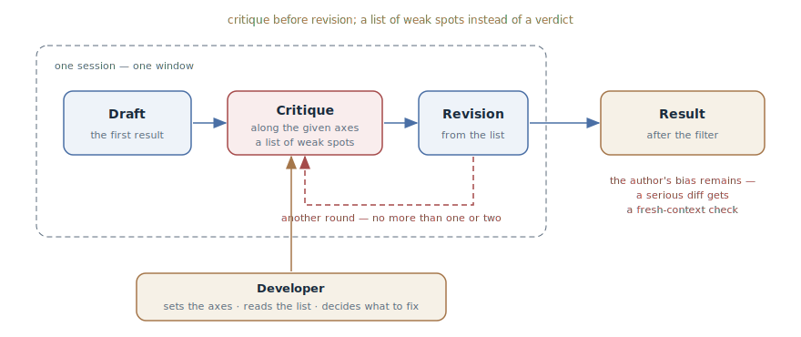

# Reflection

## Intent

As a separate move, ask the agent to critique its own result along given
axes and improve it based on the critique: generate → evaluate → improve.
The cheapest verification move there is — no external oracle, no fresh
session, inside the same window.

## Also known as

Reflection (one of Andrew Ng's four canonical patterns), self-critique; in
Anthropic's terms — the evaluator-optimizer turned into manual mode.

## Problem

The agent's first answer is a draft, even when it looks finished. The code
works on the happy path, but the edge cases aren't handled, errors are
swallowed, and a requirement from the middle of the conversation is lost.
Meanwhile:

- There is no machine oracle: readability, completeness of error handling,
  adherence to requirements, and design quality aren't checked by a test —
  the [Feedback Loop](give-agent-a-way-to-verify.md) doesn't reach here.
- Spinning up a fresh session for every draft is expensive: a full
  [Writer and Reviewer](writer-reviewer.md) is justified for a serious diff,
  not for every function.
- An unstructured "make it better" yields cosmetics: the agent renames
  variables and adds comments without touching the real weak spots.

A curious fact about models: they find their own mistakes when asked — but
don't look for them by default, because they've finished the work and
consider it good.

## Solution

Once the result is in, make two explicit moves.

**Move one — critique without revision.** Ask the agent to examine its own
work and list the weak spots along axes you set: correctness, edge cases,
error handling, adherence to requirements, simplicity. The key words are
"list the problems", not "is everything fine": to a verdict-question the
agent answers "everything is fine"; asked to name the three weakest spots,
it looks — and finds them.

**Move two — revision from the list.** Of what was found, fix what deserves
fixing: the list of problems reaches you first, and what to fix versus what
to accept as a conscious trade-off is the developer's decision.

Separating the moves is not a formality: critique blended with revision in
one prompt degenerates into "fixed it and praised myself along the way".
Evaluation before improvement.

The pattern has a built-in ceiling: the critic sits in the same window as
the author and shares its blind spots. Reflection catches what the author is
*capable* of seeing — a missed case, a forgotten requirement — but not a
flaw in the very reasoning that produced the solution. One or two rounds
give most of the gain; beyond that it's polishing in circles, and if the
result still doesn't inspire trust, a fresh context is needed.

## Structure

The whole cycle lives inside one session: the draft, the critique along the
given axes, the revision from the list — and, if needed, one more round. The
developer stands outside, sets the axes, and decides what from the list gets
fixed. The exit on the right is the result with a caveat: the author's bias
is not removed, so for serious changes the final check is done by a fresh
context.

## Participants / Components

- **Agent-author and agent-critic** — the same model in the same window:
  that is both the pattern's cheapness and its ceiling.
- **Critique axes** — the developer's list: edges, errors, requirements,
  simplicity. Without axes the critique slides into cosmetics.
- **The list of weak spots** — the artifact of the first move; it passes
  through the developer, not straight into revision.
- **Developer** — sets the axes, reads the list, decides what to fix and how
  many rounds to run.

## When to use

- Where there is no machine oracle: design quality, completeness of error
  handling, readability, adherence to requirements from the conversation.
- As a standing move before committing and before review: a cheap cleanup
  that raises the bar of what reaches humans at all.
- For non-code artifacts: a specification, a plan, documentation — "find
  the holes in this plan" works the same as for code.
- When a fresh session is overkill: the change is small, and a full
  writer-reviewer cycle costs more than the change itself.

## Consequences and trade-offs

- ➕ Nearly free: one or two turns in the same session, no infrastructure.
- ➕ Noticeably lifts the first draft: the typical omissions — edges,
  errors, forgotten requirements — get caught by the agent itself.
- ➕ Works on everything the agent produces — not just code.
- ➖ The critic is biased: it is the author. A flaw in the original
  reasoning won't be found by reflection — it will reproduce it in the
  critique too.
- ➖ Diminishing returns: after the second round the agent polishes and
  rearranges instead of finding anything new.
- ➖ The ritual risk: a checkbox reflection with an "all good" verdict
  creates false confidence — worse than nothing.

## Implementation

1. Wait for the result and ask for the critique as a separate move — not in
   the same prompt as the task.
2. Set the axes explicitly: "check for edge cases, error handling, and
   adherence to the task's requirements." Axes without an address make a
   critique without an address.
3. Force the search: "list the three weakest spots" instead of "is
   everything okay". Verdicts are banned; a list is required.
4. Read the list yourself: what to fix and what to accept is your call —
   otherwise the agent will "fix" the conscious trade-offs too.
5. Ask for the revision on the chosen items and stop after one or two
   rounds.
6. Package recurring axes into a command — your own slash command or skill,
   so reflection is one invocation rather than a paragraph of text every
   time.
7. Calibrate the trust: reflection is a filter before verification, not a
   replacement for it. A serious diff still goes through
   [Writer and Reviewer](writer-reviewer.md) or a loop with an oracle.

## Example

The agent has finished a CSV report export function. Before committing, the
developer makes the critique move:

> Don't defend this code — find problems in it. List the three weakest
> spots along these axes: edge cases, error handling, memory on large data.
> Don't fix anything yet.

The agent returns the list: on a write error the file descriptor isn't
closed; the report is built entirely in memory — hundreds of megabytes on
large exports; an empty report is exported without column headers, which
breaks the external parser. The developer replies:

> Fix the first and the third. We're not doing streaming yet — exports are
> capped at ten thousand rows; leave a comment with that constraint.

Two real problems caught before the commit, at the cost of two replies. Note
what did *not* happen: the agent didn't "rewrite it better" wholesale and
didn't touch the conscious memory trade-off — because the list went through
the developer.

## Anti-patterns and common mistakes

- **The verdict question.** "Check that everything is fine" gets
  "everything is fine". Ask for a list of weak spots — with a count.
- **Critique and revision in one prompt.** The blended move degenerates
  into cosmetics with self-praise. First the list, then the decision, then
  the revision.
- **Reflection without axes.** "Improve the code" yields renames and
  comments. The axes say where to dig.
- **Endless polishing.** The third round and beyond is furniture
  rearrangement. If nothing new is found — change the instrument, don't
  repeat the move.
- **Reflection instead of verification.** Self-critique replaces neither
  tests nor a fresh pair of eyes: it is a filter that cuts noise before the
  real check, and it must not be used to manufacture confidence.

## Known uses

- **Andrew Ng, the four agentic patterns** — Reflection in its canonical
  phrasing: "The LLM examines its own work to come up with ways to improve
  it"; combined with the other patterns, an agentic loop lifted GPT-3.5 on
  HumanEval from 48.1% (zero-shot) to 95.1%.
- **Reflexion (Shinn et al., NeurIPS 2023)** — the agent-internal ancestor:
  verbal self-reflection accumulated in episodic memory across attempts.
- **Anthropic, evaluator-optimizer** — the same generator-evaluator cycle
  as an automated workflow in "Building effective agents"; reflection is its
  manual, developer-driven case.
- **Constitutional AI** — self-critique as a training mechanism: the model
  critiques its own answers against a list of principles and rewrites
  them — evidence that model self-critique works when it is requested.

## Related patterns

- [Feedback Loop](give-agent-a-way-to-verify.md) — when a machine oracle
  exists, it always beats self-critique; reflection covers what the oracle
  can't reach.
- [Writer and Reviewer](writer-reviewer.md) — the next rung: a critic with
  a fresh context who doesn't share the author's blind spots. Reflection is
  a filter before it, not a replacement.
- [TDD with an Agent](tdd-with-agent.md) — the section neighbor: TDD
  insures correctness with an oracle written before the code; reflection
  cleans up what an oracle can't express.
