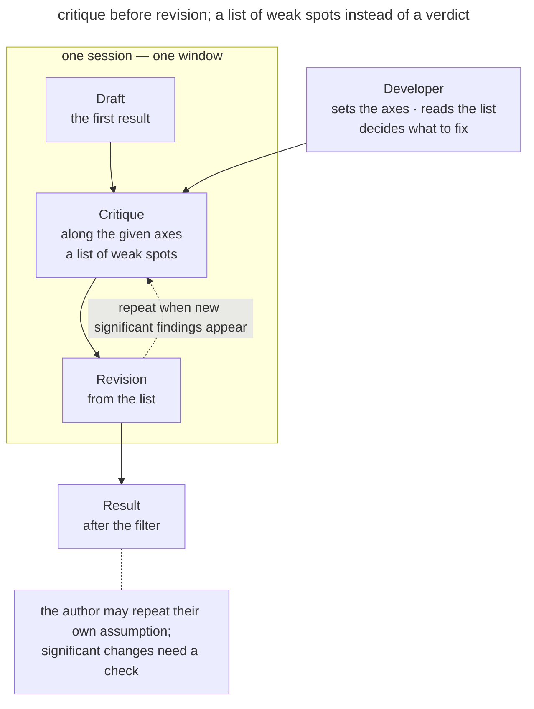

# Reflection

## Intent

Ask the agent to assess its own result separately along given axes, then fix the confirmed flaws. The check runs in the same window and helps improve the draft before an external assessment.

## Also known as

Reflection, self-critique. A similar generate-and-evaluate cycle is used in evaluator-optimizer.

## Problem

The first result can miss a requirement or error handling, even if the normal scenario works. A separate review pass is useful for such omissions.

For example, an export function produces a correct CSV, but you haven't yet checked that the file is closed when a write fails. Asking the agent to go through error handling steers it to that path. A full review in a new session carries the extra cost of handing over context. For a small draft you can start with [reflection](reflection.md) and pass significant changes to an [independent reviewer](writer-reviewer.md). A request to "make it better" doesn't specify what to check, so it may lead to nothing more than renames and comments.

A separate task of finding flaws shifts the focus of the agent's work. But the findings still need to be checked.

## Solution

Once the result is in, make two explicit moves.

**First, get a critique without edits.** Name the axes to check and ask for concrete flaws with the conditions under which they show up. For an export, for example, it is useful to check write errors and data size.

**Then choose the fixes.** You assess the findings, separate defects from accepted trade-offs, and assign the agent the changes you need.

The separation helps you see on what grounds the agent changes the code. Otherwise a useful fix can get mixed up with an unnecessary rework.

The author and the critic share one context, so they can repeat the same wrong original assumption. If a new pass adds no verifiable findings, stop polishing and use tests or a fresh context.

## Structure

In the diagram, the agent takes the draft, compiles a list of findings, and fixes the selected items.

```mermaid
---
title: critique before revision; a list of weak spots instead of a verdict
---
flowchart TB
  subgraph session["one session — one window"]
    direction LR
    draft["Draft<br/>the first result"]
    critique["Critique<br/>along the given axes<br/>a list of weak spots"]:::warn
    revise["Revision<br/>from the list"]
    draft --> critique --> revise
    revise -. "repeat when new significant findings appear" .-> critique
  end
  dev["Developer<br/>sets the axes · reads the list<br/>decides what to fix"]:::accent
  result["Result<br/>after the filter"]:::accent
  caveat["the author may repeat their own assumption;<br/>significant changes need a check"]:::warn
  dev --> critique
  revise --> result
  result -.- caveat
```

The developer sets the axes and makes the decisions. The result of the cycle still needs a check proportionate to the risk of the change.

## Participants / Components

- **Agent** creates and critiques the result in one context.
- **Critique axes** set the properties to be checked.
- **List of findings** keeps the flaws found before any edits.
- **Developer** assesses the findings and chooses the fixes.

## When to use

- Existing automated checks are not enough to assess readability or completeness of requirements.
- A draft needs to be prepared for an independent review.
- A plan, specification, or documentation needs to be checked.
- The small size of the edit does not yet justify a separate reviewer session.

## Consequences and trade-offs

- ➕ One extra prompt in the current session is enough to start.
- ➕ The agent may notice a missed scenario or requirement.
- ➕ The technique applies to both code and documents.
- ➖ The critic may repeat the author's assumptions.
- ➖ Repeated passes can produce cosmetic edits without new findings.
- ➖ A formal approval creates unwarranted confidence in the result.

## Implementation

1. Once you have the result, ask for a separate critical assessment.
2. Name specific axes, for example error handling and compliance with the requirements.
3. Ask for the flaws to be described with the conditions under which they show up and the evidence.
4. Go through the list and choose fixes with the accepted constraints in mind.
5. Ask for edits on the selected items and stop after one or two rounds.
6. Save recurring criteria in a command or a skill.
7. Confirm the fixes with tests or an [independent review](writer-reviewer.md) if the change calls for it.

## Example

The agent has finished a CSV report export. Before committing, you ask it to check the code.

> Find problems in error handling, edge cases, and memory use on large data. For each, show the condition under which it shows up. Don't fix anything yet.

The agent finds an unclosed file descriptor on a write error and missing headers in an empty report. It also notes that the whole report is assembled in memory. You choose the fixes.

> Fix the file closing and the headers of the empty report. Exports are limited to ten thousand rows, so streaming isn't needed yet. Record this limit in a comment.

The agent fixes the two defects and keeps the chosen way of assembling the report. Going through the findings let you take the known data size limit into account.

## Anti-patterns and common mistakes

- **A verdict question.** Asking for approval of the code may get you a formal yes. Ask for concrete flaws and evidence.
- **Critique together with edits.** First go through the findings, then change the code on the selected items.
- **No criteria.** A general request to improve the code doesn't specify what to check.
- **Endless polishing.** If new passes yield no significant findings, change the way you check.
- **Self-critique as proof.** Reflection helps prepare the result but does not by itself confirm correctness.

## Known uses

- **Andrew Ng** describes Reflection as a separate pattern in which the model examines its own work in order to improve it.
- **Reflexion (Shinn et al., NeurIPS 2023)** keeps the conclusions of self-reflection across attempts in episodic memory.
- **Anthropic's evaluator-optimizer** automates the cycle of generating, evaluating, and refining a result.
- **Constitutional AI** uses critique of answers against a list of principles, followed by rewriting them, during training.

## Related patterns

- [Feedback Loop](give-agent-a-way-to-verify.md) adds a verifiable external signal.
- [Writer and Reviewer](writer-reviewer.md) moves the critique into a fresh context.
- [TDD with an Agent](tdd-with-agent.md) sets a behavior check before implementation.
