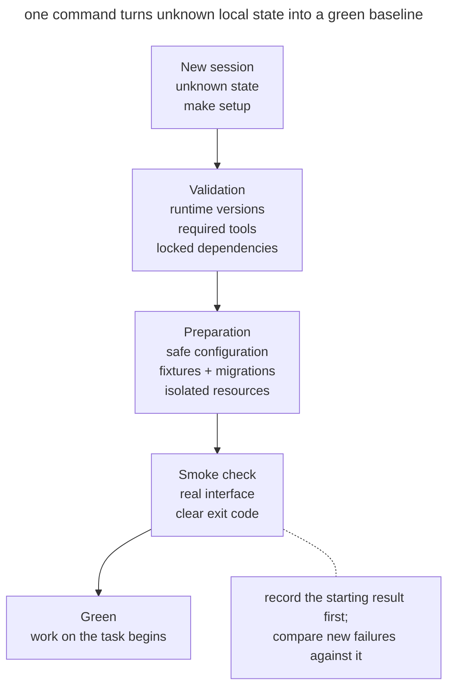

# Reproducible Agent Bootstrap

## Intent

Give a new session a single command that prepares the environment and verifies the starting state. After it runs, the agent knows the baseline scenario works and can compare later changes against it.

## Also known as

Reproducible agent bootstrap, one-command setup, initializer script, green baseline.

## Problem

A new session opens the repository and does not know how to bring it to life. The README lists five commands, some of them outdated; _.env_ has to be assembled from a chat message; the database expects a manual migration; and the check needs a separate service. The agent tries variations, accidentally changes the configuration, and twenty minutes later gets a failing test.

If the test was already failing at the start, it is hard to tell later what caused a new failure. In a separate worktree the manual setup is repeated, adding to the cost of every parallel task.

An "install dependencies" command is not enough. Being ready means the required tools are available, a safe configuration has been created, services are running or replaced with fixtures, and a minimal end-to-end smoke check passes.

## Solution

Prepare an idempotent command, such as `make setup` or `./scripts/bootstrap`, that brings a supported environment to a **verified starting state**.

The bootstrap performs four actions in sequence.

1. **Checks prerequisites**, including runtime and system tool versions.
2. **Prepares local state** with dependencies, a safe configuration, and test data.
3. **Starts services** or reports a known non-interactive start command.
4. **Verifies readiness** with a short smoke test of the key scenario.

The script must be safe to run again. It does not require production secrets, does not touch user data, and does not mask a red baseline. If a prerequisite is missing, the error names the specific command that fixes it.

The bootstrap verifies the starting state and uses pinned dependency versions. The full test suite runs separately, as the task requires.

## Structure

A new session arrives with unknown local state and calls a single command.



The command validates the tools, creates a safe state, and runs the smoke check. Only a green result opens work on the task; a red one stops it and separates the environment problem from the future diff.

## Participants / Components

- **Supported baseline** defines the OS and tool versions.
- **Bootstrap command** prepares the environment repeatably.
- **Lockfile** pins dependency versions.
- **Safe configuration** uses local values and test data.
- **Isolated resources** separate the ports, databases, and containers of each instance.
- **Smoke check** verifies the minimal working scenario.
- **Agent** runs the setup before implementation and records the result.

## When to use

- New developers, agents, CI jobs, or worktrees regularly open the repository.
- Starting up takes more than one obvious command, or needs external services.
- Agent sessions are short, and repeated setup noticeably eats into the context.
- Parallel tasks need independent local instances.
- It often turns out that tests were failing before the change began.

For a simple library, a short install-and-check command is enough. How much bootstrap you need depends on how the project is built.

## Consequences and trade-offs

- ➕ A starting result helps separate existing failures from those that appeared after the edit.
- ➕ A new session gets oriented faster and spends its context on product work.
- ➕ Worktrees and CI get the same setup path, reducing the "works on my machine" effect.
- ➕ Running in a clean environment checks that the setup procedure is still current.
- ➖ The bootstrap becomes a product within the product and needs maintenance when the environment changes.
- ➖ A full setup can be slow; you need caching and a separate fast smoke, but without silently skipping steps.
- ➖ Idempotence is hard for databases and external services; a careless rerun can destroy data.
- ➖ Local fixtures can differ too much from production and give false confidence.

## Implementation

1. Write down the path from a clean checkout to the first successful user action. Remove every step that lives only in personal notes.
2. Pin runtime and dependency versions with a lockfile. Check for incompatible versions at the start, with a clear error.
3. Create the configuration from a safe example. Do not copy real tokens, and do not overwrite an existing _.env_ without an explicit decision.
4. Make reruns safe. A rerun should confirm the required state without duplicating data.
5. Set the database, port, and Compose project through an instance parameter or the worktree name.
6. Finish with a smoke test through the system's user-facing interface, such as an HTTP request or a CLI command.
7. Return a non-zero code if any phase is incomplete, and print the next safe step.
8. Run the bootstrap in CI on a clean environment so the command does not quietly rot.

## Example

Below is the skeleton of a shared setup command for a service.

```make
setup:
	pnpm install --frozen-lockfile
	if [ ! -e .env.local ]; then cp .env.example .env.local; fi
	docker compose up -d db
	pnpm db:migrate
	pnpm smoke
```

A real project needs to refine this skeleton. The condition preserves an existing configuration file, and a copy error stops `make`. The port and Compose project must differ between worktrees, and the smoke test must wait for the database to be ready with a bounded timeout.

Once a runtime version check and a report are added, the bootstrap can print its result in the following format. This is a sample of the desired report; the skeleton above does not print it yet.

```console
$ make setup
runtime: node 24.8.0 ✓
dependencies: lockfile unchanged ✓
database: agent_auth_42 ready ✓
smoke: create and read note ✓
baseline: green
```

If the smoke test fails before any changes, the agent records the pre-existing problem. If the failure appeared after implementation, it starts investigating from the new diff, allowing for a flaky test or a change in the external environment.

## Anti-patterns and common mistakes

- **README instead of a command.** Five manual steps drift from reality and are executed slightly differently each time.
- **Install only.** The packages are installed, but the configuration, the database, and the user path are unverified.
- **Production secrets.** A local start requires a production token with broad permissions.
- **Non-idempotent setup.** The second run duplicates fixtures, resets the database, or breaks the first one.
- **Green at any cost.** `|| true` swallows a meaningful error and declares an incomplete start successful.
- **Floating versions.** The same command installs a different set of dependencies today than it did yesterday.
- **Shared resources.** All worktrees use one database and port, so independent sessions interfere with one another.
- **Heavy full run.** Setup takes an hour even though a five-minute smoke is enough to prove the start; developers stop running it.

## Known uses

- **Anthropic's harness for long-running agents** uses an initializer agent that creates `init.sh`, and every subsequent session starts the server and a basic end-to-end test before new work.
- **Dev containers and Codespaces** encode the runtime, system packages, and setup commands in versioned configuration.
- **CI from a clean checkout** verifies that installation is reproducible without the author's local state.

The approach is described in [Effective harnesses for long-running agents](https://www.anthropic.com/engineering/effective-harnesses-for-long-running-agents).

## Related patterns

- [Isolated Parallel Work](isolated-parallel-work.md) uses the bootstrap for every new worktree.
- [Progress Journal](progress-file.md) records the state after the starting check.
- [Feedback Loop](give-agent-a-way-to-verify.md) begins with a short check of the baseline behavior.
- [One Feature at a Time](one-feature-at-a-time.md) uses a verified start for a bounded pass.
