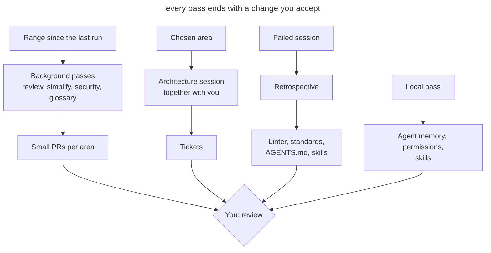

# Scheduled Maintenance

## Intent

Run the agent on regular passes that look for drift in code, documentation and the agent's own setup, and bring the results back as small PRs or tickets. Each pass has its own cadence, its own scope and its own runner: in the cloud, locally or together with you.

## Also known as

Garbage collection, doc gardening, maintenance routines, recurring tasks, hygiene passes.

## Problem

Agents write tens of thousands of lines a week. Reviewing each PR checks only its diff. If three PRs each bend a standard a little and in different places, no single review notices, and a month later the deviation becomes the new norm that the agent keeps copying.

Everything that helps the agent work goes stale along with the code. The glossary doesn't know about new models, _AGENTS.md_ collects rules that no longer change anything, the skill that starts the app points to a deleted script, the permission allowlist keeps growing, and the agent's private memory accumulates facts about the project that are not in the repository. Each of these small things costs the agent extra calls and mistakes in every following session.

A one-off cleanup "when things get really bad" doesn't work: by then the drift has spread across the codebase, and fixing it turns into a large, risky refactoring. A manual weekly cleanup doesn't scale either: the team spends a day on it and still can't keep up with the volume.

## Solution

List the recurring passes and decide four things for each.

1. **What drifts.** Code relative to the standards, domain language relative to the glossary, instructions relative to practice, the agent's setup relative to the real project.
2. **The cadence.** It depends on how fast the drift happens. Check everything that follows the code weekly. Instructions and the agent's setup change more slowly; a monthly look is enough.
3. **The scope.** A pass over the whole repository produces a shallow report. Set a commit range, the directories with the most changes, a layer or a domain concept.
4. **The runner.** A pass that needs only the repository fits a background task in the cloud. A pass that needs your memory, transcripts or a running app needs your machine. A pass with decisions only you can make is done together with you.

The result of every pass must be an action, not a report: a PR with fixes for one area, or tickets. A report nobody turned into a change only adds noise.

Keep an event-driven review separate from the scheduled passes. A session retrospective is useful right after work went badly, while you still remember what went wrong. A week later there is nothing left to review.

## Structure

The diagram shows the three runners and where the result of each ends up.



Background passes run without you and arrive as ready PRs. The findings of the weekly review suggest which area to take into the architecture session. The retrospective is triggered by a failed session, not by the calendar. Local passes maintain the tool itself and rarely reach the project.

## Participants / Components

- **The schedule** runs passes at the set cadence and stores their prompts.
- **The checkpoint** sets the range: a tag from the last run or a date.
- **A pass** checks one area for one kind of drift.
- **The reference** describes the norm: coding standards, glossary, ADRs, _AGENTS.md_.
- **The result** turns findings into PRs or tickets.
- **You** accept the changes, choose the area for the architecture session and answer the retrospective's questions.

## When to use

- Agents write more code than the team can read carefully.
- The project has a reference to check against: standards, a glossary, ADRs.
- Several people or several parallel sessions work on the repository.
- The project has already accumulated an agent setup: instructions, skills, hooks, permissions.

In a small project with one developer and infrequent changes, a retrospective after failed sessions and a monthly pass over the instructions are enough.

## Consequences and trade-offs

- ➕ Drift gets fixed in small steps while it is still local.
- ➕ Instructions and skills stay short and match the real work.
- ➕ Background passes don't take your time until review.
- ➖ Weekly PRs also have to be read; if they pile up, the passes lose their point.
- ➖ A background agent makes mistakes like any other, so its PRs go through normal review.
- ➖ Passes cost tokens and usage limits, especially on large ranges.
- ➖ The schedule goes stale along with the project and needs its own review.

## Implementation

1. Write down what serves as the reference in the project and what can fall behind it. Without a reference, a standards review and a glossary check turn into matters of taste.
2. For each pass, set the cadence, the scope and the result format. Start with a weekly standards review and a monthly pass over the instructions; add the rest when a recurring problem shows up.
3. Set the range explicitly. A background task doesn't have to remember its last run: put the run's tag or a period like "commits from the last 7 days" in the prompt.
4. Split a large diff by directory. Tens of thousands of lines don't fit in one pass, so run one task per major area.
5. Keep project passes apart from tool upkeep. The former change the repository and go into PRs; the latter change your settings and memory.
6. Once a month, review the schedule itself: which passes haven't found anything for a long time, and which produce PRs nobody reads.

### Project passes

These passes don't depend on the agent. Most of them are [Matt Pocock's skills](matt-pocock-skills.md), and the pack has to be installed first: `npx skills@latest add mattpocock/skills`, then `/setup-matt-pocock-skills` once. The installer puts the skills in _.agents/skills_, where Codex reads them; Claude Code reads only _.claude/skills_, so links to them must be there. In Claude Code a skill is invoked as `/name`, in Codex as `$name`. Where an agent has a built-in command, it is described in the same subsection.

#### Retrospective

**What it is.** The `retro` skill from the in-progress section of Matt Pocock's pack ([source](https://github.com/mattpocock/skills/tree/main/skills/in-progress/retro)). The model doesn't invoke it on its own; only you run it.

**How it works.** The skill loads `writing-for-agents` as a style guide and reads the session transcript, the current one by default. It looks for improvements in seven categories: navigation, automated checks, review standards, _AGENTS.md_, tool economy, rules that change nothing, and access to information. It proposes catching a mechanical violation with a linter, hook or CI, and writing into the standards only what takes judgement. It lists candidates by severity and changes nothing itself.

**When.** Right after a session where the agent got stuck: many corrections, a rollback, a long search, a repeated mistake.

**How to run.**

```text
/retro the agent searched three times for where mailings are configured and edited a generated file twice
```

In Codex the same text starts with `$retro`. You implement the accepted proposals in that same session.

#### Standards review

**What it is.** The `code-review` skill from the pack ([source](https://github.com/mattpocock/skills/tree/main/skills/engineering/code-review)). Claude Code has a built-in `/code-review` command that looks for correctness bugs. A project skill with the same name replaces it, and the built-in stays available as `/review`.

**How it works.** The skill takes the diff from a fixed point (`git diff <point>...HEAD`) and finds the documents with standards, such as _CODING_STANDARDS.md_ and _CONTRIBUTING.md_. Then it runs two sub-agents in parallel. Standards checks the diff against the project's standards and a baseline of code smells from Fowler's *Refactoring*. Spec checks the diff against the originating issue. A scheduled pass needs only the Standards axis. Violations are split into hard ones and judgement calls, each with a link to the rule.

**When.** Weekly, as a cloud task, one task per major area.

**How to run.** A prompt for a task covering one area:

```text
/code-review from the last main commit older than 7 days, Standards axis only, app/services only. Fix the violations and open a PR, listing the violated rules from CODING_STANDARDS.md in the description
```

In Codex the same prompt starts with `$code-review`. Codex also has a built-in `codex review --base <branch>`, which takes its review rules from the `## Code Review Rules` section of _AGENTS.md_ ([docs](https://learn.chatgpt.com/docs/code-review)). Automatic PR review on GitHub (`@codex review`) looks at one PR and reports only serious problems, so it doesn't replace the weekly pass.

#### Simplification

**What it is.** In Claude Code, the built-in `/simplify` skill ([docs](https://code.claude.com/docs/en/commands)). Codex has no built-in equivalent.

**How it works.** Four sub-agents look at the changed code in parallel: reuse of existing helpers, simplification, efficiency, and level of abstraction. What they find is fixed right away. `/simplify` doesn't look for correctness bugs; that's what `/code-review` is for. You can pass a path or a PR as an argument.

**When.** Weekly, on the 3–5 directories with the most changes.

**How to run.** The cloud task first finds the directories with `git log --since="7 days ago" --stat`, then runs the command for each:

```text
/simplify app/services
```

In Codex, use a plain prompt: "find repetition, extra layers and dead code in this week's changes in app/services and remove them".

#### Security review

**What it is.** In Claude Code, the built-in `/security-review` command ([docs](https://code.claude.com/docs/en/security-guidance), [source](https://github.com/anthropics/claude-code-security-review)). In Codex, the `@codex security review` mention on a PR and a separate Codex Security plugin ([docs](https://learn.chatgpt.com/docs/security)).

**How it works.** `/security-review` takes the diff between the current branch and the default branch on `origin` and looks for injection, authorization flaws and data exposure. It doesn't accept a commit range. `@codex security review` checks a PR; the full report appears in the task's Security Report tab.

**When.** On every branch before merging, and weekly over the main branch.

**How to run.** On a branch before merging:

```text
/security-review
```

The weekly pass over the main branch is a cloud task with a plain prompt:

```text
Review the security of changes in main over the last 7 days: authorization, payments, file uploads, calls to external APIs. For each confirmed finding, open a separate PR with a fix and a test that reproduces it
```

#### Glossary check

**What it is.** The `domain-modeling` skill from the pack ([source](https://github.com/mattpocock/skills/tree/main/skills/engineering/domain-modeling)).

**How it works.** The skill checks terms in the code and the conversation against _CONTEXT.md_ and points out contradictions: the glossary calls a concept one thing and the code another, or the code behaves differently from the description. It writes a resolved term into the glossary right away. _CONTEXT.md_ stays a dictionary only, with no implementation details. If there is a _CONTEXT-MAP.md_ at the root, the skill works across several contexts.

**When.** Weekly, as a cloud task.

**How to run.**

```text
/domain-modeling check CONTEXT.md against the models and services added to main in the last 7 days: new concepts with no entry, entries with old class names, terms from the Avoid section that crept back into the code. Put the glossary edits in a PR and list disputed terms in the description
```

The skill is designed for a conversation with you. In a cloud task there is nobody to ask, so disputed terms go into the PR description and you decide them.

#### Architecture

**What it is.** The `improve-codebase-architecture` skill from the pack ([source](https://github.com/mattpocock/skills/tree/main/skills/engineering/improve-codebase-architecture)). It loads `codebase-design` and `grilling` itself. The plan becomes tickets with the `to-tickets` skill ([source](https://github.com/mattpocock/skills/tree/main/skills/engineering/to-tickets)).

**How it works.** The skill takes its vocabulary from `codebase-design`: module, interface, depth, seam, adapter. Then it reads _CONTEXT.md_ and the ADRs of the chosen area, and a sub-agent walks the code looking for friction: understanding one concept means bouncing between many small modules; an interface is nearly as complex as its implementation; modules leak into each other across seams. Suspicious modules get the deletion test: if you deleted the module, would the complexity concentrate in one place or just move? The skill presents candidates as an HTML report in a temp folder. For the chosen candidate it runs `grilling` and, if you want, compares interface options with design-it-twice. `to-tickets` cuts the plan into vertical slices with blocking edges and publishes them to the tracker.

**When.** Weekly, together with you. The area rotates between a layer and a domain concept. Pick it where the weekly review and simplification found the most.

**How to run.**

```text
/improve-codebase-architecture app/services
```

After working through the chosen place, run `/to-tickets`.

#### Agent instructions

**What it is.** The `writing-for-agents` skill from the pack ([source](https://github.com/mattpocock/skills/tree/main/skills/productivity/writing-for-agents)).

**How it works.** It is a reference on writing documents for an agent. It covers context pointers, the two loads (on the agent's context and on the human's attention), the order of steps and reference, completion criteria, and a single source of truth. With it you can see duplicates between files, bloated documents, and prohibitions that pull attention toward the forbidden thing more than away from it.

**When.** Monthly.

**How to run.**

```text
/writing-for-agents go through AGENTS.md, CODING_STANDARDS.md and docs/agents/: find duplicates between files, rules that diverged from how we actually work, and what should move behind a pointer
```

#### Your own skills

**What it is.** The same `writing-for-agents`. For skills it also covers frontmatter and invocation.

**How it works.** The skill checks the instructions against the reference and against how the skill actually fires: the description should name the cases where the skill is needed, and each step should end on a checkable criterion.

**When.** Monthly.

**How to run.**

```text
/writing-for-agents go through the skills we wrote ourselves: run-app and finish-task. Remove steps the agent no longer performs and adjust the descriptions so each skill fires when it's needed
```

#### ADRs

**What it is.** The same `domain-modeling`.

**How it works.** The skill reads _docs/adr_, checks the decisions against the code and later ADRs, and sets statuses and links.

**When.** Monthly.

**How to run.**

```text
/domain-modeling go through docs/adr: which decisions were superseded by later ones, which were never implemented. Set statuses and links to the superseding ADRs
```

#### Agent memory

**What it is.** A plain prompt; there is no dedicated command. In Claude Code, auto-memory lives in _~/.claude/projects/&lt;project&gt;/memory_, and `/memory` shows the entries ([docs](https://code.claude.com/docs/en/memory)). Codex has Memories in _~/.codex/memories/_; they are off by default ([docs](https://learn.chatgpt.com/docs/customization/memories)).

**How it works.** The agent reads its memory and checks it against the repository. In Claude Code, background consolidation (the `autoDreamEnabled` setting) already removes stale entries and flags contradictions with _CLAUDE.md_, but it doesn't move project facts into the repository. The Codex documentation advises against editing Memories by hand, so there the facts go into _AGENTS.md_, and generation can be turned off with `memories.generate_memories` if needed.

**When.** Monthly, locally.

**How to run.**

```text
Go through your memory for this project. Move facts about the code, commands and project structure into AGENTS.md or docs/ if they aren't there yet, and delete them from memory. Keep only how to work with me
```

### Schedule and upkeep in Claude Code

Checked against Claude Code 2.1.283 and the [command reference](https://code.claude.com/docs/en/commands) on 2026-09-26. Command names change faster than the approach itself. Everything except `/schedule` runs locally: these commands need your transcripts, settings or a running environment.

#### Schedule: `/schedule`

**What it is.** A built-in command, also `/routines` ([docs](https://code.claude.com/docs/en/routines)).

**How it works.** The command creates a cloud task in conversation: it asks for the schedule, the repository and the prompt. Each run clones the repository at its default branch and can use connected connectors. The task delivers its result as a PR from a branch prefixed `claude/`, and the run can be followed in its transcript on claude.ai.

**How to run.**

```text
/schedule every Monday at 9:00 check standards in main for the last 7 days in app/services, app/policies and app/javascript, a separate PR per directory
```

#### Permissions: `/fewer-permission-prompts`

**What it is.** A built-in skill.

**How it works.** The skill reads session transcripts, collects frequent read-only Bash and MCP calls, and proposes a prioritized list. Once you agree, it appends the rules to `permissions.allow` in the shared _.claude/settings.json_.

**When.** Monthly.

**How to run.**

```text
/fewer-permission-prompts
```

#### Installation health: `/doctor`

**What it is.** A built-in skill.

**How it works.** The skill checks the installation (duplicates, `PATH`, broken settings files) and the version. It finds unused skills, MCP servers and plugins along with their context cost, and flags slow hooks. It cleans _CLAUDE.md_ files of duplicates and of what can be learned from the code. It adds frequently denied read-only commands to the personal _.claude/settings.local.json_. _AGENTS.md_ isn't part of its checks, so the `writing-for-agents` pass trims the instructions.

**When.** Monthly, after `/fewer-permission-prompts`.

**How to run.**

```text
/doctor
```

#### Skills: `/skill-doctor`

**What it is.** A built-in command, available since version 2.1.252.

**How it works.** The command shows, for each skill, how much it costs in context and how often it gets used, so you can see what to turn off. Claude Code doesn't see skills that aren't in _.claude/skills_ at all, so also check that the links to _.agents/skills_ are in place.

**When.** Monthly.

**How to run.**

```text
/skill-doctor which skills earn their token cost and which are dead weight
```

#### Running the app: `/run-skill-generator`

**What it is.** A built-in skill.

**How it works.** The skill writes a project skill that teaches `/run` and `/verify` to build, launch and check your app from a clean environment. If the recorded skill stops working, `/run` offers to refresh it. Claude edits the file only when a run went wrong.

**When.** Monthly, and whenever `/run` reports that the skill is stale.

**How to run.**

```text
/run-skill-generator
```

### Schedule and upkeep in Codex

Checked against Codex CLI 0.156.1 and the documentation on learn.chatgpt.com on 2026-09-26.

#### Schedule: Scheduled tasks and `codex-action`

**What it is.** Scheduled tasks are a feature of the Codex app ([docs](https://learn.chatgpt.com/docs/automations)). `openai/codex-action` is a GitHub Action that runs Codex in CI ([docs](https://learn.chatgpt.com/docs/github-action), [source](https://github.com/openai/codex-action)).

**How it works.** A task in the app runs in the local project or in a separate worktree on a schedule, without approvals (`approval_policy = "never"`), in your default sandbox. The result lands in the Scheduled view, which works as an inbox. The computer and the app must be running. The Action runs `codex exec` on any GitHub trigger, including cron, and doesn't depend on your machine. It doesn't open PRs itself; that takes a separate step.

**How to run.** In the app, create a task in the Scheduled view with a schedule and a prompt, for example `$code-review from the last main commit older than 7 days, Standards axis only, app/services only`. In CI the same pass looks like this:

```yaml
on:
  schedule:
    - cron: "0 6 * * 1"
jobs:
  standards:
    runs-on: ubuntu-latest
    permissions:
      contents: write
      pull-requests: write
    steps:
      - uses: actions/checkout@v5
        with:
          fetch-depth: 0
      - uses: openai/codex-action@v1
        with:
          openai-api-key: ${{ secrets.OPENAI_API_KEY }}
          prompt-file: .github/prompts/weekly-standards.md
      - uses: peter-evans/create-pull-request@v7
        with:
          branch: maintenance/weekly-standards
          title: "refactor: weekly standards pass"
```

Before putting a pass on a schedule, make sure the sandbox keeps it inside the repository.

#### Permissions: `.rules` files

**What it is.** The command execution rules mechanism, marked experimental ([docs](https://learn.chatgpt.com/docs/agent-configuration/rules)).

**How it works.** Rules are written as `prefix_rule(pattern=[...], decision="allow" | "prompt" | "forbidden")` in _.rules_ files next to each configuration layer: _~/.codex/rules/_ and _.codex/rules/_ in a trusted project. Of the matching rules, the strictest wins. Every "allow" in the TUI appends a rule to _~/.codex/rules/default.rules_, and there is no command to review or prune it.

**When.** Monthly: go through the file by hand, move shared rules into the repository's _.codex/rules/_, delete the rest.

**How to run.** Checking how the rules decide a specific command:

```text
codex execpolicy check --pretty --rules ~/.codex/rules/default.rules -- git push origin main
```

#### Installation health: `codex doctor`

**What it is.** A built-in CLI command ([docs](https://learn.chatgpt.com/docs/cli/reference)).

**How it works.** The command checks the installation, configuration, authentication, runtime, Git and terminal. In the TUI, `/debug-config` shows the configuration layers, and `/hooks` shows the hooks and lets you trust or disable them ([docs](https://learn.chatgpt.com/docs/hooks)).

**When.** Monthly.

**How to run.**

```text
codex doctor
```

#### _AGENTS.md_ size

**What it is.** The `project_doc_max_bytes` configuration limit, 32 KiB by default ([docs](https://learn.chatgpt.com/docs/agent-configuration/agents-md)).

**How it works.** Codex collects _AGENTS.md_ files from the project root down to the working directory and stops loading once the combined size reaches the limit. There is no warning: rules from the last files simply don't make it into the context.

**When.** Monthly, together with the `writing-for-agents` pass.

**How to run.** In that same pass, ask the agent to add up the size of all _AGENTS.md_ files on the path to the deepest directories and compare it with the limit.

#### Skills

**What it is.** The `[[skills.config]]` setting in _config.toml_ ([docs](https://learn.chatgpt.com/docs/build-skills)). There is no equivalent of `/skill-doctor`.

**How it works.** Codex reads _.agents/skills_ directly; no symlinks are needed. An unused skill is turned off with a `[[skills.config]]` entry with `enabled = false`. How often a skill fires can be estimated from the sessions in _~/.codex/sessions_.

**When.** Monthly.

**How to run.**

```text
Count, from the sessions in ~/.codex/sessions for the last month, which skills from .agents/skills were invoked and how many times. List the ones that were never invoked
```

#### Running the app

**What it is.** Local environments in the Codex app ([docs](https://learn.chatgpt.com/docs/environments/local-environment)). There is no generator for a run skill.

**How it works.** Local environments describe worktree setup scripts and common actions, such as starting the app.

**When.** Monthly: check that the scripts still bring the app up from scratch.

## Example

The project gets about twenty thousand lines a week, the standards live in _CODING_STANDARDS.md_, and the code is organized into layers under _app/_. The weekly standards review task gets this prompt.

> Check standards compliance in main for the last 7 days. Use the code-review skill, Standards axis only. Split the changes by top-level directory under app/ and go through each one separately. Open a separate PR for each area with findings, and list the violated rules from CODING_STANDARDS.md in the description, with links to the commits where they appeared.

On Monday three PRs arrive: in _app/services_ two services again go to the database around the repositories, in _app/policies_ a role check compares strings instead of using an enum, and in _app/javascript/pages_ date formatting is duplicated. You accept the first two after a short review. The third shows that the date-formatting rule can be checked by a linter, so you open a ticket for a lint rule instead of a line in the standards.

For this week's architecture session you take _app/services_: it has had the most findings for the second month in a row. The report shows the services are thin and almost entirely restate the repositories; the chosen place is worked out into a plan and goes out as tickets.

## Anti-patterns and common mistakes

- **A pass over the whole repository.** The agent looks at a bit of everything and finds only the obvious. Set a scope.
- **One big PR.** Fixes for every area in one PR can't be reviewed, it gets postponed, and the next pass finds the same things.
- **A report instead of a change.** HTML reports pile up in a temp folder and nothing changes.
- **A retrospective from memory.** Reviewing week-old sessions relies on what nobody remembers anymore.
- **Relying on per-PR review.** Automatic PR review catches mistakes in a diff, but not a deviation that builds up across many PRs.
- **Tool upkeep mixed with project work.** Changes to personal permissions and memory end up in a team PR, or team rules stay in personal settings.
- **A schedule nobody revisits.** Passes that haven't found anything for a long time keep spending limits, and people stop reading their PRs.

## Known uses

- **OpenAI** describes in [Harness engineering](https://openai.com/index/harness-engineering/) background Codex tasks that, on a regular cadence, scan for deviations from "golden principles", update quality grades per domain and layer, and open targeted refactoring PRs. A separate doc-gardening agent looks for stale documentation. The team used to spend every Friday on cleanup, and that didn't scale.
- **Matt Pocock's skills** provide ready passes for regular runs: `retro`, `code-review`, `domain-modeling`, `writing-for-agents`, `improve-codebase-architecture`.
- **Claude Code** ships built-in setup checks `/doctor`, `/skill-doctor` and `/fewer-permission-prompts`, and `/schedule` runs cloud tasks on a schedule.
- **Codex** gives, in the Scheduled tasks documentation, an example task that goes through past sessions and improves skills.

## Related patterns

- [Project Memory](claude-md-memory.md) describes the instructions file that the monthly pass keeps short.
- [Bloated Memory](bloated-claude-md.md) shows what instructions turn into without regular cleanup.
- [Domain Vocabulary](domain-context-file.md) sets the reference for the weekly glossary check.
- [Skills](skills-as-packaged-workflows.md) package the passes so they can run on a schedule.
- [Writer and Reviewer](writer-reviewer.md) separates writing from review; the scheduled standards review works at the level of a week, not a single PR.
- [Executable Guardrails](executable-guardrails.md) get new checks from retrospectives and confine background tasks to a sandbox.
