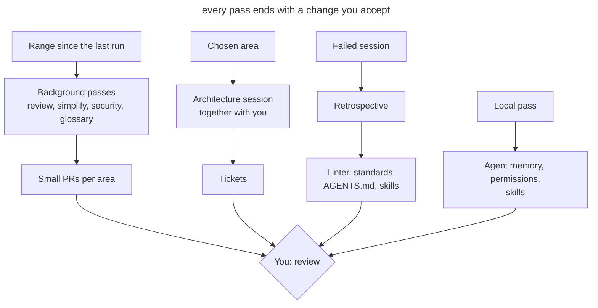

# Scheduled Maintenance

## Intent

Run the agent on regular passes that look for drift in code, documentation and the agent's own setup, and bring the results back as small PRs or tickets. Each pass has its own cadence, its own scope and its own runner: in the cloud, locally or together with you.

## Also known as

Garbage collection, doc gardening, maintenance routines, recurring tasks, hygiene passes.

## Problem

Agents write tens of thousands of lines a week. Reviewing each PR checks only its diff. If three PRs each bend a standard a little and in different places, no single review notices, and a month later the deviation becomes the new norm that the agent keeps copying.

Everything that helps the agent work goes stale along with the code. The glossary doesn't know about new models, _AGENTS.md_ collects rules that no longer change anything, the skill that starts the app points to a deleted script, the permission allowlist keeps growing, and the agent's private memory accumulates facts about the project that are not in the repository. Each of these small things costs the agent extra calls and mistakes in every following session.

A one-off cleanup "when things get really bad" doesn't work: by then the drift has spread across the codebase, and fixing it turns into a large, risky refactoring. A manual weekly cleanup doesn't scale either: the team spends a day on it and still can't keep up with the volume.

## Solution

When there is a lot of agent code, everything drifts at once: the architecture, layer boundaries, the glossary, adherence to standards, the instructions for the agents themselves. So the checks don't wait for a reason; they just run regularly. Everything that follows the code gets a weekly look: standards review, simplification, security, glossary, architecture. Instructions, skills, ADRs and agent settings change more slowly, and a monthly check is enough.

Each pass looks at a specific slice: the week's changes, a directory, a layer or a domain concept. A pass over the whole repository at once produces a shallow report.

The result of every pass must be an action, not a report: a PR with fixes for one area, or tickets. A report nobody turned into a change only adds noise.

Keep an event-driven review separate from the scheduled passes. A session retrospective is useful right after work went badly, while you still remember what went wrong. A week later there is nothing left to review.

## Structure

The diagram shows the three runners and where the result of each ends up.



Background passes run without you and arrive as ready PRs. The findings of the weekly review suggest which area to take into the architecture session. The retrospective is triggered by a failed session, not by the calendar. Local passes maintain the tool itself and rarely reach the project.

## Participants / Components

- **The schedule** runs passes at the set cadence and stores their prompts.
- **The checkpoint** sets the range: a tag from the last run or a date.
- **A pass** checks one area for one kind of drift.
- **The reference** describes the norm: coding standards, glossary, ADRs, _AGENTS.md_.
- **The result** turns findings into PRs or tickets.
- **You** accept the changes, choose the area for the architecture session and answer the retrospective's questions.

## When to use

- Agents write more code than the team can read carefully.
- The project has a reference to check against: standards, a glossary, ADRs.
- Several people or several parallel sessions work on the repository.
- The project has already accumulated an agent setup: instructions, skills, hooks, permissions.

In a small project with one developer and infrequent changes, a retrospective after failed sessions and a monthly pass over the instructions are enough.

## Consequences and trade-offs

- ➕ Drift gets fixed in small steps while it is still local.
- ➕ Instructions and skills stay short and match the real work.
- ➕ Background passes don't take your time until review.
- ➖ Weekly PRs also have to be read; if they pile up, the passes lose their point.
- ➖ A background agent makes mistakes like any other, so its PRs go through normal review.
- ➖ Passes cost tokens and usage limits, especially on large ranges.
- ➖ The schedule goes stale along with the project and needs its own review.

## Implementation

The weekly passes over the code are easiest to set up as cloud tasks: they arrive as ready PRs on their own. Architecture, the retrospective and agent upkeep are run by hand. A background task doesn't remember its last run, so put the period right in the prompt, for example "for the last week". If there are too many changes for one pass, run it per directory. Once a month, look at which passes haven't found anything for a long time and which produce PRs nobody reads.

### Passes that don't depend on the agent

Most of these passes are [Matt Pocock's skills](matt-pocock-skills.md), and the pack has to be installed first: `npx skills@latest add mattpocock/skills`, then `/setup-matt-pocock-skills` once. The installer puts the skills in _.agents/skills_, where Codex reads them; Claude Code reads only _.claude/skills_, so links to them must be there. The examples invoke skills the Claude Code way, as `/name`; in Codex the same call is written `$name`. The agents' built-in commands are described in the next blocks.

#### Retrospective

This is the `retro` skill from the pack's in-progress section ([source](https://github.com/mattpocock/skills/tree/main/skills/in-progress/retro)). The model doesn't invoke it on its own; only you run it.

The skill loads `writing-for-agents` as a style guide and reads the session transcript, the current one by default. It looks for improvements in seven categories: navigation, automated checks, review standards, _AGENTS.md_, tool economy, rules that change nothing, and access to information. It proposes catching a mechanical violation with a linter, hook or CI, and writing into the standards only what takes judgement. It lists candidates by severity and changes nothing itself.

Run it right after a session where the agent got stuck: many corrections, a rollback, a long search, a repeated mistake. Implement the accepted proposals in that same session.

##### Example

```text
/retro
```

#### Standards review

This is the `code-review` skill from the pack ([source](https://github.com/mattpocock/skills/tree/main/skills/engineering/code-review)).

The skill takes the diff from a fixed point (`git diff <point>...HEAD`) and finds the documents with standards, such as _CODING_STANDARDS.md_ and _CONTRIBUTING.md_. Then it runs two sub-agents in parallel: one checks the diff against the project's standards and a baseline of code smells from Fowler's *Refactoring*, the other checks the diff against the originating issue. A scheduled pass needs only the first part. Violations are split into hard ones and judgement calls, each with a link to the rule.

Run it weekly as a cloud task, one task per major area.

##### Example

```text
/code-review for the last week
```

#### Simplification

The pack has no dedicated skill for this; the pass is a plain prompt. The agent looks for repetition, extra layers and dead code in recently changed code and removes them right away.

Run it weekly on the 3–5 directories with the most changes. The cloud task finds them itself with `git log --since="7 days ago" --stat`.

##### Example

```text
Simplify the code that changed over the last week
```

#### Security review

A plain prompt. The agent reads the changes for the period and checks the places where a mistake costs the most: authorization, payments, file uploads and calls to external APIs.

Run it weekly as a cloud task over the main branch.

##### Example

```text
Check the changes from the last week for vulnerabilities
```

#### Glossary check

This is the `domain-modeling` skill from the pack ([source](https://github.com/mattpocock/skills/tree/main/skills/engineering/domain-modeling)).

The skill checks terms in the code and the conversation against _CONTEXT.md_ and points out contradictions: the glossary calls a concept one thing and the code another, or the code behaves differently from the description. It writes a resolved term into the glossary right away. _CONTEXT.md_ stays a dictionary only, with no implementation details. The skill is designed for a conversation with you; in a cloud task there is nobody to ask, so disputed terms go into the PR description.

Run it weekly as a cloud task.

##### Example

```text
/domain-modeling for the last week
```

#### Architecture

This is the `improve-codebase-architecture` skill from the pack ([source](https://github.com/mattpocock/skills/tree/main/skills/engineering/improve-codebase-architecture)). It loads `codebase-design` and `grilling` itself. The plan becomes tickets with the `to-tickets` skill ([source](https://github.com/mattpocock/skills/tree/main/skills/engineering/to-tickets)).

The skill takes its vocabulary from `codebase-design`: module, interface, depth, seam, adapter. Then it reads _CONTEXT.md_ and the ADRs of the chosen area, and a sub-agent walks the code looking for friction: understanding one concept means bouncing between many small modules; an interface is nearly as complex as its implementation; modules leak into each other across seams. Suspicious modules get the deletion test: if you deleted the module, would the complexity concentrate in one place or just move? The skill presents candidates as an HTML report in a temp folder. For the chosen candidate it runs `grilling` and, if you want, compares interface options with design-it-twice. `to-tickets` cuts the plan into vertical slices with blocking edges and publishes them to the tracker.

Run it weekly, together with you. The area rotates between a layer and a domain concept. Pick it where the weekly review and simplification found the most.

##### Example

```text
/improve-codebase-architecture app/services
```

After working through the chosen place, run `/to-tickets`.

#### Agent instructions

This is the `writing-for-agents` skill from the pack ([source](https://github.com/mattpocock/skills/tree/main/skills/productivity/writing-for-agents)).

It is a reference on writing documents for an agent. It covers context pointers, the two loads (on the agent's context and on the human's attention), the order of steps and reference, completion criteria, and a single source of truth. With it you can see duplicates between files, bloated documents, and prohibitions that pull attention toward the forbidden thing more than away from it.

Run it monthly.

##### Example

```text
/writing-for-agents check the docs
```

#### Your own skills

Your own skills are checked with the same `writing-for-agents`; for skills it also covers frontmatter and invocation. A skill's description should name the cases where it's needed, and each step should end on a checkable criterion.

Run it monthly.

##### Example

```text
/writing-for-agents check the skills
```

#### ADRs

ADRs are checked with the same `domain-modeling`. The skill reads _docs/adr_, checks the decisions against the code and later ADRs, and sets statuses and links.

Run it monthly.

##### Example

```text
/domain-modeling check the ADRs
```

#### Agent memory

There is no dedicated command; a plain prompt does it. The agent reads its memory about the project, moves facts about the code and commands into the repository, and keeps in memory only how to work with you. Where the memory lives and how it cleans itself up depends on the agent and is described in its block.

Run it monthly, locally.

##### Example

```text
Clean up your memory for this project
```

### Claude Code

Checked against Claude Code 2.1.283 and the [command reference](https://code.claude.com/docs/en/commands) on 2026-09-26. Command names change faster than the approach itself. Everything except `/schedule` runs locally: these commands need your transcripts, settings or a running environment.

#### Schedule: `/schedule`

`/schedule` is a built-in command, also `/routines` ([docs](https://code.claude.com/docs/en/routines)).

The command creates a cloud task in conversation: it asks for the schedule, the repository and the prompt. Each run clones the repository at its default branch and can use connected connectors. The task delivers its result as a PR from a branch prefixed `claude/`, and the run can be followed in its transcript on claude.ai.

##### Example

```text
/schedule every Monday /code-review for the last week
```

#### Review: `/code-review` and `/review`

Claude Code has a built-in `/code-review` skill that looks for correctness bugs. A project skill with the same name, such as `code-review` from Matt Pocock's pack, replaces it, and the built-in stays available as `/review` ([docs](https://code.claude.com/docs/en/skills)).

##### Example

```text
/review
```

#### Simplification: `/simplify`

`/simplify` is a built-in skill ([docs](https://code.claude.com/docs/en/commands)).

Four sub-agents look at the changed code in parallel: reuse of existing helpers, simplification, efficiency, and level of abstraction. What they find is fixed right away. `/simplify` doesn't look for correctness bugs. You can pass a path or a PR as an argument, so the weekly task runs it per directory.

##### Example

```text
/simplify app/services
```

#### Security: `/security-review`

`/security-review` is a built-in command ([docs](https://code.claude.com/docs/en/security-guidance), [source](https://github.com/anthropics/claude-code-security-review)).

The command takes the diff between the current branch and the default branch on `origin` and looks for injection, authorization flaws and data exposure. It doesn't accept a commit range, so it runs on a branch before merging, while the weekly pass over the main branch stays a plain prompt from the common block.

##### Example

```text
/security-review
```

#### Memory

Auto-memory lives in _~/.claude/projects/&lt;project&gt;/memory_, and `/memory` shows the entries and turns it on or off ([docs](https://code.claude.com/docs/en/memory)). Background consolidation (the `autoDreamEnabled` setting) removes stale entries and flags contradictions with _CLAUDE.md_, but it doesn't move project facts into the repository, so the monthly pass from the common block is still needed.

#### Permissions: `/fewer-permission-prompts`

`/fewer-permission-prompts` is a built-in skill.

The skill reads session transcripts, collects frequent read-only Bash and MCP calls, and proposes a prioritized list. Once you agree, it appends the rules to `permissions.allow` in the shared _.claude/settings.json_.

Run it monthly.

##### Example

```text
/fewer-permission-prompts
```

#### Installation health: `/doctor`

`/doctor` is a built-in skill.

The skill checks the installation (duplicates, `PATH`, broken settings files) and the version. It finds unused skills, MCP servers and plugins along with their context cost, and flags slow hooks. It cleans _CLAUDE.md_ files of duplicates and of what can be learned from the code. It adds frequently denied read-only commands to the personal _.claude/settings.local.json_. _AGENTS.md_ isn't part of its checks, so the `writing-for-agents` pass trims the instructions.

Run it monthly, after `/fewer-permission-prompts`.

##### Example

```text
/doctor
```

#### Skills: `/skill-doctor`

`/skill-doctor` is a built-in command, available since version 2.1.252.

The command shows, for each skill, how much it costs in context and how often it gets used, so you can see what to turn off. Claude Code doesn't see skills that aren't in _.claude/skills_ at all, so also check that the links to _.agents/skills_ are in place.

Run it monthly.

##### Example

```text
/skill-doctor
```

#### Running the app: `/run-skill-generator`

`/run-skill-generator` is a built-in skill.

The skill writes a project skill that teaches `/run` and `/verify` to build, launch and check your app from a clean environment. If the recorded skill stops working, `/run` offers to refresh it. Claude edits the file only when a run went wrong.

Run it monthly, and whenever `/run` reports that the skill is stale.

##### Example

```text
/run-skill-generator
```

### Codex

Checked against Codex CLI 0.156.1 and the documentation on learn.chatgpt.com on 2026-09-26.

#### Schedule: Scheduled tasks and `codex-action`

Scheduled tasks are a feature of the Codex app ([docs](https://learn.chatgpt.com/docs/automations)). `openai/codex-action` is a GitHub Action that runs Codex in CI ([docs](https://learn.chatgpt.com/docs/github-action), [source](https://github.com/openai/codex-action)).

A task in the app runs in the local project or in a separate worktree on a schedule, without approvals (`approval_policy = "never"`), in your default sandbox. The result lands in the Scheduled view, which works as an inbox. The computer and the app must be running. The Action runs `codex exec` on any GitHub trigger, including cron, and doesn't depend on your machine. It doesn't open PRs itself; that takes a separate step. Before putting a pass on a schedule, make sure the sandbox keeps it inside the repository.

##### Example in the app

In the Scheduled view, create a task with a schedule and a prompt:

```text
$code-review for the last week
```

##### Example in GitHub Actions

```yaml
on:
  schedule:
    - cron: "0 6 * * 1"
jobs:
  standards:
    runs-on: ubuntu-latest
    permissions:
      contents: write
      pull-requests: write
    steps:
      - uses: actions/checkout@v5
        with:
          fetch-depth: 0
      - uses: openai/codex-action@v1
        with:
          openai-api-key: ${{ secrets.OPENAI_API_KEY }}
          prompt-file: .github/prompts/weekly-standards.md
      - uses: peter-evans/create-pull-request@v7
        with:
          branch: maintenance/weekly-standards
          title: "refactor: weekly standards pass"
```

#### Review: `codex review` and `@codex review`

`codex review` is a built-in CLI command; `/review` does the same in the TUI ([docs](https://learn.chatgpt.com/docs/code-review)). Codex takes its review rules from the `## Code Review Rules` section of _AGENTS.md_, so that's where a pointer to the project's standards belongs. Automatic PR review on GitHub (`@codex review`) looks at one PR and reports only serious problems, so it doesn't replace the weekly pass.

##### Example

```text
codex review --base main
```

#### Security: `@codex security review`

Mentioning `@codex security review` in a PR comment starts a Security Review; the full report appears in the task's Security Report tab. For broader checks there is a separate Codex Security plugin ([docs](https://learn.chatgpt.com/docs/security)).

##### Example

```text
@codex security review
```

#### Memory: Memories

Memories are off by default ([docs](https://learn.chatgpt.com/docs/customization/memories)). If you turned them on, entries live in _~/.codex/memories/_ and are generated from past sessions. The documentation advises against editing them by hand, so during the monthly pass project facts go into _AGENTS.md_, and generation can be turned off with `memories.generate_memories` if needed.

#### Permissions: `.rules` files

Permissions in Codex are set by the command execution rules mechanism, which is marked experimental ([docs](https://learn.chatgpt.com/docs/agent-configuration/rules)).

Rules are written as `prefix_rule(pattern=[...], decision="allow" | "prompt" | "forbidden")` in _.rules_ files next to each configuration layer: _~/.codex/rules/_ and _.codex/rules/_ in a trusted project. Of the matching rules, the strictest wins. Every "allow" in the TUI appends a rule to _~/.codex/rules/default.rules_, and there is no command to review or prune it.

Once a month, go through the file by hand, move shared rules into the repository's _.codex/rules/_, and delete the rest.

##### Example

Checking how the rules decide a specific command:

```text
codex execpolicy check --pretty --rules ~/.codex/rules/default.rules -- git push origin main
```

#### Installation health: `codex doctor`

`codex doctor` is a built-in CLI command ([docs](https://learn.chatgpt.com/docs/cli/reference)).

The command checks the installation, configuration, authentication, runtime, Git and terminal. In the TUI, `/debug-config` shows the configuration layers, and `/hooks` shows the hooks and lets you trust or disable them ([docs](https://learn.chatgpt.com/docs/hooks)).

Run it monthly.

##### Example

```text
codex doctor
```

#### _AGENTS.md_ size

The size of the instructions is capped by the `project_doc_max_bytes` setting, 32 KiB by default ([docs](https://learn.chatgpt.com/docs/agent-configuration/agents-md)).

Codex collects _AGENTS.md_ files from the project root down to the working directory and stops loading once the combined size reaches the limit. There is no warning: rules from the last files simply don't make it into the context. Check this monthly together with the `writing-for-agents` pass.

##### Example

```text
Add up how much all the AGENTS.md files weigh together
```

#### Skills

Skills in Codex are managed by the `[[skills.config]]` setting in _config.toml_ ([docs](https://learn.chatgpt.com/docs/build-skills)). There is no equivalent of `/skill-doctor`.

Codex reads _.agents/skills_ directly; no symlinks are needed. An unused skill is turned off with a `[[skills.config]]` entry with `enabled = false`. How often a skill fires can be estimated from the sessions in _~/.codex/sessions_.

Run it monthly.

##### Example

```text
Which skills haven't I used in the last month?
```

#### Running the app

Starting the app in Codex is described in the app's Local environments ([docs](https://learn.chatgpt.com/docs/environments/local-environment)). There is no generator for a run skill. Once a month, check that the scripts still bring the app up from scratch.

## Example

The project gets about twenty thousand lines a week, the standards live in _CODING_STANDARDS.md_, and the code is organized into layers under _app/_. Every Monday a cloud task runs with this prompt:

> /code-review for the last week

On Monday three PRs arrive: in _app/services_ two services again go to the database around the repositories, in _app/policies_ a role check compares strings instead of using an enum, and in _app/javascript/pages_ date formatting is duplicated. You accept the first two after a short review. The third shows that the date-formatting rule can be checked by a linter, so you open a ticket for a lint rule instead of a line in the standards.

For this week's architecture session you take _app/services_: it has had the most findings for the second month in a row. The report shows the services are thin and almost entirely restate the repositories; the chosen place is worked out into a plan and goes out as tickets.

## Anti-patterns and common mistakes

- **A pass over the whole repository.** The agent looks at a bit of everything and finds only the obvious. Set a scope.
- **One big PR.** Fixes for every area in one PR can't be reviewed, it gets postponed, and the next pass finds the same things.
- **A report instead of a change.** HTML reports pile up in a temp folder and nothing changes.
- **A retrospective from memory.** Reviewing week-old sessions relies on what nobody remembers anymore.
- **Relying on per-PR review.** Automatic PR review catches mistakes in a diff, but not a deviation that builds up across many PRs.
- **Tool upkeep mixed with project work.** Changes to personal permissions and memory end up in a team PR, or team rules stay in personal settings.
- **A schedule nobody revisits.** Passes that haven't found anything for a long time keep spending limits, and people stop reading their PRs.

## Known uses

- **OpenAI** describes in [Harness engineering](https://openai.com/index/harness-engineering/) background Codex tasks that, on a regular cadence, scan for deviations from "golden principles", update quality grades per domain and layer, and open targeted refactoring PRs. A separate doc-gardening agent looks for stale documentation. The team used to spend every Friday on cleanup, and that didn't scale.
- **Matt Pocock's skills** provide ready passes for regular runs: `retro`, `code-review`, `domain-modeling`, `writing-for-agents`, `improve-codebase-architecture`.
- **Claude Code** ships built-in setup checks `/doctor`, `/skill-doctor` and `/fewer-permission-prompts`, and `/schedule` runs cloud tasks on a schedule.
- **Codex** gives, in the Scheduled tasks documentation, an example task that goes through past sessions and improves skills.

## Related patterns

- [Project Memory](claude-md-memory.md) describes the instructions file that the monthly pass keeps short.
- [Bloated Memory](bloated-claude-md.md) shows what instructions turn into without regular cleanup.
- [Domain Vocabulary](domain-context-file.md) sets the reference for the weekly glossary check.
- [Skills](skills-as-packaged-workflows.md) package the passes so they can run on a schedule.
- [Writer and Reviewer](writer-reviewer.md) separates writing from review; the scheduled standards review works at the level of a week, not a single PR.
- [Executable Guardrails](executable-guardrails.md) get new checks from retrospectives and confine background tasks to a sandbox.
