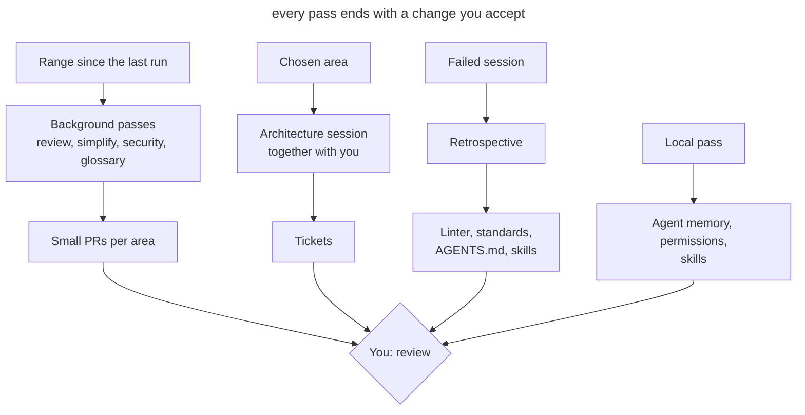

# Scheduled Maintenance

## Intent

Run the agent on regular passes that look for drift in code, documentation and the agent's own setup, and bring the results back as small PRs or tickets. Each pass has its own cadence, its own scope and its own runner: in the cloud, locally or together with you.

## Also known as

Garbage collection, doc gardening, maintenance routines, recurring tasks, hygiene passes.

## Problem

Agents write tens of thousands of lines a week. Reviewing each PR checks only its diff. If three PRs each bend a standard a little and in different places, no single review notices, and a month later the deviation becomes the new norm that the agent keeps copying.

Everything that helps the agent work goes stale along with the code. The glossary doesn't know about new models, _AGENTS.md_ collects rules that no longer change anything, the skill that starts the app points to a deleted script, the permission allowlist keeps growing, and the agent's private memory accumulates facts about the project that are not in the repository. Each of these small things costs the agent extra calls and mistakes in every following session.

A one-off cleanup "when things get really bad" doesn't work: by then the drift has spread across the codebase, and fixing it turns into a large, risky refactoring. A manual weekly cleanup doesn't scale either: the team spends a day on it and still can't keep up with the volume.

## Solution

List the recurring passes and decide four things for each.

1. **What drifts.** Code relative to the standards, domain language relative to the glossary, instructions relative to practice, the agent's setup relative to the real project.
2. **The cadence.** It depends on how fast the drift happens. Check everything that follows the code weekly. Instructions and the agent's setup change more slowly; a monthly look is enough.
3. **The scope.** A pass over the whole repository produces a shallow report. Set a commit range, the directories with the most changes, a layer or a domain concept.
4. **The runner.** A pass that needs only the repository fits a background task in the cloud. A pass that needs your memory, transcripts or a running app needs your machine. A pass with decisions only you can make is done together with you.

The result of every pass must be an action, not a report: a PR with fixes for one area, or tickets. A report nobody turned into a change only adds noise.

Keep an event-driven review separate from the scheduled passes. A session retrospective is useful right after work went badly, while you still remember what went wrong. A week later there is nothing left to review.

## Structure

The diagram shows the three runners and where the result of each ends up.

Background passes run without you and arrive as ready PRs. The findings of the weekly review suggest which area to take into the architecture session. The retrospective is triggered by a failed session, not by the calendar. Local passes maintain the tool itself and rarely reach the project.

## Participants / Components

- **The schedule** runs passes at the set cadence and stores their prompts.
- **The checkpoint** sets the range: a tag from the last run or a date.
- **A pass** checks one area for one kind of drift.
- **The reference** describes the norm: coding standards, glossary, ADRs, _AGENTS.md_.
- **The result** turns findings into PRs or tickets.
- **You** accept the changes, choose the area for the architecture session and answer the retrospective's questions.

## When to use

- Agents write more code than the team can read carefully.
- The project has a reference to check against: standards, a glossary, ADRs.
- Several people or several parallel sessions work on the repository.
- The project has already accumulated an agent setup: instructions, skills, hooks, permissions.

In a small project with one developer and infrequent changes, a retrospective after failed sessions and a monthly pass over the instructions are enough.

## Consequences and trade-offs

- ➕ Drift gets fixed in small steps while it is still local.
- ➕ Instructions and skills stay short and match the real work.
- ➕ Background passes don't take your time until review.
- ➖ Weekly PRs also have to be read; if they pile up, the passes lose their point.
- ➖ A background agent makes mistakes like any other, so its PRs go through normal review.
- ➖ Passes cost tokens and usage limits, especially on large ranges.
- ➖ The schedule goes stale along with the project and needs its own review.

## Implementation

1. Write down what serves as the reference in the project and what can fall behind it. Without a reference, a standards review and a glossary check turn into matters of taste.
2. For each pass, set the cadence, the scope and the result format. Start with a weekly standards review and a monthly pass over the instructions; add the rest when a recurring problem shows up.
3. Set the range explicitly. A background task doesn't have to remember its last run: put the run's tag or a period like "commits from the last 7 days" in the prompt.
4. Split a large diff by directory. Tens of thousands of lines don't fit in one pass, so run one task per major area.
5. Keep project passes apart from tool upkeep. The former change the repository and go into PRs; the latter change your settings and memory.
6. Once a month, review the schedule itself: which passes haven't found anything for a long time, and which produce PRs nobody reads.

### The common set

The passes below don't depend on the agent. Most of them are [Matt Pocock's skills](matt-pocock-skills.md), and the pack has to be installed first: `npx skills@latest add mattpocock/skills`, then `/setup-matt-pocock-skills` once. The installer puts the skills in _.agents/skills_, where Codex reads them; Claude Code reads only _.claude/skills_, so links to them must be there. The `retro` skill is in the pack's in-progress section; check that it made it into the install.

| Cadence | Pass | Result |
|---|---|---|
| right after a session where the agent got stuck | `retro` in that same session | Proposals for the setup. Mechanical violations are caught by a linter, hook or CI; judgement calls are written into the review standards; rules that change nothing are removed from _AGENTS.md_ |
| weekly | `code-review` over the main branch for the week, standards axis only, one task per area | Deviation from the standards that no single PR shows is fixed in separate PRs |
| weekly | Simplify the 3–5 directories with the most changes this week | Repetition, extra layers and dead code are removed |
| weekly | Security review of the week's changes, starting with authorization, payments, file uploads and external APIs | Findings are fixed |
| weekly | `domain-modeling` over _CONTEXT.md_ | New models are added to the glossary, renames are reflected, banned terms are removed from the code |
| weekly | `improve-codebase-architecture <area>` together with you; the area rotates between a layer and a domain concept | One place where a module should be deepened is worked out into a plan and split into tickets with `to-tickets` |
| monthly | `writing-for-agents` over _AGENTS.md_, the review standards and the agent docs | Duplicates between files are removed, rules that diverged from practice are fixed |
| monthly | `writing-for-agents` over your own skills | Dead steps are removed, descriptions are adjusted so the skill fires when it's needed |
| monthly | `domain-modeling` over _docs/adr_ | Superseded and never-implemented ADRs get statuses and links |
| monthly | Agent memory check | Project facts from private memory are moved into the repository or deleted; the memory keeps only how to work with you |

The weekly passes suggest the area for the architecture session: take the directory where review and simplification found the most, or the place the retrospective complained was hard to navigate.

### In Claude Code

Checked against Claude Code 2.1.283 on 2026-09-26. Command names change faster than the approach itself.

- **Schedule.** `/schedule` (also `/routines`) creates cloud tasks on a schedule. The task clones the repository, can use connected connectors, and delivers its result as a PR from a branch prefixed `claude/`. The weekly review, simplification, security and glossary passes fit here.
- **Simplification.** The built-in `/simplify` looks at changed code and applies fixes right away; it doesn't hunt for bugs. Pass it the list of directories explicitly.
- **Security.** `/security-review` checks only the current branch's changes against its base and takes no commit range. Run it on a branch before merging, and schedule the weekly pass over the main branch as a cloud task with a plain security-review prompt for the period.
- **Permissions.** `/fewer-permission-prompts` finds frequent safe calls in the transcripts and adds them to the shared _.claude/settings.json_.
- **Installation health.** `/doctor` checks the installation and version, unused MCP servers and plugins, slow hooks, and adds frequently denied read-only commands to the personal _.claude/settings.local.json_. Its duplicate and trimming checks look at _CLAUDE.md_ files and _.claude/rules_; _AGENTS.md_ is not on that list, so the `writing-for-agents` pass trims the instructions.
- **Skills.** `/skill-doctor` shows which loaded skills go unused and how much context they take. Claude Code reads skills from _.claude/skills_, so skills from _.agents/skills_ are linked there with symlinks; check that none got lost.
- **Running the app.** `/run-skill-generator` creates a skill that knows how to start your app. The built-in `/run` offers to refresh such a skill itself when it stops working.
- **Memory.** Auto-memory lives in _~/.claude/projects/&lt;project&gt;/memory_. Background consolidation (the `autoDreamEnabled` setting) removes stale entries and flags contradictions with _CLAUDE.md_, but it doesn't move project facts into the repository. Do that part of the check yourself.

Cloud tasks get only the repository. The memory check, `/doctor`, `/fewer-permission-prompts`, `/skill-doctor` and `/run-skill-generator` run locally, because they need your transcripts, settings or a running environment.

### In Codex

Checked against Codex CLI 0.156.1 and the documentation on learn.chatgpt.com on 2026-09-26.

- **Schedule.** The Codex app has **Scheduled tasks**. A task runs in the local project or in a separate worktree, and the result lands in the Scheduled view, which works as an inbox. The computer and the app must be running. To run without your machine, use `openai/codex-action` in GitHub Actions with a cron trigger.
- **Review.** `codex review --base <branch>` checks a diff without an interactive session; `/review` does the same in the TUI. Automatic PR review on GitHub (`@codex review`) looks at one PR and reports only serious problems, so it doesn't replace a weekly standards pass. Codex takes its review rules from the `## Code Review Rules` section of _AGENTS.md_.
- **Security.** `@codex security review` checks a PR; for broader checks there is a separate Codex Security plugin.
- **Simplification.** There is no built-in command. Use `codex review` with your own instructions or your own skill.
- **Permissions.** Every "allow" in the TUI appends a rule to _~/.codex/rules/default.rules_, and there is no command to review or prune it. Once a month, go through the file by hand, move shared rules into the repository's _.codex/rules/_, and test them with `codex execpolicy check`. The rules mechanism is marked experimental.
- **Installation health.** `codex doctor` checks the installation, configuration, authentication and Git; `/debug-config` shows the configuration layers; `/hooks` shows the hooks and their trust.
- **Instructions.** Codex stops loading _AGENTS.md_ files once their combined size exceeds `project_doc_max_bytes` (32 KiB by default), and it doesn't warn about it. The monthly pass over the instructions should watch that threshold too.
- **Skills.** Codex reads _.agents/skills_ directly; no symlinks are needed. There is no equivalent of `/skill-doctor`: disable unused skills through `[[skills.config]]` with `enabled = false`, and estimate usage from the sessions in _~/.codex/sessions_.
- **Running the app.** There is no skill generator. The commands for starting the app and preparing a worktree are described in the app's Local environments; check them along with the rest of the setup.
- **Memory.** Memories are off by default. If you turned them on, entries live in _~/.codex/memories/_ and are generated from past sessions. The documentation advises against editing them by hand, so during the check move project facts into _AGENTS.md_ or the docs, and turn generation off through `memories.generate_memories` if needed.

Tasks in the app run without approvals (`approval_policy = "never"`) in your default sandbox. Before putting a pass on a schedule, make sure the sandbox keeps it inside the repository.

## Example

The project gets about twenty thousand lines a week, the standards live in _CODING_STANDARDS.md_, and the code is organized into layers under _app/_. The weekly standards review task gets this prompt.

> Check standards compliance in main for the last 7 days. Use the code-review skill, Standards axis only. Split the changes by top-level directory under app/ and go through each one separately. Open a separate PR for each area with findings, and list the violated rules from CODING_STANDARDS.md in the description, with links to the commits where they appeared.

On Monday three PRs arrive: in _app/services_ two services again go to the database around the repositories, in _app/policies_ a role check compares strings instead of using an enum, and in _app/javascript/pages_ date formatting is duplicated. You accept the first two after a short review. The third shows that the date-formatting rule can be checked by a linter, so you open a ticket for a lint rule instead of a line in the standards.

For this week's architecture session you take _app/services_: it has had the most findings for the second month in a row. The report shows the services are thin and almost entirely restate the repositories; the chosen place is worked out into a plan and goes out as tickets.

## Anti-patterns and common mistakes

- **A pass over the whole repository.** The agent looks at a bit of everything and finds only the obvious. Set a scope.
- **One big PR.** Fixes for every area in one PR can't be reviewed, it gets postponed, and the next pass finds the same things.
- **A report instead of a change.** HTML reports pile up in a temp folder and nothing changes.
- **A retrospective from memory.** Reviewing week-old sessions relies on what nobody remembers anymore.
- **Relying on per-PR review.** Automatic PR review catches mistakes in a diff, but not a deviation that builds up across many PRs.
- **Tool upkeep mixed with project work.** Changes to personal permissions and memory end up in a team PR, or team rules stay in personal settings.
- **A schedule nobody revisits.** Passes that haven't found anything for a long time keep spending limits, and people stop reading their PRs.

## Known uses

- **OpenAI** describes in [Harness engineering](https://openai.com/index/harness-engineering/) background Codex tasks that, on a regular cadence, scan for deviations from "golden principles", update quality grades per domain and layer, and open targeted refactoring PRs. A separate doc-gardening agent looks for stale documentation. The team used to spend every Friday on cleanup, and that didn't scale.
- **Matt Pocock's skills** provide ready passes for regular runs: `retro`, `code-review`, `domain-modeling`, `writing-for-agents`, `improve-codebase-architecture`.
- **Claude Code** ships built-in setup checks `/doctor`, `/skill-doctor` and `/fewer-permission-prompts`, and `/schedule` runs cloud tasks on a schedule.
- **Codex** gives, in the Scheduled tasks documentation, an example task that goes through past sessions and improves skills.

## Related patterns

- [Project Memory](claude-md-memory.md) describes the instructions file that the monthly pass keeps short.
- [Bloated Memory](bloated-claude-md.md) shows what instructions turn into without regular cleanup.
- [Domain Vocabulary](domain-context-file.md) sets the reference for the weekly glossary check.
- [Skills](skills-as-packaged-workflows.md) package the passes so they can run on a schedule.
- [Writer and Reviewer](writer-reviewer.md) separates writing from review; the scheduled standards review works at the level of a week, not a single PR.
- [Executable Guardrails](executable-guardrails.md) get new checks from retrospectives and confine background tasks to a sandbox.
