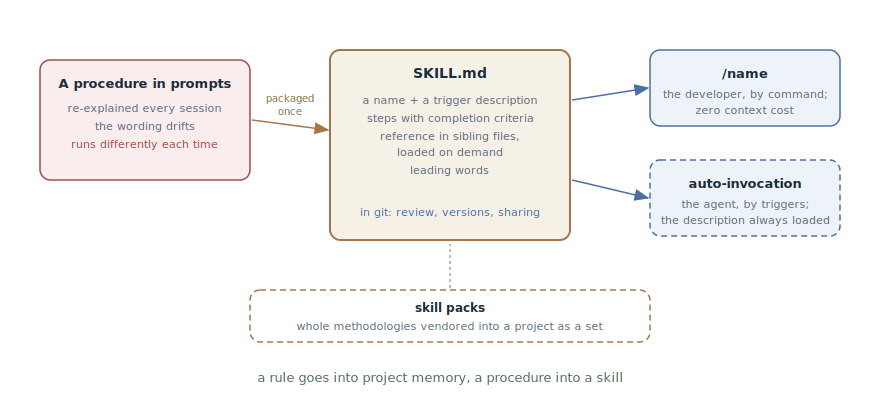

# Skills

## Intent

Package a recurring procedure into a skill — a named file of instructions
that the agent loads on demand and the developer invokes with a single
command — instead of re-explaining the procedure in every prompt. This
book's meta-pattern: almost any pattern in it can be packaged as a skill —
and half of them already are.

## Also known as

Skills, slash commands, custom commands, packaged workflows.

## Problem

A working process has procedures: the release ritual, the review order, the
triage steps, the TDD cycle. While they live in heads and conversations,
the predictable happens:

- The procedure gets re-explained in every session — a paragraph of text
  you are typing for the twentieth time.
- The wording drifts: today it was explained slightly differently than
  yesterday — and the agent executed it slightly differently. A stochastic
  system needs even less of an excuse.
- Dumping the procedures into [Project Memory](claude-md-memory.md) is not
  an option: it loads whole every session, and multi-step instructions
  don't belong there — that's the straight road to bloated memory, half of
  which the agent ignores.
- The procedure doesn't transfer: a colleague explains the same ritual to
  their agent in their own words — with a different result.

## Solution

The procedure becomes a file in the repository: a skill — a `SKILL.md` with
a name, a description, and an instruction body. This packaging has four
properties a prompt doesn't:

1. **On demand.** Unlike project memory, a skill doesn't occupy the window
   until invoked: its cost is zero in every session that doesn't need it —
   this is exactly where multi-step procedures move out of memory.
2. **Two invocation modes.** *User-invoked* — the skill fires only by name
   (`/release`), costs the context nothing, but you are the one who must
   remember it. *Model-invoked* — the skill's description with its triggers
   is always in the window, and the agent reaches for it on its own when
   the request fits. Choose the model mode only when the agent must decide
   by itself that the skill is needed — every such description is paid for
   with every session's context.
3. **As code.** The skill lives in git: editing the procedure is a diff
   under review, not oral tradition. The team gets one procedure for
   everyone.
4. **Portability.** Skills assemble into packs and get vendored from
   project to project — this is how whole methodologies spread.

The goal of the packaging is **predictability**: the agent walks the same
*process* every run, even if the outputs differ. The writing techniques
serve it: steps with checkable completion criteria ("every modified model
accounted for", not "produce a list"); reference pushed into sibling files
and loaded on demand; leading words — compact terms the model already
knows, on which a whole region of behavior is hung.

The boundary with project memory is simple: **a rule goes into memory, a
procedure into a skill**. "Commits in English" is a rule — it is needed
always. "How we release" is a procedure — it is needed on demand.

## Structure



On the left, a procedure's life before packaging: re-explanation in every
session and drift. In the center, the skill: a name, a trigger description,
steps with completion criteria, reference in sibling files — all of it in
git, edited through review. On the right, the two ways to invoke: the
developer by name with a command, or the agent by the description's
triggers. At the bottom, the packs: skills travel between projects as
ready-made sets.

## Participants / Components

- **The skill** — `SKILL.md` plus its sibling reference files; one
  procedure — one skill.
- **The trigger description** — determines invocation: a human-facing
  one-liner for the user mode, a trigger list for the model mode.
- **The developer** — the author and editor: notices a recurring
  procedure, packages it, prunes it.
- **The agent** — executes the skill as a process: step by step, to the
  completion criteria.
- **The pack** — a set of skills vendored into a project: a methodology as
  a directory of files.

## When to use

- A procedure has repeated two or three times — the same trigger as for
  project memory, only for "how to do" rather than "what is true".
- The procedure must run identically for everyone and always: releases,
  reviews, triage, migrations.
- You want this book's patterns to be invocable: the session handoff, TDD,
  triage, and the investigation map package into skills literally.

Don't package the one-off: a skill invoked once is overhead on a file
nobody will find a month later.

## Consequences and trade-offs

- ➕ Predictability: the procedure runs as the same process in every
  session and for every team member.
- ➕ The context stays free: unlike memory, a skill costs nothing until
  invoked; the window is spent only on the procedure that's needed.
- ➕ Procedures become code: review, versions, change history, sharing as a
  pack.
- ➖ Maintenance: skills sediment — stale layers pile up because adding
  feels safe and removing feels risky. Without pruning, a pack degrades.
- ➖ User-invoked skills tax the developer's memory: you are the index.
  When there are more skills than you can remember, you need a router skill
  that knows the others.
- ➖ Model-invoked descriptions eat context always: handing out
  auto-invocation generously is the same bloated context through a side
  door.

## Implementation

1. Catch the trigger: the procedure is being explained for the second
   time — time to package.
2. Create `SKILL.md` with frontmatter (name, description) and a body: the
   steps in execution order, each with a checkable completion criterion.
3. Choose the invocation mode. The default is user-invoked: fired by name,
   zero context cost. Model-invoked — only if the agent must reach the
   skill itself; then the description is written as a trigger list.
4. Push reference into sibling files and link them from the steps — they
   load only when their moment comes (see
   [Context Engineering](context-engineering.md): its on-demand principle
   in miniature).
5. Hunt for leading words: one compact term ("tracer", "fog of war",
   "red") anchors behavior more cheaply than a paragraph.
6. Prune regularly: check every line for relevance, delete hollow
   sentences whole. Unpruned skills sediment.
7. When they multiply — set up a router: one user-invoked skill that lists
   the others and when to reach for each.
8. Don't invent a pack from scratch: [Superpowers](superpowers.md) and
   [Matt Pocock's skills](matt-pocock-skills.md) are ready methodologies in
   skill form; vendor and adapt.

## Example

Every service release, the developer dictates the same paragraph to the
agent: build the changelog from commits since the last tag, bump the
version, check migrations, run the smoke set, create the tag and the
release. Once a month the paragraph mutates — and the releases come out
slightly different.

The procedure is packaged into `.claude/skills/release/SKILL.md`:

```markdown
---
name: release
description: Assemble and publish a service release
disable-model-invocation: true
---

1. Build the changelog from commits since the last tag; every line is
   a Conventional Commit. Criterion: every commit is either in the
   changelog or explicitly discarded as housekeeping.
2. Bump the version by semver based on the changelog's contents.
3. Check for unapplied migrations — there must be none.
4. Run the smoke set: make smoke. Criterion: green output attached.
5. Tag and release with the changelog in the description.
```

Now a release is `/release`. A month later the team decides to add a check
for unclosed feature flags — that's a one-line pull request to SKILL.md,
not a broadcast of "now also explain this to your agent".

That the pattern is meta shows in this very book: the session handoff, TDD,
triage, the investigation map, and the prototype are covered in chapters as
patterns — and all five exist in Matt Pocock's pack as invocable skills.

## Anti-patterns and common mistakes

- **The dump skill.** The whole project memory moved into one skill, or a
  skill "for everything": the packaging works while one procedure is one
  skill.
- **Everything model-invoked.** Auto-invocation on every skill — and the
  descriptions eat every session's window: bloated memory returned through
  the back door.
- **Steps without criteria.** "Do the review and fix things" with no
  checkable "done" — the agent ends the step when it's tired, not when
  it's finished.
- **Sediment.** Layers of stale instructions nobody dares delete. Pruning
  skills is the same discipline as pruning project memory.
- **Duplication with memory.** The same rule in both CLAUDE.md and a
  skill — two sources of truth that will diverge. A rule lives in one
  place.

## Known uses

- **Claude Code** — skills as the mechanism: `SKILL.md` in
  `.claude/skills/`, invocation modes via `disable-model-invocation`,
  arguments, plugins as packs; bundled skills like `/code-review` are the
  same pattern from the vendor.
- **Superpowers** — a whole SDD methodology shipped as a skill pack:
  brainstorming, planning, TDD implementation by subagents, review.
- **Matt Pocock's skills** — a pack with a router and the *writing great
  skills* meta-skill — a reference on writing the skills themselves:
  predictability, invocation modes, completion criteria, leading words.
- **The AGENTS.md ecosystem** — team procedure catalogs in other tools:
  from Cursor rules to custom commands in various agents; the format
  differs, the pattern is the same.

## Related patterns

- [Project Memory](claude-md-memory.md) — the paired pattern with a clean
  boundary: a rule goes into memory (needed always), a procedure into a
  skill (needed on demand); skills are the main cure for bloated memory.
- [Context Engineering](context-engineering.md) — a skill is on-demand
  loading in its pure form: zero tokens before invocation, the full
  instruction after.
- [Session Handoff](handoff.md), [TDD with an Agent](tdd-with-agent.md),
  [Issue Triage](triage-state-machine.md), and the
  [Investigation Map](wayfinder.md) — this book's patterns that exist in
  real packs precisely as skills: packaging is their native form.
