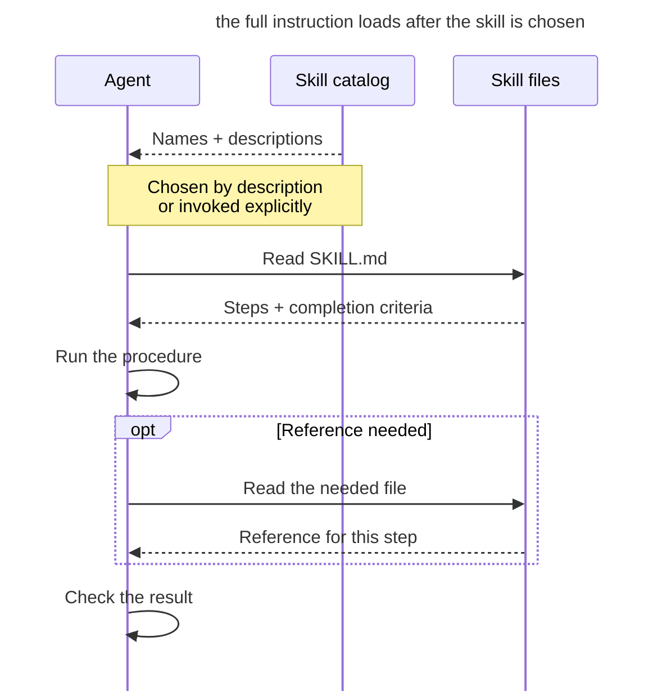

# Skills

## Intent

Save a recurring procedure in a skill that the agent loads when needed. You get a named workflow with a version and completion criteria that can be used across sessions.

## Also known as

Skills, slash commands, custom commands, packaged workflows.

## Problem

At every release you explain the preparation order to the agent all over again. One day you forget to mention the migration check, and the agent ships the version without it.

If the procedure lives only in the conversation, how complete each run is depends on the new prompt. A colleague may describe the same process differently and get a different order of actions. Moving the whole procedure into [Project Memory](claude-md-memory.md) loads it into sessions that have nothing to do with releases as well.

## Solution

Write the procedure into a _SKILL.md_ with a name, a description of its purpose, and a sequence of actions. This packaging gives you several capabilities.

1. **Loading on demand.** The full instruction enters the context when the skill is used. The description used to pick the skill can stay in the catalog of available procedures.
2. **Choice of invocation.** The user can invoke the skill by name, and the agent picks it on its own from the description, so the description should explain which tasks the procedure applies to.
3. **Versioning.** The team keeps the skill in git and discusses process changes in review.
4. **Portability.** A set of skills can be carried between projects and adapted to local rules.

Give every step a checkable result. For example, a release step should confirm that the migrations ran on a test database. Move reference details into separate files so the agent reads them as needed.

**Keep standing rules in project memory, and load procedures through skills.** The commit-language rule is needed across many tasks. The detailed release order is needed while a version is being shipped.

## Structure

The agent first receives a catalog of names and descriptions. The full procedure and the reference material enter the context as needed.


```mermaid
---
title: the full instruction loads after the skill is chosen
config:
  sequence:
    mirrorActors: false
    width: 130
    height: 45
    actorMargin: 35
    messageMargin: 28
---
sequenceDiagram
  participant A as Agent
  participant C as Skill catalog
  participant F as Skill files
  C-->>A: Names + descriptions
  Note over A,C: Chosen by description<br/>or invoked explicitly
  A->>F: Read SKILL.md
  F-->>A: Steps + completion criteria
  A->>A: Run the procedure
  opt Reference needed
    A->>F: Read the needed file
    F-->>A: Reference for this step
  end
  A->>A: Check the result
```

The procedure is stored in git and goes through review. On invocation the agent reads its current version and opens the sibling files through links in the instruction. The set of descriptions occupies the context before any skill is chosen, so it has to be kept compact too.

## Participants / Components

- **The skill** holds one procedure in a _SKILL.md_ and related materials.
- **The description** explains when to apply the procedure.
- **The developer** writes, checks, and updates the instructions.
- **The agent** carries out the steps and checks the completion criteria.
- **The pack** bundles related skills for installation into a project.

## When to use

- You explain the same procedure again and again.
- The team needs a consistent order for releases, reviews, or triage.
- One of this book's patterns has to be applied regularly.

For a one-off task a dedicated skill usually creates extra work maintaining the file.

## Consequences and trade-offs

- ➕ Everyone gets a consistent version of the procedure.
- ➕ The full instruction loads only when needed.
- ➕ Process changes go through review and stay in the history.
- ➖ The team has to delete stale steps and re-check the procedure after the project changes.
- ➖ The user has to find the right skill among the available ones.
- ➖ A large catalog of descriptions also occupies the context.

## Implementation

1. Pick a procedure you keep having to explain again.
2. Create a _SKILL.md_ with a name, a purpose, steps, and their completion criteria.
3. Decide how it is invoked. In the description, state which tasks the skill is needed for rather than summarizing its contents: the agent uses the description to decide whether to load the procedure.
4. Move reference material into sibling files and link to it from the steps that need it (see [Context Engineering](context-engineering.md)).
5. Use consistent process terms and explain them where they affect an action.
6. Test the procedure on real tasks and delete stale instructions.
7. Build up a "Gotchas" section in the skill from the mistakes the agent made while following it. These entries hold what the agent does not know without the skill.
8. For a large set, add an index that helps pick the right skill.
9. If needed, adapt ready-made procedures from [Superpowers](superpowers.md) or [Matt Pocock's skills](matt-pocock-skills.md).

## Example

Every release of a service involves a changelog, a version bump, a migration check, a smoke test, and creating the release. You want to save this order so you don't have to reconstruct it from memory.

You write the procedure into _.claude/skills/release/SKILL.md_.

```markdown
---
name: release
description: Assemble and publish a service release
disable-model-invocation: true
---

1. Build the changelog from commits since the last tag; every line is
   a Conventional Commit. Criterion: every commit is either in the
   changelog or explicitly discarded as housekeeping.
2. Bump the version by semver based on the changelog's contents.
3. On a separate test database, restore the previous release's schema and apply the new migrations. Attach the run output and the post-migration data check.
4. Run the smoke set: make smoke. Criterion: green output attached.
5. Tag and release with the changelog in the description.
```

Now you invoke `/release`. When the team adds a check for unclosed feature flags, it changes the skill through a pull request. The following runs get the new version of the instruction.

On the same principle, Matt Pocock's pack saves the procedures for session handoff, TDD, triage, investigation, and prototyping.

## Anti-patterns and common mistakes

- **The skill for everything.** Unrelated procedures in one file make it hard to pick out the steps that apply.
- **Invocation conditions that are too broad.** The agent loads the procedure even for tasks that don't need it.
- **Steps without criteria.** Without a checkable result the agent has a hard time telling when a step is done.
- **Stale instructions.** Accumulated rules can steer the agent toward an action that is no longer right.
- **A rigid script where the result is what matters.** If the order of steps does not affect the outcome, a step-by-step instruction keeps the agent from adapting to the task. Set the goal and the constraints, and keep steps where the order matters.
- **Duplicated rules.** Copies in memory and in a skill can diverge. Keep a rule in one place and link to it.

## Known uses

- **Claude Code** supports _SKILL.md_ in _.claude/skills/_, arguments, and invocation control via `disable-model-invocation`.
- **The Claude Code team** [describes](https://x.com/trq212/status/2033949937936085378) how it writes its own skills. The description serves as the invocation condition for the model. The gotchas section grows as new failures appear. Instead of a step-by-step script, the skill sets a goal and constraints.
- **Codex** supports skills and a built-in `$skill-creator` helper. [OpenAI's guide](https://learn.chatgpt.com/guides/best-practices) advises extracting a skill from a process that already works and limiting it to a single task.
- **Superpowers** combines planning, TDD, implementation, and review into a set of skills.
- **Matt Pocock's skills** include an index of procedures and the [writing-for-agents](https://github.com/mattpocock/skills/blob/main/skills/productivity/writing-for-agents/SKILL.md) guide to writing instructions for agents.
- **Other coding agents** also support saved procedures, although the format and loading rules differ.

## Related patterns

- [Project Memory](claude-md-memory.md) holds the standing rules that procedures refer to.
- [Context Engineering](context-engineering.md) explains loading instructions on demand.
- [Session Handoff](handoff.md), [TDD with an Agent](tdd-with-agent.md), [Issue Triage](triage-state-machine.md), and the [Investigation Map](wayfinder.md) can be packaged as repeatable skills.
- [Bloated Memory](bloated-claude-md.md) describes an overloaded memory file that is relieved by moving procedures out into skills.
