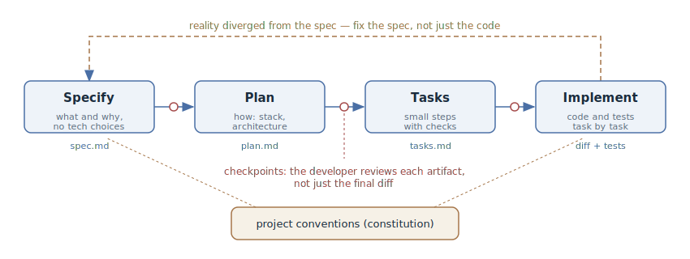

# Spec-Driven Development

## Intent

Make neither the code nor the chat with the agent the source of truth, but the
specification — a living document in the repository that describes *what* we
are building and *why*. The specification unfolds into a technical plan and a
task list, the agent implements them step by step, and the developer reviews
the artifacts at every transition — long before a diff appears.

## Also known as

SDD, spec-first, "the spec as the source of truth".

## Problem

In conversational work with an agent, intent lives in the chat. For a short
task that is enough, but for a large feature the chat does not scale:

- The context window ends before the feature does. A new session starts from
  scratch — what was decided, why this approach was chosen, and what remains
  has to be reconstructed from memory and from the code.
- A prompt is ephemeral. A month later nobody — neither human nor agent — can
  tell whether "it's meant to be this way" or "it just came out this way": the
  intent is recorded nowhere, only the code remains.
- Without pinned-down requirements, every next "tweak this bit" request
  gradually pulls the implementation away from the original goal, and there is
  nothing to detect the drift with — nothing to compare against.

The opposite extreme is vibe coding: describe the goal in one phrase and accept
whatever compiles. It works on a prototype; in a living codebase it leaves
behind a layer of code that nobody can say what it is *supposed* to do.

## Solution

Before implementing, pin the intent down in a specification — a file in the
repository, not a chat — and drive the work from it:

1. **Specification.** What we are building and why: user scenarios,
   requirements, acceptance criteria. No technical decisions — the "what", not
   the "how".
2. **Plan.** How we are building it: stack, architecture, affected modules,
   contracts. Technical decisions appear only here, once the "what" is agreed.
3. **Tasks.** The plan is sliced into small verifiable steps — each has a way
   to confirm the step is done.
4. **Implementation.** The agent works through the task list, checking against
   the specification and the plan.

Every transition is a checkpoint: the developer reviews the artifact and edits
it as text. A requirements mistake is caught on the specification, an
architecture mistake on the plan — both cheaper than on a finished diff. If
during implementation the specification turns out to be wrong, it is fixed
first and the code second — otherwise the document silently goes stale and
stops being the source of truth.

## Structure

The four artifacts form a pipeline, and each next one is derived from the
previous: the plan from the specification, the tasks from the plan, the code
from the tasks. All artifacts live in the repository and go through ordinary
review. A separate input is the project conventions (in Spec Kit — the
"constitution"): standards and constraints the agent must respect in every
phase. The dashed arrow back is the specification edit when reality has
diverged from it.

## Participants / Components

- **Developer** — states the intent, reviews and approves each artifact,
  accepts the result.
- **Agent** — unfolds the intent into a specification, plan, and tasks;
  implements the tasks, checking against the artifacts.
- **Specification** — the source of truth: what we build and why, acceptance
  criteria.
- **Plan and tasks** — derived artifacts: the technical approach and the
  slicing into verifiable steps.
- **Project conventions** — standing rules (standards, stack, constraints)
  shared by all specifications.

## When to use

- The feature is bigger than one session: the work outlives the context
  window, and artifacts are the only way to hand state to the next session or
  another agent.
- Several people or several agents work on the task — you need a shared
  document, not somebody's chat history.
- A domain with strict requirements: you must be able to show *what* the
  system is obliged to do and verify the implementation against that list.
- Greenfield where "what we are building" has not settled yet: the
  specification forces that decision before the code.

For a two-file edit the pipeline is overkill — there,
[explore — plan — code — commit](explore-plan-code-commit.md) or a plain
request is enough.

## Consequences and trade-offs

- ➕ Intent outlives the session: a new session, another agent, or a colleague
  continues from the artifacts, not from a retelling.
- ➕ Drift is visible: the implementation can be checked against the
  specification, and a divergence can be discussed concretely.
- ➕ Review is spread across cheap points: requirements, approach, and slicing
  are checked as text before any code exists.
- ➕ The specification remains documentation: half a year later you can see
  what the system is *supposed* to do, not only what it does.
- ➖ Overhead: on a short task the four-artifact pipeline costs more than the
  task itself.
- ➖ Artifacts must be maintained: a stale specification is worse than none —
  it lies with an authoritative face.
- ➖ The temptation to detail the specification down to pseudocode leads back
  to [premature specification](premature-specification.md): pin down
  requirements and constraints, not the implementation.

## Implementation

1. Pin down the project conventions: standards, stack, quality constraints.
   This is a standing document shared by all specifications.
2. Unfold the intent into a specification: scenarios, requirements, acceptance
   criteria — no technical decisions. Review it as text; underspecified spots
   are cheapest to close here.
3. Ask for a technical plan derived from the specification and review it:
   architecture, contracts, affected modules.
4. Slice the plan into small tasks, each with a completion check.
5. Run the implementation down the task list; the agent checks against the
   specification and the plan.
6. When reality diverges, fix the specification first, the code second.

This pipeline is almost never assembled by hand — there are ready-made
frameworks, each with its own view of what it should be. Each one has its own
article in this section:

- [GitHub Spec Kit](spec-kit.md) — the most direct translation of the pattern
  into a tool: a slash command per phase, an artifact per command.
- [OpenSpec](openspec.md) — a pipeline around a **change**: the system's
  standing specifications are updated by deltas, the way migrations update a
  database schema.
- [Kiro](kiro.md) — SDD as an IDE mode: spec sessions with explicit approval
  of each phase and acceptance criteria in EARS notation.
- [Tessl](tessl.md) — the radical variant: the specification is the source,
  the code a derived artifact.
- [Superpowers](superpowers.md) — SDD as a Claude Code skill pack:
  brainstorming → plan → subagent implementation with TDD and mandatory
  checkpoints.
- [Matt Pocock's skills](matt-pocock-skills.md) — a pipeline on top of the
  issue tracker: interview → specification → tracer-bullet tickets →
  implementation.

## Example

The task: add scheduled report exports to the service.

**Specification** (`/speckit.specify` or `/opsx:propose` — same essence):

> A user configures a recurring report export: picks the report, a schedule,
> and recipients. At the scheduled time the system builds the report and sends
> it by email. Acceptance criteria: the export goes out no later than five
> minutes past the schedule; if the build fails, recipients get a failure
> notification, not silence; deleting a report disables its schedules.

Reviewing the specification immediately exposes a hole: what about the
recipients' time zones? The requirement is added — before it could turn into a
bug.

**Plan:** the agent proposes a cron worker and a `report_schedules` table; in
review the developer replaces the hand-rolled cron with the task scheduler the
project already uses — a one-line text edit.

**Tasks:** migration, model, worker, notifications, settings UI — each with a
check (a test or a manual scenario).

**Implementation:** the agent works down the list; when it turns out the mail
gateway rejects attachments over 10 MB, that is a specification edit (add a
requirement for a download link instead of an attachment), not a silent
workaround in the code.

## Anti-patterns and common mistakes

- **A specification for the checkbox.** Artifacts are generated and approved
  unread — the pipeline adds overhead but catches nothing. Checkpoints work
  only if someone actually looks.
- **The code diverged from the spec — oh well.** The first unsynchronized edit
  turns the specification from a source of truth into a museum exhibit. One
  rule: the document first, the code second.
- **The pseudocode specification.** Spelling out function names and call order
  in the specification is
  [premature specification](premature-specification.md) in a new wrapper. The
  "what" level holds requirements, not implementation.
- **A pipeline for a two-file edit.** If the task fits in one session and one
  screen of diff, four artifacts are bureaucracy, not engineering.

## Known uses

- [GitHub Spec Kit](spec-kit.md), [OpenSpec](openspec.md), [Kiro](kiro.md),
  [Tessl](tessl.md), [Superpowers](superpowers.md), and
  [Matt Pocock's skills](matt-pocock-skills.md) — the six solutions covered by
  this section's articles; the SDD manifesto as a methodology is in the
  [Spec Kit announcement](https://github.blog/ai-and-ml/generative-ai/spec-driven-development-with-ai-get-started-with-a-new-open-source-toolkit/).
- **BMAD-Method** — SDD in an agile wrapper: role agents (analyst, PM,
  architect, developer) drive PRD → architecture → stories.

## Related patterns

- [Explore — Plan — Code — Commit](explore-plan-code-commit.md) — the same
  "agree first, code second" principle at the scale of a single session; SDD
  unfolds it into artifacts that outlive the session.
- [Premature Specification](premature-specification.md) — the anti-pattern the
  specification degenerates into if you pin down the implementation instead of
  the requirements.
