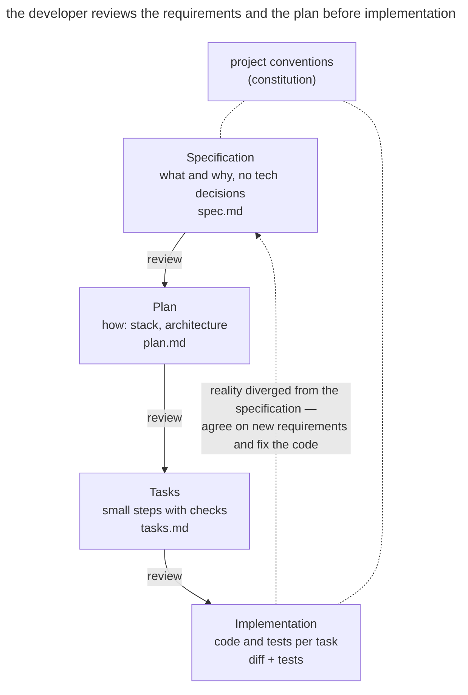

# Spec-Driven Development

## Intent

Keep the goal and requirements in an agreed specification. From it the team prepares a technical plan and tasks, and the agent implements them while verifying the result. The documents let the work continue in another session and make it possible to judge whether the result matches the original intent.

## Also known as

Spec-Driven Development (SDD), spec-first, "the spec as the source of truth".

## Problem

With a large feature, requirements can end up buried among the messages of a long conversation. A new session sees the code but does not know everything that was agreed.

For example, the chat settled on sending large reports as a link. The implementation still sends attachments, and a new agent cannot tell whether that was a deliberate limitation or an unfinished piece of work. Without a written record, requirements have to be reconstructed from the author's memory. Subsequent edits can pull the behavior even further from the goal, because there is nothing to compare it against.

Accepting generated code without such a comparison is described in the [vibe coding](vibe-coding.md) anti-pattern.

## Solution

Before implementation, write the goal down in a specification and use it in the later stages.

1. **The specification** describes scenarios, requirements, constraints and acceptance criteria.
2. **The plan** chooses a technical approach once the requirements are agreed.
3. **The tasks** split the plan into small steps with a verifiable result.
4. **Implementation.** The agent works through the tasks in order, checking against the specification and the plan.

At each transition you review the resulting document. This lets you fix a requirement before it is implemented. If new information changes the task, agree on the specification first and then bring the code in line with it.

## Structure

The diagram connects the specification, the plan, the tasks and the code.

```mermaid
---
title: the developer reviews the requirements and the plan before implementation
---
flowchart TB
  spec["Specification<br/>what and why, no tech decisions<br/>spec.md"]
  plan["Plan<br/>how: stack, architecture<br/>plan.md"]
  tasks["Tasks<br/>small steps with checks<br/>tasks.md"]
  impl["Implementation<br/>code and tests per task<br/>diff + tests"]
  rules["project conventions<br/>(constitution)"]:::accent
  spec -- "review" --> plan -- "review" --> tasks -- "review" --> impl
  impl -. "reality diverged from the specification —<br/>agree on new requirements and fix the code" .-> spec
  rules -.- spec
  rules -.- impl
```

Standing project conventions constrain the choices in every phase. The backward arrow shows requirements being revised in light of new information.

## Participants / Components

- **Developer** sets the goal and reviews the documents and the result.
- **Agent** prepares the documents and implements the agreed tasks.
- **Specification** holds the requirements and acceptance criteria.
- **Plan and tasks** set the technical approach and the order of implementation.
- **Project conventions** preserve shared standards and constraints.

## When to use

- The work spans several sessions.
- Several participants need shared requirements.
- The system's correctness has to be checked against explicitly defined scenarios.
- The team is still refining the behavior of a new system.

For a small edit, [four phases](explore-plan-code-commit.md) or a direct request is enough.

## Consequences and trade-offs

- ➕ Requirements are available to the next session and to other participants.
- ➕ Divergence between the implementation and the intent can be checked against the document.
- ➕ Mistakes in requirements and approach can surface before any code is written.
- ➕ An up-to-date specification explains the expected behavior after development is finished.
- ➖ Preparing documents raises the cost of short tasks.
- ➖ The documents have to be updated when requirements change.
- ➖ Too much implementation detail in the specification leads to [premature specification](premature-specification.md).

## Implementation

1. Write down the project's shared standards and constraints.
2. Prepare scenarios, requirements and acceptance criteria. Check them for completeness.
3. Draft and discuss the technical plan.
4. Split the plan into tasks, each with a way to verify its result.
5. Run the implementation from the task list; the agent checks against the specification and the plan.
6. If the code violates the current requirements, fix the implementation. If the requirements themselves have changed, agree on a new specification and then bring the code in line with it.

You can assemble the workflow by hand or use a ready-made toolkit. This section covers three options.

- [OpenSpec](openspec.md) keeps standing specifications and change deltas.
- [Superpowers](superpowers.md) links the phases through skills and mandatory checkpoints.
- [Matt Pocock's skills](matt-pocock-skills.md) keep specifications and tracer-bullet tickets in the issue tracker.

Other tools are collected in [Useful Links](resources.md) and in the [spec-compare](https://cameronsjo.github.io/spec-compare/) comparison.

## Example

A team is adding scheduled report export.

First it writes the **specification**, for example with `/opsx:propose` in OpenSpec.

> The user picks a report, a schedule and recipients. The system sends the report no later than five minutes after the scheduled time. If the build fails, it notifies the recipients of the failure. Deleting a report disables its schedules.

During review the team notices that the schedule's time zone is undefined and extends the requirement before implementation.

In the **plan**, the agent proposes a cron worker and `report_schedules`. You point to the scheduler the project already uses, and the agent refines the approach.

The **tasks** add verifiable scenarios one after another: creating a schedule, sending a report and handling a failure.

During **implementation** it turns out the mail gateway limits attachments to 10 MB. The team agrees to send a link for large reports and records this behavior in the specification.

## Anti-patterns and common mistakes

- **Documents without review.** Unchecked requirements can carry a mistake into the implementation.
- **Stale specification.** When behavior changes, update the agreed requirements together with the code.
- **Pseudocode specification.** A detailed call sequence written before the task has been explored creates a [premature specification](premature-specification.md).
- **Excessive process.** For a small, reversible edit, a full set of documents can cost more than the work itself.

## Known uses

- [OpenSpec](openspec.md), [Superpowers](superpowers.md) and [Matt Pocock's skills](matt-pocock-skills.md) are covered in this section. The general approach is also described in the [Spec Kit announcement](https://github.blog/ai-and-ml/generative-ai/spec-driven-development-with-ai-get-started-with-a-new-open-source-toolkit/).
- A comparison of other tools is available in [spec-compare](https://cameronsjo.github.io/spec-compare/) and the [collection of links](resources.md).

## Related patterns

- [Four Phases](explore-plan-code-commit.md) organizes agreement and implementation at the scale of a single task.
- [Premature Specification](premature-specification.md) describes the risk of choosing an implementation before the requirements are clarified.
