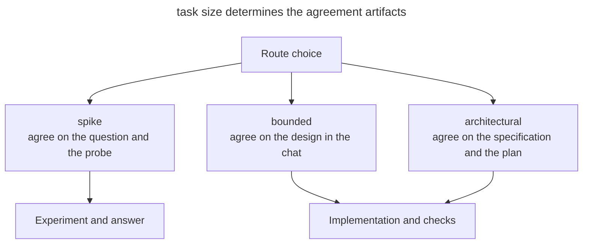

# Superpowers

_Commands and capabilities checked on September 21, 2026._

[Superpowers](https://github.com/obra/superpowers) by Jesse Vincent (obra) implements [SDD](spec-driven-development.md) as a set of [skills](skills-as-packaged-workflows.md). Between design and implementation, the instructions set mandatory checkpoints called HARD-GATE.

## Installation

The main way to install it uses the Claude Code marketplace.

```text
/plugin install superpowers@claude-plugins-official
```

The pack also includes instructions and manifests for Codex, Cursor, Antigravity, GitHub Copilot CLI and OpenCode.

## Workflow

At session start, a hook loads `using-superpowers`, which requires checking whether skills apply before answering. A request for a new feature is routed to `brainstorming`, and a bug report to `systematic-debugging`. Choosing the procedure becomes part of the overall process.

In `brainstorming`, the agent first picks a route based on the nature of the task. On every route you agree on the proposed step before implementation, but the amount of documentation differs.

| Route | Task | What gets agreed |
| --- | --- | --- |
| `spike` | Test whether an idea is feasible | The question and how to run the experiment; the result is an answer |
| `bounded` | Make a limited change to existing code | A short design in the chat; no separate specification or plan is needed |
| `architectural` | Create a project or subsystem, or change how components relate | A written specification, then a plan and an execution approach |

The next diagram shows the different outcomes of these routes.



In this diagram, the experiment ends with a conclusion about whether a solution is possible. A bounded change moves to implementation after agreement in the chat, while an architectural task requires separate documents. The details of the choice are described in the [brainstorming instructions](https://github.com/obra/superpowers/blob/main/skills/brainstorming/SKILL.md).

For an architectural task, the full process looks like this.

1. **`brainstorming`** clarifies the intent and the solution options. You agree on the design, then review the written specification.
2. **`using-git-worktrees`** isolates the work in a separate worktree and branch.
3. **`writing-plans`** creates small tasks with actions and checks that are sufficient for an executor without the discussion history.
4. **`subagent-driven-development`** or **`executing-plans`** executes the plan. The first uses a fresh subagent per task and a separate review. Independent tasks can be distributed through `dispatching-parallel-agents`, and `test-driven-development` sets the TDD cycle.
5. **`requesting-code-review`** checks the result against the plan. `receiving-code-review` helps work through the feedback.
6. **`finishing-a-development-branch`** checks the tests and offers to wrap up via merge or PR.

Debugging is supported by `systematic-debugging`, and `verification-before-completion` requires verification before declaring the work done.

## Artifacts

| Artifact | Where it lives |
| ---------- | ----------- |
| Design document | _docs/superpowers/specs/YYYY-MM-DD-\<topic\>-design.md_ |
| Implementation plan | _docs/superpowers/plans/YYYY-MM-DD-\<feature\>.md_ |

These documents belong to the architectural route and are stored in Markdown. The specification goes through the agent's self-review and the user's review; the location of plans can be set in the configuration. The `spike` and `bounded` routes do without these files.

## What makes it different

- The instructions require agreement before implementation; for a small change, a short design in the chat is enough.
- A hook helps the agent pick the right procedure automatically.
- Separate contexts for the executor and the reviewer keep implementation apart from evaluation.
- The plan includes red–green–refactor steps.

## When to choose it

Superpowers fits a team that needs a single process with mandatory checkpoints. For quick changes this process can be excessive. If you prefer to keep the outcome of discussions in an issue tracker, compare [Matt Pocock's skills](matt-pocock-skills.md).
