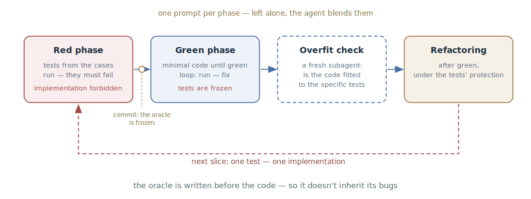

# TDD with an Agent

## Intent

Walk the agent through the red–green cycle with phase-specific prompts:
first failing tests, frozen by a commit, then a minimal implementation until
green — with no right to edit the tests. The oracle is written before the
code and therefore doesn't inherit its bugs.

## Also known as

Test-driven development with agents, red–green–refactor, test-first.

## Problem

Ask the agent to "build the feature and cover it with tests" — and it will
do exactly that, in that order: the implementation first, then tests for it.
Such tests look like coverage but verify little:

- **The tests are copied off the code.** The agent writes them while looking
  at the finished implementation — they repeat its structure and its bugs.
  If a condition is inverted in the code, the test enshrines the inverted
  condition as the norm.
- **Tautology instead of verification.** The expected value is computed the
  same way the code computes it — the test passes by construction and can
  never disagree with the code.
- **Fitting to the oracle.** If the tests already exist, an agent under
  "make it green" pressure knows how to cheat: a stub instead of logic, a
  special case hidden under a specific test.

A single "use TDD" instruction is not enough: without explicit phase gates
the agent slides back into its habitual order — code, then tests.

## Solution

Separate the red and green phases into different prompts and keep the gate
between them in the developer's hands.

1. **Declare the rules.** Say it outright: we work test-first — so the agent
   doesn't create implementations or stubs ahead of time.
2. **The red phase.** The agent writes tests from expected input/output
   pairs, runs them, and confirms they fail. Implementation is explicitly
   forbidden in this phase. A test that never failed proves nothing.
3. **Freeze the oracle.** The tests are committed. From this moment they are
   the reference, not a draft.
4. **The green phase.** The agent writes minimal code until the tests pass,
   running them and iterating — this is the
   [Feedback Loop](give-agent-a-way-to-verify.md) with a ready-made oracle.
   Editing the tests is forbidden: changing them is the developer's
   decision.
5. **The overfit check.** A fresh subagent looks at the implementation: is
   it fitted to the specific tests (see
   [Writer and Reviewer](writer-reviewer.md)).
6. **Refactoring** — as a separate move after green, under the tests'
   protection, not inside the cycle.

Work in vertical slices: one test → one minimal implementation → the next
test. All tests in bulk means verifying imagined behavior: the test
structure gets locked in before the task is understood. And agree on the
seams in advance: tests live on public boundaries, not on internals —
otherwise they break from refactoring, not from behavior changes.

## Structure

The phases run left to right, each with its own prompt: the red one produces
a failing oracle, the commit freezes it, the green one spins the
implementation loop with the tests frozen, then a fresh pair of eyes checks
the implementation for overfitting, and only after that comes refactoring
under the tests' protection. The loop at the bottom is the vertical slices:
the cycle repeats one test at a time, each next slice building on what the
last one taught.

## Participants / Components

- **Developer** — supplies the cases and the seams, holds the phase gates,
  is the sole authority over editing tests.
- **Agent** — writes tests in the red phase and the implementation in the
  green one; doesn't blend the phases, because each arrives as a separate
  prompt.
- **The test oracle** — failing in the red phase, frozen in the green one; a
  specification of behavior independent of the implementation.
- **Seams** — the agreed public boundaries the tests live on.
- **Reviewer** — a fresh subagent checking the implementation for
  overfitting.

## When to use

- Logic with verifiable input/output pairs: parsers, calculations,
  validation, data transformations.
- Bug fixes: a failing reproduction test before the fix is the cheapest
  insurance against the bug's return.
- Code where the cost of regression is high and the tests will live on as a
  specification.

For interface markup, prototypes, and exploration the pattern is overkill:
there is nothing to pin down with an input/output pair, and the
[Feedback Loop](give-agent-a-way-to-verify.md) with screenshots or a
[Throwaway Prototype](prototype-to-answer.md) works better.

## Consequences and trade-offs

- ➕ The oracle is independent of the implementation: the tests don't
  inherit the code's bugs, because they were written before it.
- ➕ Cheating is visible: with frozen tests a stub won't pass, and an
  attempt to edit a test is an explicit violation, not a quiet tweak.
- ➕ The tests read like a specification and survive refactorings — they are
  bound to seams, not to internals.
- ➖ Slower than a direct request: two phases, commits, an overfit check —
  on a trivial edit this is bureaucracy.
- ➖ The discipline rests on the developer: skip a gate, and the agent has
  quietly slid into "code, then tests".
- ➖ Quality is bounded by the seams: tests on badly chosen boundaries will
  be brittle, no matter how many phases there are.

## Implementation

1. Start with the declaration: "we're doing TDD: tests first, implementation
   after."
2. The red prompt: "write tests for cases X, Y, Z; run them and show they
   fail; don't write the implementation." Supply the cases yourself — that's
   your part of the specification; ask the agent to propose missed edge
   cases.
3. Agree on the seams before the tests: "what's the public boundary here?
   which seams do we test at?" — reject tests on internals.
4. Commit the red tests. From here the rule holds: only the developer
   changes tests, as a separate decision.
5. The green prompt: "implement until the tests pass; don't edit the tests;
   run and iterate." Demand evidence — the test runner's output.
6. After green — with a fresh context: "check that the implementation isn't
   fitted to the tests: stubs, special cases for specific test inputs."
7. Ask for refactoring separately, under the protection of green tests.
8. Repeat one slice at a time; anchor the "red before green" and "don't edit
   tests" rules in [Project Memory](claude-md-memory.md).

In the toolkits the cycle comes pre-assembled: in
[Superpowers](superpowers.md) the `test-driven-development` skill is
mandatory inside every plan task, in
[Matt Pocock's skills](matt-pocock-skills.md) `/tdd` adds seams and vertical
slices and moves refactoring out into review, and in [Kiro](kiro.md) the
acceptance criteria from the requirements phase turn into test cases before
any implementation.

## Example

The bug: a user with an expired session isn't logged out and stares at an
infinite spinner. The developer starts with the red phase:

> We're doing TDD. Write a test reproducing the bug: the session has
> expired — an API request returns 401 — the user ends up on /login. Run it
> and show that it fails. Don't write the fix yet.

The agent writes a test at the "HTTP client → response handler" seam and
runs it: red — on a 401 the client goes into an infinite retry. The test is
committed.

> Now fix it. Don't edit the test; run it and iterate until green.

The agent finds that the interceptor retries all errors indiscriminately,
adds a 401 exception with a redirect — green, the test runner's output in
the reply. The final touch:

> With a fresh subagent: check that the fix isn't fitted to the test — that
> the 401 handling works for all requests, not just the endpoint from the
> test.

The reviewer confirms: the change is in the shared interceptor. The bug is
closed, and its return is now caught by a test that was born before the fix
— and therefore verifies the behavior instead of transcribing it from the
code.

## Anti-patterns and common mistakes

- **Tests after the fact.** "Build the feature and cover it with tests"
  produces tests copied off the implementation — coverage exists,
  verification doesn't.
- **Skipping red.** A test that never failed may be passing for any reason —
  including that it verifies nothing.
- **All tests in bulk.** Horizontal slicing locks in the test structure
  before the task is understood; work in vertical slices.
- **The agent edits the oracle.** Editing a test in the green phase is
  rewriting the specification to match the answer. Only the developer, only
  as a separate decision.
- **Tests on internals.** Mocking internal collaborators and asserting on
  private methods breaks with refactoring, not with behavior changes — the
  seam was chosen wrong.
- **A tautological oracle.** An expected value computed the same way as in
  the code passes by construction. References come from an independent
  source: the spec, a hand-worked example, a known-good answer.

## Known uses

- **Claude Code best practices** — the canonical phased workflow: tests from
  input/output pairs with an explicit "we're doing TDD", confirming the
  failure, committing the tests, implementing without the right to change
  them, and an independent overfit check.
- **Superpowers** — TDD as a mandatory mode: every plan item is implemented
  by a subagent through red–green–refactor; the cycle can't be skipped.
- **Matt Pocock's skills** — `/tdd`: pre-agreed seams, tracer-bullet
  vertical slices, a ban on tautological tests, refactoring moved out into
  review.
- **Kent Beck, Test-Driven Development: By Example** — the primary source of
  the practice itself; with agents it gets a second wind: a cycle that used
  to demand human discipline can now be imposed by prompts.

## Related patterns

- [Feedback Loop](give-agent-a-way-to-verify.md) — the general pattern whose
  disciplined form TDD is: the oracle is written before the code, one per
  step.
- [Writer and Reviewer](writer-reviewer.md) — the overfit check at the end
  of the cycle: the implementation is judged by someone other than its
  author.
- [Four Phases](explore-plan-code-commit.md) — test cases are naturally born
  in the plan phase: the approved plan names what counts as "works".
