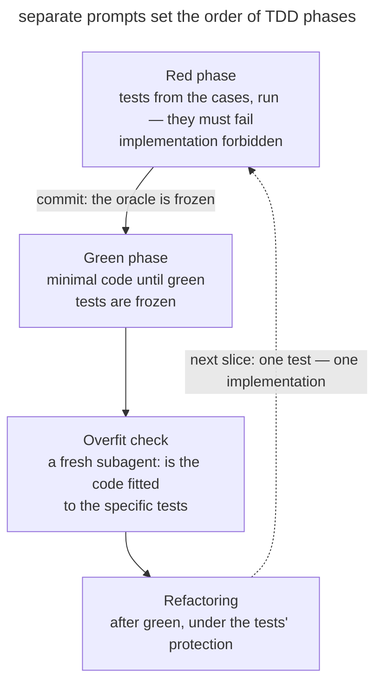

# TDD with an Agent

## Intent

Split writing the test and writing the implementation into explicit phases. First the agent confirms that the test fails for the expected reason, then it changes the code until the test passes. The frozen criteria help you notice when the result is being fitted.

## Also known as

Test-driven development with an agent, red–green–refactor, test-first.

## Problem

When the agent writes tests against a finished implementation, it can take the implementation's behavior for the expected one. A mistake in the logic then ends up in both the code and the check.

For example, a test computes a discount with the same formula the function uses. If the formula is wrong, both results will match. The expected value has to be obtained independently, from the requirement or from a worked example. Even an independent test can be passed with a special-case stub. That is why a check for overfitting is useful after green.

Separating the phases explicitly lets you see the test before the implementation and control changes to the criterion.

## Solution

Put the red and green phases into separate prompts and keep the gate between them in your hands.

1. **Set the order.** The agent writes the test first, then the implementation.
2. **Get a red result.** The agent runs the test and shows that it fails because the behavior is missing.
3. **Freeze the criterion.** Review the test and save it with a commit.
4. **Get a green result.** The agent changes the implementation and repeats the [check](give-agent-a-way-to-verify.md). Changing the test requires a separate decision.
5. **Check for overfitting.** A reviewer assesses whether the code solves the general case (see [Writer and Reviewer](writer-reviewer.md)).
6. **Refactor** under the protection of the passing tests.

Go through the cycle one behavior at a time. The next test takes into account what came out of the previous step. Before you start, agree on the public boundary where the result is checked, so that internal refactoring does not break a test without a change in behavior.

## Structure

The diagram shows the path from a failing test to the implementation and an independent check.

```mermaid
---
title: separate prompts set the order of TDD phases
---
flowchart TB
  red["Red phase<br/>tests from the cases, run — they must fail<br/>implementation forbidden"]:::warn
  green["Green phase<br/>minimal code until green<br/>tests are frozen"]
  overfit["Overfit check<br/>a fresh subagent: is the code fitted<br/>to the specific tests"]:::muted
  refactor["Refactoring<br/>after green, under the tests' protection"]:::accent
  red -- "commit: the oracle is frozen" --> green
  green --> overfit --> refactor
  refactor -. "next slice: one test — one implementation" .-> red
```

The back loop repeats the cycle for the next scenario once the current one is confirmed.

## Participants / Components

- **Developer** sets the expected behavior and approves changes to the criteria.
- **Agent** writes the test and then the implementation, in sequence.
- **Test** checks the requirement and is saved before the implementation.
- **Testing seam** sets the public interface through which behavior is observed.
- **Reviewer** looks for overfitting to special cases.

## When to use

- The result can be expressed as specific inputs and expected outputs.
- A bug can be reproduced by a test before the fix.
- Code where a regression is costly and the tests will live on as a specification.

For a visual choice or an exploratory prototype, [screenshot checks](give-agent-a-way-to-verify.md) and a [throwaway experiment](prototype-to-answer.md) may fit better.

## Consequences and trade-offs

- ➕ The test can be checked against the requirement before the implementation exists.
- ➕ A change to a frozen criterion is visible in the diff.
- ➕ Checking public behavior depends less on the code's internal structure.
- ➖ Explicit phases and a review increase the cost of a small edit.
- ➖ You have to control the order of steps and the reasons tests fail.
- ➖ A poorly chosen seam makes tests brittle.

## Implementation

1. Declare a test-first order of work.
2. Agree on the expected cases and ask the agent to suggest missing edge cases.
3. Choose the public interface for the check before writing the tests.
4. Check the reason the first test fails and save it with a commit.
5. Ask for the implementation to be changed until it passes, keeping the test as is. Get the run output.
6. Hand the code to a fresh reviewer to look for special-case stubs and missing cases.
7. Ask for refactoring separately, under the protection of green tests.
8. Repeat the cycle for the next behavior. Anchor the order in [Project Memory](claude-md-memory.md).

[Superpowers](superpowers.md) includes `test-driven-development` in task implementation. In [Matt Pocock's pack](matt-pocock-skills.md), `/tdd` also sets testing seams and works one scenario at a time.

## Example

When the session expires, the user sees an endless spinner. You start with a reproduction.

> We're doing TDD. Write a test for an expired session. The API returns 401, after which the user should end up on /login. Show that the test fails for this reason. Don't write the fix yet.

The agent checks how the HTTP client behaves on a 401 response. The test fails because the client retries the request endlessly. You review the test and save it with a commit.

> Now fix it. Don't edit the test; run it and iterate until green.

The agent fixes the shared interceptor, adding 401 handling that redirects to the login page. Once the test passes, you ask for a review.

> In a fresh context, check that the 401 handling applies to all requests and doesn't depend on the specific endpoint from the test.

The reviewer checks the shared interceptor. The test preserves the original scenario and will catch it if it breaks again.

## Anti-patterns and common mistakes

- **Tests written from the implementation.** The check can lock in a bug in the finished code. Derive the expected behavior from the requirement.
- **Skipping red.** Without an observed failure it is unclear whether the test detects the original defect.
- **All tests up front.** A large suite can lock in unverified assumptions. Add scenarios one after another.
- **Fitting the criterion.** Weakening a test during the fix requires a separate discussion.
- **Testing internals.** Tests of private methods can break after refactoring even though the behavior is preserved.
- **A tautological oracle.** Computing the expected answer the same way repeats the implementation's mistake. Use an independent example or the requirement.

## Known uses

- **Claude Code best practices** describe confirming the failure, committing the tests, implementing, and checking for overfitting.
- **Superpowers** makes TDD a mandatory part of executing the plan.
- **Matt Pocock's skills** use `/tdd` with agreed testing seams.
- **Kent Beck** described the practice in _Test-Driven Development: By Example_.

## Related patterns

- [Feedback Loop](give-agent-a-way-to-verify.md) sets the general cycle of checking and fixing.
- [Writer and Reviewer](writer-reviewer.md) helps detect overfitting after the tests pass.
- [Four Phases](explore-plan-code-commit.md) lets you agree on the scenarios to check in the plan.
- [Hypothesis-Driven Debugging](hypothesis-driven-debugging.md) helps establish the cause of a defect before the fix.
- [Premature Success](premature-success.md) occurs when green unit tests are taken for a working feature.
