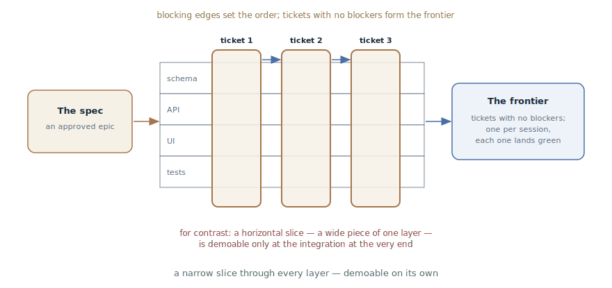

# Tracer-Bullet Tickets

## Intent

Slice a plan or specification into tracer tickets: narrow vertical slices
through every layer, each demoable on its own and sized to one fresh context
window, with explicit blocking edges between tickets. The agent gets
executable chunks, not an epic.

## Also known as

Tracer-bullet tickets, vertical slices, tracers; `/to-tickets` in Matt
Pocock's skills.

## Problem

The specification is approved — and it is an epic. Handing it to the agent
as-is won't work, and the usual ways of slicing fail:

- It doesn't fit in the window whole: an agent given "implement the spec"
  predictably [tries to one-shot it](one-feature-at-a-time.md) and leaves a
  scattering of half-done work.
- Slicing by layer — "the whole schema first, then the whole API, then the
  whole UI" — yields pieces none of which can be demoed: whether the system
  works becomes known only at integration at the end, the most expensive
  point.
- Chunks without explicit edges are a trap for the executor: the agent
  takes a task that depends on what isn't done yet and starts inventing the
  missing details.

## Solution

Slice vertically and declare the edges. Each ticket is a **tracer**: like a
tracer bullet, it threads a narrow but complete trajectory through every
layer of the system — schema, API, interface, tests — and shows where the
burst is going.

The slicing rules:

- **Vertical, not horizontal**: a narrow path through every layer, not a
  wide piece of one layer.
- **Demoable on its own**: a completed ticket can be shown or verified
  without waiting for the rest.
- **Sized to one fresh window**: the agent pulls a ticket through in one
  session, with room for verification iterations.
- **Prefactoring as the first ticket**: if the change is worth making easy
  first, that is a separate slice at the head of the queue.

Every ticket declares its **blocking edges** — which tickets must finish
before it can start. A ticket with no blockers can be taken immediately;
the set of such tickets is the frontier, visible in the tracker.

The slicing passes through the developer: the agent presents the breakdown
as a list — title, blockers, what end-to-end behavior the ticket makes
work — and iterates on the feedback: too coarse? are the edges right? what
to merge, what to split? The approved tickets are published to the tracker
with native blocking relationships.

The exception is **wide refactors**: one mechanical change with a blast
radius across the whole codebase (rename a column, retype a shared symbol)
can't be sliced vertically. It runs as **expand–contract**: first expand —
add the new form beside the old so nothing breaks; then migrate the call
sites in batches — each batch its own ticket blocked by the expand; and a
final contract ticket deletes the old form once no caller remains.

## Structure

On the left, the specification-epic. In the center, its slicing: each
ticket threads all the layers in a narrow strip, and the blocking arrows
arrange the tickets into a partial order. At the bottom, for contrast, the
horizontal slicing by layer: wide pieces none of which is demoable before
the final integration. On the right, the execution: a frontier of unblocked
tickets, one per session, each landing green.

## Participants / Components

- **The specification** — the slicing's source: the approved "what we are
  building".
- **The tracer ticket** — a vertical slice: end-to-end behavior, acceptance
  criteria, a list of blockers.
- **The blocking edges** — the explicit partial order; the frontier is
  computed from them.
- **The developer** — approves the granularity and the edges; the agent
  proposes, the human decides.
- **The executing agent** — takes a ticket from the frontier and carries it
  to the end in a fresh window.

## When to use

- Approved work bigger than one session: a specification, a large plan, the
  outcome of an [Investigation Map](wayfinder.md).
- Parallelism is wanted: the frontier lets several sessions work at once
  without stepping on each other.
- It is the concrete mechanics of the "tasks" step in the
  [SDD pipeline](spec-driven-development.md) — when `tasks.md` is needed as
  an executable queue, not a checklist.

Not needed for single-session work — a plan suffices. And not for
exploration: unclear work is first clarified by the
[Investigation Map](wayfinder.md); tickets are cut from what is already
clear.

## Consequences and trade-offs

- ➕ Every ticket lands green and demoable: there is no integration
  explosion at the end, because integration happens inside every slice.
- ➕ Window-sized means the executor always has enough context — and a
  session cutoff costs one ticket.
- ➕ The frontier gives cheap parallelism and an honest picture of
  progress.
- ➖ Slicing is a skill: slices too coarse don't fit the window, slices too
  fine bury the work in overhead.
- ➖ Wide refactors break the verticality rule — they need the separate
  expand–contract mode.
- ➖ Tracker infrastructure: tickets, edges, statuses — for a small piece
  of work this is bureaucracy.

## Implementation

1. Gather the context: the specification or plan is in the conversation;
   study the codebase before slicing, and look for prefactoring
   opportunities: "make the change easy, then make the easy change."
2. Slice vertically: each ticket describes end-to-end behavior from the
   user's perspective — not "build the table" but "a schedule can be
   created and appears in the list".
3. Declare each ticket's blockers; no blockers — a frontier candidate.
4. Present the breakdown to the developer as a list and iterate:
   granularity, edges, merges and splits.
5. Publish to the tracker in dependency order, with native blocking and
   acceptance criteria. Avoid file paths and snippets in tickets — they go
   stale; the exception is decision-rich pieces from
   [prototypes](prototype-to-answer.md) that encode a decision more
   precisely than prose.
6. Run a wide refactor separately: an expand ticket → migration batches
   sized by blast radius → a contract ticket blocked by every batch.
7. Execute the frontier [one ticket per pass](one-feature-at-a-time.md),
   clearing the context between tickets.

## Example

The "scheduled report export" specification from the
[SDD chapter](spec-driven-development.md) is approved. The agent proposes a
breakdown:

1. **A schedule can be created and seen** — the migration, the model, a
   minimal UI: the user saves a schedule and sees it in the list. No
   blockers.
2. **The report goes out on schedule** — the worker, the assembly, the
   email: at the appointed time the report arrives by mail. Blocked by: 1.
3. **A failure becomes a notification** — an assembly error is a failure
   email, not silence. Blocked by: 2.
4. **Deleting a report disables its schedules.** Blocked by: 1.

The developer adjusts the granularity — "the first ticket is heavy; carve
the list UI out as its own slice" — and approves. The tickets go to the
tracker with their blocking edges. The frontier is ticket 1; after it,
tickets 2 and 4 open up, and two parallel sessions take them at once. Every
ticket ends in demoable behavior: after the second one you can already show
the customer an email with the report — long before the whole specification
is done.

## Anti-patterns and common mistakes

- **Slicing by layer.** "The whole schema first, then the whole API" — no
  piece is demoable, and the integration explodes at the end. Cut across
  the layers, not along them.
- **The epic ticket.** A slice that doesn't fit the window reproduces the
  original problem in miniature: the agent tries to one-shot again.
- **Edges in the head.** Unwritten blocking means the agent will take a
  ticket that depends on the undone — and invent the missing parts.
- **Paths and snippets in tickets.** Implementation specifics go stale
  faster than the ticket's turn comes. Describe behavior; code — only the
  decision-rich pieces from prototypes.
- **A wide refactor as a tracer.** A rename across the whole codebase
  can't be threaded vertically — the forced slice won't land green.
  Expand–contract.

## Known uses

- **Matt Pocock's skills** — `/to-tickets`: the mechanics' primary source —
  the vertical-slice rules, blocking edges, the quiz with the developer,
  publication to the tracker, expand–contract for wide refactors;
  execution via `/implement`, one ticket at a time.
- **The Pragmatic Programmer** — tracer bullets as the metaphor: a thin
  end-to-end channel through the system that shows where the burst is
  going — and, unlike a prototype, stays in the code.
- **SDD toolkits** — `tasks.md` in [Spec Kit](spec-kit.md) and the plans of
  [Superpowers](superpowers.md): the same slicing into executable steps;
  tracers add the verticality and the explicit blocking.

## Related patterns

- [Spec-Driven Development](spec-driven-development.md) — tracer-bullet
  tickets are the concrete mechanics of the "tasks" step: the specification
  becomes an executable queue.
- [One Feature at a Time](one-feature-at-a-time.md) — the queue's execution
  rule: a ticket per pass, in a fresh window.
- [Investigation Map](wayfinder.md) — the stage predecessor: the map clears
  the fog down to decisions; tickets cut the clear into the executable.
- [Throwaway Prototype](prototype-to-answer.md) — the supplier of
  decision-rich snippets for tickets — and a useful contrast: the prototype
  is thrown away, the tracer stays and grows.
