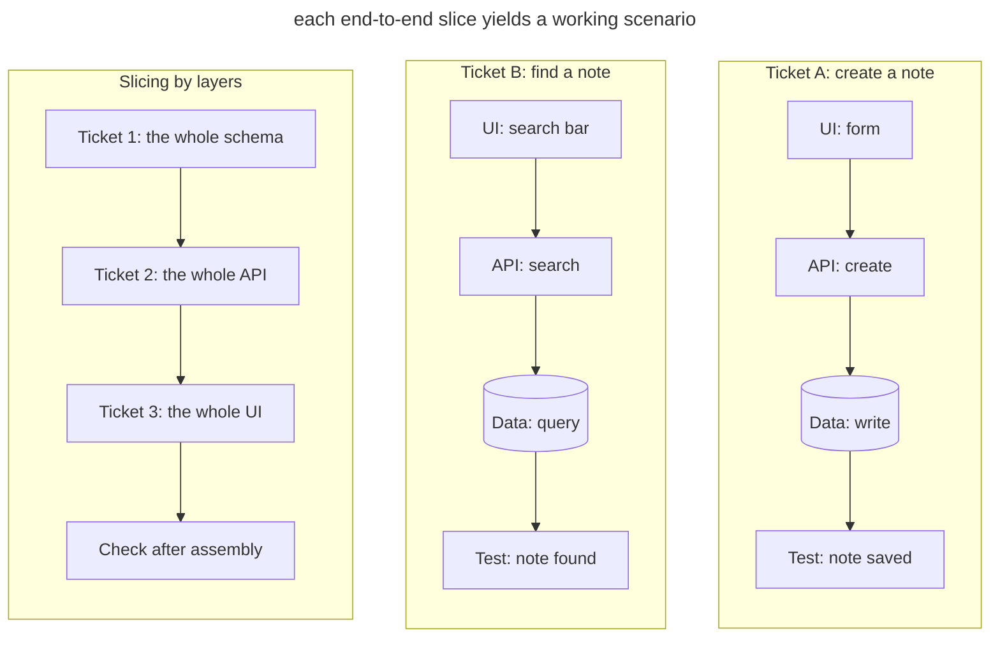
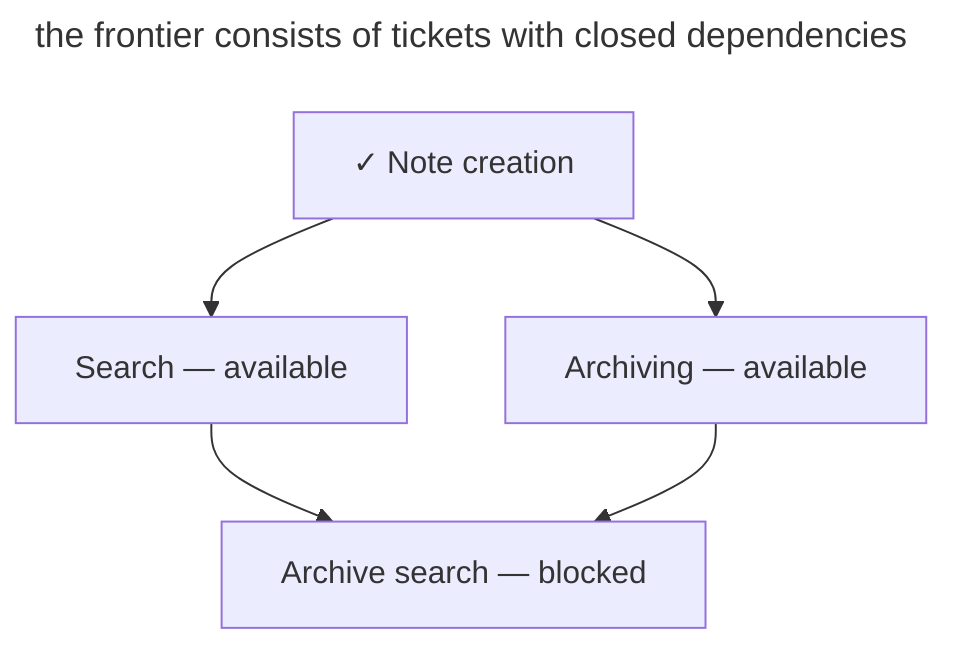

# Tracer-Bullet Tickets

## Intent

Split the specification into small tickets with end-to-end verifiable behavior. Each ticket passes through the layers of the system it needs, fits into one working session and states its dependencies explicitly.

## Also known as

Tracer-bullet tickets, vertical slices, tracers; `/to-tickets` in Matt Pocock's skills.

## Problem

A large specification may not fit into one pass. Splitting it by technical layers also postpones checking the behavior.

For example, after the whole schema and API are built, the user still can't set up an export. A mismatch between interfaces will surface only once the UI is ready. A narrow scenario of creating a single schedule lets you check how the layers interact earlier. The next scenario needs an explicit dependency on the already working schedule creation.

## Solution

Carve out **tracer-bullet tickets** by user outcome. The first slice goes through the minimal changes to the schema, API, UI and tests needed for one scenario. The following slices extend the path that already works.

Check each ticket against the following conditions.

- It covers all the layers needed for the chosen behavior.
- The result can be verified once the ticket is done.
- The session has room left for implementation and fixing bugs.
- Any necessary code preparation is split into a separate first ticket with its own check.

In each ticket, state the **blocking edges**. The set of open tickets whose dependencies are closed forms the frontier, from which work can be picked.

The agent shows you the titles, dependencies and verifiable outcomes. After you refine the size and the edges, it publishes the agreed tickets to the tracker.

For a mass interface change, use **expand–contract**. First add the new form while keeping the old one, then move the consumers over in separate batches. The last ticket removes the old form after all migrations are done.

## Structure

An end-to-end ticket passes through all the layers needed for one scenario. In the diagram, each column ends with its own behavior check.

```mermaid
---
title: each end-to-end slice yields a working scenario
---
flowchart TB
  subgraph create["Ticket A: create a note"]
    direction TB
    a_ui["UI: form"] --> a_api["API: create"]
    a_api --> a_db[("Data: write")]
    a_db --> a_test["Test: note saved"]:::accent
  end
  subgraph search["Ticket B: find a note"]
    direction TB
    b_ui["UI: search bar"] --> b_api["API: search"]
    b_api --> b_db[("Data: query")]
    b_db --> b_test["Test: note found"]:::accent
  end
  subgraph horizontal["Slicing by layers"]
    direction TB
    h_db["Ticket 1: the whole schema"] --> h_api["Ticket 2: the whole API"]
    h_api --> h_ui["Ticket 3: the whole UI"]
    h_ui --> h_test["Check after assembly"]:::warn
  end
```

The arrows inside the columns show the contents of a ticket and the boundary of its check. The order of work across tickets is set by a separate dependency graph.

```mermaid
---
title: the frontier consists of tickets with closed dependencies
---
flowchart TB
  create["✓ Note creation"]:::muted
  search["Search — available"]:::accent
  archive["Archiving — available"]:::accent
  filter["Archive search — blocked"]:::warn
  create --> search
  create --> archive
  search --> filter
  archive --> filter
```

In this example, search and archiving depend on the finished note creation and form the frontier. Archive search can be taken once both branches are done. The agent picks one available ticket and checks it end to end.

## Participants / Components

- **Specification** sets the expected behavior.
- **Ticket** describes the end-to-end scenario, criteria and dependencies.
- **Blocking edges** define the allowed order of work.
- **Developer** agrees on the size of tickets and the dependencies.
- **Agent** carries the chosen available ticket through to a verified result.

## When to use

- The approved specification or plan spans several sessions.
- Independent slices can be done in parallel.
- In [SDD](spec-driven-development.md), you need an explicit order for executing tasks.

For a single session, a plan is usually enough. If the way to solve the problem is still unknown, use the [Investigation Map](wayfinder.md) first.

## Consequences and trade-offs

- ➕ Each slice checks how the needed layers interact before the whole feature is done.
- ➕ A small ticket leaves more context for checking and fixes.
- ➕ Explicit dependencies help pick available work and coordinate implementers.
- ➖ Tickets that are too large don't fit into a session, and tiny ones raise coordination costs.
- ➖ A mass refactor needs a separate expand–contract order.
- ➖ Tickets, statuses and edges need upkeep.

## Implementation

1. Study the specification and the code. Find out whether a preparatory edit is needed before adding the behavior.
2. Pick out user scenarios, for example creating a schedule that shows up in the list.
3. Write down each ticket's dependencies.
4. Agree with the agent on the size of the slices and the order of work.
5. Publish the tickets with acceptance criteria and blocking edges. Include implementation details only where they preserve an essential decision, for example the result of a [prototype](prototype-to-answer.md).
6. For a wide refactor, set up the stages of expanding the interface, moving the consumers and removing the old form.
7. Execute the frontier [one ticket per pass](one-feature-at-a-time.md), clearing the context between tickets.

## Example

After the export from the [SDD chapter](spec-driven-development.md) is approved, the agent proposes end-to-end tickets.

1. **Creating a schedule.** The user saves a schedule and sees it in the list. The ticket includes the needed changes to the schema, API and UI. No dependencies.
2. **Sending the report.** At the scheduled time, the user receives an email with the report. The ticket depends on creating a schedule.
3. **Failure notification.** If the build fails, the recipients see an email with the cause of the failure. The ticket depends on sending the report.
4. **Deleting a report.** Deletion disables the related schedules. The ticket depends on creating them.

You confirm that the first slice is small enough and can be checked through the UI. After it, sending the report and disabling schedules become available. They can be done separately once the contract is agreed. After the second ticket, the team can already show the report email, although failure handling is still ahead.

## Anti-patterns and common mistakes

- **Slicing by layers.** A complete schema without a working scenario postpones the integration check.
- **Epic ticket.** An item that is too big again produces several unfinished parts.
- **Unrecorded dependencies.** The implementer may start work before the needed contract is ready.
- **Excessive detail.** Stale paths and code fragments get in the way of choosing the current implementation. Preserve behavior and constraints first of all.
- **Mass refactor as a feature.** Use expand–contract to change a shared interface in stages.

## Known uses

- **Matt Pocock's skills** use `/to-tickets` for end-to-end splitting and `/implement` for executing tickets.
- **The Pragmatic Programmer** describes a tracer implementation that checks a path through the system and keeps evolving.
- **SDD toolkits**, including [Superpowers](superpowers.md), split plans into executable steps. Tracer-bullet tickets additionally set an end-to-end outcome and dependencies.

## Related patterns

- [Spec-Driven Development](spec-driven-development.md) supplies the specification to split.
- [One Feature at a Time](one-feature-at-a-time.md) limits execution to one ticket per pass.
- [Investigation Map](wayfinder.md) clarifies decisions before the implementation queue is prepared.
- [Throwaway Prototype](prototype-to-answer.md) provides verified decisions for the ticket's requirements.
- [One-Shotting](one-shotting.md) comes back when a ticket doesn't fit into the window and the agent again tries to do everything in one pass.
