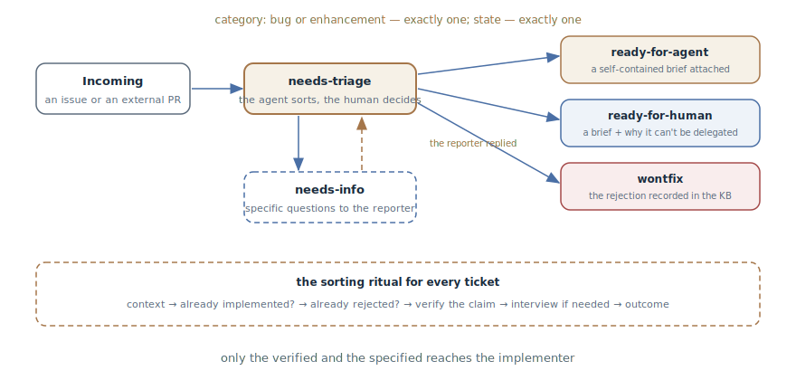

# Issue Triage

## Intent

Move incoming issues through a state machine of role labels — from "needs
sorting" to a finished agent-ready brief or a "for a human" mark — so that
by the time of execution every ticket is categorized, verified, and
specified. The agent drives the sorting; the maintainer decides the fate.

## Also known as

Triage state machine; `/triage` in Matt Pocock's skills.

## Problem

The tracker's inbox is raw material, not tasks: bug reports without
reproduction steps, feature wishes, duplicates of what already exists,
repeat requests for what was already rejected, external pull requests of
unknown quality. Both usual recipients handle this stream poorly:

- Hand a raw ticket to an agent — and it helpfully fills in the missing
  parts: "fixes" an unreproduced bug, implements what already exists in the
  codebase under another name, or reopens an argument closed half a year
  ago.
- Have the maintainer sort everything by hand — and their time goes not to
  decisions but to archaeology: reproducing, hunting duplicates, coaxing
  details out of reporters.
- Without fixed states nobody knows where anything stands: which tickets
  are sorted, which are waiting, which can be picked up.

## Solution

A small state machine of labels, and an agent that walks every ticket
through it.

**The roles.** Every triaged ticket carries exactly one category — `bug` or
`enhancement` — and exactly one state:

- `needs-triage` — awaiting sorting;
- `needs-info` — waiting on the reporter; returns to `needs-triage` once
  the reply arrives;
- `ready-for-agent` — fully specified, a brief is attached, an autonomous
  agent can take the work;
- `ready-for-human` — needs a person; the same brief structure plus an
  explicit reason why it can't be delegated: judgment calls, external
  access, manual testing;
- `wontfix` — will not be actioned; the reason is recorded.

An external pull request is an issue with attached code: the same roles,
the same machine.

**The sorting ritual.** The agent gathers the context (the body, the
comments, the codebase — through the
[Domain Vocabulary](domain-context-file.md) and the ADRs) and runs two
checks before anything else: *is it already implemented* — searching by
domain concepts, not the request's wording — and *was it already rejected*
— checking the rejection knowledge base. It then recommends a category and
a state — and waits for the maintainer's decision. Next comes verifying the
claim: a bug is reproduced from the reporter's steps, a pull request's diff
is run through the tests. If the request needs fleshing out — an interview
with the maintainer, one question at a time. The outcome is applied as
labels, a brief, or a closure.

**The memory of rejections.** Rejected wishes are recorded in a knowledge
base in the repository (`.out-of-scope/`): the next similar request is cut
off with a link, not another discussion.

Everything the agent posts to a public tracker starts with a "generated by
AI during triage" note — the transparency is non-negotiable.

## Structure

An incoming ticket lands in `needs-triage` — the only state where the
sorting work happens. Out of it lead four exits: a brief for an agent, a
brief for a human with the reason it can't be delegated, specific questions
to the reporter with a return after the reply — and a rejection that
settles into the knowledge base. At the bottom is the ritual the agent runs
for every ticket before an exit is chosen; the exit decision stays with the
maintainer.

## Participants / Components

- **The label machine** — the categories and the states; exactly one of
  each per ticket.
- **The triaging agent** — gathers context, checks, reproduces,
  recommends, formats the outcome.
- **The maintainer** — the arbiter: accepts recommendations, decides fates,
  can move any ticket to any state directly.
- **The reporter** — the source of details; receives specific questions,
  not "please clarify".
- **The brief** — the outcome artifact: a self-contained statement of the
  work an agent can execute without the ticket's author.
- **The rejection base** — recorded refusals with reasons; the filter for
  repeat requests.

## When to use

- An open-source or team project with an inbox stream: bugs, wishes,
  external pull requests.
- Autonomous agents pick work from the tracker: `ready-for-agent` is their
  queue, and the quality of the briefs determines the quality of the
  results.
- Maintainer time is the bottleneck: the sorting is delegated to the agent,
  and only the decisions remain with the human.

For a personal project with three tickets a month the machine is overkill —
a head and one label suffice.

## Consequences and trade-offs

- ➕ Only the verified and the specified reaches the implementer: the agent
  receives a brief, not guesses.
- ➕ Duplicates and repeats are cut off mechanically: the
  "already implemented" check and the rejection base work before the
  discussion, not after.
- ➕ The stream's state is visible from the labels: what's sorted, what's
  waiting, what's ready to take — without reading the tickets.
- ➕ Verification before the brief: an unreproducible bug won't ride to
  execution.
- ➖ Setup: the labels, their mapping, the brief templates, the rejection
  base — infrastructure that has to be built and maintained.
- ➖ Agent comments on a public tracker are a matter of tact: the AI note
  is mandatory, and the tone is the maintainer's responsibility too.
- ➖ The machine makes no decisions: without an arbiter it degenerates into
  either a bottleneck or the agent's self-rule.

## Implementation

1. Define the roles: two categories, five states, the "exactly one + 
   exactly one" rule. Map them onto your tracker's labels.
2. Fix the transitions: a new ticket → `needs-triage`; from there — into
   one of the four outcomes; `needs-info` returns to `needs-triage` after
   the reply.
3. Set the sorting ritual: context → "already implemented?" → "already
   rejected?" → a recommendation to the maintainer → verify the claim → an
   interview if needed → the outcome.
4. Demand verification before the brief: a reproduced bug with a code path
   gives the brief solid ground; an unreproducible one is a strong
   `needs-info` signal.
5. Templates for the outcomes: the brief — self-contained (reproduction,
   context, the done criterion); triage notes — "what we've established"
   plus specific questions; an enhancement rejection — a record in
   `.out-of-scope/` linked from a comment.
6. The "generated by AI during triage" note — at the top of every agent
   comment.
7. Close the pipeline onto execution: `ready-for-agent` is the queue for
   autonomous sessions, one ticket per pass.

## Example

An issue lands in the tracker: "search doesn't work". The agent sorts it:
no duplicates, nothing similar in the rejection base; it can't reproduce
from the description — no details. The recommendation: `bug` +
`needs-info`. After the maintainer's decision, a comment with the AI note
appears on the ticket: what's been established (exact-match search works,
substring search works) and two specific questions: what query string and
what locale.

The reporter replies: Turkish locale, a query with a capital "İ". The
ticket returns to `needs-triage`; the agent reproduces the bug — Unicode
normalization in the indexer — and formats `ready-for-agent` with a brief:
reproduction steps, the code path, the done criterion (the failing test
from the reproduction passes). The overnight autonomous session picks the
ticket up by the brief — it no longer needs the ticket's author.

A parallel wish, "dark mode for email notifications", closes in a minute:
`.out-of-scope/` holds last year's rejection of email customization with
its reasons — `wontfix` with a link, no new discussion.

## Anti-patterns and common mistakes

- **A raw ticket straight to the agent.** Skipping triage means the agent
  fills in what's missing: the most expensive way to learn a bug doesn't
  reproduce.
- **The agent decides fates.** A machine without an arbiter: categories and
  states are recommendations, the maintainer decides. Especially for
  `wontfix`.
- **"Please clarify."** A vague `needs-info` is a polite "go away":
  questions must be answerable.
- **A rejection without a record.** `wontfix` without the knowledge base
  guarantees the same request returns in a month and the discussion
  repeats.
- **A hollow brief.** A `ready-for-agent` label without a self-contained
  brief is the same raw statement, just with a green sticker.
- **Hidden AI.** Agent comments without the note undermine trust in the
  tracker; transparency is cheaper than exposure.

## Known uses

- **Matt Pocock's skills** — `/triage`: the primary source — the roles and
  the machine, the "verify, then interview" order, agent briefs, the
  `.out-of-scope/` base, and triaging pull requests as "issues with code".
- **Classic bug triage** — the pre-agent lineage: Mozilla's and Debian's
  processes with a dedicated triager role and a status lifecycle; the
  pattern hands the routine part of that role to an agent.
- **GitHub triage automations** — labeling and auto-closing bots as the
  weak form: categorization without verification or briefs.

## Related patterns

- [Investigation Map](wayfinder.md) — the tracker neighbor with a
  different subject: the map leads a large investigation to a destination,
  triage grinds the stream of small incomings.
- [Feedback Loop](give-agent-a-way-to-verify.md) — the verification step is
  exactly it: reproducing the bug and running the diff before the claim is
  believed.
- [Domain Vocabulary](domain-context-file.md) — the sorting hunts
  duplicates by domain concepts, not the request's wording; without a
  canonical language the "already implemented" check is blind.
- [One Feature at a Time](one-feature-at-a-time.md) — the execution rule
  for the `ready-for-agent` queue: one ticket per pass.
