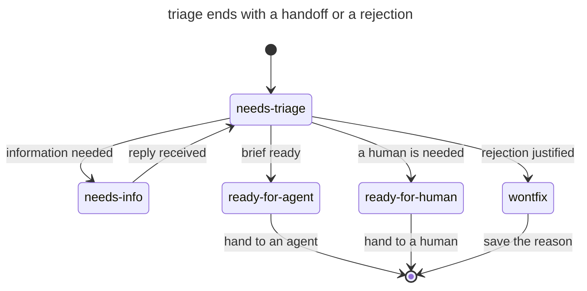

# Issue Triage

## Intent

Prepare incoming issues for execution through explicit triage states. The agent verifies the request and drafts a brief, and the maintainer decides whether to hand the issue to an agent, to a human, or to reject it.

## Also known as

Triage state machine; `/triage` in Matt Pocock's skills.

## Problem

An incoming bug report may contain nothing but the phrase "search doesn't work". The implementer knows neither the query, nor the locale, nor the expected result.

If you hand the fix to an agent right away, it will start picking the problem by guesswork. Even passing tests for such a fix won't confirm that the original failure is gone. The maintainer needs to gather the missing information and reproduce the problem. This part of the work can be delegated to the agent. Explicit states show which request has already been verified and which is still waiting for a reply.

## Solution

Define a small set of states and the order in which each ticket is checked.

In this variant of the process, a triaged ticket has one category (`bug` or `enhancement`) and one state.

- `needs-triage` means it is waiting to be sorted.
- `needs-info` means it is waiting for specific information from the reporter. After the reply, the ticket returns to `needs-triage`.
- `ready-for-agent` means a verified brief exists for autonomous work.
- `ready-for-human` indicates that a person needs to be involved and keeps the reason for that decision.
- `wontfix` records a rejection with its justification.

An external pull request goes through the same sorting, with an additional check of the attached code.

The agent reads the description, the comments, and the code, using the [Domain Vocabulary](domain-context-file.md) and the ADRs. It looks for an existing implementation and earlier decisions on similar requests. Then it verifies the claim, for example by reproducing the bug, and recommends a state. The maintainer approves the result; when information is missing, the agent prepares specific questions.

Save the reasons for rejected requests in _.out-of-scope/_. When a similar request comes in, the agent can show the earlier decision, and the maintainer checks whether it still applies.

In the process described here, the agent's comments are marked as generated by AI during triage. The maintainer reviews their content before publishing.

## Structure

The diagram is limited to the triage stage. Its end means handing a prepared issue to an implementer or rejecting it.

```mermaid
---
title: triage ends with a handoff or a rejection
---
stateDiagram-v2
  direction TB
  state "needs-triage" as triage
  state "needs-info" as info
  state "ready-for-agent" as agent
  state "ready-for-human" as human
  state "wontfix" as wontfix
  class agent accent
  class wontfix warn
  [*] --> triage
  triage --> info: information needed
  info --> triage: reply received
  triage --> agent: brief ready
  triage --> human: a human is needed
  triage --> wontfix: rejection justified
  agent --> [*]: hand to an agent
  human --> [*]: hand to a human
  wontfix --> [*]: save the reason
```

The maintainer approves a transition after the claim is verified, the context is clarified, and the brief is prepared. When information is missing, the ticket waits for a reply and goes through sorting again. The issue's category is stored separately from the state shown here; being ready to hand to an implementer does not yet mean the issue itself is done.

## Participants / Components

- **The states** show whether a ticket is ready for the next action.
- **The agent** gathers information, verifies the claim, and prepares a recommendation.
- **The maintainer** approves the decision on the issue.
- **The reporter** supplies the missing details.
- **The brief** gives a self-contained statement of the work and a done criterion.
- **The rejection base** keeps the reasons for earlier decisions.

## When to use

- The project regularly receives bugs, suggestions, and external PRs.
- Autonomous agents pick work from the tracker.
- The maintainer spends a lot of time gathering information before deciding.

With a few tickets a month, the full set of states may be overkill.

## Consequences and trade-offs

- ➕ The implementer receives a verified statement of the work.
- ➕ Earlier decisions help sort repeat requests.
- ➕ The labels show which issue is waiting for clarification and which is ready for work.
- ➕ Reproduction provides the basis for the fix criterion.
- ➖ The labels, templates, and decision base need maintenance.
- ➖ Public comments require a check of their content and tone.
- ➖ The process depends on the maintainer deciding in time.

## Implementation

1. Map the categories and states onto the tracker's labels.
2. Describe the transitions, including the return from `needs-info` after a reply.
3. Set the order for gathering context, searching for earlier decisions, and verifying the claim.
4. Confirm a bug by reproducing it before preparing a brief for the fix.
5. Prepare templates for the brief, the specific questions, and the rejection record.
6. Indicate the origin of an agent comment before publishing it.
7. Use `ready-for-agent` as a queue, one ticket per pass.

## Example

For the report "search doesn't work", the agent checks ordinary search and finds no failure. It recommends `bug` and `needs-info`. The maintainer approves asking for the query string and the locale; the comment also says which cases have already been checked.

The reporter names the Turkish locale and a query with "İ". The agent reproduces a Unicode normalization failure and prepares a brief with the input data, the place where it is processed, and the expected result. After reviewing it, the maintainer moves the ticket to `ready-for-agent`.

For a repeat request about customizing emails, the agent finds the earlier rejection in _.out-of-scope/_. The maintainer checks whether the grounds have changed and, if they still hold, closes the request with a link to the decision.

## Anti-patterns and common mistakes

- **A fix without verification.** The agent may solve an imagined problem if the original claim was not reproduced.
- **A decision without the maintainer.** The agent's recommendation needs approval, especially for a rejection.
- **A generic request for clarification.** Name the specific information needed for verification.
- **A rejection without a reason.** The next similar request will again need a full discussion.
- **Readiness without a brief.** A label by itself does not give the implementer requirements.
- **An unreviewed public comment.** The maintainer is responsible for the accuracy and clarity of the published text.

## Known uses

- **Matt Pocock's skills** implement the states, the briefs, and the rejection base through `/triage`.
- **Classic bug triage** uses a dedicated role to prepare incoming bugs for work.
- **GitHub automations** help label the stream but need additional checks to prepare a full brief.

## Related patterns

- [Investigation Map](wayfinder.md) organizes the questions of a large initiative.
- [Feedback Loop](give-agent-a-way-to-verify.md) helps verify a claim before execution.
- [Domain Vocabulary](domain-context-file.md) lets you search for duplicates by the meaning of concepts.
- [One Feature at a Time](one-feature-at-a-time.md) limits the work on the ready queue.
