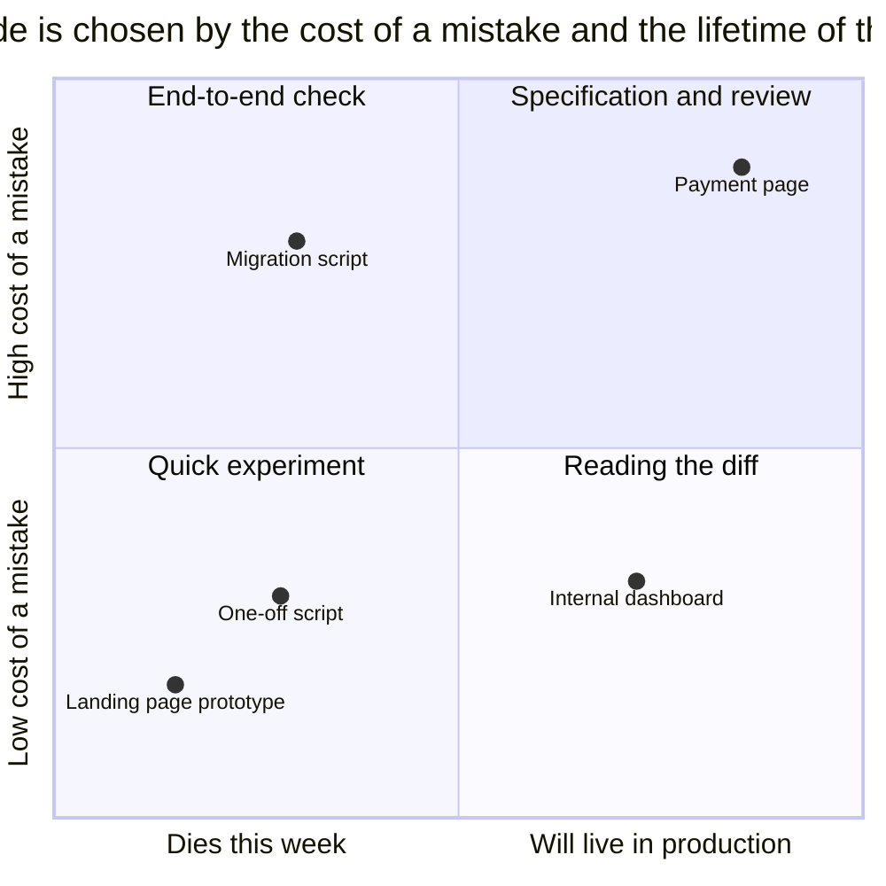

# Vibe Coding

## Also known as

Vibe coding, Andrej Karpathy's term for developing by prompting a model without paying attention to the generated code.

## Context

You describe the goal, the agent generates code, and you accept a result that runs and looks like it works. You forward errors back into the chat without reading the diff. The habit from a quick experiment moves into a production project.

## Problem

Behavior that nobody has checked against the requirements appears in the codebase. At the next change, the team finds it hard to tell what must be preserved and what was an accidental result of generation.

## Why people do it

- A fast first result reduces the desire to spend time on review.
- On an experiment where a mistake is cheap, this approach lets you test an idea quickly.
- A large generated diff takes effort to read.
- The agent's knowledge of the framework is taken as proof that the result is correct.

## Consequences

- ➖ The team finds it hard to fix and evolve code whose design it does not understand.
- ➖ Without requirements, the original intent cannot be recovered.
- ➖ Unchecked edge cases may surface for users.
- ➖ New changes build on an ever-growing amount of unverified behavior.

## Signs

- A diff is merged unread.
- Participants cannot explain how the accepted code works.
- Requirements are reconstructed by reading the code, because they exist nowhere else.
- Quality is justified only by a successful run.

## A better way

Choose the depth of verification based on the cost of a mistake and the lifetime of the code. For a [Throwaway Prototype](prototype-to-answer.md), checking its specific question is enough. For production code, record the requirements in a [specification](spec-driven-development.md) or a [plan](explore-plan-code-commit.md), verify the behavior with a [Feedback Loop](give-agent-a-way-to-verify.md), and do a [review](writer-reviewer.md).

The diagram takes into account the lifetime of the code and the cost of a mistake. A landing page prototype allows a short check, while a payment page requires the full process. A migration script also needs a thorough check even though it runs once, because a mistake can affect existing data.

## Example

**Before**

> Build the subscription payment page. It opened and looks like it works, we can merge.

**After**

> Build the subscription payment page, real payments will go through it. Run a test-mode payment through the browser

## Related patterns and anti-patterns

- [Throwaway Prototype](prototype-to-answer.md) limits an experiment to a specific question.
- [Spec-Driven Development](spec-driven-development.md) keeps the requirements for verifying the implementation.
- [Premature Success](premature-success.md) describes declaring the work done without an end-to-end check.
- [One-Shotting](one-shotting.md) describes expecting a finished product after a single pass.
